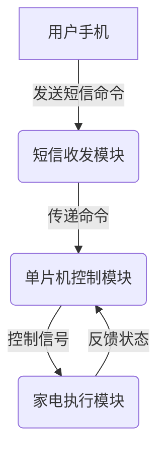
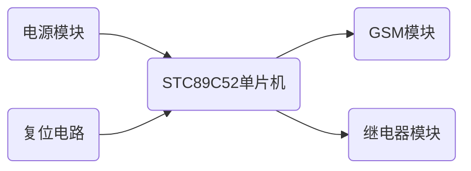

下面是《基于单片机短信定时控制家电的设计与实现》的技术博客文章正文：

## 1.背景介绍

### 1.1 家电控制的重要性

随着生活水平的不断提高,家用电器在我们的日常生活中扮演着越来越重要的角色。然而,由于工作、旅行或其他活动的原因,我们难免会忘记关闭某些家电,导致能源的浪费和安全隐患。因此,开发一种方便、高效的家电远程控制系统就显得尤为重要。

### 1.2 短信控制技术概述 

短信控制技术利用移动通信网络,通过发送特定格式的短信命令来控制家电的开关状态。由于短信服务具有覆盖范围广、使用成本低、操作简单等优点,因此被广泛应用于远程控制领域。

### 1.3 单片机在家电控制中的应用

单片机是一种高度集成的微型计算机,具有体积小、功耗低、价格便宜等特点,非常适合嵌入式系统的开发。在家电控制领域,单片机可以与各种传感器和执行器相连,实现对家电状态的检测和控制。

## 2.核心概念与联系

### 2.1 短信控制系统的工作原理

短信控制系统主要由短信收发模块、单片机控制模块和家电执行模块三部分组成。当用户通过手机发送特定格式的短信命令时,短信收发模块会将命令传递给单片机。单片机根据命令的内容,控制相应的家电执行模块开启或关闭特定的家电设备。

### 2.2 关键技术点

实现基于单片机的短信定时控制家电系统需要解决以下几个关键技术问题:

1. 短信解析技术:准确识别和解析用户发送的短信命令格式。
2. 定时控制算法:根据用户设置的时间参数,实现家电的定时开关控制。
3. 硬件电路设计:将单片机、短信收发模块和家电执行模块进行合理的电路连接。
4. 软件编程技术:基于特定的单片机型号,编写相应的控制程序。

### 2.3 系统框架

该系统的整体框架如下所示:



## 3.核心算法原理具体操作步骤

### 3.1 短信解析算法

短信解析算法的主要任务是从用户发送的文本短信中提取出控制命令和相关参数,并将其转化为单片机可识别的格式。一种常见的短信命令格式如下:

```
开启#设备名称#时间
```

例如,`开启#电视#20:30`表示在20:30时开启电视。

算法步骤:

1. 使用字符串分割函数将短信内容按`#`分割,得到命令、设备名称和时间三个字段。
2. 判断命令字段是"开启"还是"关闭",将其转化为相应的控制码(如0x01和0x00)。
3. 查找设备名称对应的设备编码。
4. 解析时间字段,将其转化为分钟数的格式。

### 3.2 定时控制算法

定时控制算法需要结合系统实时时钟,在指定的时间点对家电设备进行开关操作。

算法步骤:

1. 初始化系统时钟,获取当前时间。
2. 计算当前时间与目标时间之间的时间差(分钟数)。
3. 进入低功耗模式,设置定时器中断,时间间隔为1分钟。
4. 每次定时器中断时,将时间差减1,直到时间差为0。
5. 时间差为0时,发出对应的控制命令,执行家电开关操作。

### 3.3 硬件电路设计

硬件电路的设计需要将单片机、短信收发模块和家电执行模块进行合理的连接,并考虑电源、复位电路等因素。

以STC89C52单片机为例,电路连接示意图如下:



### 3.4 软件编程技术

软件编程技术包括单片机程序的编写、编译和下载等步骤。以C51语言为例:

1. 初始化各个模块(串口、定时器等)。
2. 编写短信解析函数,实现算法3.1。
3. 编写定时控制函数,实现算法3.2。
4. 在主程序循环中,通过串口接收短信命令,调用相应的函数进行处理。
5. 使用Keil等集成开发环境编译程序,生成目标代码文件。
6. 通过下载器将目标代码下载到单片机中运行。

## 4.数学模型和公式详细讲解举例说明 

在定时控制算法中,需要计算当前时间与目标时间之间的时间差(分钟数),可以使用以下公式:

$$
时间差(分钟) = (目标时间(时) \times 60 + 目标时间(分)) - (当前时间(时) \times 60 + 当前时间(分))
$$

例如,当前时间为18:25,目标时间为20:30,则时间差为:

$$
\begin{aligned}
时间差 &= (20 \times 60 + 30) - (18 \times 60 + 25) \\
       &= 1200 + 30 - 1080 - 25 \\
       &= 125(分钟)
\end{aligned}
$$

在实际的程序中,需要将时间差转化为无符号整型变量,并在每次定时器中断时将其减1,直到减为0时执行家电控制操作。

## 4.项目实践:代码实例和详细解释说明

下面给出一个基于STC89C52单片机和GSM模块的短信控制系统的C51代码示例,并对关键部分进行说明。

```c
#include <reg52.h>

// 定义设备编码
#define DEV_LIGHT 0x01
#define DEV_TV    0x02
#define DEV_AC    0x03

// 定义命令编码
#define CMD_ON    0x01
#define CMD_OFF   0x00

// 全局变量
unsigned char buf[20]; // 短信缓冲区
unsigned int target_time; // 目标时间(分钟)
unsigned char dev_code; // 设备编码
unsigned char cmd_code; // 命令编码

// 短信解析函数
void parse_sms(char *sms) {
    char *p = sms;
    char *q;
    
    // 提取命令字段
    q = strchr(p, '#');
    if (strncmp(p, "开启", q-p) == 0) {
        cmd_code = CMD_ON;
    } else {
        cmd_code = CMD_OFF;
    }
    p = q + 1;
    
    // 提取设备名称字段
    q = strchr(p, '#');
    if (strncmp(p, "电视", q-p) == 0) {
        dev_code = DEV_TV;
    } else if (strncmp(p, "空调", q-p) == 0) {
        dev_code = DEV_AC;
    } else {
        dev_code = DEV_LIGHT;
    }
    p = q + 1;
    
    // 提取时间字段
    sscanf(p, "%d:%d", &target_time/60, &target_time%60);
    target_time += 60 * 12; // 转换为分钟数
}

// 定时器中断服务函数
void timer0_int (void) interrupt 1 {
    TH0 = (65536 - 45000) / 256; // 重新赋值
    TL0 = (65536 - 45000) % 256;
    
    if (target_time > 0) {
        target_time--;
    } else {
        // 执行家电控制操作
        ...
    }
}

// 主函数
void main() {
    // 初始化
    ...
    
    while (1) {
        if (recv_sms(buf)) { // 收到新短信
            parse_sms(buf); // 解析短信
            target_time = ... // 计算时间差
            
            // 设置定时器中断
            ...
        }
    }
}
```

上述代码实现了短信解析、定时控制和家电执行三个主要功能,其中:

1. `parse_sms`函数根据算法3.1解析用户发送的短信命令。
2. `timer0_int`函数是定时器0的中断服务程序,实现了算法3.2中的定时控制逻辑。
3. 在主函数`main`中,当收到新的短信时,调用相应的函数进行处理。

## 5.实际应用场景

基于单片机的短信定时控制家电系统可以应用于以下几种场景:

1. **家庭自动化**:通过手机远程控制家中的电器设备,如空调、电视、照明等,提高生活质量和能源利用效率。

2. **农业设施控制**:在农场或温室中,利用该系统可以远程控制加热、通风、喷淋等设备,为农作物创造适宜的生长环境。

3. **工业设备监控**:在工厂或生产车间,可以通过短信命令控制机床、传送带等设备的启停,实现远程监控和管理。

4. **安防系统**:将该系统与门禁、报警器等安防设备相连,可以在发生异常情况时通过短信命令进行控制和响应。

5. **特殊场合应用**:在一些特殊场合,如婚礼、庆典等,可以利用短信控制系统对舞台灯光、音响等设备进行远程操作。

## 6.工具和资源推荐

在开发基于单片机的短信控制系统时,可以使用以下工具和资源:

1. **单片机开发板**:如STC89C52最小系统板、Arduino开发板等,用于编程和调试。

2. **GSM模块**:如SIM900A、SIM800C等,用于发送和接收短信。

3. **继电器模块**:用于控制家电设备的通断电。

4. **Keil集成开发环境**:用于编写、编译和下载C51程序。

5. **Proteus仿真软件**:用于模拟和测试电路设计。

6. **在线技术文档**:如STC单片机手册、GSM模块AT指令集等,提供详细的硬件和软件参考资料。

7. **技术论坛和社区**:如51单片机网、Arduino社区等,可以获取更多的技术支持和案例参考。

## 7.总结:未来发展趋势与挑战

基于单片机的短信控制技术为家电远程控制提供了一种简单、实用的解决方案。然而,随着物联网技术的不断发展,未来的家电控制系统将朝着更加智能化、网络化的方向发展。

1. **物联网技术的融合**:未来的家电控制系统将与物联网技术深度融合,实现设备之间的互联互通,提高控制的灵活性和可扩展性。

2. **智能化控制**:系统将采用更加智能化的控制策略,如基于用户习惯的自动化控制、语音控制等,提升用户体验。

3. **云端管理**:控制系统将与云平台相连,实现对家电设备的远程监控和管理,并提供数据分析和优化服务。

4. **安全性和隐私保护**:随着系统的开放性和网络化程度不断提高,如何保证系统的安全性和用户隐私将成为一个重大挑战。

5. **低功耗和绿色环保**:在设计和实现过程中,需要更多地考虑系统的能源消耗和环境影响,追求低功耗、绿色环保的解决方案。

总的来说,基于单片机的短信控制技术为家电控制领域提供了一种实用的解决方案,但未来仍需与新兴技术相结合,不断创新和优化,以满足用户日益增长的需求。

## 8.附录:常见问题与解答

1. **为什么选择单片机而不是其他控制器?**

单片机具有体积小、功耗低、成本低等优点,非常适合嵌入式系统的开发。相比于其他控制器(如工控机、PLC等),单片机在简单的家电控制场景下具有更好的性价比。

2. **如何选择合适的GSM模块?**

在选择GSM模块时,需要考虑以下几个因素:通信频段、功耗、尺寸、价格等。常见的GSM模块