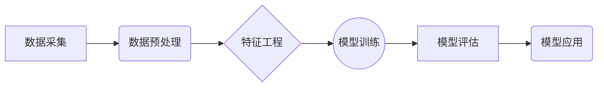

## 1. 背景介绍

### 1.1 城市活跃度的重要性

城市是人类文明的中心，其活跃度直接反映了城市的经济发展水平、社会活力以及居民生活质量。近年来，随着城市化进程的加速，城市规模不断扩大，人口密度不断增加，城市管理面临着前所未有的挑战。如何准确、及时地掌握城市活跃度，对于城市规划、交通管理、环境保护等方面都具有重要意义。

### 1.2 大数据时代的机遇

随着信息技术的飞速发展，我们进入了大数据时代。各种传感器、移动设备、社交媒体等产生了海量的城市数据，为我们研究城市活跃度提供了前所未有的机遇。通过对这些数据的挖掘和分析，我们可以更深入地了解城市内部的运行规律，从而更好地服务于城市管理和发展。

### 1.3 本文研究目标

本文旨在探讨如何利用大数据技术研究城市活跃度，并提出一种基于多源数据的城市活跃度评估模型。

## 2. 核心概念与联系

### 2.1 城市活跃度的定义

城市活跃度是一个综合性的指标，它反映了城市内部人流、物流、信息流等的活跃程度。目前，学术界对城市活跃度的定义尚未达成共识，但普遍认为它应该包含以下几个方面：

* **经济活跃度:** 商业活动、金融交易、企业发展等。
* **社会活跃度:** 人口流动、社交活动、文化娱乐等。
* **交通活跃度:** 交通流量、道路拥堵情况、公共交通使用率等。
* **环境活跃度:**  空气质量、噪音污染、绿化覆盖率等。

### 2.2 大数据的特征

大数据具有以下几个显著特征：

* **海量性:** 数据规模巨大，远远超出传统数据库的处理能力。
* **多样性:** 数据类型繁多，包括结构化数据、半结构化数据和非结构化数据。
* **高速性:** 数据产生和更新速度快，需要实时处理和分析。
* **价值性:** 数据中蕴藏着巨大的潜在价值，需要进行深度挖掘和分析。

### 2.3 大数据与城市活跃度的联系

大数据为研究城市活跃度提供了丰富的数据来源，例如：

* **手机信令数据:** 可以反映人口流动和交通流量。
* **社交媒体数据:** 可以反映社会活动和公众情绪。
* **交通流量数据:** 可以反映交通拥堵情况和道路通行能力。
* **环境监测数据:** 可以反映空气质量、噪音污染等环境问题。

## 3. 核心算法原理具体操作步骤

### 3.1 数据预处理

* **数据清洗:**  去除数据中的噪声、缺失值和异常值。
* **数据集成:**  将来自不同来源的数据进行整合，形成统一的数据集。
* **数据转换:**  将数据转换为适合分析的格式，例如时间序列数据、空间数据等。

### 3.2 特征提取

* **人口流动特征:**  基于手机信令数据，提取人口流动轨迹、停留时间、出行目的等特征。
* **社会活动特征:**  基于社交媒体数据，提取用户发布内容、情感倾向、活动类型等特征。
* **交通流量特征:**  基于交通流量数据，提取道路拥堵指数、车辆平均速度、交通事故发生率等特征。
* **环境质量特征:**  基于环境监测数据，提取空气质量指数、噪音污染程度、绿化覆盖率等特征。

### 3.3 城市活跃度评估模型构建

* **基于指标体系的评估模型:**  根据城市活跃度的定义，构建指标体系，并赋予每个指标权重，最终计算出城市活跃度得分。
* **基于机器学习的评估模型:**  利用机器学习算法，例如回归分析、支持向量机、神经网络等，构建城市活跃度预测模型。

## 4. 数学模型和公式详细讲解举例说明

### 4.1 基于指标体系的评估模型

假设我们构建了以下指标体系来评估城市活跃度：

| 指标 | 权重 | 说明 |
|---|---|---|
| 人口流动指数 | 0.3 | 反映人口流动活跃程度 |
| 社会活动指数 | 0.2 | 反映社会活动丰富程度 |
| 交通流量指数 | 0.3 | 反映交通流量通畅程度 |
| 环境质量指数 | 0.2 | 反映环境质量优良程度 |

城市活跃度得分计算公式如下：

```
城市活跃度得分 = 0.3 * 人口流动指数 + 0.2 * 社会活动指数 + 0.3 * 交通流量指数 + 0.2 * 环境质量指数
```

### 4.2 基于机器学习的评估模型

假设我们使用线性回归模型来预测城市活跃度，模型公式如下：

```
城市活跃度 = β0 + β1 * 人口流动指数 + β2 * 社会活动指数 + β3 * 交通流量指数 + β4 * 环境质量指数
```

其中，β0、β1、β2、β3、β4 为模型参数，可以通过训练数据进行学习。

## 5. 项目实践：代码实例和详细解释说明

### 5.1 数据获取

```python
# 导入必要的库
import pandas as pd

# 读取手机信令数据
mobile_data = pd.read_csv('mobile_data.csv')

# 读取社交媒体数据
social_media_data = pd.read_csv('social_media_data.csv')

# 读取交通流量数据
traffic_data = pd.read_csv('traffic_data.csv')

# 读取环境监测数据
environment_data = pd.read_csv('environment_data.csv')
```

### 5.2 数据预处理

```python
# 数据清洗
# ...

# 数据集成
# ...

# 数据转换
# ...
```

### 5.3 特征提取

```python
# 人口流动特征提取
# ...

# 社会活动特征提取
# ...

# 交通流量特征提取
# ...

# 环境质量特征提取
# ...
```

### 5.4 模型构建

```python
# 基于指标体系的评估模型
# ...

# 基于机器学习的评估模型
# ...
```

### 5.5 模型评估

```python
# 模型评估指标
# ...

# 模型评估结果
# ...
```

## 6. 实际应用场景

### 6.1 城市规划

城市活跃度可以作为城市规划的重要参考指标。例如，可以根据城市活跃度分布情况，合理规划商业区、住宅区、工业区等功能区域，优化城市空间布局。

### 6.2 交通管理

城市活跃度可以用于交通流量预测和交通拥堵治理。例如，可以根据城市活跃度变化趋势，及时调整交通信号灯配时、优化公交线路、引导车辆分流，缓解交通拥堵。

### 6.3 环境保护

城市活跃度可以用于环境污染监测和治理。例如，可以根据城市活跃度与环境质量之间的关系，识别污染源、制定环境保护措施、引导绿色出行，改善城市环境质量。

## 7. 工具和资源推荐

### 7.1 数据可视化工具

* Tableau
* Power BI
* Python matplotlib

### 7.2 机器学习库

* scikit-learn
* TensorFlow
* PyTorch

### 7.3 云计算平台

* Amazon Web Services
* Microsoft Azure
* Google Cloud Platform

## 8. 总结：未来发展趋势与挑战

### 8.1 未来发展趋势

* **多源数据融合:**  将来自不同来源的数据进行融合，构建更全面、更准确的城市活跃度评估模型。
* **实时数据分析:**  利用实时数据流处理技术，实现城市活跃度的实时监测和预测。
* **人工智能应用:**  将人工智能技术应用于城市活跃度研究，例如深度学习、强化学习等。

### 8.2 面临的挑战

* **数据隐私保护:**  在利用大数据研究城市活跃度的过程中，需要注意保护用户隐私。
* **数据质量控制:**  确保数据的准确性和可靠性，避免数据偏差导致的分析结果误差。
* **模型解释性:**  提高模型的可解释性，使分析结果更易于理解和应用。

## 9. 附录：常见问题与解答

### 9.1 如何选择合适的城市活跃度指标？

选择城市活跃度指标需要考虑以下因素：

* **指标的代表性:**  指标应该能够准确反映城市活跃度的各个方面。
* **数据的可获取性:**  指标对应的数据应该易于获取和处理。
* **指标的可比性:**  指标应该可以在不同城市之间进行比较。

### 9.2 如何评估城市活跃度模型的性能？

可以使用以下指标来评估城市活跃度模型的性能：

* **准确率:**  模型预测结果与实际情况相符的比例。
* **精确率:**  模型预测为正例的样本中，真正正例的比例。
* **召回率:**  所有正例样本中，被模型正确预测为正例的比例。
* **F1 值:**  精确率和召回率的调和平均值。


## 10.  Mermaid流程图



**图 1. 基于大数据的城市活跃度研究流程图**

这个流程图展示了基于大数据的城市活跃度研究的典型流程，从数据采集开始，经过数据预处理、特征工程、模型训练、模型评估，最终到模型应用，形成一个完整的闭环。 
