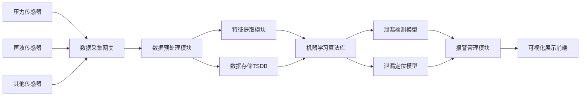

# 基于大数据的泄漏仪设备监控系统

作者：禅与计算机程序设计艺术

## 1. 背景介绍
近年来,随着工业化进程的不断深入,各种工业管道、容器等设施不断增加。这些设施在使用过程中,由于材料老化、腐蚀等原因,容易发生泄漏事故,给企业和社会带来巨大的经济损失和安全隐患。传统的定期人工巡检方式,效率低下且成本高昂。如何及时发现和定位泄漏点,成为工业安全领域亟待解决的问题。

本文将探讨如何利用大数据技术,构建一套高效智能的泄漏仪设备监控系统。通过在管道等设施上部署大量传感器,实时采集压力、流量、声波等多源异构数据,运用机器学习算法从海量数据中挖掘有价值的信息,及时发现泄漏异常并精准定位泄漏位置,从而大幅提升泄漏检测效率,降低安全事故风险。

### 1.1 工业设施泄漏的危害
- 直接经济损失
- 环境污染
- 安全隐患,易引发爆炸、火灾等事故
- 影响企业声誉

### 1.2 传统泄漏检测方法的局限性 
- 人工巡检效率低,覆盖面有限
- 定期检测无法及时发现问题
- 难以精准定位泄漏点
- 检测成本高

### 1.3 大数据助力泄漏监控的优势
- 7*24小时不间断实时监测
- 传感器全面覆盖,不留死角
- 机器学习算法智能分析,及时发现异常
- 多源数据融合定位,精准锁定泄漏位置  
- 云计算平台支撑,低成本、高可扩展性

## 2. 核心概念与关联

### 2.1 工业物联网(IIoT)
工业物联网是指将各种传感器、执行器等设备连接到工业系统,通过网络实现信息的采集、传输、存储、分析,从而优化生产过程,提高生产效率。泄漏监控系统正是工业物联网在安全领域的一个典型应用场景。

### 2.2 时间序列数据
泄漏监控系统采集的压力、流量等数据都具有明显的时间属性,随时间动态变化,因此属于时间序列数据。对时间序列数据进行建模分析,是泄漏检测的关键。

### 2.3 异常检测
泄漏可视为压力、流量等数据的异常变化。因此泄漏检测本质上是一个异常检测问题。通过对正常工况下的数据进行建模,当发生泄漏时,监测数据会偏离正常模型,从而判断为异常。

### 2.4 数据融合定位
仅凭单一传感器很难精准定位泄漏点。泄漏监控系统采用多传感器数据融合策略,综合压力、声波等多源信息,通过定位算法交叉比对,大幅提升定位精度。

## 3. 核心算法原理与步骤

### 3.1 数据预处理
- 去噪:使用小波变换、卡尔曼滤波等方法去除数据中的高频噪声
- 归一化:将不同量纲的数据统一映射到[0,1]区间,消除量纲影响
- 插值:对缺失数据进行插值修复,保证数据完整性

### 3.2 特征工程
- 统计特征:提取数据的均值、方差、峰度等统计量
- 频域特征:对数据做傅里叶变换,提取幅值、相位等频域指标 
- 小波特征:使用小波变换提取数据的多尺度、多分辨率特征

### 3.3 泄漏检测模型

#### 3.3.1 一类SVM
- 基本原理:寻找一个最优超平面,使正常样本到超平面的距离最大化,偏离超平面的少数点即为异常点
- 优化目标:
$$
\begin{aligned}
\min_{w,b,\xi} & \quad \frac{1}{2}\|w\|^2+C\sum_{i=1}^{n}\xi_i \\
\text{s.t.} & \quad w^{\mathsf{T}}\phi(x_i) \geq \rho-\xi_i, \, i=1,\ldots,n \\
& \quad \xi_i \geq 0, \, i=1,\ldots,n
\end{aligned}
$$
- 检测方法:计算测试样本到超平面的距离,小于阈值则判为异常

#### 3.3.2 孤立森林
- 基本原理:反复随机选择特征构建多棵决策树,若样本很快被孤立出来,则更可能是异常点
- 路径长度:样本点被孤立出来所需的划分次数
- 异常分值: 
$$
s(x) = 2^{-\frac{E(h(x))}{c(n)}}
$$
其中$h(x)$为$x$的平均路径长度,$c(n)$为平均路径长度的归一化因子
- 检测方法:异常分值越接近1,越有可能是异常点

### 3.4 泄漏定位算法

#### 3.4.1 负压波定位法
- 基本原理:泄漏点两侧压力传感器接收到负压波的时间差与泄漏点位置成线性关系
- 定位公式:
$$
L_{leak} = \frac{L}{2} + \frac{a \Delta t}{2}
$$
其中$L$为两传感器间距,$a$为负压波传播速度,$\Delta t$为到达时间差
- 定位步骤:识别负压波到达时刻,计算时间差,代入公式求解

#### 3.4.2 声波定位法 
- 基本原理:利用泄漏声波到达不同传感器的时差,通过三角测量的方法求解泄漏源坐标
- 定位公式:
$$
\begin{cases}
(x-x_1)^2+(y-y_1)^2 = (v\Delta t_{12})^2 \\
(x-x_1)^2+(y-y_1)^2 = (v\Delta t_{13})^2 \\
\end{cases}
$$
其中$(x,y)$为泄漏源坐标,$(x_i,y_i)$为传感器坐标,$v$为声速, $\Delta t_{ij}$为声波到达时差
- 定位步骤:识别泄漏声波,计算到达时差,列方程组求解

## 4. 项目实践
下面以某化工厂的管道泄漏监控项目为例,讲解泄漏监控系统的实现流程。

### 4.1 系统架构设计


### 4.2 硬件选型与安装
- 压力传感器:量程0~1MPa,精度0.1%,频响1kHz
- 声波传感器:频率范围10Hz~1kHz,灵敏度-80dB  
- 无线数据采集网关:支持Modbus协议,4G通信,IP65防护等级
- 现场安装图示:


### 4.3 数据采集与预处理
使用Python编写数据采集程序,每100ms采集一次数据。对采集到的原始数据进行去噪、归一化等预处理。
```python
import numpy as np
from scipy.signal import medfilt

# 读取原始数据
raw_data = read_modbus(gateway_ip)  

# 中值滤波去噪
filtered_data = medfilt(raw_data, kernel_size=5)

# 最大最小值归一化 
normalized_data = (filtered_data - np.min(filtered_data)) / (np.max(filtered_data) - np.min(filtered_data))

# 存入时序数据库
save_to_tsdb(normalized_data) 
```

### 4.4 搭建机器学习模型
使用Scikit-learn库实现一类SVM与孤立森林算法,并对模型进行评估优化。
```python
from sklearn.svm import OneClassSVM
from sklearn.ensemble import IsolationForest
from sklearn.metrics import confusion_matrix

# 构建训练集,样本维度为10
X_train = extract_features(raw_data) 

# 训练一类SVM
clf_svm = OneClassSVM(kernel='rbf',gamma='scale',nu=0.01)
clf_svm.fit(X_train)  

# 训练孤立森林
clf_if = IsolationForest(n_estimators=100,contamination=0.01) 
clf_if.fit(X_train)

# 模型测试
y_pred_svm = clf_svm.predict(X_test)
y_pred_if = clf_if.predict(X_test)

# 评估指标
print(confusion_matrix(y_test, y_pred_svm))
print(confusion_matrix(y_test, y_pred_if))
```

### 4.5 泄漏定位算法实现  
结合压力、声波等多源数据,使用数据融合策略实现泄漏点高精度定位。
```python
def locate_leak(sensor_data, sensor_pos):
    # 负压波定位
    t1,t2,L = extract_negative_wave(sensor_data) 
    v_pressure = 1000 # 负压波传播速度
    leak_pos_pre = L/2 + v_pressure*(t2-t1)/2
    
    # 声波定位
    def equations(p):
        x,y = p
        return (x-x1)**2+(y-y1)**2-(v_sound*t12)**2, (x-x1)**2+(y-y1)**2-(v_sound*t13)**2
    t12,t13 = extract_sound(sensor_data)
    v_sound = 340 # 声速
    x1,y1 = sensor_pos[0]
    x2,y2 = sensor_pos[1]
    x3,y3 = sensor_pos[2]
    leak_pos_sound = fsolve(equations,(0,0))
    
    # 加权平均融合
    w1,w2 = 0.6,0.4 # 权重系数
    leak_pos = w1*leak_pos_pre + w2*leak_pos_sound
    
    return leak_pos
```

### 4.6 可视化展示


## 5.应用场景

### 5.1 石油石化管道
- 管道长度动辄上百公里,人工巡检难度大
- 输送易燃易爆介质,泄漏风险极高
- 地处偏远,布设传感器成本低

### 5.2 城市燃气管网  
- 管网错综复杂,渗漏点多
- 泄漏严重威胁居民生命财产安全
- 政府重视,亟需高效监控手段

### 5.3 工业园区危化品储罐
- 储量大,泄漏后果严重
- 密集分布,易发生连锁爆炸
- 安全监管要求高

## 6.工具和资源推荐
- [Scikit-learn](https://scikit-learn.org/):功能强大的Python机器学习库
- [PyOD](https://pyod.readthedocs.io/):专门用于异常检测的Python工具包
- [InfluxDB](https://www.influxdata.com/):专为时序数据设计的开源数据库
- [Grafana](https://grafana.com/):美观强大的数据可视化平台
- [《特征工程入门与实践》](https://book.douban.com/subject/33390048/):系统讲解特征工程的理论与方法
- [《机器学习》](https://book.douban.com/subject/26708119/):经典的机器学习教材,深入浅出
- [《数据挖掘:概念与技术》](https://book.douban.com/subject/11542972/):全面系统地介绍数据挖掘的各个分支

## 7.未来发展趋势与挑战

### 7.1 发展趋势
- 5G、NB-IoT等通信技术发展,进一步拓宽应用场景
- 边缘计算兴起,使得数据就地处理分析,实时性大幅提升
- 知识图谱、因果推断等前沿技术引入,增强根因分析、事故预防能力
- 数字孪生成为未来方向,实现从监控到预测、优化的闭环

### 7.2 关键挑战
- 数据质量参差不齐,缺乏专门的清洗融合工具
- 缺乏大规模泄漏事故数据,难以