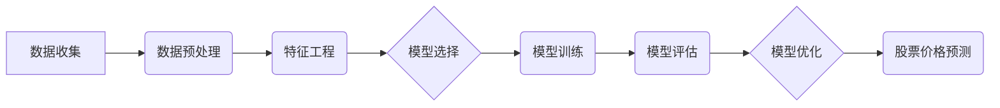

## 1. 背景介绍

### 1.1 股票市场预测的挑战

股票市场以其波动性和不可预测性而闻名。无数因素，从全球经济趋势到个别公司公告，都会影响股票价格。这使得准确预测股票价格极具挑战性，即使对经验丰富的投资者和金融分析师也是如此。

### 1.2 数据挖掘的兴起

近年来，数据挖掘技术的出现为股票预测提供了新的可能性。数据挖掘是从大型数据集中提取有意义的模式和洞察力的过程。通过利用先进的算法和计算能力，数据挖掘可以揭示隐藏在海量金融数据中的趋势和关系，这些趋势和关系可能被传统方法所忽视。

### 1.3 基于数据挖掘的股票预测系统的优势

与传统的股票预测方法相比，基于数据挖掘的系统具有以下优势：

* **更高的准确性：**数据挖掘算法可以识别复杂的模式并适应不断变化的市场条件，从而提高预测准确性。
* **客观性：**数据挖掘消除了人为偏见，提供基于数据驱动的客观预测。
* **速度和效率：**数据挖掘系统可以快速处理大量数据，提供实时预测和洞察力。
* **可扩展性：**数据挖掘系统可以轻松扩展以处理不断增长的数据量和复杂性。

## 2. 核心概念与联系

### 2.1 数据挖掘技术

基于数据挖掘的股票预测系统利用各种数据挖掘技术来分析金融数据并生成预测。一些常用的技术包括：

* **统计分析：**用于识别数据中的趋势、模式和异常值。
* **机器学习：**用于训练预测模型并根据历史数据进行预测。
* **深度学习：**用于分析复杂的非线性关系并提高预测准确性。
* **自然语言处理：**用于从新闻文章、社交媒体帖子和公司公告等文本数据中提取见解。

### 2.2 股票数据

股票预测系统依赖于各种来源的股票数据，包括：

* **历史股票价格：**股票价格的历史数据，包括开盘价、最高价、最低价和收盘价。
* **基本面数据：**与公司财务状况相关的数据，例如收入、利润和资产。
* **技术指标：**从历史股票价格数据中得出的数学计算，例如移动平均线和相对强弱指数 (RSI)。
* **情绪数据：**反映投资者情绪的数据，例如新闻文章、社交媒体帖子和分析师评级。

### 2.3 预测模型

股票预测系统使用预测模型来预测未来的股票价格。这些模型基于历史数据进行训练，并使用数据挖掘技术来识别预测股票价格变动的模式和关系。一些常用的预测模型包括：

* **线性回归：**一种建立变量之间线性关系的统计方法。
* **支持向量机：**一种用于分类和回归分析的监督学习模型。
* **神经网络：**受人脑结构启发的计算模型，能够学习复杂的模式。

## 3. 核心算法原理具体操作步骤

### 3.1 数据收集和预处理

构建基于数据挖掘的股票预测系统的第一步是收集和预处理必要的数据。这包括从各种来源收集股票数据，清理和转换数据以用于数据挖掘算法，以及将数据分为训练集和测试集。

#### 3.1.1 数据源

股票数据可以从各种来源获得，包括：

* **金融数据提供商：**例如 Bloomberg、Refinitiv 和 FactSet。
* **经纪公司：**许多经纪公司向其客户提供股票数据。
* **交易所：**交易所发布有关在其平台上交易的股票的信息。
* **公开可用数据库：**例如 Yahoo Finance 和 Google Finance。

#### 3.1.2 数据清理

收集数据后，必须对其进行清理以确保其准确性和一致性。这包括：

* **处理缺失值：**缺失值可以用平均值、中位数或其他插补技术来填补。
* **删除异常值：**异常值是与数据集中其他数据点显着不同的数据点。它们可以通过各种方法识别和删除，例如箱线图和 z 分数。
* **数据转换：**数据可以转换为不同的格式以提高数据挖掘算法的性能。例如，数值数据可以标准化或归一化。

#### 3.1.3 数据分割

清理数据后，将其分为训练集和测试集。训练集用于训练预测模型，而测试集用于评估模型的性能。训练集和测试集的比例通常为 70/30 或 80/20。

### 3.2 特征工程

特征工程是选择和转换数据的过程，以提高数据挖掘算法的性能。这包括：

* **特征选择：**识别与预测目标变量最相关的特征。
* **特征提取：**从现有特征中创建新的特征。
* **特征转换：**将特征转换为不同的格式以提高算法性能。

### 3.3 模型选择和训练

选择合适的预测模型对于股票预测系统的成功至关重要。模型的选择取决于预测任务的具体要求以及数据的特征。

#### 3.3.1 模型选择

一些常用的预测模型包括：

* **线性回归：**一种建立变量之间线性关系的统计方法。
* **支持向量机：**一种用于分类和回归分析的监督学习模型。
* **神经网络：**受人脑结构启发的计算模型，能够学习复杂的模式。

#### 3.3.2 模型训练

选择模型后，使用训练集对其进行训练。训练过程涉及调整模型的参数以最小化预测误差。

### 3.4 模型评估和优化

训练模型后，使用测试集对其性能进行评估。评估指标包括：

* **平均绝对误差 (MAE)：**预测值与实际值之间平均绝对差。
* **均方误差 (MSE)：**预测值与实际值之间平均平方差。
* **决定系数 (R^2)：**模型解释的目标变量方差比例。

如果模型的性能不能令人满意，则可以对其进行优化以提高其准确性。优化技术包括：

* **超参数调整：**调整模型的超参数以提高其性能。
* **特征工程：**选择或转换特征以提高模型的准确性。
* **集成学习：**组合多个模型以提高整体预测性能。

## 4. 数学模型和公式详细讲解举例说明

### 4.1 线性回归

线性回归是一种用于建立变量之间线性关系的统计方法。在股票预测的背景下，线性回归可用于根据历史股票价格和基本面数据预测未来的股票价格。

线性回归模型的方程式为：

$$
y = \beta_0 + \beta_1 x_1 + \beta_2 x_2 + ... + \beta_n x_n + \epsilon
$$

其中：

* $y$ 是目标变量（在本例中为股票价格）
* $x_1, x_2, ..., x_n$ 是预测变量（例如，历史股票价格、基本面数据）
* $\beta_0, \beta_1, \beta_2, ..., \beta_n$ 是回归系数
* $\epsilon$ 是误差项

回归系数表示预测变量对目标变量的影响程度。例如，如果 $\beta_1$ 为正，则 $x_1$ 的增加与 $y$ 的增加相关。

**示例：**

假设我们要根据过去 5 天的股票价格预测公司 A 的股票价格。我们可以使用线性回归模型，其中预测变量是过去 5 天的股票价格，目标变量是公司 A 的当前股票价格。我们可以使用历史数据来估计回归系数，然后使用这些系数来预测未来的股票价格。

### 4.2 支持向量机

支持向量机 (SVM) 是一种用于分类和回归分析的监督学习模型。在股票预测的背景下，SVM 可用于根据历史股票价格和其他相关数据预测股票价格的未来方向（上涨或下跌）。

SVM 通过在数据点之间找到最佳分离超平面来工作。超平面是将数据点分为不同类别（在本例中为上涨或下跌）的线或平面。最佳分离超平面是最大化不同类别数据点之间距离的超平面。

**示例：**

假设我们要根据过去 10 天的股票价格和公司公告的情绪预测公司 B 的股票价格方向（上涨或下跌）。我们可以使用 SVM 模型，其中预测变量是过去 10 天的股票价格和公司公告的情绪，目标变量是股票价格方向（上涨或下跌）。我们可以使用历史数据来训练 SVM 模型，然后使用该模型来预测未来的股票价格方向。

### 4.3 神经网络

神经网络是一种受人脑结构启发的计算模型，能够学习复杂的模式。在股票预测的背景下，神经网络可用于根据历史股票价格、基本面数据和情绪数据预测未来的股票价格。

神经网络由相互连接的节点层组成。输入层接收输入数据，隐藏层处理数据，输出层产生预测。节点之间的连接具有与其相关的权重，这些权重在训练过程中进行调整以最小化预测误差。

**示例：**

假设我们要根据过去 20 天的股票价格、公司财务数据和社交媒体情绪预测公司 C 的股票价格。我们可以使用神经网络模型，其中预测变量是过去 20 天的股票价格、公司财务数据和社交媒体情绪，目标变量是公司 C 的当前股票价格。我们可以使用历史数据来训练神经网络模型，然后使用该模型来预测未来的股票价格。

## 5. 项目实践：代码实例和详细解释说明

### 5.1 Python 代码示例

以下是一个使用 Python 和 scikit-learn 库构建简单线性回归模型来预测股票价格的示例：

```python
import pandas as pd
from sklearn.linear_model import LinearRegression
from sklearn.model_selection import train_test_split

# 加载股票数据
df = pd.read_csv('stock_data.csv')

# 选择预测变量和目标变量
X = df[['prev_close', 'volume']]
y = df['close']

# 将数据分为训练集和测试集
X_train, X_test, y_train, y_test = train_test_split(X, y, test_size=0.2)

# 创建线性回归模型
model = LinearRegression()

# 使用训练数据训练模型
model.fit(X_train, y_train)

# 使用测试数据评估模型
score = model.score(X_test, y_test)

# 打印模型的决定系数
print('R^2 score:', score)

# 使用模型进行预测
predictions = model.predict(X_test)

# 打印预测结果
print('Predictions:', predictions)
```

### 5.2 代码解释

* **加载股票数据：**代码的第一步是使用 `pandas` 库加载股票数据。
* **选择预测变量和目标变量：**接下来，我们选择要用作预测变量的列（在本例中为 `prev_close` 和 `volume`）以及要用作目标变量的列（在本例中为 `close`）。
* **将数据分为训练集和测试集：**然后，我们使用 `train_test_split` 函数将数据分为训练集和测试集。
* **创建线性回归模型：**我们使用 `LinearRegression` 类创建一个线性回归模型。
* **使用训练数据训练模型：**我们使用 `fit` 方法使用训练数据训练模型。
* **使用测试数据评估模型：**我们使用 `score` 方法使用测试数据评估模型。`score` 方法返回模型的决定系数 (R^2)。
* **使用模型进行预测：**最后，我们使用 `predict` 方法使用模型进行预测。

## 6. 实际应用场景

基于数据挖掘的股票预测系统在各种实际应用场景中具有巨大的潜力，包括：

* **算法交易：**这些系统可以生成实时交易信号，使交易者能够自动化他们的交易策略并利用市场波动。
* **投资组合管理：**基金经理可以使用这些系统来优化他们的投资组合，识别有希望的股票，并降低风险。
* **风险管理：**金融机构可以利用这些系统来评估和管理与股票投资相关的风险。
* **市场研究：**分析师可以使用这些系统来识别市场趋势、评估公司表现并制定投资策略。

## 7. 总结：未来发展趋势与挑战

基于数据挖掘的股票预测系统不断发展，为投资者和金融专业人士提供新的机会。未来发展趋势包括：

* **更先进的算法：**深度学习和强化学习等算法的进步有可能进一步提高预测准确性。
* **另类数据源：**将社交媒体情绪、新闻文章和卫星图像等另类数据源纳入预测模型可以提供额外的见解。
* **实时预测：**随着计算能力的提高，实时股票价格预测将变得更加可行，从而实现更快的交易决策。

然而，基于数据挖掘的股票预测系统也面临着挑战：

* **数据质量：**预测模型的准确性在很大程度上取决于输入数据的质量。确保数据准确、完整且相关至关重要。
* **过度拟合：**当模型过于复杂并且过于适合训练数据时，就会发生过度拟合。这会导致模型对新数据的泛化能力较差。
* **市场波动性：**股票市场本质上是不可预测的，即使是最先进的预测模型也可能难以始终如一地产生准确的结果。

## 8. 附录：常见问题与解答

### 8.1 基于数据挖掘的股票预测系统可以保证盈利吗？

不能，任何股票预测系统都不能保证盈利。股票市场本质上是不可预测的，即使是最先进的预测模型也可能难以始终如一地产生准确的结果。

### 8.2 构建基于数据挖掘的股票预测系统需要哪些技能？

构建基于数据挖掘的股票预测系统需要以下技能：

* **数据挖掘：**了解数据挖掘技术，例如统计分析、机器学习和深度学习。
* **编程：**精通 Python 或 R 等编程语言。
* **金融市场：**了解金融市场和股票价格驱动因素。
* **统计学：**对统计概念有深入的了解。

### 8.3 我在哪里可以找到构建基于数据挖掘的股票预测系统的资源？

有许多资源可用于构建基于数据挖掘的股票预测系统，包括：

* **在线课程：**Coursera、edX 和 Udacity 等平台提供数据挖掘和机器学习课程。
* **书籍：**有许多关于数据挖掘、机器学习和金融市场的书籍。
* **开源库：**scikit-learn、TensorFlow 和 PyTorch 等库提供用于构建数据挖掘模型的工具和算法。

## 9. 核心概念原理和架构的 Mermaid流程图

