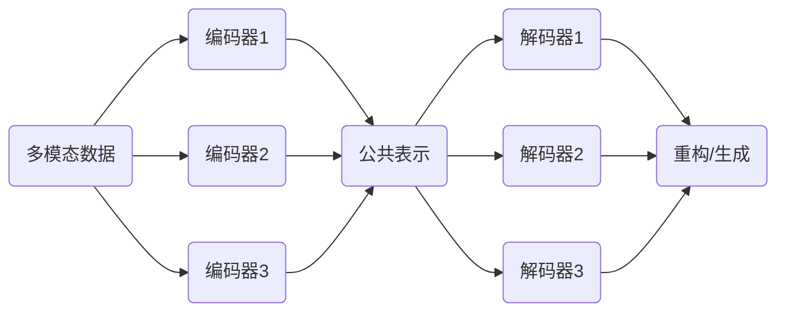
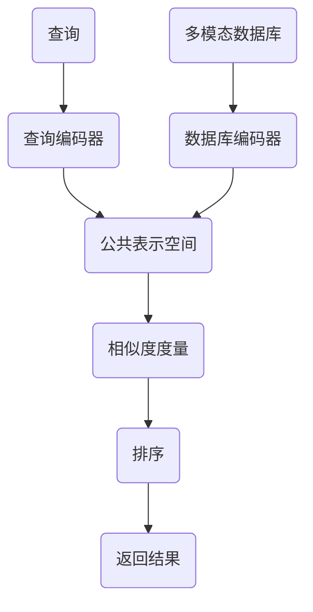
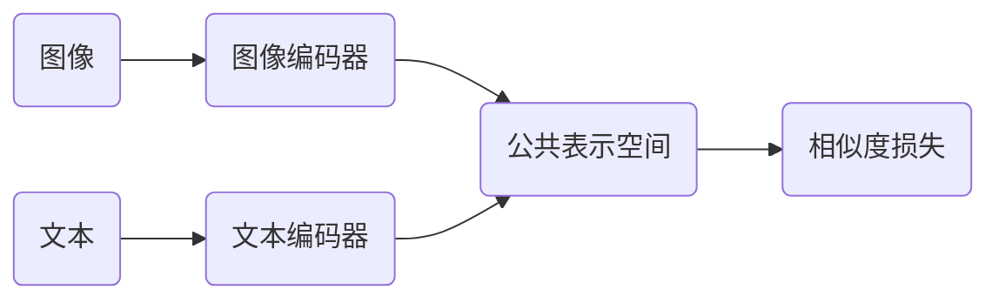
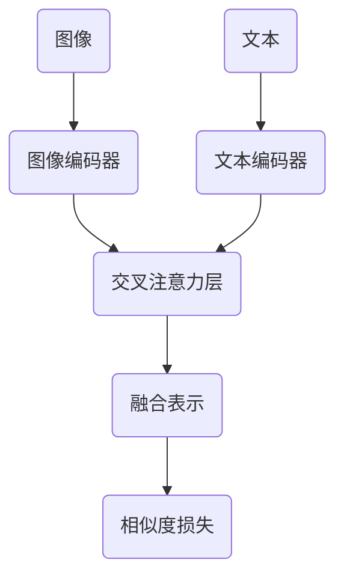
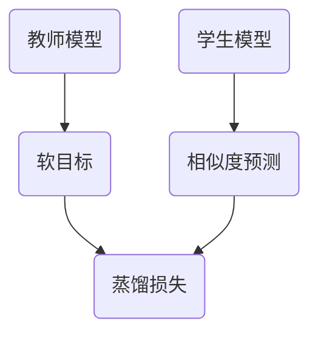

# 基于深度学习的多模态检索

作者：禅与计算机程序设计艺术

## 1. 背景介绍
### 1.1 多模态数据的爆炸式增长
随着互联网和移动设备的普及,我们每天都在产生和消费大量的多模态数据,如文本、图像、音频和视频等。据统计,全球每天产生的数据量高达2.5EB(艾字节),其中80%以上是非结构化的多模态数据。如何高效地管理和检索这些异构数据,成为了一个巨大的挑战。

### 1.2 传统单模态检索的局限性
传统的信息检索主要针对文本数据,采用倒排索引等技术。对于图像、视频等非文本数据,通常需要先提取一些关键词作为标签,再建立文本索引。这种方法存在两个问题:

1. 人工标注成本高,覆盖率低。海量多模态数据依靠人工标注是不现实的。
2. 忽略了模态内部和模态间的语义关联。不同模态的数据可能描述同一个对象或场景,单独检索无法揭示它们的内在联系。

### 1.3 深度学习驱动的多模态检索
近年来,以深度神经网络为代表的人工智能技术取得了突破性进展。深度学习能够从海量数据中自动学习多层次的特征表示,极大地提升了图像、语音等模态的理解和检索能力。将深度学习应用于多模态检索,有望突破传统方法的瓶颈,实现更加智能、高效、全面的信息检索。

## 2. 核心概念与联系
### 2.1 多模态
多模态(Multimodal)是指信息以多种感官形式如视觉、听觉、触觉等呈现。在计算机领域,多模态数据泛指异构的数字信息载体,主要包括:  

- 文本:如网页、文档、字幕等
- 图像:如照片、图画、截图等 
- 音频:如音乐、播客、录音等
- 视频:如电影、短视频、监控等

不同模态的数据在采集、存储、表示和理解等方面有很大差异,但它们又是高度关联的,描述着现实世界的不同侧面。

### 2.2 深度学习
深度学习(Deep Learning)是机器学习的一个分支,它模仿人脑的神经网络结构,使用多层级的非线性变换对输入数据进行特征提取和抽象。深度学习模型通过端到端的训练,能够自动学习数据内部的分布式表示,而无需过多的人工设计和特征工程。

一些代表性的深度学习模型包括:

- 卷积神经网络(CNN):主要用于图像识别等场景
- 循环神经网络(RNN):主要用于序列建模如语音识别、机器翻译等
- 注意力机制(Attention)和Transformer:用于捕捉数据中的长距离依赖
- 生成式对抗网络(GAN):用于生成逼真的图像、视频等

深度学习在计算机视觉、自然语言处理等领域取得了显著成果,极大地提升了多模态数据的表示和理解能力。

### 2.3 多模态表示学习
多模态表示学习的目标是将不同模态的数据映射到一个公共的语义空间,学习它们的联合表示。理想的多模态表示应该具备以下特性:

- 语义一致性:描述同一概念的不同模态数据应该具有相近的表示。
- 互补性:不同模态的表示应该互补,携带独特的信息。
- 可解释性:表示应该可解释,揭示模态内和模态间的语义结构。
- 泛化性:学习到的表示应该具有较好的泛化能力,可迁移到新的任务。

一些常用的多模态表示学习框架如图1所示。

图1 多模态表示学习框架

多个模态的数据首先通过各自的编码器映射到公共表示空间,再通过解码器重构或生成原始数据。该框架可以无监督地学习紧凑、可解释的多模态表示。

### 2.4 多模态检索
多模态检索(Multi-modal Retrieval)是指给定一个查询(文本、图像等),从多模态数据库中找出与之语义相关的其他模态的数据。多模态检索需要解决两个关键问题:

1. 如何对查询和数据库中的多模态数据进行统一表示和度量?
2. 如何高效地从海量多模态数据库中检索出相关结果?

传统的多模态检索方法主要基于 canonical correlation analysis (CCA) 等浅层模型,难以刻画复杂的跨模态语义关联。近年来,研究者开始探索深度学习驱动的多模态检索方案,取得了可喜的进展。一个典型的基于深度学习的多模态检索流程如图2所示。

图2 基于深度学习的多模态检索流程

查询和数据库中的多模态数据首先通过各自的编码器映射到公共表示空间,然后在该空间计算它们的相似度,对候选结果排序并返回给用户。其中编码器可以采用2.3节中的多模态表示学习框架进行训练。

## 3. 核心算法原理与操作步骤
本节我们重点介绍几种代表性的基于深度学习的多模态检索算法,分析其原理和操作步骤。

### 3.1 基于对偶编码器的多模态检索
对偶编码器(Dual Encoder)是一种简单而有效的多模态表示学习框架。其基本思想是为查询和目标模态各训练一个编码器网络,将它们映射到公共表示空间,并最小化匹配对的表示距离。图3展示了一个基于对偶编码器的图文检索模型。

图3 基于对偶编码器的图文检索模型

对偶编码器的训练分为以下步骤:

1. 准备大规模的图文对齐数据,如图像标题数据集。
2. 对图像使用CNN编码器,对文本使用RNN或Transformer编码器,将它们映射到固定长度的向量表示。
3. 在公共表示空间计算图文表示的相似度,如内积或余弦相似度。
4. 使用对比损失函数(如triplet loss)优化模型,使匹配的图文对相似度高于不匹配的图文对。
5. 重复步骤2-4,直到模型收敛。

在推理阶段,可以用训练好的图像和文本编码器离线计算数据库中所有图像和文本的表示,然后在公共空间进行高效的最近邻搜索。

对偶编码器的优点是简单高效,适合大规模数据。但其缺点是查询和目标模态是独立编码的,无法捕捉它们的细粒度交互。

### 3.2 基于交叉注意力的多模态检索
为了更好地建模查询和目标模态的交互,研究者提出了基于交叉注意力(Cross-attention)的多模态检索模型。其核心是在编码过程中引入注意力机制,让查询和目标模态相互关注对方的重要信息。图4展示了一个基于交叉注意力的图文检索模型。

图4 基于交叉注意力的图文检索模型

具体来说,交叉注意力层的计算过程如下:

1. 将图像表示划分为N个区域向量$\mathbf{v}_i$,将文本表示划分为M个词向量$\mathbf{w}_j$。
2. 计算图文区域/词之间的注意力权重:

$$
a_{ij} = \frac{\exp(s_{ij})}{\sum_{k=1}^N \exp(s_{ik})}, \quad s_{ij} = \mathbf{v}_i^\top \mathbf{w}_j
$$

3. 计算图像到文本的注意力加权和:

$$
\mathbf{\hat{v}} = \sum_{i=1}^N \sum_{j=1}^M a_{ij} \mathbf{v}_i
$$

4. 计算文本到图像的注意力加权和:

$$
\mathbf{\hat{w}} = \sum_{j=1}^M \sum_{i=1}^N a_{ij} \mathbf{w}_j
$$

5. 将原始表示和注意力加权和拼接起来:

$$
\mathbf{v}^* = [\mathbf{v}; \mathbf{\hat{v}}], \quad \mathbf{w}^* = [\mathbf{w}; \mathbf{\hat{w}}]
$$

其中$[\cdot;\cdot]$表示向量拼接。最后将融合后的图文表示$\mathbf{v}^*$和$\mathbf{w}^*$输入到相似度计算层。

引入交叉注意力可以让图像和文本相互增强对方的表示,挖掘更细粒度的语义关联。但其计算开销也相对更大。

### 3.3 基于知识蒸馏的多模态检索
前面介绍的检索模型都是端到端训练的,需要在推理阶段重复计算查询和目标模态的交互。这对于实时性要求高的场景是不友好的。

基于知识蒸馏(Knowledge Distillation)的多模态检索模型可以缓解这一问题。其思想是先训练一个计算密集的教师模型(如基于交叉注意力的模型),然后蒸馏其知识到一个轻量级的学生模型(如对偶编码器)。在推理阶段只需使用学生模型,既能获得较好的检索性能,又能显著提升计算效率。

图5展示了一个基于知识蒸馏的图文检索模型。教师模型采用交叉注意力机制,学生模型采用对偶编码器结构。蒸馏过程可以看作教师模型在引导学生模型学习。

图5 基于知识蒸馏的图文检索模型

具体的蒸馏步骤如下:

1. 在图文对齐数据上训练教师模型,使其能够准确预测图文的匹配度。
2. 用教师模型对所有图文对进行推理,得到软目标(soft target)。
3. 固定教师模型,训练学生模型去拟合软目标。蒸馏损失可以使用KL散度:

$$
\mathcal{L}_{distill} = \sum_{i=1}^N \mathrm{KL}(p_i||q_i) = \sum_{i=1}^N \sum_{j=1}^M p_{ij} \log \frac{p_{ij}}{q_{ij}}
$$

其中$p_i$是教师模型在第$i$个图文对上的软目标概率分布,$q_i$是学生模型的预测概率分布。

4. 重复步骤3,直到学生模型收敛。

知识蒸馏能够将教师模型学到的知识压缩到学生模型中,在提升推理效率的同时尽量保持较高的检索性能。

## 4. 数学模型与公式详解
本节我们详细推导多模态检索中用到的一些关键数学模型和公式。

### 4.1 余弦相似度
余弦相似度(Cosine Similarity)是一种常用的向量