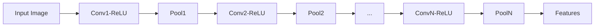

# 基于深度学习的网站验证码识别系统设计与实现

作者：禅与计算机程序设计艺术

## 1. 背景介绍
### 1.1 网站验证码的重要性
验证码是用于区分真实用户和自动程序的一种常见技术,广泛应用于网站登录、注册、评论等需要人机交互的场景。有效的验证码机制能够防止恶意攻击和滥用,保障网站安全和良好的用户体验。

### 1.2 传统验证码识别方法的局限性
传统的验证码识别方法主要基于OCR(光学字符识别)技术,通过对验证码图像进行字符分割、特征提取和模式匹配来识别字符。然而,随着验证码的不断升级和复杂化,如加入干扰线、噪点、畸变、重叠等,传统方法面临识别准确率低、泛化能力差等挑战。

### 1.3 深度学习在验证码识别中的优势
近年来,深度学习技术的飞速发展为验证码识别带来新的契机。相比传统方法,基于深度学习的验证码识别有以下优势:
- 端到端学习:无需人工设计特征,网络可直接从原始图像学习判别性表示
- 强大的特征提取和泛化能力:卷积神经网络擅长学习层次化、抽象化的特征,具有很强的适应性
- 并行计算:深度学习善于利用GPU进行大规模并行计算,速度快
- 容易集成和部署:训练好的模型封装成API,可方便地集成到现有系统

### 1.4 本文的研究目标和内容安排  
本文旨在探索如何利用深度学习技术构建高效准确的网站验证码识别系统。主要研究内容包括:
- 深度学习在图像识别中的核心概念和常用网络结构
- 针对验证码识别任务的数据预处理、网络设计和训练技巧  
- 搭建验证码识别系统的整体架构和工程实践
- 实验评估和应用场景分析

## 2. 核心概念与联系
### 2.1 图像分类和深度学习
图像分类是计算机视觉中的基础任务,旨在将图像映射到预定义的类别标签。深度学习凭借其强大的表示学习能力,在图像分类任务上取得了突破性进展。典型的图像分类流程是:使用卷积神经网络(如AlexNet, VGG, ResNet等)提取图像特征,再通过全连接层映射到类别空间,通过softmax归一化得到各类别概率。

### 2.2 验证码识别的特殊性
相比普通的图像分类,验证码识别有其特殊性:
- 字符数量少(通常4-6个),但排列组合空间大
- 字符是定长序列,需要对每个位置字符进行分类
- 存在字符粘连、断裂、变形等干扰因素,增加了识别难度
因此,我们不能简单套用图像分类的模型,需要根据验证码的特点进行针对性设计。

### 2.3 基于序列学习的验证码识别
验证码可以看作一个定长字符序列,启发我们使用序列学习的思路。常见的序列学习模型有循环神经网络(RNN)和卷积神经网络(CNN)。本文选择使用CNN,主要基于以下考虑:

- CNN以端到端的方式直接从图像中提取特征,避免了繁琐的图像预处理步骤
- CNN局部感受野和权值共享的特性,天然适合处理图像这种网格结构数据
- CNN训练并行度高,在性能和速度上有优势

因此,本文的核心是设计一种融合CNN和序列学习思想的端到端验证码识别模型。

## 3. 核心算法原理与操作步骤
本节介绍验证码识别模型的核心算法原理和具体操作步骤。模型主要由两部分组成:卷积神经网络(CNN)作为特征提取器,全连接网络作为序列分类器。

### 3.1 卷积神经网络(CNN)的特征提取
#### 3.1.1 卷积层
卷积层通过局部连接和权值共享,提取图像中的局部模式特征。设输入特征图为 $\mathbf{X}$,卷积核为 $\mathbf{W}$, 偏置为 $\mathbf{b}$,卷积操作定义为:

$$\mathbf{Z} = \mathbf{W} * \mathbf{X} + \mathbf{b}$$

其中 $*$ 表示卷积操作。常用的卷积核尺寸有 $3\times3$, $5\times5$ 等。

#### 3.1.2 激活函数 
卷积的结果通过激活函数引入非线性,提高网络的表达能力。常用的激活函数有sigmoid, tanh,以及ReLU(校正线性单元):

$$ReLU(x) = max(0, x)$$

ReLU以其收敛速度快,梯度不饱和等优点被广泛使用。

#### 3.1.3 池化层
池化层对特征图进行下采样,既减少了参数量,也提供了一定程度的平移不变性。常见的池化操作有最大池化和平均池化,其中最大池化保留了最显著的特征:

$$Z(i,j) = \max_{(m,n) \in R(i,j)} X(m,n)$$

其中 $R(i,j)$ 表示以 $(i,j)$ 为中心的局部邻域。

#### 3.1.4 堆叠多层CNN
单层卷积只能提取局部简单特征,需要通过堆叠多层卷积-激活-池化单元,逐步建立层次化的特征表示。CNN的一般结构如下:



### 3.2 基于CNN的验证码序列分类
#### 3.2.1 全卷积结构 
与传统CNN在特征提取后接全连接层不同,本文采用全卷积结构。即去掉全连接层,直接在最后一层卷积特征图上做分类预测。这样可以减少参数量,加快训练和推理速度。假设验证码由 $T$ 个字符组成,最后一层卷积输出 $T$ 组特征向量:

$$\mathbf{Z} = [\mathbf{z}_1, \mathbf{z}_2, \cdots,\mathbf{z}_T]$$

每组特征向量对应一个字符分类。

#### 3.2.2 序列分类器
对每组特征向量 $\mathbf{z}_i$,我们首先通过线性变换将其映射到字符类别空间(设类别数为 $C$):

$$\mathbf{o}_i = \mathbf{W}_i\mathbf{z}_i + \mathbf{b}_i,\quad i=1,2,\cdots,T$$

然后通过softmax归一化,得到每个类别的后验概率:

$$p(c_i^t|\mathbf{z}_i) = \frac{exp(o_i^t)}{\sum_{k=1}^C exp(o_i^k)}, \quad t=1,2,\dots,C$$

其中 $c_i^t$ 表示第 $i$ 个字符属于类别 $t$ 的概率。

#### 3.2.3 联合训练目标  
模型的训练目标是最小化所有字符的分类交叉熵损失:

$$\mathcal{L} = -\sum_{i=1}^T\sum_{t=1}^C y_i^t \log p(c_i^t|\mathbf{z}_i)$$

其中 $y_i^t \in \{0,1\}$ 为第 $i$ 个字符的真实类别标签的one-hot编码。
  
### 3.3 模型训练流程
本小节概述模型的完整训练流程:
1. 数据准备:收集大量真实网站验证码样本,并人工标注每个验证码的字符类别序列
2. 数据预处理:统一验证码尺寸(如 $120\times40$),做归一化处理。将类别标签转为one-hot编码形式
3. 搭建CNN+序列分类网络:根据验证码特点设计CNN结构,在特征图上接序列分类器
4. 模型训练:使用Ten sorFlow/PyTorch等深度学习框架,采用小批量梯度下降法训练模型,优化损失函数
5. 模型评估:在单独的测试集上评估模型的识别准确率,分析错误样本
6. 模型优化:尝试改进模型结构,调节超参数,直至得到满意的性能
7. 模型部署:将训练好的模型封装成API,集成到实际的验证码识别系统中

## 4. 项目实践：代码实例和详细解释说明
本节通过代码实例详细演示如何使用Python和Keras库实现基于CNN的验证码识别模型。
### 4.1 环境准备
首先导入必要的库,如numpy, tensorflow, keras等:
```python
import numpy as np 
import tensorflow as tf
from tensorflow import keras
from tensorflow.keras import layers
```

### 4.2 数据加载与预处理
使用Keras的ImageDataGenerator加载验证码图像数据,并进行数据增强:
```python
# 数据加载器
train_datagen = keras.preprocessing.image.ImageDataGenerator(
    rescale=1./255, # 归一化
    rotation_range=20, # 随机旋转
    width_shift_range=0.2, # 水平平移
    height_shift_range=0.2, # 垂直平移
    shear_range=0.2 # 随机错切
)

# 从文件夹中加载验证码图像
train_generator = train_datagen.flow_from_directory(
    'data/train', # 训练集路径
    target_size=(120, 40), # 统一图像尺寸 
    batch_size=32,
    color_mode='grayscale', # 灰度图像
    class_mode='categorical' # 类别编码
)
```

### 4.3 构建CNN+序列分类网络
使用Keras的Sequential模型和函数式API搭建端到端网络:
```python
# 输入
inputs = keras.Input(shape=(120,40,1)) 

# 卷积层
x = layers.Conv2D(32, (3,3), activation='relu')(inputs)
x = layers.MaxPooling2D((2,2))(x)
x = layers.Conv2D(64, (3,3), activation='relu')(x)
x = layers.MaxPooling2D((2,2))(x)
x = layers.Conv2D(64, (3,3), activation='relu')(x)

# 序列分类器
x = layers.Flatten()(x) # 展平
x = layers.Dense(64, activation='relu')(x)

# 4个字符的类别输出
char1 = layers.Dense(36, activation='softmax', name='char1')(x)  
char2 = layers.Dense(36, activation='softmax', name='char2')(x)
char3 = layers.Dense(36, activation='softmax', name='char3')(x)
char4 = layers.Dense(36, activation='softmax', name='char4')(x)

# 模型构建
model = keras.Model(inputs=inputs, outputs=[char1,char2,char3,char4])

model.summary()  # 打印模型概况
```

### 4.4 模型训练与评估
编译模型,指定优化器、损失函数和评价指标,然后启动训练:
```python
# 编译模型
model.compile(loss='categorical_crossentropy',
              optimizer=keras.optimizers.Adam(learning_rate=0.001),
              metrics=['accuracy'])

# 模型训练
model.fit(train_generator,
          epochs=20,
          batch_size=32)  

# 模型评估
scores = model.evaluate(val_generator)
print(f'Val Accuracy: {scores[1]:.2%}')
```

用训练好的模型进行预测:  
```python
# 加载测试图像
img = keras.preprocessing.image.load_img('test.jpg', target_size=(120,40))  
img_arr = np.expand_dims(img, axis=0) / 255.0 # 归一化

# 预测输出
preds = model.predict(img_arr)

# 解码预测结果
labels = np.argmax(preds, axis=-1)
result = ''.join([char_map[c] for c in labels[0]]) 
print(f'Predicted: {result}')
```

## 5. 实际应用场景
基于深度学习的验证码识别可以应用于多个实际场景:
### 5.1 自动化测试
众多网站和App都采用验证码来防止机器恶意注册和登录。自动化测试需要模拟用户操作,验证码识别可以帮助自动输入验证码,提高测试效率。

### 5.2 安全渗透测试
渗透测试需要检验系统对暴力破解、撞库等攻击的防御能力。