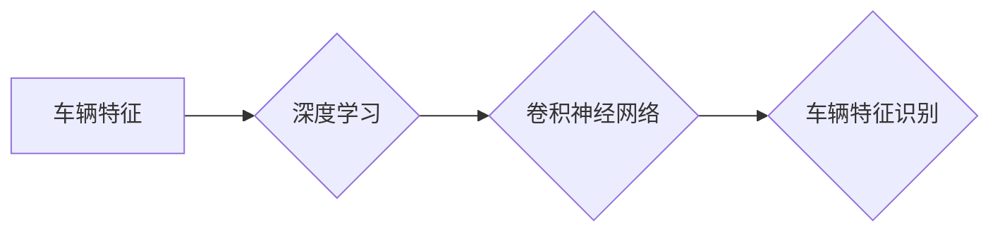

## 1. 背景介绍

### 1.1. 智能交通系统的需求与挑战

随着城市化进程的加速和车辆保有量的不断增加，交通拥堵、交通事故等问题日益突出，对智能交通系统的需求也越来越迫切。车辆特征识别作为智能交通系统中的关键技术之一，能够为交通管理、交通安全、自动驾驶等提供重要的数据支持。传统的车辆特征识别方法主要依赖于人工设计特征和机器学习算法，存在识别精度低、鲁棒性差等问题。近年来，深度学习技术的快速发展为车辆特征识别提供了新的解决方案。

### 1.2. 深度学习在车辆特征识别中的优势

深度学习是一种强大的机器学习技术，能够从海量数据中自动学习特征表示，具有以下优势：

- **强大的特征学习能力:** 深度学习模型能够自动学习复杂的特征表示，无需人工设计特征，可以更好地捕捉车辆特征的细微差别。
- **端到端学习:** 深度学习模型可以实现端到端学习，直接从原始数据学习到最终的识别结果，简化了模型训练过程。
- **高精度和鲁棒性:** 深度学习模型在车辆特征识别任务中取得了显著的成果，识别精度和鲁棒性都得到了大幅提升。

### 1.3. 本文研究内容概述

本文将深入探讨基于深度学习的车辆特征识别技术，包括以下内容：

- 核心概念与联系
- 核心算法原理及操作步骤
- 数学模型和公式详细讲解举例说明
- 项目实践：代码实例和详细解释说明
- 实际应用场景
- 工具和资源推荐
- 总结：未来发展趋势与挑战
- 附录：常见问题与解答

## 2. 核心概念与联系

### 2.1. 车辆特征

车辆特征是指能够描述车辆外观、类型、状态等信息的特征，例如：

- **颜色:** 车身颜色、车牌颜色
- **车型:** 轿车、SUV、卡车等
- **车标:** 奔驰、宝马、奥迪等
- **车牌:** 车牌号码、车牌颜色
- **速度:** 车辆行驶速度
- **位置:** 车辆所在位置

### 2.2. 深度学习

深度学习是一种基于人工神经网络的机器学习方法，其核心思想是通过构建多层神经网络来学习数据中的复杂模式。深度学习模型通常包含多个隐藏层，每个隐藏层都包含多个神经元，神经元之间通过权重连接。深度学习模型通过反向传播算法来调整神经元之间的权重，使得模型能够更好地拟合训练数据。

### 2.3. 卷积神经网络

卷积神经网络 (CNN) 是一种专门用于处理图像数据的深度学习模型。CNN 利用卷积操作来提取图像中的局部特征，并通过池化操作来降低特征维度。CNN 在图像分类、目标检测、图像分割等任务中取得了显著的成果。

### 2.4. 核心概念联系图



## 3. 核心算法原理具体操作步骤

### 3.1. 数据预处理

数据预处理是指在将数据输入深度学习模型之前，对数据进行清洗、转换、标准化等操作，以提高模型的训练效率和识别精度。常见的图像数据预处理方法包括：

- **图像缩放:** 将图像缩放至统一尺寸，以便输入深度学习模型。
- **图像增强:** 通过调整图像亮度、对比度、饱和度等参数来增强图像质量，提高模型的鲁棒性。
- **数据增强:** 通过随机翻转、旋转、裁剪等操作来扩充数据集，提高模型的泛化能力。

### 3.2. 模型构建

模型构建是指根据任务需求选择合适的深度学习模型，并设置模型的结构和参数。在车辆特征识别任务中，常用的深度学习模型包括：

- **VGGNet:** 一种经典的 CNN 模型，具有较深的网络结构和较强的特征提取能力。
- **ResNet:** 一种残差网络模型，通过引入残差连接来解决深度网络训练过程中的梯度消失问题，可以训练更深的网络模型。
- **InceptionNet:** 一种多尺度特征提取模型，通过使用不同大小的卷积核来提取不同尺度的特征，可以更好地捕捉车辆特征的细节信息。

### 3.3. 模型训练

模型训练是指使用训练数据集来调整深度学习模型的参数，使得模型能够更好地拟合训练数据。深度学习模型的训练过程通常包括以下步骤：

- **前向传播:** 将训练数据输入模型，计算模型的输出结果。
- **损失函数计算:** 计算模型输出结果与真实标签之间的差异，即损失函数值。
- **反向传播:** 根据损失函数值计算模型参数的梯度，并使用梯度下降算法来更新模型参数。

### 3.4. 模型评估

模型评估是指使用测试数据集来评估训练好的深度学习模型的性能，常用的评估指标包括：

- **准确率:** 模型正确识别车辆特征的比例。
- **召回率:** 模型正确识别所有具有该特征车辆的比例。
- **F1 值:** 准确率和召回率的调和平均值。

## 4. 数学模型和公式详细讲解举例说明

### 4.1. 卷积操作

卷积操作是 CNN 中的核心操作，用于提取图像中的局部特征。卷积操作通过将卷积核在图像上滑动来计算特征图。卷积核是一个小尺寸的矩阵，其元素表示权重。卷积操作的公式如下：

$$
y_{i,j} = \sum_{m=1}^{k} \sum_{n=1}^{k} w_{m,n} x_{i+m-1,j+n-1} + b
$$

其中：

- $y_{i,j}$ 表示特征图中位置 $(i,j)$ 处的特征值
- $w_{m,n}$ 表示卷积核中位置 $(m,n)$ 处的权重
- $x_{i+m-1,j+n-1}$ 表示输入图像中位置 $(i+m-1,j+n-1)$ 处的像素值
- $b$ 表示偏置项

### 4.2. 池化操作

池化操作用于降低特征图的维度，常用的池化操作包括最大池化和平均池化。最大池化操作选择特征图中每个区域的最大值作为输出，平均池化操作计算特征图中每个区域的平均值作为输出。

### 4.3. 激活函数

激活函数用于引入非线性变换，常用的激活函数包括 sigmoid 函数、ReLU 函数、tanh 函数等。

### 4.4. 损失函数

损失函数用于衡量模型输出结果与真实标签之间的差异，常用的损失函数包括交叉熵损失函数、均方误差损失函数等。

## 5. 项目实践：代码实例和详细解释说明

### 5.1. 数据集准备

本项目使用车辆特征识别数据集，该数据集包含各种车辆的图像，每张图像都标注了车辆的特征信息，例如颜色、车型、车标等。

### 5.2. 模型构建

本项目使用 ResNet50 模型作为车辆特征识别模型，ResNet50 模型是一种具有 50 层的残差网络模型，具有较强的特征提取能力。

```python
import tensorflow as tf

# 定义 ResNet50 模型
def ResNet50(input_shape, num_classes):
    base_model = tf.keras.applications.ResNet50(
        weights='imagenet', include_top=False, input_shape=input_shape
    )
    x = base_model.output
    x = tf.keras.layers.GlobalAveragePooling2D()(x)
    x = tf.keras.layers.Dense(1024, activation='relu')(x)
    predictions = tf.keras.layers.Dense(num_classes, activation='softmax')(x)
    model = tf.keras.models.Model(inputs=base_model.input, outputs=predictions)
    return model

# 设置模型参数
input_shape = (224, 224, 3)
num_classes = 10

# 创建 ResNet50 模型
model = ResNet50(input_shape, num_classes)
```

### 5.3. 模型训练

使用训练数据集对 ResNet50 模型进行训练，并使用验证数据集评估模型性能。

```python
# 编译模型
model.compile(
    optimizer='adam', loss='categorical_crossentropy', metrics=['accuracy']
)

# 训练模型
model.fit(
    train_dataset, epochs=10, validation_data=val_dataset
)
```

### 5.4. 模型测试

使用测试数据集评估训练好的 ResNet50 模型的性能。

```python
# 评估模型
loss, accuracy = model.evaluate(test_dataset)
print('Loss:', loss)
print('Accuracy:', accuracy)
```

## 6. 实际应用场景

### 6.1. 智能交通管理

车辆特征识别技术可以用于交通流量监测、交通违章抓拍、车辆追踪等智能交通管理场景。

### 6.2. 自动驾驶

车辆特征识别技术可以为自动驾驶系统提供车辆周围环境信息，例如识别前方车辆、行人、交通信号灯等，辅助自动驾驶系统做出安全驾驶决策。

### 6.3. 安防监控

车辆特征识别技术可以用于安防监控系统，例如识别可疑车辆、追踪车辆轨迹等，提高安防监控系统的效率和安全性。

## 7. 工具和资源推荐

### 7.1. TensorFlow

TensorFlow 是 Google 开源的深度学习框架，提供了丰富的深度学习模型和工具，方便开发者构建和训练深度学习模型。

### 7.2. PyTorch

PyTorch 是 Facebook 开源的深度学习框架，具有动态计算图和易用性等优势，也提供了丰富的深度学习模型和工具。

### 7.3. OpenCV

OpenCV 是一个开源的计算机视觉库，提供了丰富的图像处理和计算机视觉算法，可以用于车辆特征识别任务中的图像预处理和特征提取。

## 8. 总结：未来发展趋势与挑战

### 8.1. 未来发展趋势

- **多模态特征融合:** 将车辆的图像、雷达、激光雷达等多模态数据进行融合，提高车辆特征识别的精度和鲁棒性。
- **轻量化模型:** 研究轻量化的深度学习模型，降低模型计算复杂度和内存占用，方便模型部署到移动设备和嵌入式系统。
- **自监督学习:** 利用海量未标注数据进行自监督学习，提高模型的泛化能力和识别精度。

### 8.2. 挑战

- **复杂场景下的识别精度:** 在复杂交通场景下，例如光照变化、遮挡、雨雪天气等，车辆特征识别的精度仍然存在挑战。
- **实时性要求:** 车辆特征识别技术需要满足实时性要求，例如在自动驾驶系统中，需要快速识别车辆特征，以便做出驾驶决策。
- **数据安全和隐私保护:** 车辆特征识别技术涉及到车辆数据的采集和处理，需要保障数据安全和隐私保护。

## 9. 附录：常见问题与解答

### 9.1. 如何选择合适的深度学习模型？

选择深度学习模型需要考虑任务需求、数据集大小、计算资源等因素。对于车辆特征识别任务，常用的深度学习模型包括 VGGNet、ResNet、InceptionNet 等。

### 9.2. 如何提高车辆特征识别的精度？

提高车辆特征识别的精度可以从以下方面入手：

- **数据预处理:** 对图像数据进行清洗、转换、标准化等操作，提高模型的训练效率和识别精度。
- **模型选择:** 选择合适的深度学习模型，并设置模型的结构和参数。
- **模型训练:** 使用高质量的训练数据集对模型进行训练，并使用验证数据集评估模型性能。
- **数据增强:** 通过随机翻转、旋转、裁剪等操作来扩充数据集，提高模型的泛化能力。

### 9.3. 如何解决复杂场景下的车辆特征识别问题？

解决复杂场景下的车辆特征识别问题可以从以下方面入手：

- **多模态特征融合:** 将车辆的图像、雷达、激光雷达等多模态数据进行融合，提高车辆特征识别的精度和鲁棒性。
- **自监督学习:** 利用海量未标注数据进行自监督学习，提高模型的泛化能力和识别精度。
- **对抗训练:** 使用对抗样本对模型进行训练，提高模型的鲁棒性。
