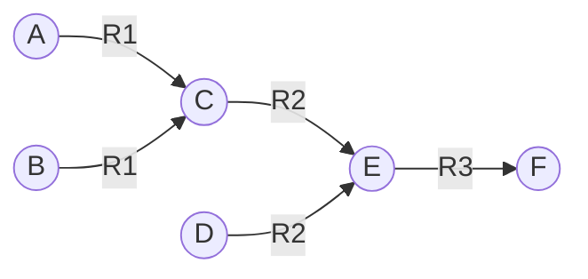

# 基于规则的专家系统：经典方法与现代应用

作者：禅与计算机程序设计艺术

## 1. 背景介绍

### 1.1 专家系统概述
专家系统是人工智能领域最早的研究方向之一,旨在通过知识工程的方法,将人类专家在特定领域的知识和经验抽取出来,形成知识库,并基于知识库和推理机制,模拟专家的决策思维,解决复杂问题。

### 1.2 基于规则的专家系统
基于规则的专家系统是专家系统的经典形式,利用if-then形式的规则来表示专家知识,通过前向或后向推理对规则进行匹配和执行,得出结论或建议。这种方法结构清晰,易于实现和维护。

### 1.3 发展历程与现状
自20世纪70年代以来,基于规则的专家系统在医疗、工程、金融等领域得到了广泛应用。随着人工智能技术的发展,深度学习、知识图谱等新方法也逐渐融入其中,赋予了传统专家系统新的生命力。

## 2. 核心概念与联系

### 2.1 知识表示
- 2.1.1 产生式规则  
产生式规则是最常见的知识表示形式,由条件和结论两部分组成,形如:IF condition THEN action。

- 2.1.2 语义网络  
语义网络使用节点表示概念,边表示概念间的关系,形成一张有向图,直观体现知识的语义联系。

- 2.1.3 框架  
框架是一种基于面向对象思想的知识表示方法,使用框架(类)及其实例(对象)的层次结构来组织知识。

### 2.2 推理机制 
- 2.2.1 前向推理  
前向推理从已知事实出发,匹配规则条件部分,执行结论部分,直到达到目标或无法继续为止。适合于数据驱动型任务。

- 2.2.2 后向推理  
后向推理从目标出发,寻找能够支持该目标的规则,如条件不满足则将其作为新的子目标,递归执行,直到目标被证明或无法继续为止。适合于目标驱动型任务。

### 2.3 知识获取
- 2.3.1 人工提取  
通过与领域专家的访谈、观察等方式,总结提炼出知识规则,再将其形式化表示为知识库。

- 2.3.2 机器学习  
利用决策树、归纳逻辑程序设计等机器学习算法,从案例数据中自动提取知识规则。

### 2.4 不确定性处理
- 2.4.1 确定性推理  
默认规则结论为确定性知识,通过传统的逻辑推理得出确定性结论。

- 2.4.2 概率推理  
使用条件概率或贝叶斯网络等模型,对带有概率的不确定性知识进行推理。

- 2.4.3 模糊推理  
对自然语言形式的模糊性知识,使用模糊集合论进行表示和推理。

## 3. 核心算法原理具体操作步骤

### 3.1 Rete算法
Rete是一种高效执行规则系统的模式匹配算法,主要用于前向推理。它的基本思想是将规则条件编译成一个判别网络,通过网络节点的层层过滤,避免了重复的模式匹配,大幅提升了执行效率。具体步骤如下:
1. 规则编译:将规则条件部分编译为判别网络的Alpha节点和Beta节点。  
2. 事实传播:将初始事实(Working Memory Elements)输入到判别网络的根节点。
3. 激活规则:匹配成功的规则被激活并放入议程(Agenda)。
4. 规则执行:从议程中选择规则,执行其结论部分,并将新的事实加入到判别网络中。
5. 重复3-4步,直到没有可激活的规则为止。

### 3.2 MYCIN的不确定性因子模型
MYCIN是一个早期诊断血液感染的专家系统,它使用了不确定性因子(Certainty Factor)来表示医生诊断的主观把握程度。
设P(h)为假设h成立的概率,P(h|e)为已知证据e时假设h成立的概率,则定义不确定性因子CF如下:

$$
CF(h,e) = 
\begin{cases}
\frac{P(h|e) - P(h)}{1-P(h)} & ,P(h|e) > P(h) \\
\frac{P(h) - P(h|e)}{P(h)} & ,P(h|e) < P(h) \\
0 & ,P(h|e) = P(h)
\end{cases}
$$

多条证据的不确定性因子可通过下列公式组合:

$$
CF(h,e_1 \wedge e_2) = 
\begin{cases}
CF(h,e_1) + CF(h,e_2) \cdot (1-CF(h,e_1)) & ,CF(h,e_1) \geq 0 \wedge CF(h,e_2) \geq 0\\
CF(h,e_1) + CF(h,e_2) \cdot (1+CF(h,e_1)) & ,CF(h,e_1) < 0 \vee CF(h,e_2) < 0\\
\frac{CF(h,e_1) + CF(h,e_2)}{1-min(|CF(h,e_1)|,|CF(h,e_2)|)} & ,sign(CF(h,e_1)) \neq sign(CF(h,e_2))
\end{cases}
$$

### 3.3 基于归结的逻辑推理
归结原理是数理逻辑中的重要推理方法,被用于早期的逻辑式专家系统如PROLOG。基本原理是:对于一阶逻辑公式集S,如果存在从S能推导出的两个互补文字(原子公式及其否定),那么就可以归结出空子句(恒真或恒假),从而证明了S的不可满足性。

1. 将知识库中的规则和事实表示为子句形式,即析取式(选言式)。
2. 对需要证明的目标公式G,构造它的否定$\neg G$,并将其加入到子句集S中。
3. 重复以下归结步骤,直到归结出空子句(证明$\neg G$不可满足,即G为真)或无法继续归结(G为假): 
   - 归结项选择:从S中选择两个可归结的子句C1和C2。
   - 一元化:找出C1和C2最一般的单一化式。
   - 归结:删除C1和C2的互补文字,将剩余的文字析取形成新子句。
   - 归结式加入:将新子句加入到S中。

## 4. 数学模型和公式详细讲解举例说明
下面以一个简单的产生式系统为例,说明其中的数学模型和推理过程。

### 4.1 知识库
设知识库KB包含以下规则:
- $R_1$: $A \wedge B \rightarrow C$ 
- $R_2$: $C \wedge D \rightarrow E$
- $R_3$: $E \rightarrow F$

### 4.2 推理过程
假设初始事实为{A,B,D},要证明目标F。根据Rete算法:

1. 编译规则得到判别网络:



2. 输入初始事实{A,B,D},激活规则$R_1$,议程中加入规则$R_1$。
3. 执行$R_1$,推出新事实C,输入到判别网络,激活规则$R_2$,议程中加入$R_2$。
4. 执行$R_2$,推出新事实E,输入到判别网络,激活规则$R_3$,议程中加入$R_3$。 
5. 执行$R_3$,推出F,匹配成功,证明目标。

可以看出,Rete网络避免了对规则条件的重复计算,提高了规则匹配和执行的效率。

## 5. 项目实践：代码实例和详细解释说明
下面以Python为例,使用PyKnow库构建一个简单的专家系统。PyKnow实现了Rete算法和产生式规则语法,可以方便地编写基于规则的推理程序。

### 5.1 安装PyKnow
```bash
pip install pyknow
```

### 5.2 知识库定义
使用Fact类定义事实,使用@Rule装饰器定义规则:

```python
from pyknow import *

class Light(Fact):
    """事实:交通信号灯"""
    pass

class RobotCrossStreet(KnowledgeEngine):
    @Rule(Light(color='green'))
    def green_light(self):
        print("绿灯亮,小车通过马路")

    @Rule(Light(color='red'))
    def red_light(self):
        print("红灯亮,小车等待")

    @Rule(AS.light << Light(color=L('yellow') | L('blinking-yellow')))
    def yellow_light(self, light):
        print("黄灯亮,小车减速慢行")
```

### 5.3 规则推理
实例化知识引擎,声明初始事实,执行run()方法触发推理:

```python
engine = RobotCrossStreet()
engine.reset()

engine.declare(Light(color='green'))
engine.run()

engine.declare(Light(color='yellow'))
engine.run()

engine.declare(Light(color='blinking-yellow'))
engine.run()

engine.declare(Light(color='red'))
engine.run()
```

输出结果为:
```
绿灯亮,小车通过马路
黄灯亮,小车减速慢行
黄灯亮,小车减速慢行
红灯亮,小车等待
```

可以看出,根据不同的交通灯颜色事实,系统触发了对应的规则,给出了相应的行为决策。

## 6. 实际应用场景

### 6.1 智能诊断
医疗领域是专家系统最早应用的领域之一。基于规则的方法可以编码医生的诊断知识和经验,辅助进行疾病的判断和治疗方案的制定。如MYCIN系统可用于血液感染的诊断,CADUCEUS系统可用于内科疾病的诊断等。

### 6.2 个性化推荐
电商领域可使用基于规则的推荐系统,根据用户的个人属性、历史行为、上下文等,构建一系列推荐规则,给出个性化的商品推荐。相比协同过滤等方法,基于规则的推荐更加灵活,可解释性更强。

### 6.3 智能客服
企业可构建基于规则的智能客服系统,根据客户问题的关键词、语义等,匹配预设的问题-答案规则库,快速给出相应的解答。对于更复杂的问题,也可以进行多轮对话,进行深入诊断,提供智能化服务。

### 6.4 设备故障诊断
工业领域常需要对复杂设备进行故障诊断和维修。基于规则的专家系统可以将工程师的诊断经验形式化为规则库,通过设备各项参数和故障现象,快速定位问题原因,指导维修操作,减少人工诊断的时间。

### 6.5 风险评估
金融领域的风险管理中,可使用规则系统对贷款申请人的资质进行评估,根据其收入、信用记录、资产等因素,给出风险等级和授信额度建议。再结合专家经验校正,帮助审核人员快速作出评判。

## 7. 工具和资源推荐
- Drools:Java语言的业务规则引擎,实现了Rete算法,提供了声明式的规则语法sugar,是开发规则系统的利器。

- PyKnow:Python语言的规则引擎库,同样实现了Rete算法,提供了简洁的API,可快速构建原型系统。

- OpenRules:基于PMML(Predictive Model Markup Language)的开源业务规则系统,使用decision table来编写规则,易学易用。

- GeneralizedRuleReasoning:GRR:一个网络化、可扩展的通用规则引擎,支持复杂的规则模型和语义推理。

- 专家系统导论(Orginal Edition):Peter Jackson的经典书,详细介绍了专家系统的原理和常见方法,案例丰富,适合入门学习。

- 构建专家系统(Building Expert Systems):Frederick Hayes-Roth的著作,全面探讨了专家系统的构建方法和工程实践,既有理论深度,又有实践指导意义。

## 8. 总结：未来发展趋