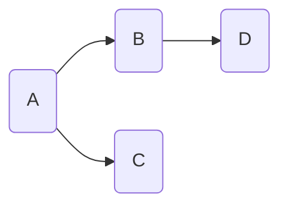

# 基于贝叶斯网络的因果关系研究及算法包实现

## 1.背景介绍

### 1.1 因果关系的重要性

在现实世界中,事物之间存在着复杂的因果关系网络。准确识别和理解这些因果关系对于科学研究、决策分析和风险评估等领域都至关重要。例如,在医学领域,确定疾病的根源和症状之间的因果关系可以帮助制定更有效的治疗方案;在社会科学研究中,探索社会现象的潜在原因有助于制定相应的政策干预措施。

### 1.2 贝叶斯网络在因果推理中的作用

贝叶斯网络(Bayesian Network)是一种基于概率论和图论的有向无环图模型,能够有效地表示随机变量之间的条件独立性和因果关系。它提供了一种紧凑且直观的方式来可视化和推理复杂的联合概率分布,广泛应用于许多领域,如医疗诊断、风险分析、决策支持系统等。

在因果推理任务中,贝叶斯网络具有以下优势:

1. 直观表示: 贝叶斯网络使用有向无环图清晰地表示变量之间的因果关系,便于人类理解和解释。
2. 概率推理: 贝叶斯网络基于贝叶斯定理,能够进行精确的概率推理,包括诊断推理(从证据推断原因)和因果推理(从原因推断结果)。
3. 结构学习: 通过观测数据,可以学习贝叶斯网络的结构,从而发现潜在的因果关系。
4. 参数学习: 给定网络结构,可以从数据中估计条件概率参数,提高模型的预测精度。

### 1.3 本文概述

本文将深入探讨基于贝叶斯网络的因果关系研究,包括理论基础、算法实现和实际应用。我们将介绍贝叶斯网络的核心概念、结构和参数学习算法、因果发现方法以及相关的数学模型和公式。此外,还将提供基于Python的贝叶斯网络算法包的实现细节和代码示例,以及在不同领域的应用场景。最后,我们将总结贝叶斯网络在因果推理中的发展趋势和挑战。

## 2.核心概念与联系

### 2.1 贝叶斯网络的基本概念

贝叶斯网络(Bayesian Network)是一种概率图模型,由两个部分组成:

1. **有向无环图(Directed Acyclic Graph, DAG)**: 节点表示随机变量,有向边表示变量之间的条件依赖关系。
2. **条件概率表(Conditional Probability Table, CPT)**: 每个节点都有一个与之相关的条件概率表,用于量化该节点在给定其父节点取值情况下的条件概率分布。

下面是一个简单的贝叶斯网络示例:

在这个例子中,节点A是B和C的父节点,节点B是D的父节点。每个节点都有一个相应的条件概率表,例如P(B|A)、P(C|A)和P(D|B)。利用这些条件概率表和网络结构,我们可以计算任意事件的联合概率分布。

贝叶斯网络遵循**马尔可夫条件独立性假设**,即给定一个节点的父节点,该节点与其非后代节点是条件独立的。这种独立性假设使得贝叶斯网络能够以紧凑的方式表示复杂的联合概率分布。

### 2.2 贝叶斯网络与因果关系

虽然贝叶斯网络本身不直接表示因果关系,但它的有向边可以被解释为因果影响。在许多应用中,贝叶斯网络的结构反映了变量之间的潜在因果机制。例如,在医学诊断中,疾病是症状的原因,因此疾病节点将指向症状节点。

然而,需要注意的是,贝叶斯网络的结构并不能直接从数据中学习出因果关系。这是因为相关性并不意味着因果关系,存在多个可能的因果模型可以解释同一组数据。为了从贝叶斯网络中推断出因果关系,需要引入一些额外的假设和约束条件,例如时间先后顺序、干预等。

### 2.3 结构等价性和因果等价性

在研究贝叶斯网络的结构时,需要注意结构等价性(Structural Equivalence)和因果等价性(Causal Equivalence)的概念。

**结构等价性**指的是两个贝叶斯网络的结构编码了相同的条件独立性关系,即它们可以表示相同的联合概率分布。结构等价的网络具有相同的d-separation属性,因此在概率推理方面是等价的。

**因果等价性**是一个更强的概念,它要求两个贝叶斯网络不仅具有相同的条件独立性关系,而且还能够表示相同的因果机制。换句话说,它们对应着相同的潜在因果模型。因果等价性类通常比结构等价性类更大,因为存在一些结构不同但却能够编码相同因果语义的网络。

在因果发现算法中,通常会首先学习出一个结构等价性类,然后根据一些额外的约束条件(如时间顺序、干预等)来确定唯一的因果等价性类。

## 3.核心算法原理具体操作步骤

### 3.1 结构学习算法

结构学习是指从观测数据中学习贝叶斯网络的结构(有向无环图)的过程。主要有以下三种方法:

#### 3.1.1 约束基础结构学习算法

约束基础结构学习算法通过检测变量之间的条件独立性关系来构建网络结构。常见的算法包括:

1. **PC算法(Peter-Clark算法)**: 基于有向分离(d-separation)的概念,通过条件独立性测试来学习骨架结构(无向边)和有向边的方向。
2. **IC算法(Inductive Causation算法)**: 利用条件独立性测试来识别潜在的因果关系,并尝试构建最简单的贝叶斯网络。
3. **Fast Causal Inference(FCI)算法**: 一种更健壮的算法,可以处理潜在的无向圈和潜在的混杂(confounder)。

这些算法的优点是不需要先验知识,可以从数据中直接学习网络结构。但缺点是需要大量数据,并且对数据的质量要求较高。

#### 3.1.2 评分函数基础结构学习算法

评分函数基础结构学习算法通过优化某个评分函数(Score Function)来搜索最优网络结构。常见的算法包括:

1. **贪婪搜索算法**: 使用贪婪启发式策略(如添加、删除或反转边)来优化评分函数,例如贪婪等阶搜索(Greedy Equivalence Search)算法。
2. **贪婪厚尔烈搜索算法**: 通过MCMC(Markov Chain Monte Carlo)采样技术来近似搜索整个网络空间。
3. **黑盒优化算法**: 使用启发式优化算法(如遗传算法、模拟退火等)来优化评分函数。

常用的评分函数包括BIC(Bayesian Information Criterion)、BDeu(Bayesian Dirichlet Equivalent Uniform)、MDL(Minimum Description Length)等。这些算法的优点是可以利用先验知识,并且对数据质量的要求较低。但缺点是计算代价较高,并且存在局部最优的风险。

#### 3.1.3 混合结构学习算法

混合结构学习算法结合了约束基础和评分函数基础的优点,通常分两个阶段进行:

1. **骨架识别阶段**: 使用约束基础算法(如PC算法)来学习网络的骨架结构。
2. **方向确定阶段**: 基于骨架结构,使用评分函数基础算法(如贪婪搜索)来确定边的方向。

这种混合方法可以提高结构学习的准确性和效率。

### 3.2 参数学习算法

给定贝叶斯网络的结构,参数学习的目标是从数据中估计每个节点的条件概率表(CPT)。常见的参数学习算法包括:

#### 3.2.1 最大似然估计(Maximum Likelihood Estimation, MLE)

最大似然估计是一种常用的参数学习方法,它通过最大化观测数据的似然函数来估计CPT参数。对于离散变量,MLE的计算公式如下:

$$P(X_i=x_i|Parents(X_i)=\pi_i) = \frac{N_{x_i,\pi_i}}{N_{\pi_i}}$$

其中,\\(N_{x_i,\pi_i}\\)表示在数据中观测到\\(X_i=x_i\\)且\\(Parents(X_i)=\pi_i\\)的实例数,\\(N_{\pi_i}\\)表示\\(Parents(X_i)=\pi_i\\)的实例数。

对于连续变量,可以使用高斯分布或其他参数分布来估计CPT参数。

#### 3.2.2 贝叶斯估计(Bayesian Estimation)

贝叶斯估计是一种将先验知识与数据相结合的参数学习方法。常用的贝叶斯估计方法包括:

1. **BDeu(Bayesian Dirichlet Equivalent Uniform)**: 使用Dirichlet先验分布,是一种常用的离散变量参数估计方法。
2. **高斯-威士忌先验(Gaussian-Wishart Prior)**: 用于连续变量的参数估计,假设数据服从高斯分布。

贝叶斯估计的优点是可以避免过拟合,并且能够很好地处理缺失数据和小样本情况。

#### 3.2.3 最大后验估计(Maximum A Posteriori, MAP)

最大后验估计将最大似然估计和贝叶斯估计相结合,通过最大化后验概率来估计CPT参数。MAP估计可以看作是在最大似然估计的基础上引入了正则化项(基于先验分布)。

### 3.3 因果发现算法

除了从数据中学习贝叶斯网络的结构和参数,另一个重要的任务是从已知的网络结构中推断出潜在的因果关系。常见的因果发现算法包括:

#### 3.3.1 基于条件独立性的算法

这类算法利用条件独立性测试来识别潜在的因果关系,例如:

1. **IC算法**: 通过测试条件独立性来确定因果方向。
2. **PC-Stable算法**: 在PC算法的基础上,引入了稳定性概念来提高因果发现的准确性。

这些算法的优点是计算效率较高,但需要满足一些假设条件(如马尔可夫条件、足够大的样本量等)。

#### 3.3.2 基于评分函数的算法

这类算法通过优化某个评分函数来搜索最优的因果模型,例如:

1. **GES(Greedy Equivalence Search)算法**: 使用贪婪搜索策略和BIC评分函数来学习因果模型。
2. **GIES(Greedy Intervention Equivalence Search)算法**: 在GES的基础上,引入了干预数据来提高因果发现的准确性。

这些算法的优点是可以利用先验知识,并且对数据质量的要求较低。但计算代价较高,存在局部最优的风险。

#### 3.3.3 基于机器学习的算法

近年来,一些基于机器学习的算法(如神经因果估计、生成对抗网络等)也被应用于因果发现任务。这些算法通过学习数据的潜在表示,从而捕获变量之间的复杂因果关系。但这类算法的可解释性和理论保证仍需进一步研究。

## 4.数学模型和公式详细讲解举例说明

在贝叶斯网络中,我们需要计算给定观测数据和网络结构的联合概率分布。根据贝叶斯网络的马尔可夫条件独立性假设,联合概率分布可以分解为条件概率的乘积:

$$P(X_1, X_2, \dots, X_n) = \prod_{i=1}^n P(X_i|Parents(X_i))$$

其中,\\(Parents(X_i)\\)表示节点\\(X_i\\)的父节点集合。

对于离散变量,每个条件概率\\(P(X_i|Parents(X_i))\\)可以通过条