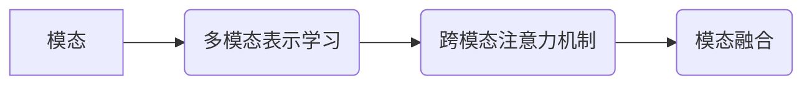

# 多模态大模型：技术原理与实战 GPT的创新点总结

作者：禅与计算机程序设计艺术

## 1. 背景介绍

### 1.1 多模态学习的兴起

近年来，随着深度学习技术的飞速发展，人工智能在各个领域都取得了显著的成果。其中，多模态学习作为一种新兴的研究方向，引起了学术界和工业界的广泛关注。多模态学习旨在通过整合多种感知模态的信息，例如文本、图像、音频和视频等，来提升模型的理解和推理能力，从而更好地模拟人类的认知过程。

### 1.2 大模型时代的到来

随着计算能力的提升和数据规模的爆炸式增长，深度学习模型的规模也越来越大。这些大模型通常拥有数十亿甚至数百亿的参数，能够在各种任务上取得令人瞩目的性能。然而，传统的单模态大模型往往难以捕捉不同模态之间的复杂关系，限制了其在实际场景中的应用。

### 1.3 多模态大模型的优势

为了克服上述局限性，多模态大模型应运而生。相比于单模态大模型，多模态大模型具有以下优势：

* **更强的表征能力:** 多模态大模型能够学习到更全面、更丰富的特征表示，从而更好地理解和分析不同模态的信息。
* **更广泛的应用场景:** 多模态大模型可以应用于更广泛的领域，例如图像描述生成、视频摘要、跨模态检索等。
* **更接近人类认知:** 多模态大模型能够模拟人类的多模态感知能力，从而更接近人类的认知过程。

## 2. 核心概念与联系

### 2.1 模态 (Modality)

模态是指信息的表达方式或感知通道，例如文本、图像、音频和视频等。每种模态都具有其独特的特征和信息表达方式。

### 2.2 多模态表示学习 (Multimodal Representation Learning)

多模态表示学习旨在将不同模态的信息映射到一个共同的特征空间，以便于模型进行跨模态理解和推理。

### 2.3 跨模态注意力机制 (Cross-modal Attention Mechanism)

跨模态注意力机制允许模型在处理一种模态信息时，关注其他模态的相关信息，从而捕捉不同模态之间的语义联系。

### 2.4 模态融合 (Modality Fusion)

模态融合是指将不同模态的特征表示进行整合，以获得更全面、更丰富的特征表示。

### 2.5 核心概念联系图



## 3. 核心算法原理具体操作步骤

### 3.1 编码器-解码器架构

多模态大模型通常采用编码器-解码器架构。编码器负责将不同模态的输入信息编码成特征向量，解码器则利用这些特征向量生成目标输出。

### 3.2 编码阶段

在编码阶段，模型使用不同的编码器来处理不同模态的输入信息。例如，对于文本模态，可以使用 BERT 或 GPT 等预训练语言模型进行编码；对于图像模态，可以使用 ResNet 或 VGG 等卷积神经网络进行编码。

### 3.3 解码阶段

在解码阶段，模型使用解码器来生成目标输出。解码器可以是循环神经网络 (RNN) 或 Transformer 等。解码器利用编码器生成的特征向量，并结合任务目标，生成最终的输出结果。

### 3.4 具体操作步骤

1. 将不同模态的输入数据分别输入对应的编码器进行编码。
2. 使用跨模态注意力机制捕捉不同模态之间的语义联系。
3. 对不同模态的特征表示进行融合，以获得更全面、更丰富的特征表示。
4. 将融合后的特征向量输入解码器进行解码，生成目标输出。

## 4. 数学模型和公式详细讲解举例说明

### 4.1 跨模态注意力机制

跨模态注意力机制的核心思想是计算不同模态特征向量之间的相似度，并根据相似度对特征向量进行加权求和。

**公式：**

```
Attention(Q, K, V) = softmax(Q * K^T / sqrt(d_k)) * V
```

其中：

* Q: 查询向量
* K: 键向量
* V: 值向量
* d_k: 键向量的维度

**举例说明：**

假设我们有一个图像和一段描述该图像的文本。我们可以使用跨模态注意力机制来计算图像特征向量和文本特征向量之间的相似度，并根据相似度对图像特征向量进行加权求和，从而获得更关注文本描述的图像特征表示。

### 4.2 模态融合

模态融合方法有很多种，例如拼接、加权求和、基于注意力机制的融合等。

**拼接：**

将不同模态的特征向量拼接在一起，形成一个更大的特征向量。

**加权求和：**

根据不同模态的重要性，对不同模态的特征向量进行加权求和。

**基于注意力机制的融合：**

使用注意力机制计算不同模态特征向量之间的相似度，并根据相似度对特征向量进行加权求和。

## 5. 项目实践：代码实例和详细解释说明

### 5.1 图像描述生成

**代码实例：**

```python
import tensorflow as tf

# 定义编码器
image_encoder = tf.keras.applications.ResNet50(weights='imagenet', include_top=False)
text_encoder = tf.keras.layers.Embedding(input_dim=vocab_size, output_dim=embedding_dim)

# 定义解码器
decoder = tf.keras.layers.LSTM(units=hidden_dim)

# 定义模型
inputs = [image_input, text_input]
image_features = image_encoder(image_input)
text_features = text_encoder(text_input)
merged_features = tf.keras.layers.Concatenate()([image_features, text_features])
outputs = decoder(merged_features)
model = tf.keras.Model(inputs=inputs, outputs=outputs)

# 编译模型
model.compile(optimizer='adam', loss='categorical_crossentropy')

# 训练模型
model.fit(x=[images, texts], y=captions, epochs=10)

# 生成图像描述
caption = model.predict([image, text])
```

**解释说明：**

* 该代码实例使用 ResNet50 作为图像编码器，使用 Embedding 层作为文本编码器。
* 使用 Concatenate 层将图像特征和文本特征拼接在一起。
* 使用 LSTM 作为解码器，生成图像描述。

### 5.2 视频摘要

**代码实例：**

```python
import tensorflow as tf

# 定义编码器
video_encoder = tf.keras.layers.TimeDistributed(tf.keras.applications.ResNet50(weights='imagenet', include_top=False))
audio_encoder = tf.keras.layers.LSTM(units=hidden_dim)

# 定义解码器
decoder = tf.keras.layers.LSTM(units=hidden_dim)

# 定义模型
inputs = [video_input, audio_input]
video_features = video_encoder(video_input)
audio_features = audio_encoder(audio_input)
merged_features = tf.keras.layers.Concatenate()([video_features, audio_features])
outputs = decoder(merged_features)
model = tf.keras.Model(inputs=inputs, outputs=outputs)

# 编译模型
model.compile(optimizer='adam', loss='categorical_crossentropy')

# 训练模型
model.fit(x=[videos, audios], y=summaries, epochs=10)

# 生成视频摘要
summary = model.predict([video, audio])
```

**解释说明：**

* 该代码实例使用 TimeDistributed 层将 ResNet50 应用于视频的每一帧，使用 LSTM 作为音频编码器。
* 使用 Concatenate 层将视频特征和音频特征拼接在一起。
* 使用 LSTM 作为解码器，生成视频摘要。

## 6. 实际应用场景

### 6.1 图像描述生成

* 自动生成图像的文字描述，用于图像检索、图像理解等。

### 6.2 视频摘要

* 自动生成视频的简短摘要，用于视频检索、视频推荐等。

### 6.3 跨模态检索

* 基于文本检索图像或视频，或基于图像或视频检索文本。

### 6.4 人机交互

* 构建更自然、更智能的人机交互系统，例如虚拟助手、聊天机器人等。

## 7. 工具和资源推荐

### 7.1 TensorFlow

* Google 开源的深度学习框架，提供了丰富的多模态学习工具和资源。

### 7.2 PyTorch

* Facebook 开源的深度学习框架，也提供了丰富的多模态学习工具和资源。

### 7.3 Hugging Face

* 提供了大量的预训练多模态模型，例如 CLIP、ViT 等。

## 8. 总结：未来发展趋势与挑战

### 8.1 未来发展趋势

* **更强大的模型:** 随着计算能力的提升和数据规模的增长，多模态大模型的规模将会越来越大，性能也将更加强大。
* **更广泛的应用:** 多模态大模型将会应用于更广泛的领域，例如医疗、教育、金融等。
* **更接近人类认知:** 多模态大模型将会更加注重模拟人类的认知过程，从而构建更智能、更人性化的 AI 系统。

### 8.2 面临的挑战

* **数据稀缺:** 多模态数据的标注成本较高，数据稀缺是多模态学习面临的一大挑战。
* **模型解释性:** 多模态大模型的内部机制较为复杂，模型解释性是一个重要的研究方向。
* **伦理和社会影响:** 多模态大模型的应用可能会带来伦理和社会影响，需要进行深入的思考和研究。

## 9. 附录：常见问题与解答

### 9.1 什么是 GPT？

GPT (Generative Pre-trained Transformer) 是一种基于 Transformer 的预训练语言模型，由 OpenAI 开发。GPT 在大量的文本数据上进行训练，能够生成高质量的文本内容。

### 9.2 GPT 的创新点有哪些？

* **Transformer 架构:** GPT 使用 Transformer 架构，相比于传统的 RNN 或 LSTM，Transformer 能够更好地捕捉长距离依赖关系。
* **自回归语言模型:** GPT 是一种自回归语言模型，能够根据之前的文本内容预测下一个词。
* **大规模预训练:** GPT 在大规模文本数据上进行预训练，能够学习到丰富的语言知识。

### 9.3 GPT 如何应用于多模态学习？

GPT 可以作为文本编码器，将文本信息编码成特征向量，然后与其他模态的特征向量进行融合，用于多模态任务，例如图像描述生成、视频摘要等。
