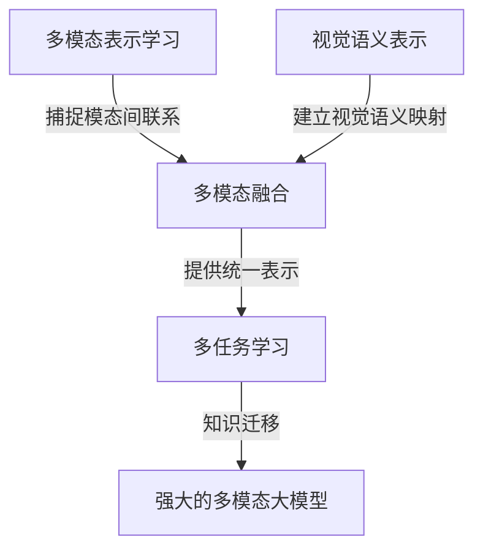

# 多模态大模型：技术原理与实战 文本多模态技术

## 1.背景介绍

### 1.1 多模态大模型的兴起

近年来,随着人工智能技术的快速发展,尤其是自然语言处理(NLP)和计算机视觉(CV)领域的突破性进展,多模态人工智能模型成为了研究的热点。传统的人工智能模型往往只能处理单一模态数据,如文本或图像。然而,现实世界中的信息往往以多种形式存在,如文本、图像、视频、音频等。为了更好地理解和处理这些多模态数据,研究人员提出了多模态人工智能模型的概念。

多模态大模型旨在整合多种模态的信息,如文本、图像、视频等,从而实现更强大、更通用的人工智能系统。这些模型能够同时处理和关联不同模态的数据,提高了人工智能系统的理解和推理能力。

### 1.2 多模态大模型的优势

相比传统的单模态模型,多模态大模型具有以下显著优势:

1. **更全面的信息表示**:多模态模型能够同时捕捉和融合来自不同模态的信息,从而获得更丰富、更全面的数据表示。
2. **更强的泛化能力**:通过在多种模态上进行联合训练,模型能够学习到更加通用和鲁棒的特征表示,从而提高在新的数据和任务上的泛化能力。
3. **更自然的人机交互**:多模态模型能够同时处理多种模态的输入和输出,使得人机交互更加自然和无缝。
4. **更广阔的应用前景**:多模态模型可应用于各种需要处理多模态数据的场景,如多媒体内容分析、人机对话系统、智能助手等。

### 1.3 文本多模态技术的重要性

在多模态大模型中,文本模态作为人类交流和知识传递的重要载体,与其他模态如图像、视频等密切相关。文本多模态技术旨在将文本信息与其他模态信息进行融合,以实现更加精准和全面的理解和生成。

文本多模态技术在以下几个方面具有重要意义:

1. **提高文本理解能力**:通过融合视觉、语音等其他模态信息,能够更好地理解文本中的隐含意义和背景知识。
2. **增强文本生成质量**:融合多模态信息,能够生成更加丰富、生动、贴近实际场景的文本内容。
3. **支持多模态人机交互**:实现文本与其他模态如图像、视频等的无缝集成,为智能助手、对话系统等提供支持。
4. **促进跨模态知识迁移**:不同模态之间的知识可以相互借鉴和迁移,提高整体模型的性能和泛化能力。

因此,文本多模态技术是实现真正通用人工智能的关键一环,对于构建更加智能、人性化的人机交互系统具有重要意义。

## 2.核心概念与联系  

### 2.1 多模态表示学习

多模态表示学习(Multimodal Representation Learning)是多模态大模型的核心概念之一。它旨在从不同模态的数据中学习统一的特征表示,以捕捉不同模态之间的联系和相互作用。

在多模态表示学习中,常用的技术包括:

1. **跨模态注意力机制**(Cross-modal Attention)
2. **模态融合**(Modal Fusion)
3. **对比学习**(Contrastive Learning)
4. **自监督学习**(Self-supervised Learning)

这些技术旨在充分利用不同模态之间的相关性和互补性,学习更加丰富和通用的表示。

### 2.2 视觉语义表示

视觉语义表示(Visual-Semantic Representation)是将视觉信息(如图像、视频)和语义信息(如文本、标签)联系起来的关键技术。它能够建立视觉和语义之间的映射关系,实现跨模态的理解和生成。

常用的视觉语义表示技术包括:

1. **视觉语义对齐**(Visual-Semantic Alignment)
2. **视觉语义嵌入**(Visual-Semantic Embedding)
3. **视觉语义推理**(Visual-Semantic Reasoning)

通过视觉语义表示,模型能够理解图像中的内容,并用自然语言进行描述;同时也能够根据文本描述生成相应的图像。这种跨模态的理解和生成能力是实现智能视觉系统和人机交互的关键。

### 2.3 多模态融合

多模态融合(Multimodal Fusion)是将来自不同模态的信息有效整合的过程。它是实现多模态模型的核心环节,直接影响模型的性能和泛化能力。

常用的多模态融合技术包括:

1. **特征级融合**(Feature-level Fusion)
2. **决策级融合**(Decision-level Fusion)
3. **混合融合**(Hybrid Fusion)

不同的融合策略适用于不同的任务和数据,需要根据具体情况进行选择和优化。此外,注意力机制、门控机制等技术也被广泛应用于多模态融合中,以提高融合效果。

### 2.4 多任务学习

多任务学习(Multi-task Learning)是一种同时优化多个相关任务的学习范式,它能够提高模型的泛化能力,并实现知识在不同任务之间的迁移。

在多模态大模型中,多任务学习可以帮助模型同时学习多个模态相关的任务,如文本生成、图像分类、视频描述等。通过共享底层表示和知识,模型能够更好地捕捉不同模态之间的联系,提高整体性能。

常用的多任务学习技术包括:

1. **硬参数共享**(Hard Parameter Sharing)
2. **软参数共享**(Soft Parameter Sharing)
3. **跨任务注意力**(Cross-task Attention)

合理设计多任务学习范式和损失函数,能够有效提高多模态大模型的性能和泛化能力。

### 2.5 概念关联图

为了更好地理解上述核心概念之间的关系,我们可以绘制一个概念关联图:

这个关联图清晰地展示了多模态表示学习、视觉语义表示、多模态融合和多任务学习这四个核心概念之间的联系和作用。它们共同构建了强大的多模态大模型,实现了跨模态的理解、生成和推理能力。

## 3.核心算法原理具体操作步骤

### 3.1 Transformer 模型

Transformer 是多模态大模型中广泛使用的基础架构,它基于自注意力机制,能够有效捕捉长距离依赖关系。Transformer 的核心组件包括编码器(Encoder)和解码器(Decoder),其工作原理如下:

1. **编码器(Encoder)**:
   - 输入序列 $X = (x_1, x_2, \dots, x_n)$ 通过嵌入层映射为嵌入向量序列 $\mathbf{E} = (\mathbf{e}_1, \mathbf{e}_2, \dots, \mathbf{e}_n)$。
   - 嵌入向量序列 $\mathbf{E}$ 经过 $N$ 层编码器层,每层包含多头自注意力(Multi-Head Attention)和前馈神经网络(Feed-Forward Neural Network)。
   - 编码器输出 $\mathbf{H} = (\mathbf{h}_1, \mathbf{h}_2, \dots, \mathbf{h}_n)$ 捕捉了输入序列中元素之间的依赖关系。

2. **解码器(Decoder)**:
   - 目标序列 $Y = (y_1, y_2, \dots, y_m)$ 通过嵌入层映射为嵌入向量序列 $\mathbf{S} = (\mathbf{s}_1, \mathbf{s}_2, \dots, \mathbf{s}_m)$。
   - 嵌入向量序列 $\mathbf{S}$ 经过 $N$ 层解码器层,每层包含掩蔽多头自注意力(Masked Multi-Head Attention)、编码器-解码器注意力(Encoder-Decoder Attention)和前馈神经网络。
   - 解码器输出 $\mathbf{O} = (\mathbf{o}_1, \mathbf{o}_2, \dots, \mathbf{o}_m)$ 基于编码器输出 $\mathbf{H}$ 和先前的解码器输出,生成目标序列。

Transformer 模型通过自注意力机制捕捉序列中元素之间的依赖关系,并通过编码器-解码器架构实现序列到序列的转换,广泛应用于机器翻译、文本生成等自然语言处理任务。

### 3.2 Vision Transformer (ViT)

Vision Transformer (ViT) 是将 Transformer 架构应用于计算机视觉任务的一种方法。它直接对图像进行切分,将每个图像patch视为一个"单词",然后将这些patch序列输入到标准的 Transformer 编码器中进行处理。ViT 的工作流程如下:

1. **图像分割**:
   - 将输入图像 $I \in \mathbb{R}^{H \times W \times C}$ 分割为一系列 $N$ 个patch,每个patch大小为 $P \times P \times C$。
   - 将每个patch展平为一维向量,得到patch序列 $\mathbf{X} = (\mathbf{x}_1, \mathbf{x}_2, \dots, \mathbf{x}_N)$,其中 $\mathbf{x}_i \in \mathbb{R}^{P^2 \cdot C}$。

2. **线性投影**:
   - 将每个patch向量 $\mathbf{x}_i$ 通过线性投影层映射为 $D$ 维嵌入向量 $\mathbf{z}_i = \mathbf{x}_i \mathbf{W}_e + \mathbf{b}_e$,其中 $\mathbf{W}_e \in \mathbb{R}^{P^2 \cdot C \times D}$, $\mathbf{b}_e \in \mathbb{R}^D$。
   - 得到嵌入序列 $\mathbf{Z} = (\mathbf{z}_1, \mathbf{z}_2, \dots, \mathbf{z}_N)$。

3. **Transformer 编码器**:
   - 将嵌入序列 $\mathbf{Z}$ 输入到标准的 Transformer 编码器中,经过多头自注意力和前馈神经网络层的处理。
   - 编码器输出 $\mathbf{H} = (\mathbf{h}_1, \mathbf{h}_2, \dots, \mathbf{h}_N)$ 捕捉了图像patch之间的依赖关系。

4. **分类头**:
   - 对于图像分类任务,将编码器输出的第一个元素 $\mathbf{h}_0$ (对应于添加的特殊patch嵌入)输入到一个小型前馈神经网络中,得到分类logits。

ViT 通过将图像patch序列输入到 Transformer 编码器中,能够有效捕捉图像中的长距离依赖关系,并在图像分类、目标检测等计算机视觉任务中取得了优异的性能。

### 3.3 Multimodal Transformer

Multimodal Transformer 是一种能够同时处理多种模态输入的 Transformer 模型,它是实现多模态融合和表示学习的关键架构。Multimodal Transformer 的工作流程如下:

1. **模态特征提取**:
   - 对于每种模态的输入数据(如文本、图像、视频等),使用相应的特征提取模块(如BERT、ViT等)提取模态特征向量序列。
   - 对于文本模态,可以使用BERT等语言模型提取文本特征序列 $\mathbf{T} = (\mathbf{t}_1, \mathbf{t}_2, \dots, \mathbf{t}_n)$。
   - 对于图像模态,可以使用ViT等视觉模型提取图像特征序列 $\mathbf{V} = (\mathbf{v}_1, \mathbf{v}_2, \dots, \mathbf{v}_m)$。

2. **模态融合**:
   - 将不同模态的特征向量序列拼接或者投影到同一个embedding空间,得到融合的多模态特征序列 $\mathbf{M} = (\math