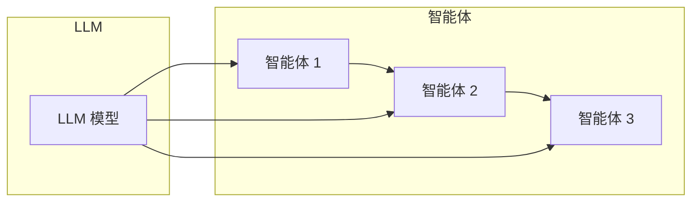

# 大规模部署:扩展LLM多智能体系统以应对海量需求

作者：禅与计算机程序设计艺术

## 1. 背景介绍

### 1.1  LLM多智能体系统的兴起

近年来，大型语言模型（LLM）的快速发展催生了多智能体系统的新范式。LLM多智能体系统由多个智能体组成，每个智能体都拥有独立的思考能力和行动能力，并能通过协作完成复杂的任务。这种系统在自然语言处理、智能客服、游戏AI等领域展现出巨大潜力。

### 1.2  大规模部署的挑战

随着LLM多智能体系统的应用场景不断扩展，对系统规模和性能的要求也越来越高。大规模部署面临着诸多挑战：

* **计算资源需求巨大:** LLM模型通常包含数十亿甚至数百亿参数，需要庞大的计算资源进行训练和推理。
* **通信开销高昂:** 多智能体之间需要频繁通信以协调行动，网络带宽和延迟成为瓶颈。
* **系统复杂度高:** 随着智能体数量增加，系统架构和管理难度也随之提升。

### 1.3  本章目标

本章将深入探讨如何扩展LLM多智能体系统以应对海量需求，并提供相应的解决方案和最佳实践。

## 2. 核心概念与联系

### 2.1  LLM：大型语言模型

LLM是一种基于深度学习的自然语言处理模型，能够理解和生成人类语言。其核心能力包括：

* **文本生成:** 生成流畅、自然的文本内容。
* **语义理解:** 理解文本含义，提取关键信息。
* **对话交互:** 与用户进行自然、流畅的对话。

### 2.2  多智能体系统

多智能体系统由多个智能体组成，每个智能体都拥有独立的感知、决策和行动能力。智能体之间通过通信和协作完成共同目标。

### 2.3  LLM多智能体系统架构

LLM多智能体系统通常采用分布式架构，将计算和数据分散到多个节点上，以提高系统性能和可扩展性。



## 3. 核心算法原理具体操作步骤

### 3.1  分布式训练

分布式训练将LLM模型的训练过程分散到多个计算节点上，以加快训练速度。常用的分布式训练策略包括：

* **数据并行:** 将训练数据分割到多个节点，每个节点使用相同的模型进行训练，然后将梯度进行聚合更新模型参数。
* **模型并行:** 将模型的不同部分分配到不同节点，每个节点只负责计算模型的一部分，然后将结果进行合并。

### 3.2  异步通信

异步通信允许智能体之间独立行动，无需等待其他智能体的响应。这可以减少通信开销，提高系统效率。常用的异步通信机制包括：

* **消息队列:** 智能体将消息发送到队列中，其他智能体可以随时从队列中获取消息。
* **发布/订阅:** 智能体将消息发布到特定主题，其他订阅该主题的智能体可以接收到消息。

### 3.3  负载均衡

负载均衡将任务均匀分配到多个节点，避免单个节点过载。常用的负载均衡策略包括：

* **轮询:** 依次将任务分配给不同的节点。
* **随机:** 随机选择一个节点分配任务。
* **加权:** 根据节点的性能和负载情况分配任务。

## 4. 数学模型和公式详细讲解举例说明

### 4.1  Transformer模型

Transformer模型是LLM的核心架构，其核心组件包括：

* **自注意力机制:** 允许模型关注输入序列中不同位置的信息。
* **多头注意力机制:** 使用多个注意力头捕捉不同方面的语义信息。
* **前馈神经网络:** 对每个位置的特征进行非线性变换。

### 4.2  损失函数

损失函数用于衡量模型预测结果与真实标签之间的差距。常用的损失函数包括：

* **交叉熵损失:** 用于分类任务，衡量预测概率分布与真实标签之间的差异。
* **均方误差损失:** 用于回归任务，衡量预测值与真实值之间的平方误差。

### 4.3  优化算法

优化算法用于更新模型参数，以最小化损失函数。常用的优化算法包括：

* **随机梯度下降 (SGD):** 沿着损失函数梯度的反方向更新参数。
* **Adam:** 结合动量和自适应学习率的优化算法。

## 5. 项目实践：代码实例和详细解释说明

### 5.1  环境配置

```python
# 安装必要的库
pip install transformers torch
```

### 5.2  模型加载

```python
# 加载预训练的LLM模型
from transformers import AutoModelForCausalLM, AutoTokenizer
model_name = "gpt2"
model = AutoModelForCausalLM.from_pretrained(model_name)
tokenizer = AutoTokenizer.from_pretrained(model_name)
```

### 5.3  智能体定义

```python
class Agent:
    def __init__(self, model, tokenizer):
        self.model = model
        self.tokenizer = tokenizer

    def generate_response(self, text):
        # 使用LLM模型生成回复
        input_ids = tokenizer.encode(text, return_tensors="pt")
        output = self.model.generate(input_ids)
        response = tokenizer.decode(output[0], skip_special_tokens=True)
        return response
```

### 5.4  多智能体交互

```python
# 创建多个智能体
agent1 = Agent(model, tokenizer)
agent2 = Agent(model, tokenizer)

# 模拟多智能体对话
text = "你好！"
response1 = agent1.generate_response(text)
response2 = agent2.generate_response(response1)
print(f"Agent 1: {response1}")
print(f"Agent 2: {response2}")
```

## 6. 实际应用场景

### 6.1  智能客服

LLM多智能体系统可以构建智能客服系统，为用户提供自然、高效的咨询服务。

### 6.2  游戏AI

LLM多智能体系统可以构建游戏AI，例如NPC角色、游戏解说等。

### 6.3  虚拟助手

LLM多智能体系统可以构建虚拟助手，例如智能音箱、聊天机器人等。

## 7. 工具和资源推荐

### 7.1  Transformers库

Transformers库提供了丰富的预训练LLM模型和工具，方便开发者快速构建LLM应用。

### 7.2  Hugging Face Hub

Hugging Face Hub是一个共享和下载LLM模型的平台，提供了大量的预训练模型和数据集。

### 7.3  Ray框架

Ray框架是一个分布式计算框架，可以方便地进行分布式训练和推理。

## 8. 总结：未来发展趋势与挑战

### 8.1  未来发展趋势

* **模型规模持续增长:** LLM模型的规模将继续增长，带来更强大的能力和更广泛的应用。
* **多模态融合:** LLM将与其他模态数据（例如图像、视频）进行融合，实现更丰富的感知和理解能力。
* **个性化定制:** LLM将根据用户需求进行个性化定制，提供更精准的服务。

### 8.2  挑战

* **计算资源需求:** LLM模型的训练和推理需要庞大的计算资源，这将成为应用部署的瓶颈。
* **数据安全和隐私:** LLM模型需要大量的训练数据，如何保障数据安全和用户隐私是一个重要问题。
* **伦理和社会影响:** LLM技术的应用可能带来伦理和社会影响，需要进行深入的思考和探讨。

## 9. 附录：常见问题与解答

### 9.1  如何选择合适的LLM模型？

选择LLM模型需要考虑以下因素：

* **任务需求:** 不同的任务需要选择不同类型的LLM模型，例如文本生成、语义理解、对话交互等。
* **模型规模:** 模型规模越大，能力越强，但也需要更多的计算资源。
* **预训练数据:** 预训练数据与目标任务越相似，模型的性能越好。

### 9.2  如何提高LLM多智能体系统的性能？

提高LLM多智能体系统的性能可以采取以下措施：

* **优化模型架构:** 使用更轻量级的模型架构，减少计算量。
* **压缩模型:** 使用模型压缩技术，减少模型参数量。
* **分布式训练:** 将训练过程分散到多个节点，加快训练速度。
* **异步通信:** 减少通信开销，提高系统效率。
* **负载均衡:** 均衡节点负载，避免单个节点过载。

### 9.3  如何保障LLM多智能体系统的数据安全和隐私？

保障LLM多智能体系统的数据安全和隐私可以采取以下措施：

* **数据脱敏:** 对敏感数据进行脱敏处理，例如匿名化、加密等。
* **访问控制:** 对数据访问进行严格控制，防止未授权访问。
* **联邦学习:** 在不共享原始数据的情况下进行模型训练，保护数据隐私。