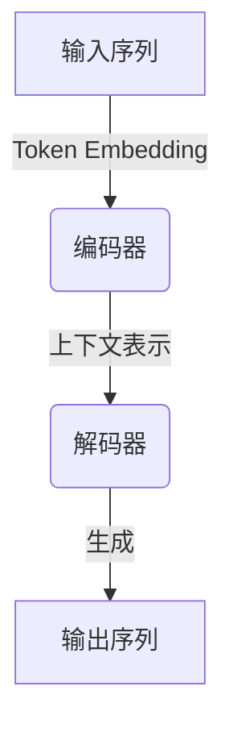

# 大语言模型原理基础与前沿 基于重新参数化的方法

## 1.背景介绍

### 1.1 大语言模型的兴起

近年来,大型语言模型(Large Language Models, LLMs)在自然语言处理(Natural Language Processing, NLP)领域掀起了一场革命。这些模型通过在大规模语料库上进行预训练,获得了令人惊叹的语言理解和生成能力。从GPT-3到ChatGPT,再到谷歌的PaLM和OpenAI的GPT-4,LLMs不断突破性能极限,展现出越来越强大的语言理解、推理和生成能力。

### 1.2 重新参数化技术的重要性

然而,训练这些庞大的模型需要消耗大量的计算资源和能源,并且在推理阶段也存在高昂的计算成本。为了应对这一挑战,重新参数化(Reparameterization)技术应运而生,旨在通过紧凑参数表示和高效计算来缩减模型规模,降低其计算和存储开销,实现可持续发展。

### 1.3 本文主旨

本文将深入探讨大语言模型的基础原理,重点介绍基于重新参数化的模型压缩和高效推理方法。我们将揭示重新参数化在大模型部署中的关键作用,并探索其对于推动人工智能可持续发展的重要意义。无论您是研究人员、工程师还是对这一领域有浓厚兴趣的读者,本文都将为您提供全面而深入的见解。

## 2.核心概念与联系  

### 2.1 大语言模型的架构

大语言模型通常采用基于Transformer的序列到序列(Seq2Seq)架构,由编码器(Encoder)和解码器(Decoder)组成。编码器将输入序列编码为上下文表示,而解码器则根据上下文表示生成输出序列。

### 2.2 参数高效性的重要性

大语言模型通常包含数十亿甚至上百亿个参数,导致巨大的计算和存储开销。参数高效性对于实现可持续的人工智能系统至关重要。重新参数化技术旨在通过紧凑参数表示和高效计算来缩减模型规模,降低其计算和存储开销。

### 2.3 重新参数化的核心思想

重新参数化的核心思想是将原始的高维参数矩阵分解为多个低维矩阵的乘积,从而减少参数数量。这种分解可以利用低秩近似、张量分解等技术实现。通过这种方式,模型的参数可以被高效地表示和计算,同时保留原始模型的性能。

## 3.核心算法原理具体操作步骤

### 3.1 矩阵/张量分解

矩阵/张量分解是重新参数化的核心技术之一。它将高维矩阵或张量分解为多个低维矩阵或张量的乘积,从而降低参数数量和计算复杂度。常见的分解方法包括奇异值分解(SVD)、CP分解和Tucker分解等。

以SVD为例,一个矩阵$\mathbf{M}$可以分解为三个矩阵的乘积:

$$\mathbf{M} = \mathbf{U}\mathbf{\Sigma}\mathbf{V}^T$$

其中$\mathbf{U}$和$\mathbf{V}$是正交矩阵,而$\mathbf{\Sigma}$是一个对角矩阵,包含矩阵$\mathbf{M}$的奇异值。通过保留前$k$个最大奇异值及对应的奇异向量,我们可以获得一个低秩近似:

$$\mathbf{M} \approx \mathbf{U}_k\mathbf{\Sigma}_k\mathbf{V}_k^T$$

这种近似可以显著降低参数数量,同时保留原始矩阵的主要信息。

### 3.2 结构化矩阵

结构化矩阵是另一种重新参数化技术,它通过引入特定的结构约束来减少参数数量。常见的结构化矩阵包括循环矩阵、托普利茨矩阵和低位置秩矩阵等。

以循环矩阵为例,一个$n\times n$的循环矩阵只需要$n$个参数即可表示,而一个普通矩阵需要$n^2$个参数。这种紧凑的参数表示可以显著降低存储和计算开销,同时保留了一定的表达能力。

### 3.3 量化

量化是一种将高精度参数映射到低精度表示的技术,通常用于减小模型的存储开销和加速推理。常见的量化方法包括线性量化、对数量化和向量量化等。

以线性量化为例,我们可以将浮点数参数$x$量化为整数$q$和缩放因子$s$的乘积:

$$x \approx s \cdot q$$

其中$q$是一个整数,而$s$是一个浮点数缩放因子。通过合理选择量化范围和步长,我们可以在保留模型性能的同时显著降低参数存储开销。

### 3.4 知识蒸馏

知识蒸馏是一种将大模型的知识传递给小模型的技术。它通过将大模型的软标签(soft labels)或中间表示作为监督信号,来训练一个小型的学生模型,使其逼近大模型的性能。

具体而言,给定一个大模型(教师模型)$T$和一个小模型(学生模型)$S$,我们可以最小化以下损失函数:

$$\mathcal{L}(S, T) = \alpha\mathcal{L}_{\text{task}}(S, y) + (1-\alpha)\mathcal{L}_{\text{distill}}(S(x), T(x))$$

其中$\mathcal{L}_{\text{task}}$是任务损失函数,用于确保学生模型能够解决相应的任务,而$\mathcal{L}_{\text{distill}}$是蒸馏损失函数,用于将教师模型的知识传递给学生模型。$\alpha$是一个权重系数,用于平衡两个损失项。通过这种方式,我们可以获得一个性能接近大模型,但规模更小的高效学生模型。

### 3.5 组合重新参数化策略

为了进一步提高重新参数化的效果,我们可以将上述多种技术相结合,形成组合重新参数化策略。例如,我们可以首先对大模型进行矩阵分解和结构化矩阵转换,然后对压缩后的模型进行量化和知识蒸馏,从而获得一个高效且性能良好的小型模型。

这种组合策略可以充分利用各种技术的优势,实现参数高效性和计算高效性的最大化,同时尽可能保留原始大模型的性能。

## 4.数学模型和公式详细讲解举例说明

在上一节中,我们介绍了几种核心的重新参数化技术,包括矩阵/张量分解、结构化矩阵、量化和知识蒸馏。现在,让我们通过具体的数学模型和公式,深入探讨这些技术的原理和实现细节。

### 4.1 矩阵分解

矩阵分解是一种常见的重新参数化技术,它将高维矩阵分解为多个低维矩阵的乘积,从而减少参数数量和计算复杂度。我们以奇异值分解(SVD)为例,详细说明其原理和应用。

对于任意一个$m\times n$矩阵$\mathbf{M}$,我们可以通过SVD将其分解为三个矩阵的乘积:

$$\mathbf{M} = \mathbf{U}\mathbf{\Sigma}\mathbf{V}^T$$

其中$\mathbf{U}$是一个$m\times m$的正交矩阵,表示$\mathbf{M}$的左奇异向量;$\mathbf{\Sigma}$是一个$m\times n$的对角矩阵,对角线元素为$\mathbf{M}$的奇异值;$\mathbf{V}$是一个$n\times n$的正交矩阵,表示$\mathbf{M}$的右奇异向量。

为了压缩参数,我们可以保留前$k$个最大奇异值及对应的奇异向量,获得一个低秩近似:

$$\mathbf{M} \approx \mathbf{U}_k\mathbf{\Sigma}_k\mathbf{V}_k^T$$

其中$\mathbf{U}_k$是一个$m\times k$矩阵,包含前$k$个左奇异向量;$\mathbf{\Sigma}_k$是一个$k\times k$对角矩阵,包含前$k$个奇异值;$\mathbf{V}_k$是一个$n\times k$矩阵,包含前$k$个右奇异向量。

通过这种低秩近似,我们可以将原始$m\times n$矩阵的参数数量从$mn$减少到$(m+n)k+k$,当$k\ll\min(m,n)$时,参数压缩率非常显著。

让我们以一个具体的例子来说明SVD在重新参数化中的应用。假设我们有一个$1000\times 2000$的参数矩阵$\mathbf{M}$,原始参数数量为$2,000,000$。如果我们将$\mathbf{M}$分解为$\mathbf{U}_k\mathbf{\Sigma}_k\mathbf{V}_k^T$,并取$k=100$,那么压缩后的参数数量将减少到$(1000+2000)\times 100 + 100^2 = 303,000$,压缩率约为$85\%$。

除了SVD之外,还有许多其他矩阵分解技术可用于重新参数化,例如CP分解、Tucker分解等。不同的分解方法在参数压缩率和计算效率上有所差异,需要根据具体情况选择合适的方法。

### 4.2 结构化矩阵

结构化矩阵是另一种重新参数化技术,它通过引入特定的结构约束来减少参数数量。常见的结构化矩阵包括循环矩阵、托普利茨矩阵和低位置秩矩阵等。

#### 4.2.1 循环矩阵

循环矩阵是一种具有特殊结构的矩阵,它的每一行(或列)都是前一行(或列)的循环移位。形式上,一个$n\times n$的循环矩阵$\mathbf{C}$可以表示为:

$$\mathbf{C} = \begin{pmatrix}
c_0 & c_1 & c_2 & \cdots & c_{n-1}\\
c_{n-1} & c_0 & c_1 & \cdots & c_{n-2}\\
c_{n-2} & c_{n-1} & c_0 & \cdots & c_{n-3}\\
\vdots & \vdots & \vdots & \ddots & \vdots\\
c_1 & c_2 & c_3 & \cdots & c_0
\end{pmatrix}$$

我们可以看到,一个$n\times n$的循环矩阵只需要$n$个参数就可以完全表示,而一个普通矩阵需要$n^2$个参数。因此,循环矩阵可以显著降低参数数量,同时保留一定的表达能力。

在深度学习中,循环矩阵常被用于卷积层和全连接层的参数表示,以减少参数开销。例如,在一个$3\times 3$的卷积核中,我们可以使用一个$9$元素的循环向量代替原始的$9$个参数,从而降低75%的参数数量。

#### 4.2.2 托普利茨矩阵

托普利茨矩阵是另一种结构化矩阵,它的每个对角线上的元素都相等。形式上,一个$n\times n$的托普利茨矩阵$\mathbf{T}$可以表示为:

$$\mathbf{T} = \begin{pmatrix}
t_0 & t_1 & t_2 & \cdots & t_{n-1}\\
t_{n-1} & t_0 & t_1 & \cdots & t_{n-2}\\
t_{n-2} & t_{n-1} & t_0 & \cdots & t_{n-3}\\
\vdots & \vdots & \vdots & \ddots & \vdots\\
t_1 & t_2 & t_3 & \cdots & t_0
\end{pmatrix}$$

与循环矩阵类似,一个$n\times n$的托普利茨矩阵只需要$n$个参数就可以完全表示,从而大大减少了参数数