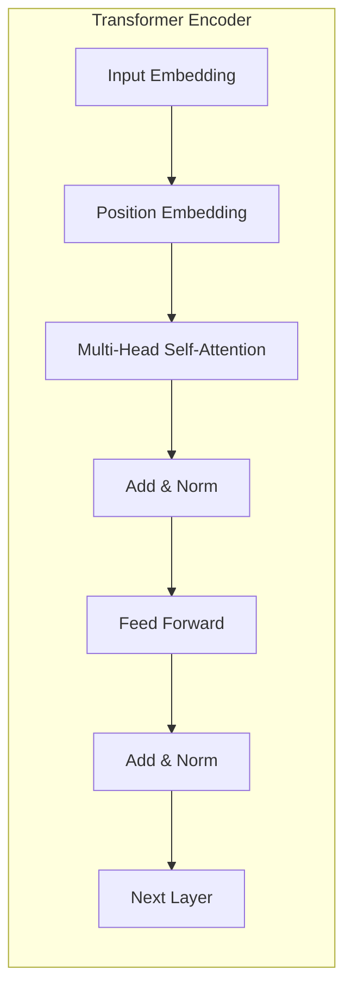
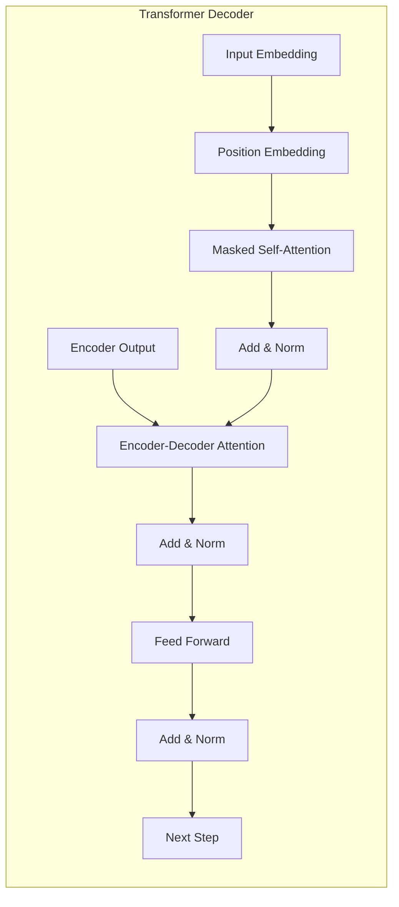

# 大语言模型原理基础与前沿 按空格分割

## 1.背景介绍

### 1.1 自然语言处理的重要性

自然语言处理(Natural Language Processing, NLP)是人工智能领域的一个重要分支,旨在使计算机能够理解和生成人类语言。随着人工智能技术的快速发展,NLP已经广泛应用于多个领域,如机器翻译、智能问答系统、文本分类、情感分析等。

### 1.2 大语言模型的兴起

传统的NLP系统通常依赖于手工设计的特征和规则,效果受限且缺乏泛化能力。近年来,benefiting from大规模数据和强大的计算能力,基于深度学习的大型神经网络模型在NLP任务上取得了突破性进展,其中以大语言模型(Large Language Model, LLM)最为瞩目。

### 1.3 大语言模型的影响

大语言模型通过在大量无监督文本数据上进行预训练,学习到丰富的语言知识和上下文表示,为下游NLP任务提供了强大的起点。自2018年以来,一系列里程碑式的大语言模型相继问世,如GPT、BERT、XLNet、T5等,极大推动了NLP技术的发展。它们不仅在学术界引发了广泛关注,也在工业界得到了大规模应用,为人类与机器之间的交互带来了全新体验。

## 2.核心概念与联系

### 2.1 语言模型

语言模型(Language Model, LM)是NLP中的基础概念,旨在捕捉语言的统计规律。形式化地,一个语言模型可以表示为条件概率分布:

$$P(w_1, w_2, ..., w_n) = \prod_{i=1}^{n}P(w_i|w_1, ..., w_{i-1})$$

其中$w_i$表示第i个单词,目标是估计给定历史单词序列的条件概率。传统的n-gram语言模型由于马尔可夫假设的限制,只能捕捉到有限的上下文信息。

### 2.2 神经网络语言模型

神经网络语言模型(Neural Network Language Model, NNLM)借助神经网络的强大建模能力,可以更好地捕捉长程依赖关系。典型的NNLM架构包括Word Embedding层将单词映射到连续向量空间,隐层编码上下文信息,以及Softmax输出层预测下一个单词的概率分布。

### 2.3 自注意力机制

自注意力(Self-Attention)机制是Transformer模型的核心,允许模型直接捕捉输入序列中任意两个位置之间的关系。相较于RNN和CNN,自注意力机制更有利于并行计算,也更易于学习长程依赖。

### 2.4 预训练与微调

大语言模型通过预训练-微调范式获得广泛应用。在预训练阶段,模型在大量无监督文本数据上进行通用表示学习;在微调阶段,将预训练模型的参数作为初始化,在有标注的特定任务数据上进行进一步训练,快速收敛到所需的下游任务。

## 3.核心算法原理具体操作步骤  

### 3.1 Transformer编码器

Transformer编码器是大语言模型的核心组件之一,主要由多层Self-Attention和前馈神经网络组成。编码器的工作流程如下:

1. 输入嵌入:将输入单词序列映射到连续向量空间。
2. 位置编码:因为Self-Attention没有位置信息,需要显式地为每个位置添加位置编码。
3. Self-Attention层:计算输入序列中每个位置与其他所有位置的注意力权重,并据此生成新的表示。
4. 前馈网络层:对Self-Attention的输出进行进一步非线性变换,生成该层的最终输出。
5. 残差连接和层归一化:为了更好地训练,每层都会有残差连接和层归一化操作。
6. 堆叠多层:将上述运算重复堆叠多层,以提取不同层次的特征。



### 3.2 Transformer解码器

对于序列生成任务,Transformer还包含一个解码器组件。解码器的结构类似于编码器,但有两点区别:

1. 解码器中有两个Self-Attention层,一个用于捕捉输出序列内部的依赖关系,另一个用于关注输入序列。
2. 为了避免在生成时参考未来位置的信息,解码器的Self-Attention层使用了掩码机制。



### 3.3 预训练目标

大语言模型的预训练通常采用自回归(Auto-Regressive)或自监督(Self-Supervised)的方式,主要有以下几种目标:

1. 掩码语言模型(Masked Language Modeling, MLM):随机掩码部分输入单词,目标是基于上下文预测被掩码的单词。
2. 下一句预测(Next Sentence Prediction, NSP):判断两个句子是否为连续句子。
3. 因果语言模型(Causal Language Modeling, CLM):基于左侧上下文预测右侧单词的概率。
4. 序列到序列(Seq2Seq):将输入序列映射为输出序列,如机器翻译任务。

通过预训练,模型可以学习到通用的语言表示,为下游任务做好迁移学习的基础。

### 3.4 微调

微调阶段是将预训练模型应用于特定下游任务的关键步骤。具体步骤如下:

1. 构建微调数据集:根据任务需求,准备好标注的训练数据。
2. 设计输入表示:将输入数据映射为模型可接受的格式,如文本拼接或序列对等。
3. 设计输出头:根据任务类型选择合适的输出头,如分类头或生成头。
4. 微调训练:在下游数据上进一步训练模型,通常只需调整顶层参数即可。
5. 模型评估:在保留的测试集上评估模型性能。
6. 模型部署:将训练好的模型应用于实际场景。

需要注意的是,由于大语言模型参数众多,微调时往往需要采用合理的训练策略和参数设置,以防止过拟合和不稳定性。

## 4.数学模型和公式详细讲解举例说明

### 4.1 Self-Attention 注意力机制

Self-Attention是Transformer的核心,它能够直接建模输入序列中任意两个位置之间的依赖关系。给定一个长度为n的序列$\boldsymbol{x} = (x_1, x_2, \ldots, x_n)$,Self-Attention的计算过程如下:

1. 计算Query、Key和Value向量:
   
   $$\begin{aligned}
   \boldsymbol{Q} &= \boldsymbol{x}\boldsymbol{W}^Q \\
   \boldsymbol{K} &= \boldsymbol{x}\boldsymbol{W}^K \\
   \boldsymbol{V} &= \boldsymbol{x}\boldsymbol{W}^V
   \end{aligned}$$

   其中$\boldsymbol{W}^Q, \boldsymbol{W}^K, \boldsymbol{W}^V$是可学习的投影矩阵。

2. 计算注意力权重:
   
   $$\boldsymbol{A} = \mathrm{softmax}\left(\frac{\boldsymbol{Q}\boldsymbol{K}^\top}{\sqrt{d_k}}\right)$$

   其中$d_k$是缩放因子,用于控制点积的大小。

3. 加权求和得到注意力输出:
   
   $$\mathrm{Attention}(\boldsymbol{Q}, \boldsymbol{K}, \boldsymbol{V}) = \boldsymbol{A}\boldsymbol{V}$$

通过Self-Attention,模型可以自适应地为每个位置分配不同的注意力权重,从而有效地捕捉长程依赖关系。

### 4.2 Multi-Head Attention

单一的Self-Attention可能难以充分捕捉复杂的模式,因此Transformer采用了Multi-Head Attention机制。具体来说,是将输入通过不同的线性投影得到多组Query、Key和Value,然后分别计算Self-Attention,最后将所有头的注意力输出拼接起来:

$$\begin{aligned}
\mathrm{MultiHead}(\boldsymbol{Q}, \boldsymbol{K}, \boldsymbol{V}) &= \mathrm{Concat}(\mathrm{head}_1, \ldots, \mathrm{head}_h)\boldsymbol{W}^O \\
\text{where } \mathrm{head}_i &= \mathrm{Attention}(\boldsymbol{Q}\boldsymbol{W}_i^Q, \boldsymbol{K}\boldsymbol{W}_i^K, \boldsymbol{V}\boldsymbol{W}_i^V)
\end{aligned}$$

其中$\boldsymbol{W}_i^Q, \boldsymbol{W}_i^K, \boldsymbol{W}_i^V$和$\boldsymbol{W}^O$都是可学习的投影矩阵。通过Multi-Head机制,模型可以从不同的子空间捕捉不同的特征,提高了模型的表达能力。

### 4.3 掩码语言模型目标

掩码语言模型(Masked Language Modeling, MLM)是一种常用的自监督预训练目标。给定一个长度为n的序列$\boldsymbol{x} = (x_1, x_2, \ldots, x_n)$,我们随机掩码序列中的部分单词,得到掩码后的序列$\boldsymbol{\tilde{x}}$。MLM的目标是最大化被掩码单词的条件对数似然:

$$\mathcal{L}_\text{MLM} = \mathbb{E}_{\boldsymbol{x}} \left[ \sum_{i \in \mathcal{M}} \log P(x_i | \boldsymbol{\tilde{x}}) \right]$$

其中$\mathcal{M}$是被掩码单词的索引集合。通过MLM预训练,模型可以学习到丰富的语义和上下文表示,为下游任务打下坚实的基础。

## 4.项目实践:代码实例和详细解释说明

以下是使用PyTorch实现Transformer编码器的简化示例代码,并对关键步骤进行了详细注释:

```python
import torch
import torch.nn as nn

# 定义缩放因子的计算函数
def scaled_dot_product_attention(q, k, v, mask=None):
    # 计算Query与Key的点积,然后除以缩放因子
    attn_scores = torch.matmul(q, k.transpose(-2, -1)) / (q.shape[-1] ** 0.5)
    
    # 如果有注意力掩码,对无效位置的注意力分数赋予很小的负值
    if mask is not None:
        attn_scores = attn_scores.masked_fill(mask == 0, -1e9)
    
    # 对注意力分数执行softmax操作,得到注意力权重
    attn_weights = nn.functional.softmax(attn_scores, dim=-1)
    
    # 将注意力权重与Value相乘,得到加权和的注意力输出
    output = torch.matmul(attn_weights, v)
    
    return output, attn_weights

# 定义Multi-Head Attention层
class MultiHeadAttention(nn.Module):
    def __init__(self, d_model, num_heads):
        super().__init__()
        self.d_model = d_model
        self.num_heads = num_heads
        self.head_dim = d_model // num_heads
        
        # 初始化Query、Key、Value的线性投影层
        self.q_proj = nn.Linear(d_model, d_model)
        self.k_proj = nn.Linear(d_model, d_model)
        self.v_proj = nn.Linear(d_model, d_model)
        
        # 初始化最终的线性投影层
        self.out_proj = nn.Linear(d_model, d_model)
        
    def forward(self, x, mask=None):
        batch