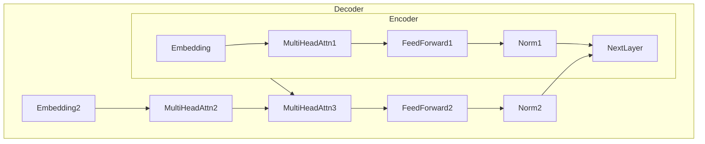

# 大语言模型原理基础与前沿 模型架构

## 1. 背景介绍

### 1.1 自然语言处理的重要性

自然语言处理(Natural Language Processing, NLP)是人工智能领域中一个基础且极具挑战的研究方向,旨在使计算机能够理解和生成人类语言。随着数据和计算能力的不断增长,NLP技术在诸多领域得到了广泛应用,如机器翻译、智能问答、文本摘要、情感分析等。

### 1.2 大语言模型的兴起

传统的NLP系统通常由多个专门的模块组成,如词法分析、句法分析、语义分析等,每个模块只完成特定的任务。这种模块化设计虽然清晰,但也存在一些缺陷,如错误传播、数据孤岛、难以扩展等。大语言模型(Large Language Model, LLM)则试图通过一个统一的模型来完成NLP的各种任务,避免了模块化设计的缺陷。

### 1.3 大语言模型的影响

近年来,大语言模型取得了令人瞩目的进展,如GPT-3、PanGu-Alpha等,展现出惊人的语言理解和生成能力。这些模型不仅在各种NLP任务上取得了state-of-the-art的表现,而且还展现出一定的推理和创造性能力。大语言模型的出现,正在重塑人工智能的发展方向和未来应用场景。

## 2. 核心概念与联系  

### 2.1 语言模型

语言模型(Language Model, LM)是自然语言处理的基础,旨在捕捉语言的统计规律。形式化地,语言模型需要学习联合概率分布:

$$P(x_1, x_2, ..., x_n) = \prod_{t=1}^{n}P(x_t|x_1, x_2, ..., x_{t-1})$$

其中$x_i$表示序列中的第i个token(如单词或字符)。语言模型可以用于生成新的文本、计算给定序列的概率、填空等任务。

### 2.2 自然语言生成

大语言模型的一个核心应用是自然语言生成(Natural Language Generation, NLG),即根据输入生成连贯、流畅、符合语义的文本输出。NLG可分为有条件生成和无条件生成两种情况。有条件生成指根据一定条件(如标题、提纲等)生成文本,而无条件生成则完全自主生成内容。

### 2.3 序列到序列学习

序列到序列(Sequence-to-Sequence, Seq2Seq)学习是处理序列数据(如文本、语音、蛋白质等)的一种通用框架。编码器将输入序列编码为向量表示,解码器则根据该向量生成输出序列。Seq2Seq广泛应用于机器翻译、对话系统、文本摘要等任务。大语言模型本质上是一种特殊的Seq2Seq模型,输入和输出均为文本序列。

### 2.4 注意力机制

注意力机制(Attention Mechanism)是一种关键技术,使得模型能够在编码解码时对输入序列中不同位置的信息赋予不同的权重,从而更好地捕捉长距离依赖关系。自注意力(Self-Attention)是注意力机制在Transformer等大语言模型中的具体实现形式。

### 2.5 迁移学习

迁移学习(Transfer Learning)是一种重要的机器学习范式,指将在一个领域学习到的知识应用到另一个领域,从而加速训练过程。在NLP领域,通常先在大规模无监督语料上预训练一个大语言模型,再将其迁移到下游任务并进行微调。这种预训练-微调范式大大提升了模型性能。  

### 2.6 多模态学习

大多数现有大语言模型主要关注文本数据,但真实世界中的信息通常来自多种模态,如图像、视频、语音等。多模态学习(Multimodal Learning)旨在构建能同时理解和生成不同模态数据的统一模型,是提升人工智能系统通用性的关键。

## 3. 核心算法原理具体操作步骤

本节将介绍大语言模型的核心算法原理和具体操作步骤。我们将以Transformer模型为例进行说明。

### 3.1 Transformer模型结构

Transformer是一种全新的基于注意力机制的序列到序列模型,不依赖于RNN或CNN等传统架构。如下图所示,Transformer包括编码器(Encoder)和解码器(Decoder)两个主要部分。

编码器将输入序列编码为向量表示,解码器则基于该表示生成输出序列。两者均由多个相同的层组成,每层包含以下几个主要子层:

1. **多头自注意力(Multi-Head Self-Attention)**:允许每个位置的单词与其他位置的单词交互,捕捉序列中的长距离依赖关系。
2. **前馈全连接网络(Feed-Forward Network)**:对序列的表示进一步加工和变换。
3. **规范化(Normalization)**和**残差连接(Residual Connection)**:帮助模型训练和提升性能。

解码器还包含一个额外的多头注意力层,用于关注编码器的输出,实现编码器-解码器之间的交互。

### 3.2 注意力机制计算过程

注意力机制是Transformer的核心,下面我们具体看一下其计算过程。假设输入包含n个单词,令$\boldsymbol{X} = [\boldsymbol{x}_1, \boldsymbol{x}_2, ..., \boldsymbol{x}_n]$为它们的词向量序列,我们希望计算一个新的序列$\boldsymbol{Z} = [\boldsymbol{z}_1, \boldsymbol{z}_2, ..., \boldsymbol{z}_n]$,使得每个$\boldsymbol{z}_i$是其他单词对$\boldsymbol{x}_i$的加权表示。

1. 首先计算Query($\boldsymbol{Q}$)、Key($\boldsymbol{K}$)和Value($\boldsymbol{V}$)矩阵:

$$\begin{aligned}
\boldsymbol{Q} &= \boldsymbol{X}\boldsymbol{W}^Q\\  
\boldsymbol{K} &= \boldsymbol{X}\boldsymbol{W}^K\\
\boldsymbol{V} &= \boldsymbol{X}\boldsymbol{W}^V
\end{aligned}$$

其中$\boldsymbol{W}^Q$、$\boldsymbol{W}^K$和$\boldsymbol{W}^V$为可训练的权重矩阵。

2. 计算注意力分数:

$$\text{Attention}(\boldsymbol{Q}, \boldsymbol{K}, \boldsymbol{V}) = \text{softmax}\left(\frac{\boldsymbol{Q}\boldsymbol{K}^\top}{\sqrt{d_k}}\right)\boldsymbol{V}$$

其中$d_k$是缩放因子,用于防止内积过大导致梯度消失。

3. 多头注意力机制可以捕捉不同子空间的信息,最终的注意力输出为:

$$\text{MultiHead}(\boldsymbol{Q}, \boldsymbol{K}, \boldsymbol{V}) = \text{Concat}(\text{head}_1, ..., \text{head}_h)\boldsymbol{W}^O$$

$$\text{where }  \text{head}_i = \text{Attention}(\boldsymbol{Q}\boldsymbol{W}_i^Q, \boldsymbol{K}\boldsymbol{W}_i^K, \boldsymbol{V}\boldsymbol{W}_i^V)$$

$\boldsymbol{W}_i^Q$、$\boldsymbol{W}_i^K$、$\boldsymbol{W}_i^V$和$\boldsymbol{W}^O$均为可训练参数。

通过这种方式,Transformer能够高效地关注输入序列中与当前单词相关的部分,从而建模长距离依赖关系。

### 3.3 位置编码

由于Transformer没有使用RNN或CNN,因此需要一种方法来注入序列的位置信息。位置编码就是一种常用的做法,即为每个位置分配一个位置向量,并将其加到对应的词向量中:

$$\boldsymbol{X}' = \boldsymbol{X} + \text{PositionEncoding}(n)$$

其中$\text{PositionEncoding}(n)$是长度为$n$的位置编码序列。常用的位置编码函数有正弦/余弦编码、学习到的编码等。

### 3.4 掩码自注意力机制

在自回归语言模型中,解码器需要预测下一个单词而避免违反因果关系。这可以通过掩码自注意力机制来实现:在计算注意力分数时,将来自未来位置的key和value进行掩码,即令它们对应的注意力分数为0或一个很小的值。

### 3.5 Beam Search解码

在生成任务中,Transformer通常使用beam search算法进行解码,输出质量相对更高。Beam search是一种贪心搜索算法,在每一步保留概率最高的k个候选序列(beam size),最终输出概率最高的序列作为结果。

### 3.6 训练技巧

训练大型Transformer模型需要一些技巧,例如:

- **梯度裁剪(Gradient Clipping)**: 防止梯度爆炸
- **标签平滑(Label Smoothing)**: 提高模型鲁棒性
- **辅助损失(Auxiliary Loss)**: 加速收敛
- **层归一化(Layer Normalization)**: 加快收敛
- **学习率warmup**: 避免冷启动问题

## 4. 数学模型和公式详细讲解举例说明

本节将重点讲解大语言模型中的一些核心数学模型和公式,并举例说明。

### 4.1 语言模型

正如前文所述,语言模型的核心是学习联合概率分布:

$$P(x_1, x_2, ..., x_n) = \prod_{t=1}^{n}P(x_t|x_1, x_2, ..., x_{t-1})$$

其中$x_i$为序列中的token。由于直接计算联合概率难以建模长距离依赖,通常采用基于神经网络的方法,使用上下文向量$\boldsymbol{h}_t$来估计条件概率:

$$P(x_t|x_1, ..., x_{t-1}) = \text{Softmax}(\boldsymbol{W}\boldsymbol{h}_t + \boldsymbol{b})$$

$\boldsymbol{W}$和$\boldsymbol{b}$为可训练权重,Softmax函数用于将分数归一化为概率分布。上下文向量$\boldsymbol{h}_t$可由RNN、Transformer等模型计算得到。

**示例**: 假设我们有一个长度为4的序列"我 爱 学习 自然语言处理",其one-hot表示为:

$$\begin{bmatrix}
1&0&0&0\\
0&1&0&0\\  
0&0&1&0\\
0&0&0&1
\end{bmatrix}$$

则语言模型的目标是最大化该序列的概率,即:

$$\begin{aligned}
\max_{\theta} &\; P(x_1,x_2,x_3,x_4|\theta) \\
=\max_{\theta} &\; P(x_1|\theta)P(x_2|x_1,\theta)P(x_3|x_1,x_2,\theta)P(x_4|x_1,x_2,x_3,\theta)\\
=\max_{\theta} &\; \prod_{t=1}^4 P(x_t|x_1,...,x_{t-1},\theta)
\end{aligned}$$

其中$\theta$为模型参数。基于最大似然估计原理,我们可以在大规模语料库上最大化对数似然函数来训练语言模型。

### 4.2 自注意力机制

自注意力机制是Transformer的核心,允许模型捕捉输入序列内部的长距离依赖关系。对于长度为$n$的输入序列$\boldsymbol{X} = [\boldsymbol{x}_1, \boldsymbol{x}_2, ..., \boldsymbol{x}_n]$,其计算过程如下:

1. 线性投影,得到Query、Key和Value矩阵:

$$\begin{aligned}
\boldsymbol{Q} &= \boldsymbol{X}\boldsymbol{W}^Q\\  
\boldsymbol{K} &