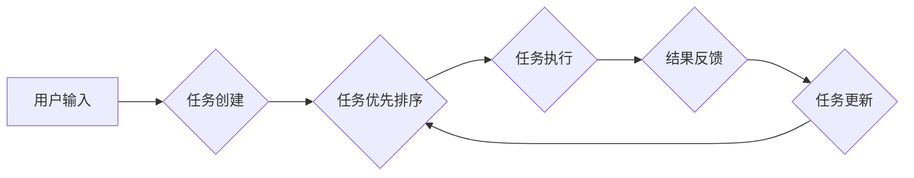

## 1. 背景介绍

### 1.1 人工智能的新纪元：大语言模型

近年来，自然语言处理领域取得了突破性进展，特别是大型语言模型（LLM）的出现，如 GPT-3、LaMDA 和 BERT，它们展示了前所未有的语言理解和生成能力。这些模型能够执行各种任务，包括：

* 文本摘要
* 机器翻译
* 代码生成
* 对话生成
* 问题解答

### 1.2 BabyAGI：LLM驱动的自主智能体

BabyAGI 是一个由 LLM 驱动的自主智能体，它利用 LLM 的能力来创建、优先排序和执行任务，旨在实现特定目标。 BabyAGI 的核心思想是将 LLM 作为智能体的"大脑"，使其能够理解和响应自然语言指令，并根据指令生成新的任务，从而实现自主地完成目标。

### 1.3 BabyAGI 的应用价值

BabyAGI 为自动化和智能化提供了新的可能性，它可以应用于各种领域，例如：

* **个人助理:** 自动化日常任务，例如安排会议、管理电子邮件和生成待办事项列表。
* **内容创作:** 生成高质量的文章、故事、诗歌和代码。
* **研究和分析:** 收集和分析数据，生成报告和洞察。
* **客户服务:** 提供个性化的客户支持和解答问题。

## 2. 核心概念与联系

### 2.1 LLM：BabyAGI 的基石

LLM 是 BabyAGI 的核心组件，它提供了理解和生成自然语言的能力。BabyAGI 利用 LLM 来：

* **解析用户指令:** 将用户输入的自然语言指令转换为可执行的任务。
* **生成新任务:** 根据当前目标和上下文生成新的任务，以推进目标的实现。
* **执行任务:** 调用外部 API 或工具来执行任务，并将结果反馈给 LLM。

### 2.2 任务列表：BabyAGI 的行动指南

任务列表是 BabyAGI 的行动指南，它包含了所有需要完成的任务及其优先级。BabyAGI 使用 LLM 来：

* **创建任务:** 根据用户指令或 LLM 生成的建议创建新的任务。
* **优先排序任务:** 根据任务的重要性、紧迫性和依赖关系对任务进行排序。
* **执行任务:** 从任务列表中选择优先级最高的任务进行执行。

### 2.3 执行引擎：BabyAGI 的行动者

执行引擎负责执行任务列表中的任务，它可以调用外部 API、工具或脚本。执行引擎需要能够：

* **理解任务描述:** 解析 LLM 生成的任务描述，并确定需要执行的操作。
* **调用外部资源:** 调用相应的 API、工具或脚本来完成任务。
* **返回结果:** 将任务执行结果反馈给 LLM，以便 LLM 更新任务列表和生成新的任务。

## 3. 核心算法原理具体操作步骤

### 3.1 BabyAGI 的工作流程

BabyAGI 的工作流程可以概括为以下步骤：

1. **用户输入:** 用户向 BabyAGI 提供一个目标，例如"写一篇关于人工智能的博客文章"。
2. **任务创建:** BabyAGI 使用 LLM 将用户目标解析为一个初始任务，例如"研究人工智能的最新进展"。
3. **任务优先排序:** BabyAGI 将初始任务添加到任务列表中，并将其优先级设置为最高。
4. **任务执行:** BabyAGI 从任务列表中选择优先级最高的任务，并使用执行引擎执行该任务。例如，执行引擎可以使用网络搜索引擎来查找关于人工智能的最新进展的信息。
5. **结果反馈:** 执行引擎将任务执行结果反馈给 LLM，例如，返回关于人工智能最新进展的搜索结果。
6. **任务更新:** BabyAGI 使用 LLM 分析任务执行结果，并更新任务列表。例如，LLM 可以根据搜索结果生成新的任务，例如"阅读关于 GPT-3 的论文"。
7. **循环执行:** BabyAGI 重复步骤 4-6，直到达到用户目标或任务列表为空。

### 3.2  Mermaid 流程图



## 4. 数学模型和公式详细讲解举例说明

BabyAGI 不依赖于特定的数学模型或公式，它主要利用 LLM 的语言理解和生成能力来实现自主智能。然而，我们可以使用一些指标来评估 BabyAGI 的性能，例如：

* **任务完成率:** 完成的任务数量占总任务数量的比例。
* **目标达成率:** 实现用户目标的比例。
* **任务执行效率:** 完成任务所需的平均时间。

## 5. 项目实践：代码实例和详细解释说明

以下是一个简单的 BabyAGI Python 代码示例：

```python
from transformers import pipeline

# 初始化 LLM
llm = pipeline("text-generation", model="gpt-3")

# 定义任务列表
task_list = []

# 定义执行引擎
def execute_task(task):
    # 此处可以调用外部 API 或工具来执行任务
    # ...
    return result

# BabyAGI 主循环
while True:
    # 获取用户输入
    user_input = input("请输入您的目标：")

    # 创建初始任务
    initial_task = llm(f"将用户目标'{user_input}'解析为一个初始任务")[0]["generated_text"]
    task_list.append({"task": initial_task, "priority": 1})

    # 执行任务
    while task_list:
        # 选择优先级最高的任务
        task = sorted(task_list, key=lambda x: x["priority"])[0]
        task_list.remove(task)

        # 执行任务
        result = execute_task(task["task"])

        # 更新任务列表
        new_tasks = llm(f"根据任务'{task['task']}'的执行结果'{result}'生成新的任务")[0]["generated_text"]
        for new_task in new_tasks.split("\n"):
            task_list.append({"task": new_task, "priority": 2})
```

**代码解释：**

* `llm` 变量初始化了一个 GPT-3 文本生成管道，用于解析用户指令和生成新任务。
* `task_list` 变量存储了所有待执行的任务，每个任务包含 `task`（任务描述）和 `priority`（优先级）两个属性。
* `execute_task` 函数模拟了任务执行引擎，它接收一个任务描述作为输入，并返回任务执行结果。
* BabyAGI 主循环不断从用户获取输入，创建初始任务，执行任务并更新任务列表，直到达到用户目标或任务列表为空。

## 6. 实际应用场景

### 6.1  个人助理

BabyAGI 可以作为个人助理，帮助用户自动化日常任务，例如：

* **安排会议:** BabyAGI 可以连接到用户的日历，并根据用户的指令自动安排会议。
* **管理电子邮件:** BabyAGI 可以读取用户的电子邮件，并根据邮件内容生成回复或采取相应的行动。
* **生成待办事项列表:** BabyAGI 可以根据用户的目标和当前情况生成待办事项列表，并提醒用户完成任务。

### 6.2 内容创作

BabyAGI 可以用于生成各种类型的内容，例如：

* **文章:** BabyAGI 可以根据用户提供的主题和关键词生成文章，并确保文章内容的准确性和流畅性。
* **故事:** BabyAGI 可以根据用户提供的角色、情节和设定生成故事，并确保故事的吸引力和趣味性。
* **诗歌:** BabyAGI 可以根据用户提供的情感和主题生成诗歌，并确保诗歌的韵律和意境。

### 6.3  研究和分析

BabyAGI 可以用于收集和分析数据，生成报告和洞察，例如：

* **市场调研:** BabyAGI 可以收集市场数据，分析市场趋势，并生成市场调研报告。
* **竞争对手分析:** BabyAGI 可以收集竞争对手的信息，分析竞争对手的优势和劣势，并生成竞争对手分析报告。
* **财务分析:** BabyAGI 可以收集财务数据，分析财务状况，并生成财务分析报告。

## 7. 工具和资源推荐

以下是一些 BabyAGI 相关的工具和资源：

* **Transformers:** Hugging Face 提供的用于自然语言处理的 Python 库，包含各种 LLM 的预训练模型和代码示例。
* **LangChain:** 用于构建 LLM 应用的 Python 框架，提供模块化的组件和工具，简化 LLM 应用的开发。
* **BabyAGI GitHub 仓库:** 包含 BabyAGI 的代码实现和示例，以及相关文档和教程。

## 8. 总结：未来发展趋势与挑战

### 8.1 未来发展趋势

* **更强大的 LLM:** 随着 LLM 的不断发展，BabyAGI 的能力将得到进一步提升，可以执行更复杂的任务，并实现更高的自主性。
* **更广泛的应用场景:** BabyAGI 的应用场景将不断扩展，可以应用于更多领域，例如医疗保健、教育和金融。
* **更人性化的交互:** BabyAGI 的交互方式将更加人性化，可以更好地理解用户的意图，并提供更自然的交互体验。

### 8.2  挑战

* **LLM 的局限性:** 尽管 LLM 取得了显著进展，但它们仍然存在一些局限性，例如缺乏常识推理能力和容易受到偏见的影响。
* **安全性和伦理问题:** BabyAGI 的自主性带来了安全性和伦理问题，需要制定相应的规范和措施来确保其安全和可靠地运行。
* **可解释性和可控性:** BabyAGI 的决策过程需要更加透明和可解释，以便用户理解其行为并进行有效的控制。

## 9. 附录：常见问题与解答

### 9.1 BabyAGI 和传统 AI 的区别是什么？

BabyAGI 与传统 AI 的主要区别在于其自主性和灵活性。传统 AI 系统通常是针对特定任务进行训练的，而 BabyAGI 可以根据用户指令动态地创建和执行任务。

### 9.2 BabyAGI 可以用于哪些领域？

BabyAGI 可以应用于各种领域，例如个人助理、内容创作、研究和分析、客户服务等。

### 9.3 BabyAGI 的安全性如何？

BabyAGI 的安全性是一个重要问题，需要采取措施来确保其安全和可靠地运行。例如，可以使用沙盒环境来限制 BabyAGI 的操作范围，并进行严格的测试和验证。