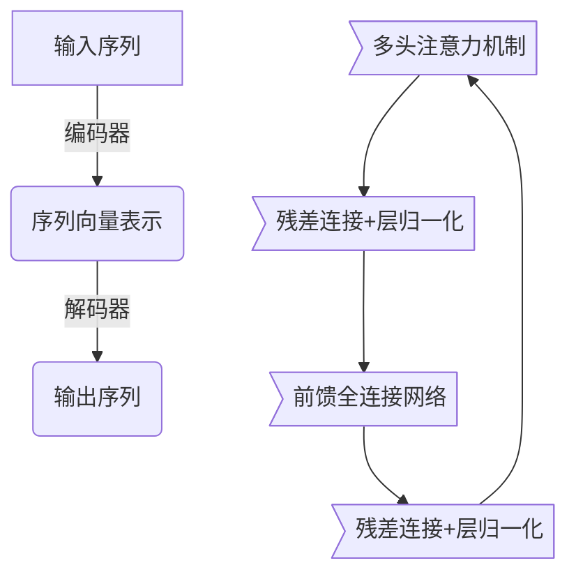

# 大语言模型应用指南：人工智能的起源

## 1.背景介绍

### 1.1 人工智能的兴起

人工智能(Artificial Intelligence, AI)是现代科技发展的重要里程碑,它的出现彻底改变了我们对智能的理解和认知。在过去几十年中,人工智能技术取得了令人瞩目的进步,从最初的专家系统、机器学习,到近年来的深度学习和大型语言模型,AI已经渗透到我们生活的方方面面。

### 1.2 大语言模型的崛起

在人工智能的大潮中,大型语言模型(Large Language Models, LLMs)凭借其强大的自然语言处理能力和广泛的应用场景,成为了最受瞩目的AI技术之一。大语言模型通过在海量文本数据上训练,能够掌握人类语言的丰富语义和语法知识,并具备出色的文本生成、理解和推理能力。

### 1.3 本文目的

本文将全面探讨大语言模型的起源、核心概念、算法原理、数学模型、实践应用、工具资源,以及未来发展趋势和挑战。我们将深入剖析大语言模型背后的奥秘,为读者提供一个全景式的指南,帮助您充分理解和掌握这项革命性的人工智能技术。

## 2.核心概念与联系

### 2.1 自然语言处理(Natural Language Processing, NLP)

大语言模型的发展源于自然语言处理(NLP)领域。NLP旨在使计算机能够理解、处理和生成人类自然语言。它涉及多个子领域,包括语音识别、语义分析、信息检索、机器翻译等。

### 2.2 语言模型(Language Model)

语言模型是NLP的核心概念之一。它通过学习大量文本数据,建立语言的概率分布模型,从而预测下一个单词或字符出现的可能性。传统的语言模型通常基于n-gram或神经网络模型。

### 2.3 大语言模型(Large Language Model, LLM)

大语言模型是一种特殊的语言模型,它采用了巨大的神经网络架构和海量的训练数据。典型的大语言模型包含数十亿甚至上万亿个参数,能够捕捉到语言的深层次语义和语法规则。

大语言模型可以执行广泛的NLP任务,如文本生成、机器翻译、问答系统、文本摘要等。它们的出现极大推动了NLP技术的发展,开启了人工智能的新纪元。

## 3.核心算法原理具体操作步骤  

### 3.1 transformer架构

大语言模型的核心算法是transformer架构,由谷歌的Vaswani等人在2017年提出。transformer完全基于注意力机制(Attention Mechanism),摒弃了传统序列模型中的递归和卷积结构,大大提高了并行计算能力。

transformer的主要组件包括:

1. **编码器(Encoder)**: 处理输入序列,生成其对应的向量表示。
2. **解码器(Decoder)**: 将编码器的输出和前一步的输出,生成当前的输出符号。
3. **多头注意力机制(Multi-Head Attention)**: 捕捉不同表示子空间中的相关性,并将它们集成到一个注意力向量中。
4. **位置编码(Positional Encoding)**: 因为transformer没有递归和卷积结构,无法直接获取序列的位置信息,因此需要显式地添加位置编码。

下面我们来看看transformer的具体操作步骤:



1. **输入序列**被送入**编码器**。
2. 编码器通过多头注意力机制、残差连接、层归一化和前馈全连接网络等模块,生成输入序列的向量表示。
3. 解码器接收编码器的输出,并结合前一步的输出(对于第一步是起始符号),通过类似的模块生成当前的输出符号。
4. 重复第3步,直到生成完整的输出序列。

需要注意的是,在解码器中还引入了"掩码"机制,即每个位置的单词只能注意到那些已经生成的输出符号和编码器的输出,而无法"预测"还未生成的输出符号。

通过自注意力机制,transformer能够有效地捕捉序列中任意两个位置之间的相关性,从而学习到语言的深层次语义和语法知识。

### 3.2 预训练与微调(Pre-training and Fine-tuning)

大语言模型通常采用"预训练与微调"的范式进行训练和应用。

1. **预训练(Pre-training)**: 在海量的文本语料上训练基础语言模型,学习到通用的语言知识。这是一个计算密集型的过程,需要消耗大量算力。常见的预训练目标包括:
   - 掩码语言模型(Masked Language Model): 随机掩盖部分词语,模型需要预测被掩码的词语。
   - 下一句预测(Next Sentence Prediction): 判断两个句子是否为连续的句子。
   - 因果语言模型(Causal Language Model): 给定前文,预测下一个词语。

2. **微调(Fine-tuning)**: 将预训练的语言模型在特定的下游任务数据上进行进一步训练,使模型适应该任务。由于已经在预训练阶段学习到通用语言知识,微调只需要少量的计算资源和训练数据,即可取得良好的性能表现。

采用预训练与微调的范式,大语言模型可以有效地利用大规模无标注数据,获取通用语言知识。同时,通过在特定任务上的微调,模型可以灵活地转移到各种不同的NLP应用场景。

## 4.数学模型和公式详细讲解举例说明

在transformer模型中,注意力机制扮演着关键角色。注意力机制的核心思想是,在生成一个元素的表示时,不是平等对待其他元素,而是赋予不同的元素不同的权重。

### 4.1 缩放点积注意力(Scaled Dot-Product Attention)

缩放点积注意力是transformer中使用的基本注意力机制,公式如下:

$$\mathrm{Attention}(Q, K, V) = \mathrm{softmax}(\frac{QK^T}{\sqrt{d_k}})V$$

其中:
- $Q$是查询(Query)向量
- $K$是键(Key)向量
- $V$是值(Value)向量
- $d_k$是缩放因子,通常是键向量的维度

这里的点积运算$QK^T$可以理解为计算查询向量$Q$与所有键向量$K$的相似性得分。将该分数除以$\sqrt{d_k}$是为了避免过大的值导致softmax函数的梯度较小。

softmax函数则将这些分数转化为概率分布,最后将值向量$V$根据这些概率加权求和,得到注意力表示。

### 4.2 多头注意力(Multi-Head Attention)

为了捕捉不同子空间中的关系,transformer采用了多头注意力机制。多头注意力将查询、键和值先通过不同的线性投影,得到多组$Q$、$K$、$V$,然后分别计算注意力,最后将这些注意力表示拼接起来:

$$\begin{aligned}
\mathrm{MultiHead}(Q, K, V) &= \mathrm{Concat}(\mathrm{head}_1, \ldots, \mathrm{head}_h)W^O\\
\mathrm{where\ head}_i &= \mathrm{Attention}(QW_i^Q, KW_i^K, VW_i^V)
\end{aligned}$$

其中$W_i^Q$、$W_i^K$、$W_i^V$和$W^O$是可学习的线性投影参数。通过多头注意力,模型能够关注不同的子空间特征,提高了表达能力。

### 4.3 自注意力(Self-Attention)

在transformer中,注意力机制不仅应用于编码器-解码器之间,也应用于编码器和解码器内部。这种自注意力机制允许序列中的每个位置都可以关注其他所有位置,捕捉长程依赖关系。

以编码器为例,给定输入序列$X = (x_1, x_2, \ldots, x_n)$,我们可以计算其自注意力表示:

$$Z = \mathrm{MultiHead}(X, X, X)$$

其中查询$Q$、键$K$和值$V$均来自输入序列$X$本身。解码器的自注意力计算类似,只是引入了掩码机制,防止每个位置关注到了后续的位置。

通过自注意力,transformer可以同时考虑序列中任意两个位置之间的关系,从而学习到复杂的句法和语义模式。

以上是transformer模型中注意力机制的数学原理。注意力机制的引入使得transformer能够高效地并行计算,同时捕捉长程依赖关系,是大语言模型取得巨大成功的关键所在。

## 5.项目实践:代码实例和详细解释说明

为了帮助读者更好地理解transformer的实现细节,下面我们将使用PyTorch展示一个简化版本的transformer模型代码。

```python
import torch
import torch.nn as nn

# 缩放点积注意力
class ScaledDotProductAttention(nn.Module):
    def __init__(self, d_k):
        super().__init__()
        self.d_k = d_k

    def forward(self, q, k, v, mask=None):
        attn_scores = torch.matmul(q, k.transpose(-2, -1)) / (self.d_k ** 0.5)
        if mask is not None:
            attn_scores = attn_scores.masked_fill(mask==0, -1e9)
        attn_weights = torch.softmax(attn_scores, dim=-1)
        attn_output = torch.matmul(attn_weights, v)
        return attn_output, attn_weights

# 多头注意力
class MultiHeadAttention(nn.Module):
    def __init__(self, d_model, n_heads):
        super().__init__()
        self.n_heads = n_heads
        self.head_dim = d_model // n_heads
        
        self.q_linear = nn.Linear(d_model, d_model)
        self.k_linear = nn.Linear(d_model, d_model)
        self.v_linear = nn.Linear(d_model, d_model)
        
        self.attention = ScaledDotProductAttention(self.head_dim)
        self.output_linear = nn.Linear(d_model, d_model)
        
    def forward(self, q, k, v, mask=None):
        batch_size = q.size(0)
        q = self.q_linear(q).view(batch_size, -1, self.n_heads, self.head_dim).transpose(1, 2)
        k = self.k_linear(k).view(batch_size, -1, self.n_heads, self.head_dim).transpose(1, 2)
        v = self.v_linear(v).view(batch_size, -1, self.n_heads, self.head_dim).transpose(1, 2)
        
        attn_output, attn_weights = self.attention(q, k, v, mask)
        attn_output = attn_output.transpose(1, 2).contiguous().view(batch_size, -1, self.n_heads * self.head_dim)
        return self.output_linear(attn_output)

# 编码器层
class EncoderLayer(nn.Module):
    def __init__(self, d_model, n_heads, d_ff, dropout=0.1):
        super().__init__()
        self.mha = MultiHeadAttention(d_model, n_heads)
        self.ff = nn.Sequential(
            nn.Linear(d_model, d_ff),
            nn.ReLU(),
            nn.Dropout(dropout),
            nn.Linear(d_ff, d_model),
            nn.Dropout(dropout)
        )
        self.layernorm1 = nn.LayerNorm(d_model)
        self.layernorm2 = nn.LayerNorm(d_model)
        
    def forward(self, x, src_mask):
        attn_output = self.mha(x, x, x, src_mask)
        x = self.layernorm1(x + attn_output)
        
        ff_output = self.ff(x)
        x = self.layernorm2(x + ff_output)
        return x

# 编码器
class Encoder(nn.Module):
    def __init__(self, n_layers, d_model, n_heads, d_ff, src_vocab_size, max_len, dropout=0.1):
        super().__init__()
        self.src_emb = nn.Embedding(src_vocab_size, d_model)
        self.pos_emb = nn.Embedding(max_len, d_model)
        self.layers = nn.Mod