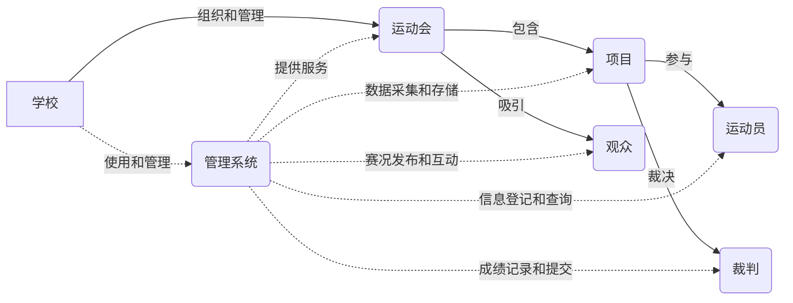

# 学校田径运动会管理系统详细设计与具体代码实现

作者：禅与计算机程序设计艺术

## 1. 背景介绍

### 1.1 学校田径运动会的重要性
学校田径运动会是学校体育活动中的重要组成部分,对于增强学生体质、培养学生的竞争意识和团队合作精神具有重要意义。然而,传统的田径运动会管理方式效率低下,存在诸多问题。因此,开发一套高效、便捷的田径运动会管理系统势在必行。

### 1.2 传统田径运动会管理方式的不足
#### 1.2.1 信息收集和处理效率低
传统的田径运动会管理通常采用纸质记录的方式,信息的收集、整理和统计非常耗时耗力,效率低下。

#### 1.2.2 数据准确性和安全性难以保证
纸质记录很容易出现遗漏、错误等问题,且难以保证数据的准确性。同时,纸质资料易丢失、损毁,数据安全性堪忧。

#### 1.2.3 实时性和便捷性不足
运动会现场情况瞬息万变,但传统管理方式很难做到实时更新数据、及时反馈信息。此外,查询数据、生成报表等操作也较为繁琐。

### 1.3 开发田径运动会管理系统的意义
#### 1.3.1 提高管理效率
通过信息化手段实现运动会各项数据的采集、存储、处理和分析,大大提高管理效率,减轻工作人员负担。

#### 1.3.2 保证数据准确性和安全性 
系统可以对数据进行有效地校验和备份,确保数据准确无误且不易丢失,提高数据的准确性和安全性。

#### 1.3.3 增强实时性和便捷性
利用计算机和网络技术,系统可以实现数据的实时更新和同步,各种信息及时发布和共享。同时,系统操作简单便捷,各项功能触手可及。

## 2. 核心概念与联系

### 2.1 学校
学校是举办田径运动会的主体,负责运动会的整体组织和管理工作。学校与运动会管理系统的关系如下:
- 学校是系统的使用者和管理者
- 学校通过系统进行运动会的策划、准备和实施
- 系统为学校提供全方位的信息化支持和数据服务

### 2.2 运动会
运动会是由学校组织的体育竞赛活动,是管理系统服务的核心对象。运动会与管理系统的关系如下:
- 运动会的各项数据通过系统采集、存储和管理
- 系统支持运动会全过程的信息化管理
- 系统为运动会提供实时的数据统计和分析服务

### 2.3 项目
项目是运动会的基本组成单元,由一系列竞赛项目构成。项目与管理系统的关系如下:
- 系统支持项目的设置和管理
- 项目的报名、成绩等数据通过系统采集和存储
- 系统可以对项目数据进行实时统计和多维分析

### 2.4 运动员
运动员是运动会的参与者,是项目竞赛的主体。运动员与管理系统的关系如下:
- 运动员信息通过系统登记和管理
- 运动员可通过系统进行项目的报名和查询
- 运动员的参赛数据和成绩通过系统记录和发布

### 2.5 裁判
裁判是运动会的重要组织者,负责竞赛的公平公正。裁判与管理系统的关系如下:
- 裁判信息通过系统登记和管理
- 裁判通过系统记录和提交竞赛成绩
- 系统为裁判提供成绩查询和统计功能

### 2.6 观众
观众是运动会的见证者和参与者。观众与管理系统的关系如下:
- 系统为观众提供运动会的实时赛况和成绩
- 观众可通过系统了解运动会的各项信息
- 系统可接受观众的反馈和互动

以下是学校田径运动会管理系统核心概念之间的关系图:

## 3. 核心算法原理具体操作步骤

### 3.1 数据存储算法
#### 3.1.1 关系型数据库
系统采用关系型数据库(如MySQL)存储结构化数据,通过建立多个二维表来描述数据实体及其关系。以下是核心数据表的设计:

- 学校表(school):记录学校的基本信息,如学校编号、名称等。
- 运动会表(sports_meeting):记录运动会的基本信息,如届数、举办日期、举办地点等。
- 项目表(event):记录运动会的竞赛项目,如项目编号、名称、类型等。
- 运动员表(athlete):记录参赛运动员的信息,如姓名、性别、所属学校等。
- 裁判表(referee):记录裁判的信息,如姓名、联系方式、负责项目等。
- 成绩表(score):记录竞赛成绩数据,如运动员编号、项目编号、名次、成绩等。

#### 3.1.2 非关系型数据库
对于非结构化数据(如图片、视频等),系统采用非关系型数据库(如MongoDB)进行存储和管理。每条数据以"键-值"对的形式存储,数据格式灵活,易于扩展。

### 3.2 数据采集算法
#### 3.2.1 表单提交
对于运动员报名、裁判登记等场景,系统提供在线表单供用户填写提交,通过表单校验和过滤算法对提交的数据进行合法性检查,然后将数据持久化到数据库中。

#### 3.2.2 文件上传
对于批量导入运动员信息、成绩等数据,系统支持以Excel等格式上传文件,服务端解析文件内容,并通过数据映射算法将数据转换为标准格式存入数据库。

#### 3.2.3 设备接入
对于田径计时、测距等数据,系统可通过硬件设备接口(如串口、USB等)与计时器、测距仪等设备连接,实时采集数据并写入数据库。

### 3.3 数据处理算法
#### 3.3.1 数据清洗
对采集到的原始数据,系统通过一系列数据清洗算法进行处理,包括:
- 去重算法:对数据进行去重,消除冗余数据。
- 异常值检测:通过统计学方法(如3σ原则)识别和剔除异常值。
- 缺失值处理:对缺失值进行插值、删除或标记等处理。

#### 3.3.2 数据转换
为满足不同业务场景需求,系统提供灵活的数据转换算法,如:
- 数据格式转换:在不同格式(如JSON、XML等)之间进行转换。
- 数据类型转换:在不同数据类型(如字符串、数值等)之间进行转换。
- 数据单位转换:在不同单位(如米、英尺等)之间进行转换。

#### 3.3.3 数据统计
系统内置常用的数据统计算法,如:
- 描述性统计:计算数据的均值、中位数、众数、方差等。
- 分组统计:按维度对数据进行分组,计算各组的统计量。
- 相关性分析:计算数据变量之间的相关系数,刻画相关性强弱。

### 3.4 数据分析算法
#### 3.4.1 排名算法
对于竞赛成绩数据,系统采用排序算法(如快速排序、归并排序等)生成排名,并支持并列名次的处理。

#### 3.4.2 破纪录算法
通过与历史最好成绩比较,系统可自动判断当前成绩是否破纪录,并给出破纪录提示。同时,系统也支持手动设置纪录标准。

#### 3.4.3 成绩预测算法
基于历史成绩数据,系统应用回归分析、时间序列等算法建立成绩预测模型,可预测运动员的成绩趋势和未来表现。

### 3.5 数据可视化算法
#### 3.5.1 统计图表
系统采用统计图表库(如ECharts),将数据转化为直观的统计图表,常用的图表类型有:
- 柱状图:展示分组数据的数量或比例关系。
- 折线图:反映数据的变化趋势。
- 饼图:表示数据的组成及占比情况。

#### 3.5.2 赛事动画
通过赛道、运动员等元素的抽象和数据映射,系统可生成赛事的动画效果,直观展现赛事进程和结果。

## 4. 数学模型和公式详细讲解举例说明

### 4.1 排名模型
假设有n个运动员参加某个项目的竞赛,他们的成绩分别为$x_1, x_2, \cdots, x_n$,我们需要根据成绩生成排名$r_1, r_2, \cdots, r_n$。排名模型可表示为:

$$
r_i = \sum_{j=1}^n I(x_j > x_i) + 1, \quad i = 1,2,\cdots,n
$$

其中,$I(x_j > x_i)$为指示函数:

$$
I(x_j > x_i) = \begin{cases}
1, & x_j > x_i \\
0, & x_j \leq x_i
\end{cases}
$$

举例说明:假设4个运动员的成绩为$x_1=10.5, x_2=10.3, x_3=10.7, x_4=10.3$,则他们的排名为:

$$
\begin{aligned}
r_1 &= I(10.3>10.5) + I(10.7>10.5) + I(10.3>10.5) + 1 = 1 \\
r_2 &= I(10.5>10.3) + I(10.7>10.3) + I(10.3>10.3) + 1 = 3 \\
r_3 &= I(10.5>10.7) + I(10.3>10.7) + I(10.3>10.7) + 1 = 1 \\
r_4 &= I(10.5>10.3) + I(10.7>10.3) + I(10.3>10.3) + 1 = 3
\end{aligned}
$$

可见,运动员1和3并列第一,运动员2和4并列第三。

### 4.2 破纪录模型
假设某项目的历史最好成绩为$x_b$,当前运动员的成绩为$x_c$,则破纪录模型可表示为:

$$
B = I(x_c < x_b)
$$

其中,$B$为是否破纪录的标志:

$$
B = \begin{cases}
1, & \text{破纪录} \\
0, & \text{未破纪录}
\end{cases}
$$

举例说明:假设跳高项目的历史最好成绩为$x_b=2.35$米,当前运动员的成绩为$x_c=2.38$米,则:

$$
B = I(2.38 < 2.35) = 0
$$

表明当前成绩未破纪录。如果当前成绩提高到$x_c=2.40$米,则:

$$
B = I(2.40 < 2.35) = 1
$$

表明当前成绩破纪录了。

### 4.3 成绩预测模型
假设某运动员过去$n$次比赛的成绩为$x_1, x_2, \cdots, x_n$,对应的比赛时间为$t_1, t_2, \cdots, t_n$,我们需要预测该运动员在未来时刻$t$的成绩$\hat{x}$。一种简单的预测模型是线性回归:

$$
\hat{x} = a + bt
$$

其中,$a$和$b$为模型参数,可通过最小二乘法估计:

$$
\begin{aligned}
\hat{b} &= \frac{\sum_{i=1}^n (t_i - \bar{t})(x_i - \