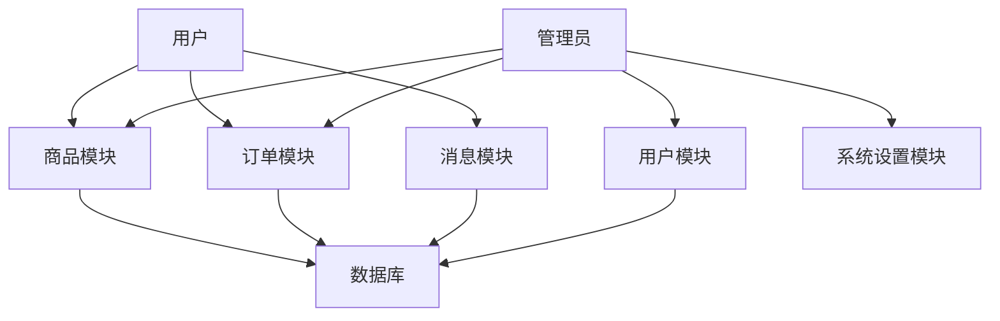

## 1. 背景介绍

### 1.1  高校二手物品交易现状分析
随着高校学生数量的不断增加，学生二手物品交易需求日益旺盛。传统的交易方式存在着信息不对称、交易效率低下、安全性难以保障等问题。为了解决这些问题，开发一个专门针对高校学生的二手物品交易系统具有重要的现实意义。

### 1.2  系统设计目标
本系统旨在构建一个功能完善、安全可靠、易于使用的学生二手物品交易平台，为学生提供便捷的二手物品交易服务，促进资源的有效利用，并营造良好的校园交易环境。

### 1.3  系统设计原则
*   **用户至上**: 以用户需求为中心，提供简单易用、功能丰富的操作界面。
*   **安全可靠**: 采用多种安全措施保障用户信息和交易安全。
*   **高可用性**: 系统架构设计合理，确保系统稳定运行。
*   **可扩展性**: 采用模块化设计，方便系统功能扩展和升级。

## 2. 核心概念与联系

### 2.1  系统用户角色
*   **学生**:  注册用户，可以发布、购买、收藏二手物品，进行评价等操作。
*   **管理员**: 负责系统管理，包括用户管理、商品管理、订单管理、系统设置等。

### 2.2  系统功能模块
*   **用户模块**: 用户注册、登录、信息修改、密码找回等功能。
*   **商品模块**: 商品发布、浏览、搜索、收藏、评价等功能。
*   **订单模块**: 订单生成、支付、发货、确认收货、评价等功能。
*   **消息模块**:  系统通知、私信聊天等功能。
*   **管理模块**: 用户管理、商品管理、订单管理、系统设置等功能。

### 2.3  核心概念联系
系统用户通过用户模块进行注册登录，然后可以在商品模块浏览、搜索、发布二手物品信息，并进行交易。交易过程中会生成订单，用户可以在订单模块查看订单状态并进行相关操作。系统管理员通过管理模块对系统进行管理维护。

## 3. 核心算法原理具体操作步骤

### 3.1  商品推荐算法
为了提高用户的购物体验，系统采用基于内容的推荐算法，根据用户的浏览历史和收藏记录，向用户推荐相关的二手商品。

#### 3.1.1  商品特征提取
系统会对每个商品进行特征提取，包括商品类别、品牌、价格、描述等信息。

#### 3.1.2  用户兴趣模型构建
系统会根据用户的浏览历史和收藏记录，构建用户的兴趣模型，记录用户对不同商品特征的偏好程度。

#### 3.1.3  商品推荐
系统会根据用户的兴趣模型，计算用户对不同商品的兴趣度，并将兴趣度高的商品推荐给用户。

### 3.2  商品搜索算法
为了方便用户快速找到想要的商品，系统采用 Elasticsearch 搜索引擎进行商品搜索。

#### 3.2.1  商品索引创建
系统会将所有商品信息索引到 Elasticsearch 中，包括商品标题、描述、类别、品牌等信息。

#### 3.2.2  搜索词处理
当用户输入搜索词时，系统会对搜索词进行分词、词干提取等处理，以提高搜索精度。

#### 3.2.3  搜索结果排序
系统会根据搜索词与商品索引的相关性，对搜索结果进行排序，并将相关性高的商品排在前面。

## 4. 数学模型和公式详细讲解举例说明

### 4.1  商品推荐算法中的余弦相似度计算
余弦相似度是一种常用的计算两个向量之间相似度的方法，可以用于计算用户兴趣模型与商品特征向量之间的相似度。

**公式：**

$$
similarity = \frac{\sum_{i=1}^{n} A_i * B_i}{\sqrt{\sum_{i=1}^{n} A_i^2} * \sqrt{\sum_{i=1}^{n} B_i^2}}
$$

**其中：**

*   $A$ 表示用户兴趣模型向量
*   $B$ 表示商品特征向量
*   $n$ 表示特征维度

**举例说明：**

假设用户对手机的品牌、价格、成色三个特征的偏好程度分别为 0.8, 0.5, 0.7，而某款手机的品牌、价格、成色三个特征分别为 Apple, 5000, 95%，则用户对该款手机的兴趣度可以计算为：

```
A = [0.8, 0.5, 0.7]
B = [1, 0.8, 0.95]
similarity = (0.8 * 1 + 0.5 * 0.8 + 0.7 * 0.95) / (sqrt(0.8^2 + 0.5^2 + 0.7^2) * sqrt(1^2 + 0.8^2 + 0.95^2)) = 0.89
```

### 4.2  商品搜索算法中的 TF-IDF 算法
TF-IDF 算法是一种常用的文本信息检索权重计算方法，可以用于计算搜索词与商品信息之间的相关性。

**公式：**

$$
tfidf(t, d, D) = tf(t, d) * idf(t, D)
$$

**其中：**

*   $t$ 表示搜索词
*   $d$ 表示商品文档
*   $D$ 表示所有商品文档集合
*   $tf(t, d)$ 表示搜索词 $t$ 在商品文档 $d$ 中出现的频率
*   $idf(t, D)$ 表示搜索词 $t$ 的逆文档频率，计算公式为：

$$
idf(t, D) = log(\frac{|D|}{|\{d \in D: t \in d\}|})
$$

**举例说明：**

假设用户搜索词为 "手机"，在某个商品文档中 "手机" 出现了 5 次，而 "手机" 在所有商品文档中出现了 1000 次，则 "手机" 在该商品文档中的 TF-IDF 值可以计算为：

```
tf("手机", d) = 5 / 文档总词数
idf("手机", D) = log(总文档数 / 1000)
tfidf("手机", d, D) = tf("手机", d) * idf("手机", D)
```

## 5. 项目实践：代码实例和详细解释说明

### 5.1  系统架构图


### 5.2  关键代码示例

#### 5.2.1  商品推荐算法实现

```python
import numpy as np

def cosine_similarity(a, b):
    """
    计算两个向量之间的余弦相似度。

    参数：
        a: 向量 a
        b: 向量 b

    返回值：
        余弦相似度
    """
    return np.dot(a, b) / (np.linalg.norm(a) * np.linalg.norm(b))

def get_recommendations(user_profile, item_features):
    """
    获取商品推荐列表。

    参数：
        user_profile: 用户兴趣模型
        item_features: 商品特征列表

    返回值：
        商品推荐列表
    """
    similarities = []
    for item_feature in item_features:
        similarity = cosine_similarity(user_profile, item_feature)
        similarities.append(similarity)
    sorted_items = sorted(zip(similarities, item_features), reverse=True)
    return [item for _, item in sorted_items]
```

#### 5.2.2  商品搜索算法实现

```python
from elasticsearch import Elasticsearch

def search_items(es, query):
    """
    搜索商品。

    参数：
        es: Elasticsearch 客户端
        query: 搜索词

    返回值：
        搜索结果列表
    """
    res = es.search(index="items", body={
        "query": {
            "match": {
                "title": query
            }
        }
    })
    return res['hits']['hits']
```

## 6. 实际应用场景

### 6.1  高校校园
学生可以在系统上发布闲置的书籍、电子产品、生活用品等二手物品，也可以浏览、搜索、购买其他学生发布的二手物品。

### 6.2  社区跳蚤市场
社区居民可以在系统上发布闲置的家具、家电、衣物等二手物品，也可以浏览、搜索、购买其他居民发布的二手物品。

### 6.3  企业内部交易平台
企业员工可以在系统上发布闲置的办公用品、电子产品等二手物品，也可以浏览、搜索、购买其他员工发布的二手物品。

## 7. 工具和资源推荐

### 7.1  开发工具
*   **Python**:  后端开发语言
*   **Django**:  Python Web 开发框架
*   **Elasticsearch**:  搜索引擎
*   **MySQL**:  关系型数据库
*   **Redis**:  缓存数据库

### 7.2  学习资源
*   **Python 官方文档**:  https://docs.python.org/
*   **Django 官方文档**:  https://docs.djangoproject.com/
*   **Elasticsearch 官方文档**:  https://www.elastic.co/guide/index.html
*   **MySQL 官方文档**:  https://dev.mysql.com/doc/
*   **Redis 官方文档**:  https://redis.io/documentation

## 8. 总结：未来发展趋势与挑战

### 8.1  发展趋势
*   **个性化推荐**:  随着人工智能技术的不断发展，系统可以提供更加精准的个性化商品推荐服务。
*   **社交化交易**:  系统可以引入社交元素，例如用户评价、商品分享等，增强用户之间的互动。
*   **信用体系**:  系统可以建立用户信用体系，鼓励用户诚信交易，提高交易安全性。

### 8.2  挑战
*   **数据安全**:  系统需要保障用户信息和交易数据的安全，防止数据泄露和滥用。
*   **用户体验**:  系统需要不断优化用户体验，提高用户粘性。
*   **市场竞争**:  系统需要面对来自其他二手交易平台的竞争，不断提升自身竞争力。

## 9. 附录：常见问题与解答

### 9.1  如何发布商品？

1.  登录系统，点击“发布商品”按钮。
2.  填写商品信息，包括商品名称、类别、描述、价格、图片等。
3.  点击“发布”按钮，完成商品发布。

### 9.2  如何购买商品？

1.  浏览或搜索商品。
2.  点击“立即购买”按钮。
3.  选择支付方式，完成支付。
4.  等待卖家发货。
5.  确认收货，完成交易。

### 9.3  如何联系客服？

1.  点击“联系客服”按钮。
2.  选择联系方式，例如在线客服、电话客服等。
3.  描述问题，等待客服回复。
