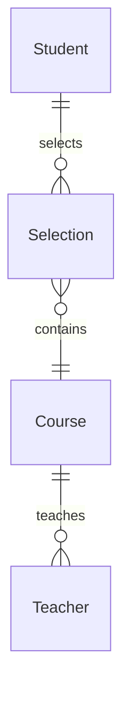

# 学生网上选课系统详细设计与具体代码实现

作者：禅与计算机程序设计艺术

## 1. 背景介绍

### 1.1 选课系统的重要性
在现代化的高校教学管理中,选课系统扮演着至关重要的角色。它不仅能够简化学生选课流程,提高教务管理效率,还能优化教学资源配置,为教学质量的提升提供有力支撑。

### 1.2 传统选课方式的弊端
传统的人工选课方式存在诸多弊端:
- 选课效率低下,学生排队选课浪费大量时间
- 课程信息不透明,难以全面了解课程
- 容易出现"选课冲突"等问题
- 教务管理工作量大,难以及时处理学生的选课需求

### 1.3 网上选课系统的优势
网上选课系统充分利用信息技术手段,能够有效克服传统模式的种种弊端:
- 选课便捷高效,学生可随时随地在线选课
- 课程信息公开透明,学生可全面了解课程信息
- 智能化解决选课冲突,提高选课成功率 
- 减轻教务管理负担,提高教学管理效率

## 2. 核心概念与联系

### 2.1 学生 Student
学生是选课系统的主要参与者和服务对象。学生可在系统中浏览课程,提交选课申请,查询选课结果等。每个学生拥有唯一的学号标识。

### 2.2 课程 Course
课程是选课系统的核心实体,包含课程编号、课程名称、授课教师、学分、上课时间、限选人数等关键信息。

### 2.3 教师 Teacher
教师承担着课程的授课任务,在系统中可以查看所授课程的选课学生名单、人数等信息。每位教师拥有唯一的教师编号。

### 2.4 选课记录 Selection Record 
选课记录表示学生与课程的选课关系,记录学生选修的课程以及选课时间等信息。它将学生和课程关联起来。

### 2.5 实体关系图
下面是学生、课程、教师三个核心实体间的关系ER图:



学生与课程是多对多的选课关系,教师与课程是一对多的授课关系。选课记录则将二者关联起来。

## 3. 核心算法原理与具体操作步骤

### 3.1 学生选课算法
学生选课是整个系统的核心业务,其基本步骤如下:

1. 学生浏览心仪的课程,点击"选课"按钮
2. 系统检查该生是否已选修过该课程
   - 若已选修则提示"您已选修过该课程",返回课程列表
3. 检查该课程是否已满 
   - 若已满则提示"该课程已满",返回课程列表
4. 检查是否与已选其他课程上课时间冲突
   - 若冲突则提示"与已选课程时间冲突",返回课程列表
5. 若均无上述问题,则在选课记录中添加该生与该课程的选课信息
6. 更新课程的已选人数
7. 提示"选课成功",返回已选课程列表

### 3.2 学生退课算法

学生退课流程与选课类似,核心步骤为:

1. 学生在已选课程中点击"退课"
2. 系统检查是否已过退课截止时间
   - 若已过期则提示"已过退课截止时间,不能退选"
3. 从选课记录中删除该生与该课程的选课信息 
4. 更新课程的已选人数
5. 提示"退课成功",返回已选课程列表

### 3.3 教师查看选课名单

授课教师可以查看所授课程的学生选课名单,具体步骤为:

1. 教师登录系统,进入"我的授课"界面
2. 点击某门课程,进入该课程的选课学生名单页面
3. 系统从选课记录中检索出选修该课程的所有学生信息
4. 将学生信息结构化展示在前端页面

## 4. 数学模型与公式详解

### 4.1 学生选课的数学模型

我们可以用集合论的语言来刻画学生选课问题。令$S$表示全体学生的集合,$C$表示全体课程的集合。

每个学生$s_i$选修的课程集合记为$C_i$,则有$C_i \subseteq C$。所有学生的选课集合构成一个集合族$\mathcal{F}=\{C_1,\cdots,C_n\}$。

如果每门课程对选课人数没有限制,则学生选课问题可表示为:

$$\begin{aligned}
\max \quad &\sum_{i=1}^n |C_i| \\
\text{s.t.} \quad & C_i \subseteq C, \forall i=1,\cdots,n \\
& C_i \cap C_j = \varnothing, \forall i \neq j
\end{aligned}$$

其中$|C_i|$表示第$i$个学生选修的课程数。目标是在不冲突的前提下,尽可能满足所有学生的选课需求,即最大化总选课数。

### 4.2 考虑课程人数上限的选课模型

在实际情况中,每门课程往往有选课人数上限$m_j$。因此学生选课问题可以表示为一个整数规划问题:

$$\begin{aligned}
\max \quad &\sum_{i=1}^n \sum_{j=1}^{|C|} x_{ij} \\
\text{s.t.} \quad & \sum_{j=1}^{|C|} x_{ij} \leq M_i, \forall i=1,\cdots,n \\
& \sum_{i=1}^n x_{ij} \leq m_j, \forall j=1,\cdots,|C| \\ 
& x_{ij} \in \{0,1\}, \forall i,j
\end{aligned}$$

其中$x_{ij}$是决策变量,表示学生$i$是否选修课程$j$。$M_i$表示学生$i$的最大选课数。这个模型的目标是最大化总选课数,同时满足每个学生的选课数上限和每门课程的选课人数上限。

### 4.3 考虑课程时间冲突的选课模型

在更复杂的情况下,不同课程的上课时间可能存在冲突。我们可以引入课程时间冲突矩阵$Q=(q_{jk})$,其中

$$
q_{jk}=\begin{cases}
1, & \text{如果课程$j$和课程$k$时间冲突} \\ 
0, & \text{otherwise}
\end{cases}
$$

则避免时间冲突的选课模型可以表示为:

$$\begin{aligned}
\max \quad &\sum_{i=1}^n \sum_{j=1}^{|C|} x_{ij} \\
\text{s.t.} \quad & \sum_{j=1}^{|C|} x_{ij} \leq M_i, \forall i \\
& \sum_{i=1}^n x_{ij} \leq m_j, \forall j \\ 
& x_{ij} + x_{ik} \leq 1, \forall i, \forall j,k \text{ s.t. } q_{jk}=1 \\
& x_{ij} \in \{0,1\}, \forall i,j
\end{aligned}$$

这个模型在之前的基础上增加了时间冲突限制,确保每个学生选修的任意两门课程之间都不会发生时间冲突。

## 5. 项目实践:代码实例与详解

下面我们使用Java语言来实现一个简单的学生选课系统。

### 5.1 实体类设计

首先我们设计系统的核心实体类:学生、课程和选课记录。

```java
public class Student {
    private String id;
    private String name;
    // 构造函数、getter和setter方法略
}

public class Course {
    private String id;
    private String name;
    private String teacherId;
    private int credit;
    private int capacity;
    private int selectedCount;
    // 构造函数、getter和setter方法略
}

public class SelectionRecord {
    private String studentId;
    private String courseId;
    private Date selectTime;
    // 构造函数、getter和setter方法略
}
```

### 5.2 数据访问层设计

接下来我们设计数据访问层,与数据库交互,实现对学生、课程和选课记录的CRUD操作。这里以操作课程表为例。

```java
public class CourseDAO {
    
    // 查询所有课程
    public List<Course> getAllCourses() {
        List<Course> courses = new ArrayList<>();
        // 从数据库中查询所有课程记录,并转换为Course对象列表
        // 具体数据库操作代码略
        return courses;
    }
    
    // 根据ID查询课程
    public Course getCourseById(String courseId) {
        Course course = null;
        // 根据课程ID从数据库中查询课程记录,并转换为Course对象
        // 具体数据库操作代码略
        return course;
    }
    
    // 更新课程已选人数
    public void updateSelectedCount(String courseId, int count) {
        // 更新数据库中相应课程记录的已选人数字段
        // 具体数据库操作代码略
    }
}
```

StudentDAO和SelectionRecordDAO的设计与此类似,这里不再赘述。

### 5.3 业务逻辑层设计

业务逻辑层负责实现系统的核心业务逻辑,如处理学生的选课和退课请求等。

```java
public class SelectCourseService {
    
    private CourseDAO courseDAO;
    private StudentDAO studentDAO;
    private SelectionRecordDAO selectionRecordDAO;
    
    // 处理学生选课请求
    public String selectCourse(String studentId, String courseId) {
        Student student = studentDAO.getStudentById(studentId);
        Course course = courseDAO.getCourseById(courseId);
        
        // 检查是否已选修过该课程
        if (selectionRecordDAO.isSelected(studentId, courseId)) {
            return "您已选修过该课程";
        }
        
        // 检查课程是否已满
        if (course.getSelectedCount() >= course.getCapacity()) {
            return "该课程已满";
        }
        
        // 检查是否与已选课程时间冲突
        List<Course> selectedCourses = selectionRecordDAO.getSelectedCourses(studentId);
        for (Course selectedCourse : selectedCourses) {
            if (hasTimeConflict(selectedCourse, course)) {
                return "与已选课程时间冲突";
            }
        }
        
        // 添加选课记录
        selectionRecordDAO.addSelectionRecord(studentId, courseId);
        
        // 更新课程已选人数
        courseDAO.updateSelectedCount(courseId, course.getSelectedCount() + 1);
        
        return "选课成功";
    }
    
    // 处理学生退课请求
    public String withdrawCourse(String studentId, String courseId) {
        // 检查是否已过退课截止时间
        if (isOverDeadline()) {
            return "已过退课截止时间,不能退选";
        }
        
        Course course = courseDAO.getCourseById(courseId);
        
        // 删除选课记录
        selectionRecordDAO.deleteSelectionRecord(studentId, courseId);
        
        // 更新课程已选人数 
        courseDAO.updateSelectedCount(courseId, course.getSelectedCount() - 1);
        
        return "退课成功";
    }
    
    // 判断两门课程是否时间冲突
    private boolean hasTimeConflict(Course c1, Course c2) {
        // 比较两门课程的上课时间,判断是否冲突
        // 具体代码略
        return false;
    }
    
    // 判断是否已过退课截止时间
    private boolean isOverDeadline() {
        // 检查当前时间是否已过退课的截止时间
        // 具体代码略
        return false;
    }
}
```

### 5.4 用户界面层设计

最后我们需要设计用户界面层,负责接收用户的输入,调用业务逻辑层的服务,并将结果反馈给用户。这里以学生选课界面为例。

```java
public class SelectCourseServlet extends HttpServlet {
    private SelectCourseService selectCourseService;
    
    protected void doPost(HttpServletRequest request, HttpServletResponse response) throws ServletException, IOException {
        // 获取学生ID和课程ID
        String studentId = request.getParameter("studentId");
        String courseId = request.getParameter("courseId");
        
        // 调用选课服务
        String result = selectCourseService.selectCourse(studentId, courseId);
        
        // 将选课结果存入request属性
        request.setAttribute("result", result);
        
        // 跳转到选课结果页面
        request.getRequestDispatcher("/selectResult.jsp").forward(request, response);
    }
}
```

在selectResult.jsp页面中,我们可以从request属性中获取选课结果并展示