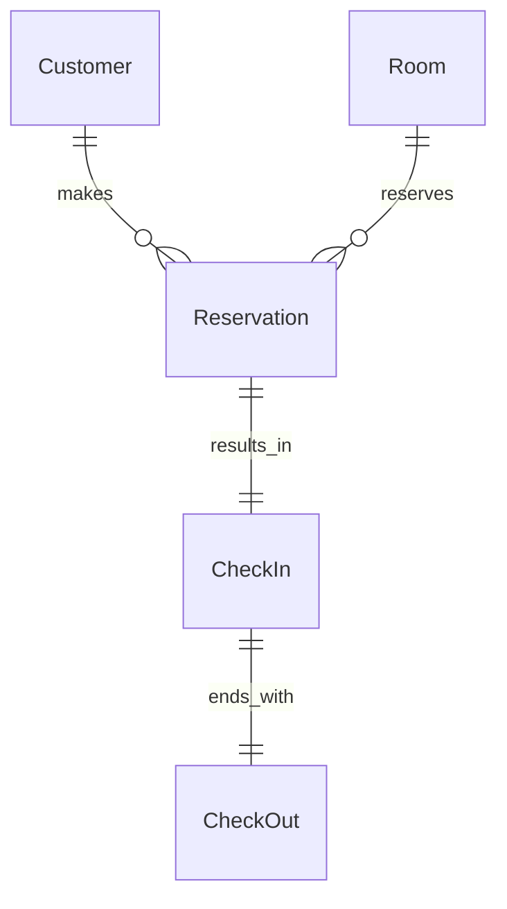

# 客房信息管理系统详细设计与具体代码实现

作者：禅与计算机程序设计艺术

## 1. 背景介绍

在现代酒店管理中,高效、准确地管理客房信息是提升服务质量和运营效率的关键。传统的人工管理方式已经无法满足日益增长的客房管理需求。因此,开发一个功能完善、易于使用的客房信息管理系统势在必行。

本文将详细阐述客房信息管理系统的设计思路和具体实现过程,为读者提供一个全面、深入的技术指南。通过对系统架构、数据库设计、核心算法和代码实现的讲解,读者将掌握开发类似系统的关键技术和最佳实践。

### 1.1 客房信息管理的痛点
#### 1.1.1 信息分散,难以管理
#### 1.1.2 实时性差,数据滞后 
#### 1.1.3 缺乏数据分析能力

### 1.2 系统开发的意义
#### 1.2.1 提高管理效率
#### 1.2.2 优化客户体验
#### 1.2.3 辅助决策分析

## 2. 核心概念与关系

在客房信息管理系统中,涉及到以下几个核心概念:

### 2.1 客房(Room)
代表酒店的每个房间,包含房间号、类型、状态、价格等属性。

### 2.2 客户(Customer)  
入住酒店的客人,包含姓名、证件号、联系方式等信息。

### 2.3 预订(Reservation)
客户预定客房的记录,包含预订时间、入住日期、离店日期、预订房型等。

### 2.4 入住(CheckIn)
客户实际入住酒店的记录,与预订关联,包含入住时间、房间号等。

### 2.5 退房(CheckOut)
客户离店的记录,与入住关联,包含退房时间、消费金额等。

以下是这些概念之间的ER图:



## 3. 核心算法原理与具体步骤

在客房信息管理系统中,以下几个核心算法值得关注:

### 3.1 客房推荐算法
#### 3.1.1 协同过滤推荐
根据客户历史偏好,找到相似客户,推荐他们喜欢的房型。
步骤:
1. 建立用户-房型评分矩阵
2. 计算用户相似度
3. 找到最相似的N个用户 
4. 聚合这些用户对候选房型的评分,生成推荐列表

#### 3.1.2 基于内容的推荐  
根据客户当前选择的房型特征,推荐特征相似的其他房型。
步骤:
1. 提取房型特征向量
2. 计算当前房型与其他房型的相似度
3. 选取相似度最高的N个房型推荐

### 3.2 客房动态定价算法
#### 3.2.1 需求预测
利用历史数据预测未来一段时间的客房需求。
主要方法:
- 时间序列分析
- 机器学习回归

#### 3.2.2 定价优化
根据需求预测、竞争对手价格、营销策略等因素,动态调整客房价格,最大化收益。
主要方法:
- 动态规划
- 强化学习

## 4. 数学模型与公式详解

### 4.1 协同过滤推荐
#### 4.1.1 用户相似度
余弦相似度:
$$sim(u,v) = \frac{\sum_{i\in I_{uv}} r_{ui}r_{vi}}{\sqrt{\sum_{i\in I_u} r_{ui}^2} \sqrt{\sum_{i\in I_v} r_{vi}^2}}$$

其中$I_u$和$I_v$分别为用户$u$和$v$评分过的房型集合,$I_{uv}$为两人共同评分的房型集合,$r_{ui}$为用户$u$对房型$i$的评分。

#### 4.1.2 用户评分预测
$$\hat{r}_{ui} = \bar{r}_u + \frac{\sum_{v\in N_i(u)} sim(u,v)(r_{vi}-\bar{r}_v)}{\sum_{v\in N_i(u)} sim(u,v)}$$

其中$\bar{r}_u$为用户$u$的平均评分,$N_i(u)$为与用户$u$最相似的$N$个用户中对房型$i$有评分的子集。

### 4.2 客房需求预测
#### 4.2.1 时间序列分析
设第$t$天的客房需求为$y_t$,利用前$n$天的需求预测第$t+1$天的需求:

$$\hat{y}_{t+1} = \sum_{i=1}^n \alpha_i y_{t-i+1}$$

其中$\alpha_i$为第$i$个时间步的权重参数。

#### 4.2.2 机器学习回归
常见的机器学习回归模型有:
- 线性回归:$\hat{y} = w^Tx+b$ 
- 决策树回归
- 支持向量回归
- 神经网络回归

## 5. 项目实践:代码实例与详解

下面以Python为例,展示客房信息管理系统的部分核心代码。

### 5.1 数据库模型定义

```python
from sqlalchemy import Column, Integer, String, ForeignKey, Date 
from sqlalchemy.ext.declarative import declarative_base

Base = declarative_base()

class Room(Base):
    __tablename__ = 'room'
    
    id = Column(Integer, primary_key=True)
    room_number = Column(String(10), unique=True)
    room_type = Column(String(20))
    price = Column(Integer)
    status = Column(String(20))

class Customer(Base):
    __tablename__ = 'customer'
    
    id = Column(Integer, primary_key=True)
    name = Column(String(50))
    id_card = Column(String(20), unique=True)
    phone = Column(String(20))

class Reservation(Base):
    __tablename__ = 'reservation'
    
    id = Column(Integer, primary_key=True)
    customer_id = Column(Integer, ForeignKey('customer.id'))
    room_id = Column(Integer, ForeignKey('room.id'))
    start_date = Column(Date)
    end_date = Column(Date)
    
class CheckIn(Base):
    __tablename__ = 'checkin'
    
    id = Column(Integer, primary_key=True)
    reservation_id = Column(Integer, ForeignKey('reservation.id'))
    checkin_date = Column(Date)
    
class CheckOut(Base):
    __tablename__ = 'checkout'
    
    id = Column(Integer, primary_key=True)
    checkin_id = Column(Integer, ForeignKey('checkin.id'))
    checkout_date = Column(Date)
    payment = Column(Integer)
```

### 5.2 协同过滤推荐

```python
import numpy as np

def cosine_similarity(u, v):
    return np.dot(u,v) / (np.linalg.norm(u) * np.linalg.norm(v))

def user_based_cf(user_id, rating_matrix, n=5):
    similarities = []
    for other_user_id in range(rating_matrix.shape[0]):
        if other_user_id == user_id:
            continue
        u_ratings = rating_matrix[user_id]
        v_ratings = rating_matrix[other_user_id]
        similarity = cosine_similarity(u_ratings, v_ratings)
        similarities.append((other_user_id, similarity))
        
    similarities.sort(key=lambda x: x[1], reverse=True)
    similar_users = [x[0] for x in similarities[:n]]
    
    user_ratings = rating_matrix[user_id]
    not_rated_indices = np.where(user_ratings == 0)[0]
    
    recommendations = []
    for idx in not_rated_indices:
        rating_sum = 0
        similarity_sum = 0
        for similar_user in similar_users:
            rating = rating_matrix[similar_user, idx]
            if rating == 0:
                continue
            similarity = cosine_similarity(rating_matrix[user_id], rating_matrix[similar_user]) 
            rating_sum += rating * similarity
            similarity_sum += similarity
        
        if similarity_sum == 0:
            continue
        
        predicted_rating = rating_sum / similarity_sum
        recommendations.append((idx, predicted_rating))
        
    recommendations.sort(key=lambda x: x[1], reverse=True)
    return recommendations
```

### 5.3 客房动态定价

```python
import numpy as np
from sklearn.linear_model import LinearRegression

def predict_demand(history_demands, n=7):
    X = []
    y = []
    for i in range(len(history_demands)-n):
        X.append(history_demands[i:i+n])
        y.append(history_demands[i+n])
        
    model = LinearRegression()
    model.fit(X, y)
    
    latest_demands = history_demands[-n:]
    predicted_demand = model.predict([latest_demands])[0]
    return predicted_demand

def optimize_price(predicted_demand, base_price, max_price):
    if predicted_demand < 0.5:
        return max_price
    elif predicted_demand < 0.7:
        return base_price * 1.2
    elif predicted_demand < 0.9:
        return base_price * 1.1
    else:
        return base_price
```

## 6. 实际应用场景

客房信息管理系统在酒店运营中有广泛的应用,主要体现在:

### 6.1 前台服务
- 快速查询客房状态、客户信息
- 高效完成预订、入住、退房流程

### 6.2 客房管理
- 实时更新客房状态
- 合理分配客房资源
- 监控客房设施维护需求

### 6.3 收益管理
- 根据需求预测和市场行情动态定价
- 分析入住率、平均房价等关键指标 
- 优化房型结构和价格体系

### 6.4 客户关系管理
- 积累客户偏好数据
- 针对性推荐房型和服务
- 开展个性化营销活动

## 7. 工具与资源推荐

### 7.1 数据库
- MySQL
- PostgreSQL
- MongoDB

### 7.2 后端框架
- Spring Boot (Java)
- Django (Python)
- Express.js (Node.js)

### 7.3 前端框架  
- Vue.js
- React
- Angular

### 7.4 数据分析
- Pandas (Python)
- NumPy (Python)
- Scikit-learn (Python)

### 7.5 部署工具
- Docker
- Kubernetes

## 8. 总结:未来发展趋势与挑战

### 8.1 个性化服务
利用人工智能技术,为客户提供更加个性化的房型推荐和服务定制。

### 8.2 数据安全
随着系统采集的客户数据日益丰富,如何保障数据安全和隐私将成为重要课题。

### 8.3 系统集成 
与其他系统(如会员系统、支付系统)的无缝集成,提供一站式解决方案。

### 8.4 移动化
通过小程序、App等形式,让客户可以随时随地管理预订,享受服务。

## 9. 附录:常见问题与解答

### 9.1 如何提高需求预测的准确性?
- 选择合适的算法和模型
- 合理设置时间窗口大小
- 特征工程:挖掘影响需求的关键因素
- 定期更新模型

### 9.2 如何处理高并发下的系统性能问题?
- 应用缓存(如Redis)
- 优化数据库查询
- 使用消息队列异步处理任务
- 动态扩容服务器

### 9.3 如何提升推荐算法的效果?
- 采集更多用户反馈数据
- 尝试不同的相似度计算方法
- 融合多种推荐算法
- 引入更多辅助信息(如用户画像)

### 9.4 如何保证数据一致性?
- 合理设计数据库模式
- 使用事务保证原子性
- 在应用层加锁
- 引入分布式事务方案

以上就是对客房信息管理系统设计与实现的全面阐述。希望本文能为你提供有价值的思路和指导。在实际开发中,还需要根据具体业务需求和技术环境,不断优化和完善系统。预祝各位读者在系统开发过程中收获满满,让客房管理工作更加高效、智能!