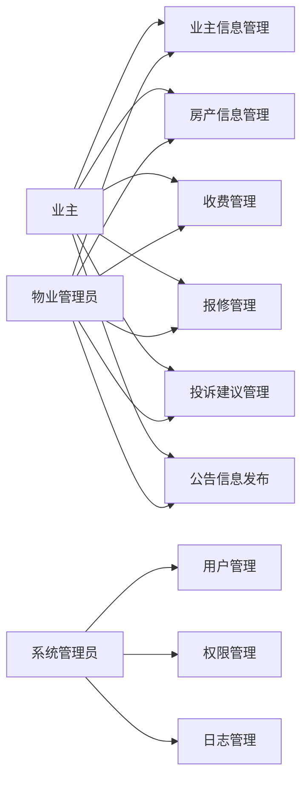

## 1. 背景介绍

### 1.1 物业管理的现状与挑战

随着城市化进程的加速，越来越多的住宅小区涌现，物业管理的重要性日益凸显。然而，传统的物业管理方式面临着诸多挑战：

* **信息化程度低:**  许多小区仍然依赖人工记录和管理，效率低下，容易出错。
* **服务质量参差不齐:**  不同物业公司服务水平差异较大，业主满意度不高。
* **沟通不畅:**  业主与物业公司之间缺乏有效的沟通渠道，信息不对称。

### 1.2 小区物业管理系统的意义

为了解决上述问题，开发一套智能化的小区物业管理系统势在必行。该系统能够：

* **提高管理效率:**  实现信息化管理，减少人工操作，提高工作效率。
* **提升服务质量:**  提供便捷的在线服务，及时响应业主需求，提升业主满意度。
* **加强沟通:**  建立业主与物业公司之间的沟通平台，促进信息共享。

### 1.3 本文的目标

本文将详细介绍小区物业管理系统的架构设计和代码实现，并探讨其应用场景、未来发展趋势和挑战。

## 2. 核心概念与联系

### 2.1 系统用户角色

小区物业管理系统涉及多个用户角色，包括：

* **业主:**  小区业主，使用系统进行信息查询、费用缴纳、报修等操作。
* **物业管理员:**  负责小区日常管理，包括收费、维修、安全等。
* **系统管理员:**  负责系统维护和管理。

### 2.2 功能模块

系统主要功能模块包括：

* **业主信息管理:**  业主信息登记、查询、修改等。
* **房产信息管理:**  房产信息登记、查询、修改等。
* **收费管理:**  物业费、水电费等费用收缴、查询、统计等。
* **报修管理:**  业主报修登记、处理、跟踪等。
* **投诉建议管理:**  业主投诉建议登记、处理、跟踪等。
* **公告信息发布:**  发布小区公告信息。
* **系统管理:**  用户管理、权限管理、日志管理等。

### 2.3 核心概念联系

**Mermaid 流程图:**



## 3. 核心算法原理具体操作步骤

### 3.1 用户登录认证

系统采用用户名密码认证方式，具体步骤如下：

1. 用户输入用户名和密码。
2. 系统校验用户名是否存在，密码是否正确。
3. 校验通过后，生成用户登录凭证，并将用户重定向至首页。

### 3.2 物业费计算

系统根据房产面积和收费标准计算物业费，具体步骤如下：

1. 获取房产面积。
2. 获取收费标准。
3. 计算物业费 = 房产面积 * 收费标准。

### 3.3 报修处理流程

业主报修后，系统自动分配给相关维修人员进行处理，具体步骤如下：

1. 业主提交报修信息。
2. 系统自动分配维修人员。
3. 维修人员接收报修信息，并进行处理。
4. 维修人员完成维修后，更新报修状态。
5. 系统通知业主维修完成。

## 4. 数学模型和公式详细讲解举例说明

### 4.1 物业费计算模型

物业费计算公式：

$$ 物业费 = 房产面积 * 收费标准 $$

**举例说明:**

假设某小区的收费标准为 2 元/平方米/月，某业主房产面积为 100 平方米，则该业主每月应缴纳的物业费为：

$$ 物业费 = 100 * 2 = 200 元 $$

### 4.2 报修响应时间模型

报修响应时间是指从业主提交报修信息到维修人员接收报修信息的时间间隔。

**举例说明:**

假设某业主在 10:00 提交报修信息，维修人员在 10:15 接收报修信息，则报修响应时间为 15 分钟。

## 5. 项目实践：代码实例和详细解释说明

### 5.1 技术选型

* **后端:**  Spring Boot
* **数据库:**  MySQL
* **前端:**  Vue.js

### 5.2 代码实例

**业主信息管理模块代码示例:**

```java
@RestController
@RequestMapping("/owner")
public class OwnerController {

    @Autowired
    private OwnerService ownerService;

    @PostMapping("/add")
    public Result addOwner(@RequestBody Owner owner) {
        ownerService.addOwner(owner);
        return Result.success();
    }

    @GetMapping("/list")
    public Result listOwners() {
        List<Owner> owners = ownerService.listOwners();
        return Result.success(owners);
    }

    // 其他方法...
}
```

**代码解释:**

* `@RestController` 注解表示该类是一个 RESTful 风格的控制器。
* `@RequestMapping("/owner")` 注解指定该控制器的 URL 前缀为 `/owner`。
* `@Autowired` 注解自动注入 `OwnerService` 对象。
* `@PostMapping("/add")` 注解指定该方法处理 POST 请求，URL 为 `/owner/add`。
* `@RequestBody` 注解表示方法参数从请求体中获取。
* `@GetMapping("/list")` 注解指定该方法处理 GET 请求，URL 为 `/owner/list`。
* `Result` 是自定义的返回结果类。

## 6. 实际应用场景

### 6.1 住宅小区

小区物业管理系统可以应用于各种类型的住宅小区，包括：

* **普通住宅小区:**  提供基础的物业管理服务，如收费、报修、投诉建议等。
* **高档住宅小区:**  提供更全面的服务，如智能家居、社区活动、生活服务等。

### 6.2 商业地产

小区物业管理系统也可以应用于商业地产，如：

* **写字楼:**  提供办公空间管理、租户服务等。
* **商场:**  提供商户管理、顾客服务等。

## 7. 工具和资源推荐

### 7.1 开发工具

* **IntelliJ IDEA:**  Java 开发 IDE。
* **Visual Studio Code:**  前端开发 IDE。
* **Navicat:**  数据库管理工具。

### 7.2 学习资源

* **Spring Boot 官方文档:**  https://spring.io/projects/spring-boot
* **Vue.js 官方文档:**  https://vuejs.org/
* **MySQL 官方文档:**  https://dev.mysql.com/doc/

## 8. 总结：未来发展趋势与挑战

### 8.1 未来发展趋势

* **智能化:**  集成人工智能技术，实现更智能化的物业管理，如智能门禁、智能安防等。
* **平台化:**  打造物业管理平台，整合各种服务资源，为业主提供更便捷的生活服务。
* **数据化:**  利用大数据技术分析业主需求，提供更精准的服务。

### 8.2 面临的挑战

* **数据安全:**  如何保障业主信息安全。
* **技术更新:**  如何应对不断更新的技术挑战。
* **用户体验:**  如何提升用户体验，满足业主多样化需求。

## 9. 附录：常见问题与解答

### 9.1 如何修改密码？

业主可以通过系统提供的“修改密码”功能进行密码修改。

### 9.2 如何缴纳物业费？

业主可以通过系统提供的在线支付功能缴纳物业费。

### 9.3 如何报修？

业主可以通过系统提供的“报修”功能提交报修信息。
