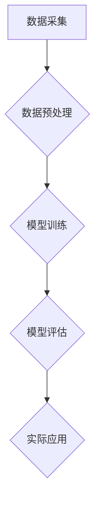

## 1. 背景介绍

### 1.1 深度学习的局限性

近年来，深度学习在各个领域取得了显著的成就，但其成功很大程度上依赖于大量的标注数据。然而，在许多实际应用场景中，获取大量标注数据的成本高昂且耗时。例如，在医疗影像诊断、罕见疾病识别、新物种分类等领域，收集足够的标注样本非常困难。

### 1.2 小样本学习的兴起

为了解决深度学习对大量标注数据的依赖问题，小样本学习（Few-shot Learning）应运而生。小样本学习旨在利用少量标注样本训练模型，并使其能够识别新的、未见过的类别。

### 1.3 数据集的重要性

数据集是小样本学习研究的基石。高质量的数据集能够提供丰富的样本多样性，帮助研究人员更好地评估算法性能、探索新的学习方法。


## 2. 核心概念与联系

### 2.1 小样本学习的定义

小样本学习是一种机器学习问题，其目标是通过少量标注样本训练模型，使其能够识别新的类别。通常情况下，每个新类别只有 1 到 5 个标注样本可用，因此也被称为“N-way K-shot”学习，其中 N 表示类别数量，K 表示每个类别样本数量。

### 2.2 元学习与度量学习

小样本学习的核心思想是学习如何学习。元学习（Meta-Learning）是一种学习如何学习的方法，其目标是训练一个元学习器，使其能够快速适应新的任务。度量学习（Metric Learning）则关注于学习样本之间的距离度量，使得属于同一类别的样本距离更近，不同类别的样本距离更远。许多小样本学习算法都基于元学习和度量学习的思想。

### 2.3 常用数据集的特点

小样本学习常用数据集通常具有以下特点：

* **类别数量多:** 数据集包含大量的类别，以模拟现实世界中类别数量众多的情况。
* **样本数量少:** 每个类别只有少量标注样本，以模拟小样本学习的场景。
* **样本多样性高:** 数据集包含来自不同领域的样本，以提高模型的泛化能力。


## 3. 核心算法原理具体操作步骤

### 3.1 基于度量学习的算法

#### 3.1.1 原型网络（Prototypical Networks）

原型网络是一种简单而有效的小样本学习算法。其核心思想是为每个类别学习一个原型向量，然后根据样本与原型向量之间的距离进行分类。

具体操作步骤如下：

1. **计算支持集样本的原型向量:** 对于每个类别，计算其支持集样本的平均向量作为原型向量。
2. **计算查询集样本与原型向量之间的距离:** 使用欧氏距离或余弦相似度等度量方法计算查询集样本与每个原型向量之间的距离。
3. **分类:** 将查询集样本分类到距离最近的原型向量所代表的类别。

#### 3.1.2 匹配网络（Matching Networks）

匹配网络是一种基于注意力机制的小样本学习算法。其核心思想是计算支持集样本与查询集样本之间的相似度，然后根据相似度进行分类。

具体操作步骤如下：

1. **计算支持集样本与查询集样本之间的相似度:** 使用注意力机制计算支持集样本与查询集样本之间的相似度。
2. **加权求和:** 对支持集样本的标签进行加权求和，其中权重为对应的相似度。
3. **分类:** 将查询集样本分类到加权求和结果最大的类别。

### 3.2 基于元学习的算法

#### 3.2.1 模型无关元学习（MAML）

MAML 是一种经典的元学习算法，其目标是学习一个易于微调的模型初始化参数。

具体操作步骤如下：

1. **初始化模型参数:** 随机初始化模型参数。
2. **在支持集上进行训练:** 使用支持集样本对模型参数进行训练。
3. **在查询集上进行测试:** 使用查询集样本测试模型性能。
4. **计算元梯度:** 计算模型参数在查询集上的梯度，并将其作为元梯度。
5. **更新模型参数:** 使用元梯度更新模型参数。

#### 3.2.2 元学习 LSTM（Meta-LSTM）

Meta-LSTM 是一种基于 LSTM 的元学习算法，其目标是学习一个能够快速适应新任务的 LSTM 网络。

具体操作步骤如下：

1. **初始化 LSTM 网络:** 随机初始化 LSTM 网络参数。
2. **在支持集上进行训练:** 使用支持集样本对 LSTM 网络参数进行训练。
3. **在查询集上进行测试:** 使用查询集样本测试 LSTM 网络性能。
4. **更新 LSTM 网络参数:** 根据测试结果更新 LSTM 网络参数。


## 4. 数学模型和公式详细讲解举例说明

### 4.1 原型网络

原型网络的数学模型可以表示为：

$$
\mathbf{c}_k = \frac{1}{|S_k|} \sum_{\mathbf{x}_i \in S_k} \mathbf{x}_i
$$

其中，$\mathbf{c}_k$ 表示类别 $k$ 的原型向量，$S_k$ 表示类别 $k$ 的支持集样本集合，$\mathbf{x}_i$ 表示支持集样本。

查询集样本 $\mathbf{x}$ 的分类结果可以表示为：

$$
y = \arg\min_k d(\mathbf{x}, \mathbf{c}_k)
$$

其中，$d(\mathbf{x}, \mathbf{c}_k)$ 表示样本 $\mathbf{x}$ 与原型向量 $\mathbf{c}_k$ 之间的距离。

**举例说明:**

假设有两个类别，类别 1 的支持集样本为 {1, 2, 3}，类别 2 的支持集样本为 {4, 5, 6}。则类别 1 的原型向量为 (1+2+3)/3=2，类别 2 的原型向量为 (4+5+6)/3=5。

如果查询集样本为 2.5，则其与类别 1 原型向量的距离为 |2.5-2|=0.5，与类别 2 原型向量的距离为 |2.5-5|=2.5。因此，查询集样本 2.5 被分类到类别 1。

### 4.2 匹配网络

匹配网络的数学模型可以表示为：

$$
y = \sum_{i=1}^k a(\mathbf{x}, \mathbf{x}_i) y_i
$$

其中，$a(\mathbf{x}, \mathbf{x}_i)$ 表示查询集样本 $\mathbf{x}$ 与支持集样本 $\mathbf{x}_i$ 之间的相似度，$y_i$ 表示支持集样本 $\mathbf{x}_i$ 的标签。

**举例说明:**

假设有两个类别，类别 1 的支持集样本为 {1, 2, 3}，类别 2 的支持集样本为 {4, 5, 6}。查询集样本为 2.5。

假设查询集样本与支持集样本之间的相似度分别为：

* a(2.5, 1) = 0.8
* a(2.5, 2) = 0.9
* a(2.5, 3) = 0.7
* a(2.5, 4) = 0.2
* a(2.5, 5) = 0.1
* a(2.5, 6) = 0.3

则查询集样本的分类结果为：

```
y = 0.8 * 1 + 0.9 * 1 + 0.7 * 1 + 0.2 * 2 + 0.1 * 2 + 0.3 * 2 = 2.4
```

因此，查询集样本 2.5 被分类到类别 2。


## 5. 项目实践：代码实例和详细解释说明

### 5.1 Python 代码实例

```python
import torch
from torch import nn
from torch.optim import Adam
from torch.utils.data import DataLoader

# 定义原型网络模型
class PrototypicalNetwork(nn.Module):
    def __init__(self, input_dim, hidden_dim, output_dim):
        super().__init__()
        self.encoder = nn.Sequential(
            nn.Linear(input_dim, hidden_dim),
            nn.ReLU(),
            nn.Linear(hidden_dim, output_dim)
        )

    def forward(self, x):
        return self.encoder(x)

# 定义数据集
class FewShotDataset(torch.utils.data.Dataset):
    def __init__(self, data, labels, n_way, k_shot):
        self.data = data
        self.labels = labels
        self.n_way = n_way
        self.k_shot = k_shot

    def __getitem__(self, index):
        # 随机选择 n_way 个类别
        chosen_classes = torch.randperm(len(torch.unique(self.labels)))[:self.n_way]

        # 为每个类别选择 k_shot 个样本作为支持集
        support_data = []
        support_labels = []
        for class_idx in chosen_classes:
            class_data = self.data[self.labels == class_idx]
            chosen_indices = torch.randperm(len(class_data))[:self.k_shot]
            support_data.append(class_data[chosen_indices])
            support_labels.append(torch.full((self.k_shot,), class_idx))

        # 选择一个样本作为查询集
        query_data = self.data[index]
        query_label = self.labels[index]

        return support_data, support_labels, query_data, query_label

    def __len__(self):
        return len(self.data)

# 定义训练函数
def train(model, data_loader, optimizer, criterion, device):
    model.train()
    for support_data, support_labels, query_data, query_label in data_loader:
        support_data = torch.stack(support_data).to(device)
        support_labels = torch.cat(support_labels).to(device)
        query_data = query_data.to(device)
        query_label = query_label.to(device)

        # 计算支持集样本的原型向量
        prototypes = model(support_data).view(model.n_way, model.k_shot, -1).mean(dim=1)

        # 计算查询集样本与原型向量之间的距离
        distances = torch.cdist(model(query_data).unsqueeze(0), prototypes)

        # 计算损失
        loss = criterion(distances, query_label)

        # 更新模型参数
        optimizer.zero_grad()
        loss.backward()
        optimizer.step()

# 定义测试函数
def test(model, data_loader, criterion, device):
    model.eval()
    correct = 0
    total = 0
    with torch.no_grad():
        for support_data, support_labels, query_data, query_label in data_loader:
            support_data = torch.stack(support_data).to(device)
            support_labels = torch.cat(support_labels).to(device)
            query_data = query_data.to(device)
            query_label = query_label.to(device)

            # 计算支持集样本的原型向量
            prototypes = model(support_data).view(model.n_way, model.k_shot, -1).mean(dim=1)

            # 计算查询集样本与原型向量之间的距离
            distances = torch.cdist(model(query_data).unsqueeze(0), prototypes)

            # 预测类别
            predicted_label = torch.argmin(distances)

            # 统计正确率
            if predicted_label == query_label:
                correct += 1
            total += 1

    return correct / total

# 设置超参数
input_dim = 784
hidden_dim = 128
output_dim = 64
n_way = 5
k_shot = 1
batch_size = 32
learning_rate = 0.001
num_epochs = 10

# 设置设备
device = torch.device('cuda' if torch.cuda.is_available() else 'cpu')

# 加载数据集
train_data = ...
train_labels = ...
test_data = ...
test_labels = ...

# 创建数据集和数据加载器
train_dataset = FewShotDataset(train_data, train_labels, n_way, k_shot)
train_loader = DataLoader(train_dataset, batch_size=batch_size, shuffle=True)
test_dataset = FewShotDataset(test_data, test_labels, n_way, k_shot)
test_loader = DataLoader(test_dataset, batch_size=batch_size, shuffle=False)

# 创建模型、优化器和损失函数
model = PrototypicalNetwork(input_dim, hidden_dim, output_dim).to(device)
optimizer = Adam(model.parameters(), lr=learning_rate)
criterion = nn.CrossEntropyLoss()

# 训练模型
for epoch in range(num_epochs):
    train(model, train_loader, optimizer, criterion, device)

# 测试模型
accuracy = test(model, test_loader, criterion, device)
print(f'Accuracy: {accuracy}')
```

### 5.2 代码解释

* **模型定义:** `PrototypicalNetwork` 类定义了原型网络模型，包括编码器和前向传播函数。
* **数据集定义:** `FewShotDataset` 类定义了小样本学习数据集，包括数据、标签、类别数量和每个类别样本数量。
* **训练函数:** `train` 函数定义了模型训练过程，包括计算原型向量、计算距离、计算损失和更新模型参数。
* **测试函数:** `test` 函数定义了模型测试过程，包括计算原型向量、计算距离、预测类别和统计正确率。
* **超参数设置:** 代码中设置了输入维度、隐藏层维度、输出维度、类别数量、每个类别样本数量、批大小、学习率和训练轮数等超参数。
* **设备设置:** 代码中设置了使用 GPU 或 CPU 进行训练和测试。
* **数据集加载:** 代码中加载了训练集和测试集数据和标签。
* **数据集和数据加载器创建:** 代码中创建了训练集和测试集数据集和数据加载器。
* **模型、优化器和损失函数创建:** 代码中创建了原型网络模型、 Adam 优化器和交叉熵损失函数。
* **模型训练:** 代码中使用训练集数据对模型进行训练。
* **模型测试:** 代码中使用测试集数据对模型进行测试，并输出正确率。


## 6. 实际应用场景

小样本学习在许多实际应用场景中具有重要意义，例如：

* **医疗影像诊断:** 利用少量标注样本训练模型，识别新的疾病类型。
* **罕见疾病识别:** 针对罕见疾病，利用少量样本训练模型进行识别。
* **新物种分类:** 利用少量样本训练模型，识别新的物种。
* **药物发现:** 利用少量样本训练模型，预测药物的药效和毒性。
* **个性化推荐:** 利用少量用户数据训练模型，进行个性化推荐。


## 7. 工具和资源推荐

* **PyTorch:** PyTorch 是一个开源的机器学习框架，提供了丰富的工具和资源，方便进行小样本学习研究。
* **TensorFlow:** TensorFlow 是另一个开源的机器学习框架，也提供了丰富的工具和资源，方便进行小样本学习研究。
* **Few-Shot Learning Papers:** 该网站收集了大量小样本学习相关论文，方便研究人员了解最新的研究进展。
* **Few-Shot Learning Datasets:** 该网站收集了一些常用的  小样本学习数据集，方便研究人员进行实验。


## 8. 总结：未来发展趋势与挑战

### 8.1 未来发展趋势

小样本学习是一个充满活力和潜力的研究领域，未来发展趋势包括：

* **更强大的元学习算法:** 研究人员正在探索更强大的元学习算法，以提高模型的泛化能力和学习效率。
* **更丰富的数据集:** 研究人员正在构建更丰富的数据集，以更好地评估算法性能和探索新的学习方法。
* **更广泛的应用场景:** 小样本学习正在被应用到更广泛的领域，例如自然语言处理、计算机视觉、机器人学等。

### 8.2 面临的挑战

小样本学习也面临着一些挑战，例如：

* **过拟合:** 由于样本数量少，模型容易过拟合到训练集上。
* **数据偏差:** 小样本学习数据集可能存在数据偏差，导致模型泛化能力差。
* **可解释性:** 小样本学习模型的可解释性较差，难以理解模型的决策过程。


## 9. 附录：常见问题与解答

### 9.1 小样本学习与迁移学习的区别

迁移学习是将一个领域学习到的知识迁移到另一个领域，而小样本学习是利用少量样本训练模型，使其能够识别新的类别。

### 9.2 小样本学习与零样本学习的区别

零样本学习是指在没有任何标注样本的情况下，训练模型识别新的类别，而小样本学习是利用少量标注样本训练模型，使其能够识别新的类别。


## 10. Mermaid流程图



**图例:**

* A: 数据采集
* B: 数据预处理
* C: 模型训练
* D: 模型评估
* E: 实际应用
