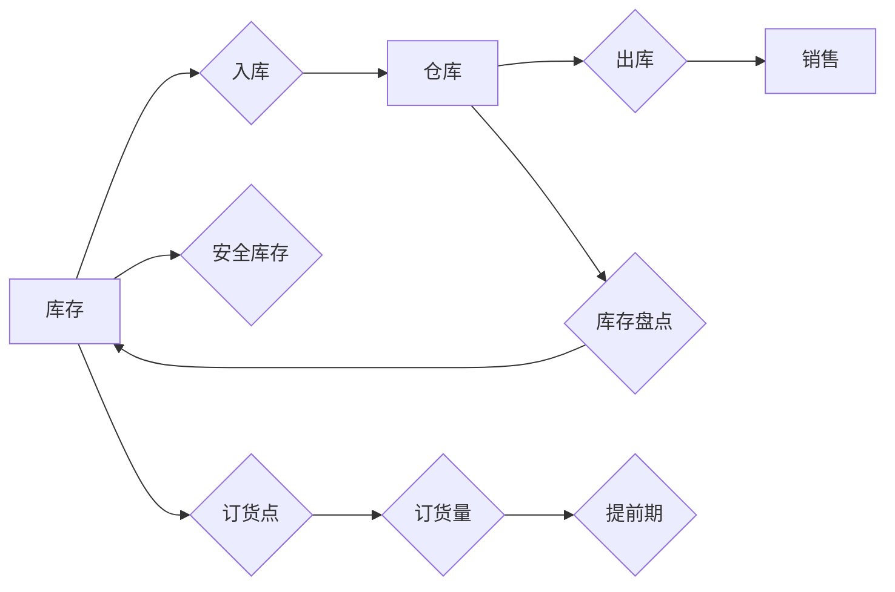

## 1. 背景介绍

### 1.1 库存管理的重要性

在商业运营中，库存管理扮演着至关重要的角色。高效的库存管理系统可以帮助企业：

* **降低库存成本:** 通过优化库存水平，减少库存持有成本，例如仓储费用、保险费用和货物损耗。
* **提高订单履行效率:** 确保及时准确地处理客户订单，提高客户满意度。
* **优化供应链:**  与供应商建立良好的合作关系，确保原材料和产品的及时供应。
* **提高数据可视化:**  提供实时的库存数据，帮助企业做出明智的决策。

### 1.2 库存管理系统的演变

随着信息技术的快速发展，库存管理系统经历了从手工记录到电子化、自动化、智能化的演变过程。早期的库存管理系统主要依赖于人工记录和计算，效率低下且容易出错。随着计算机技术的普及，电子表格和数据库开始应用于库存管理，提高了数据处理效率。近年来，云计算、物联网、大数据和人工智能等技术的兴起，为库存管理系统带来了新的发展机遇，例如：

* **云库存管理系统:**  将库存数据存储在云端，实现随时随地访问和管理。
* **物联网库存管理系统:**  利用RFID、传感器等技术实时监控库存状态，实现自动化库存管理。
* **智能库存管理系统:**  利用机器学习算法预测库存需求，优化库存策略，提高库存管理效率。

### 1.3 本文目的

本文旨在探讨如何设计和实现一个高效的库存管理系统，涵盖系统架构、核心功能、算法原理、代码实例、实际应用场景、工具和资源推荐等方面，为读者提供全面的技术指导。

## 2. 核心概念与联系

### 2.1 库存管理系统的核心概念

* **库存:**  指企业在生产经营过程中持有的用于销售或生产的原材料、半成品、产成品等物资。
* **SKU (Stock Keeping Unit):**  库存量单位，用于区分不同的产品或服务。
* **仓库:**  用于存储库存的场所。
* **入库:**  指货物进入仓库的过程。
* **出库:**  指货物离开仓库的过程。
* **库存盘点:**  定期核对实际库存与系统记录的一致性。
* **安全库存:**  为防止缺货而设置的最低库存量。
* **订货点:**  当库存量达到订货点时，需要进行补货。
* **订货量:**  每次补货的数量。
* **提前期:**  从发出订单到收到货物的时间间隔。

### 2.2 核心概念之间的联系

下图展示了库存管理系统中核心概念之间的联系：



## 3. 核心算法原理具体操作步骤

### 3.1 经济订货批量 (EOQ) 模型

经济订货批量 (EOQ) 模型是一种经典的库存管理模型，用于确定最佳的订货量，以最小化库存总成本。EOQ 模型基于以下假设：

* 需求是恒定的。
* 订货提前期是固定的。
* 每次订货的成本是固定的。
* 库存持有成本与平均库存量成正比。

EOQ 公式如下：

$$ EOQ = \sqrt{\frac{2DS}{H}} $$

其中：

* D: 年需求量
* S: 每次订货成本
* H: 年库存持有成本

### 3.2  EOQ 模型的操作步骤

1. 确定年需求量 (D)。
2. 确定每次订货成本 (S)。
3. 确定年库存持有成本 (H)。
4. 将 D、S 和 H 代入 EOQ 公式，计算出最佳订货量。

### 3.3  EOQ 模型的示例

假设某公司年需求量为 10,000 件，每次订货成本为 50 元，年库存持有成本为每件 2 元。则最佳订货量为：

$$ EOQ = \sqrt{\frac{2 \times 10000 \times 50}{2}} = 1000 件 $$

## 4. 数学模型和公式详细讲解举例说明

### 4.1 ABC 分类法

ABC 分类法是一种常用的库存管理方法，根据库存物品的价值和重要性将其分为 A、B、C 三类。

* **A 类物品:**  价值最高、最重要的物品，占库存总价值的 70%-80%，占库存总数的 10%-20%。
* **B 类物品:**  价值中等、重要性一般的物品，占库存总价值的 15%-25%，占库存总数的 30%-40%。
* **C 类物品:**  价值最低、重要性最低的物品，占库存总价值的 5%-10%，占库存总数的 50%-60%。

### 4.2 ABC 分类法的应用

ABC 分类法可以帮助企业：

* **优化库存管理策略:**  对 A 类物品进行更严格的控制，对 C 类物品可以采用更简单的管理方式。
* **降低库存成本:**  减少 A 类物品的库存量，可以有效降低库存持有成本。
* **提高订单履行效率:**  确保 A 类物品的及时供应，可以提高订单履行效率。

### 4.3 ABC 分类法的示例

假设某公司有以下库存物品：

| 物品 | 价值 | 数量 |
|---|---|---|
| A | 100 | 10 |
| B | 50 | 20 |
| C | 10 | 50 |
| D | 20 | 30 |
| E | 5 | 100 |

根据 ABC 分类法，可以将这些物品分为以下三类：

* **A 类物品:**  A
* **B 类物品:**  B、D
* **C 类物品:**  C、E

## 5. 项目实践：代码实例和详细解释说明

### 5.1 库存管理系统的基本功能

一个基本的库存管理系统应具备以下功能：

* **商品管理:**  添加、修改、删除商品信息，包括商品名称、SKU、描述、价格、库存数量等。
* **仓库管理:**  添加、修改、删除仓库信息，包括仓库名称、地址、负责人等。
* **入库管理:**  记录商品入库信息，包括入库日期、商品、数量、仓库等。
* **出库管理:**  记录商品出库信息，包括出库日期、商品、数量、仓库等。
* **库存盘点:**  定期核对实际库存与系统记录的一致性。
* **报表统计:**  生成各种库存报表，例如库存周转率、库存预警报表等。

### 5.2  Python 代码实例

```python
import datetime

class Product:
    def __init__(self, name, sku, description, price, quantity):
        self.name = name
        self.sku = sku
        self.description = description
        self.price = price
        self.quantity = quantity

class Warehouse:
    def __init__(self, name, address, manager):
        self.name = name
        self.address = address
        self.manager = manager

class Inventory:
    def __init__(self):
        self.products = []
        self.warehouses = []

    def add_product(self, product):
        self.products.append(product)

    def add_warehouse(self, warehouse):
        self.warehouses.append(warehouse)

    def stock_in(self, product, quantity, warehouse):
        # 更新商品库存
        product.quantity += quantity

        # 记录入库信息
        stock_in_record = {
            "date": datetime.datetime.now(),
            "product": product,
            "quantity": quantity,
            "warehouse": warehouse
        }
        # 将入库信息保存到数据库或文件中

    def stock_out(self, product, quantity, warehouse):
        # 检查库存是否充足
        if product.quantity < quantity:
            raise ValueError("库存不足")

        # 更新商品库存
        product.quantity -= quantity

        # 记录出库信息
        stock_out_record = {
            "date": datetime.datetime.now(),
            "product": product,
            "quantity": quantity,
            "warehouse": warehouse
        }
        # 将出库信息保存到数据库或文件中

# 创建库存管理系统实例
inventory = Inventory()

# 添加商品
product1 = Product("苹果", "SKU001", "新鲜的苹果", 10, 100)
inventory.add_product(product1)

# 添加仓库
warehouse1 = Warehouse("仓库 A", "北京市朝阳区", "张三")
inventory.add_warehouse(warehouse1)

# 入库
inventory.stock_in(product1, 50, warehouse1)

# 出库
inventory.stock_out(product1, 20, warehouse1)
```

### 5.3 代码解释

* **Product 类:**  表示商品，包含商品名称、SKU、描述、价格、库存数量等属性。
* **Warehouse 类:**  表示仓库，包含仓库名称、地址、负责人等属性。
* **Inventory 类:**  表示库存管理系统，包含商品列表、仓库列表、入库方法、出库方法等。
* **add_product 方法:**  用于添加商品。
* **add_warehouse 方法:**  用于添加仓库。
* **stock_in 方法:**  用于记录商品入库信息，更新商品库存。
* **stock_out 方法:**  用于记录商品出库信息，更新商品库存。

## 6. 实际应用场景

### 6.1 零售业

零售企业可以使用库存管理系统来管理商品库存、跟踪销售情况、预测需求和优化库存策略。

### 6.2 制造业

制造企业可以使用库存管理系统来管理原材料、半成品和产成品库存，跟踪生产进度，优化生产计划。

### 6.3 物流业

物流企业可以使用库存管理系统来管理货物库存、跟踪运输过程、优化配送路线。

## 7. 工具和资源推荐

### 7.1  Odoo

Odoo 是一款开源的企业资源计划 (ERP) 软件，包含库存管理模块。

### 7.2  SAP ERP

SAP ERP 是一款商业 ERP 软件，包含强大的库存管理功能。

### 7.3  Oracle E-Business Suite

Oracle E-Business Suite 是一款商业 ERP 软件，包含库存管理模块。

## 8. 总结：未来发展趋势与挑战

### 8.1 未来发展趋势

* **智能化:**  利用人工智能技术预测需求、优化库存策略。
* **自动化:**  利用物联网技术实现自动化库存管理。
* **云化:**  将库存管理系统迁移到云端，实现随时随地访问和管理。
* **一体化:**  将库存管理系统与其他企业系统集成，例如 CRM、ERP 等。

### 8.2  挑战

* **数据安全:**  保护库存数据安全。
* **系统集成:**  将库存管理系统与其他企业系统集成。
* **人才培养:**  培养具备库存管理专业技能的人才。

## 9. 附录：常见问题与解答

### 9.1  如何选择合适的库存管理系统？

选择库存管理系统时，需要考虑以下因素：

* **企业规模:**  不同规模的企业对库存管理系统的功能需求不同。
* **行业特点:**  不同行业对库存管理系统的功能需求不同。
* **预算:**  不同库存管理系统的价格差异很大。
* **功能:**  选择满足企业需求的库存管理系统功能。
* **易用性:**  选择易于使用和维护的库存管理系统。

### 9.2  如何提高库存管理效率？

提高库存管理效率可以采取以下措施：

* **优化库存策略:**  例如采用 EOQ 模型、ABC 分类法等。
* **利用信息技术:**  例如使用条形码、RFID 等技术。
* **加强员工培训:**  提高员工的库存管理技能。
* **建立健全的制度:**  完善库存管理制度，规范操作流程。