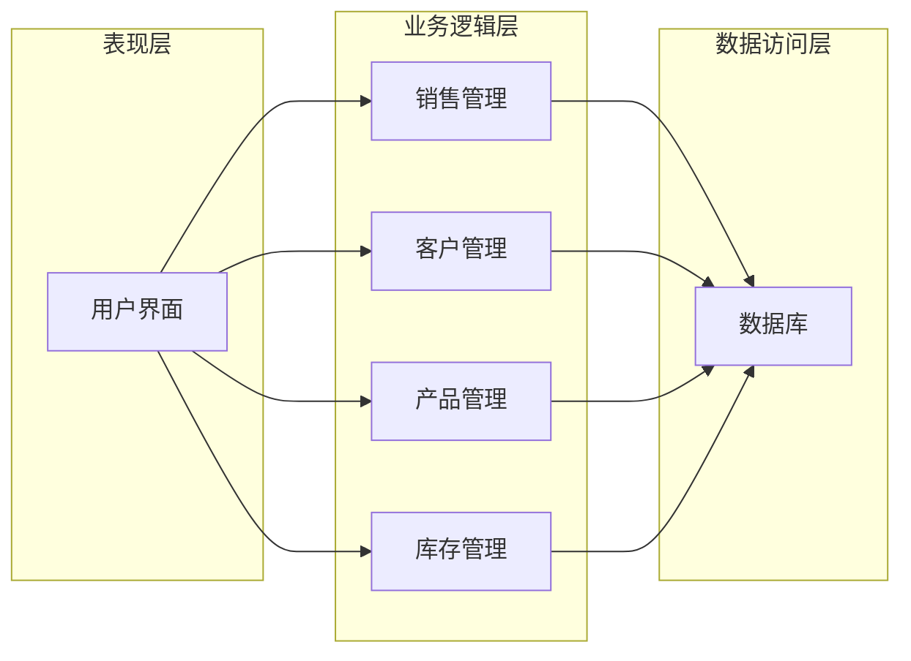

## 1. 背景介绍

### 1.1 建材行业现状与挑战

近年来，随着城镇化进程的加速推进和基础设施建设的持续投入，我国建材行业迎来了快速发展时期。然而，在行业蓬勃发展的同时，也面临着一些挑战：

* **市场竞争激烈:**  建材市场产品种类繁多，供应商众多，竞争异常激烈。
* **信息化程度低:** 许多建材企业仍采用传统的人工管理方式，效率低下，容易出错。
* **库存管理困难:** 建材产品种类多、规格复杂，库存管理难度大，容易造成积压或缺货。
* **客户关系管理薄弱:**  缺乏有效的客户关系管理手段，难以建立长期稳定的客户关系。

### 1.2 建材销售管理系统概述

为了应对上述挑战，提高企业运营效率和市场竞争力，越来越多的建材企业开始采用信息化手段进行管理，其中建材销售管理系统成为企业的核心信息系统之一。

建材销售管理系统旨在通过信息化手段，实现对建材销售全过程的自动化管理，包括：

* **客户管理:**  记录客户信息，跟踪客户需求，建立客户档案，进行客户关系管理。
* **产品管理:**  管理产品信息，包括产品分类、规格、价格、库存等。
* **销售管理:**  记录销售订单，管理发货、收款、退货等流程。
* **库存管理:**  实时监控库存状况，进行库存预警，优化库存结构。
* **数据分析:**  对销售数据进行统计分析，为企业决策提供数据支持。

### 1.3 系统目标

建材销售管理系统的目标是：

* 提高销售效率，缩短销售周期。
* 降低运营成本，提高企业利润。
* 优化库存管理，减少库存积压。
* 提升客户满意度，建立长期稳定的客户关系。

## 2. 核心概念与联系

### 2.1 系统架构

建材销售管理系统采用典型的三层架构：

* **表现层:**  负责用户界面展示，与用户进行交互。
* **业务逻辑层:**  负责处理业务逻辑，实现系统功能。
* **数据访问层:**  负责与数据库进行交互，进行数据存取操作。



### 2.2 核心模块

建材销售管理系统主要包括以下核心模块：

* **客户管理模块:**  管理客户信息，包括客户基本信息、联系方式、购买记录、信用额度等。
* **产品管理模块:**  管理产品信息，包括产品分类、规格、型号、价格、库存等。
* **销售管理模块:**  管理销售订单，包括订单录入、审核、发货、收款、退货等流程。
* **库存管理模块:**  管理库存信息，包括库存入库、出库、盘点、预警等功能。
* **报表分析模块:**  提供各种报表，对销售数据进行统计分析，为企业决策提供数据支持。

### 2.3 模块间联系

各个模块之间相互关联，共同完成建材销售管理系统的功能。例如，销售管理模块需要调用客户管理模块获取客户信息，产品管理模块获取产品信息，库存管理模块更新库存信息等。

## 3. 核心算法原理具体操作步骤

### 3.1 库存管理算法

库存管理是建材销售管理系统的核心功能之一。建材产品种类多、规格复杂，库存管理难度大，需要采用科学的库存管理算法来优化库存结构，减少库存积压。

常用的库存管理算法包括：

* **ABC分类法:**  将库存物品按照其重要性分为A、B、C三类，对不同类别的库存物品采取不同的管理策略。
* **经济订货批量(EOQ):**  计算出最经济的订货批量，以最小化库存成本。
* **再订货点:**  确定何时需要补充库存，以避免缺货。

### 3.2 库存管理操作步骤

以经济订货批量(EOQ)为例，其具体操作步骤如下：

1. **确定年需求量:**  统计过去一年的产品销售量，预测未来一年的需求量。
2. **确定每次订货成本:**  包括运输成本、人工成本等。
3. **确定每件商品的年储存成本:**  包括仓储成本、保险成本等。
4. **计算经济订货批量:** 
   $$EOQ = \sqrt{\frac{2DS}{H}}$$
   其中：
     * D: 年需求量
     * S: 每次订货成本
     * H: 每件商品的年储存成本
5. **确定再订货点:** 
   $$ROP = dL$$
   其中：
     * d: 平均日需求量
     * L: 订货提前期

### 3.3 销售预测算法

销售预测是企业制定销售计划的重要依据。建材销售管理系统可以利用历史销售数据，结合市场趋势，对未来销售情况进行预测。

常用的销售预测算法包括：

* **时间序列分析:**  利用历史销售数据，分析销售趋势，预测未来销售量。
* **回归分析:**  利用历史销售数据，建立回归模型，预测未来销售量。
* **机器学习:**  利用机器学习算法，训练预测模型，预测未来销售量。

## 4. 数学模型和公式详细讲解举例说明

### 4.1 经济订货批量(EOQ)模型

经济订货批量(EOQ)模型是库存管理中常用的模型之一，用于确定最经济的订货批量，以最小化库存成本。

EOQ模型的数学公式如下：

$$EOQ = \sqrt{\frac{2DS}{H}}$$

其中：

* D: 年需求量
* S: 每次订货成本
* H: 每件商品的年储存成本

**举例说明:**

假设某建材企业年需求量为1000件，每次订货成本为50元，每件商品的年储存成本为10元。则该企业的经济订货批量为：

$$EOQ = \sqrt{\frac{2 * 1000 * 50}{10}} = 100 件$$

**模型分析:**

EOQ模型的目的是在订货成本和储存成本之间找到一个平衡点，以最小化总库存成本。当订货量较大时，订货成本较低，但储存成本较高；当订货量较小时，订货成本较高，但储存成本较低。EOQ模型通过计算得出最经济的订货批量，使得总库存成本最小。

### 4.2 再订货点(ROP)模型

再订货点(ROP)模型用于确定何时需要补充库存，以避免缺货。

ROP模型的数学公式如下：

$$ROP = dL$$

其中：

* d: 平均日需求量
* L: 订货提前期

**举例说明:**

假设某建材企业的平均日需求量为10件，订货提前期为7天。则该企业的再订货点为：

$$ROP = 10 * 7 = 70 件$$

**模型分析:**

ROP模型的目的是确保在库存不足时及时补充库存，避免缺货。当库存量低于再订货点时，就需要下达新的订单，以补充库存。

## 5. 项目实践：代码实例和详细解释说明

### 5.1 技术选型

* **编程语言:** Python
* **Web框架:** Django
* **数据库:** MySQL
* **前端框架:** Bootstrap

### 5.2 代码实例

#### 5.2.1 产品模型

```python
from django.db import models

class Product(models.Model):
    name = models.CharField(max_length=100)
    category = models.CharField(max_length=50)
    specification = models.CharField(max_length=100)
    price = models.DecimalField(max_digits=10, decimal_places=2)
    stock = models.IntegerField()

    def __str__(self):
        return self.name
```

#### 5.2.2 销售订单模型

```python
from django.db import models
from .customer import Customer
from .product import Product

class Order(models.Model):
    customer = models.ForeignKey(Customer, on_delete=models.CASCADE)
    products = models.ManyToManyField(Product, through='OrderItem')
    order_date = models.DateTimeField(auto_now_add=True)
    total_price = models.DecimalField(max_digits=10, decimal_places=2)

    def __str__(self):
        return f"Order #{self.id}"
```

#### 5.2.3 库存管理视图

```python
from django.shortcuts import render
from .models import Product

def inventory_management(request):
    products = Product.objects.all()
    context = {'products': products}
    return render(request, 'inventory_management.html', context)
```

### 5.3 代码解释说明

* 产品模型定义了产品的基本信息，包括名称、类别、规格、价格、库存等。
* 销售订单模型定义了销售订单的信息，包括客户、产品、订单日期、总价等。
* 库存管理视图展示了所有产品的库存信息，方便用户查看和管理库存。

## 6. 实际应用场景

建材销售管理系统适用于各种类型的建材企业，包括：

* 建材生产企业
* 建材经销商
* 建材零售商

## 7. 工具和资源推荐

### 7.1 开发工具

* PyCharm: Python集成开发环境
* Visual Studio Code: 代码编辑器
* MySQL Workbench: MySQL数据库管理工具

### 7.2 学习资源

* Django官方文档: https://docs.djangoproject.com/
* Python官方文档: https://docs.python.org/

## 8. 总结：未来发展趋势与挑战

### 8.1 未来发展趋势

* **云计算:**  将建材销售管理系统部署到云端，实现随时随地访问和管理。
* **大数据:**  利用大数据技术，分析销售数据，预测市场趋势，优化库存管理。
* **人工智能:**  利用人工智能技术，实现自动化销售预测、客户服务等功能。

### 8.2 面临的挑战

* **数据安全:**  保障系统数据的安全性和隐私性。
* **系统集成:**  与其他企业信息系统进行集成，实现数据共享和协同工作。
* **用户体验:**  不断提升系统用户体验，提高用户满意度。

## 9. 附录：常见问题与解答

### 9.1 如何添加新产品?

1. 进入产品管理模块。
2. 点击"添加产品"按钮。
3. 填写产品信息，包括名称、类别、规格、价格、库存等。
4. 点击"保存"按钮。

### 9.2 如何查看销售报表?

1. 进入报表分析模块。
2. 选择要查看的报表类型。
3. 设置报表参数，例如时间范围、产品类别等。
4. 点击"生成报表"按钮。