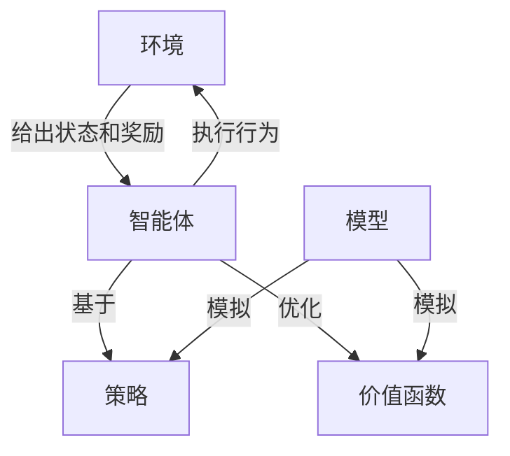

# 强化学习入门：开启智能决策的大门

## 1.背景介绍

### 1.1 什么是强化学习？

强化学习(Reinforcement Learning, RL)是机器学习的一个重要分支,它研究如何基于环境反馈来学习最优决策策略。与监督学习和无监督学习不同,强化学习没有给定的输入-输出样本对,而是通过与环境的互动来学习。

在强化学习中,智能体(Agent)在环境(Environment)中执行一系列行为(Actions),环境会根据这些行为产生新的状态(States),并给出对应的奖励或惩罚(Rewards)。智能体的目标是通过学习,找到一个策略(Policy),使得在给定状态下采取的一系列行为可以最大化预期的长期累积奖励。

### 1.2 强化学习的重要性

强化学习的独特之处在于,它能够解决复杂的序列决策问题,在不确定的环境中学习最优策略,这种能力使其在许多领域都有广泛的应用前景:

- 机器人控制与自动驾驶
- 游戏AI与对抗性AI
- 自然语言处理与对话系统
- 金融投资与资源管理
- 工业控制与智能制造
- 推荐系统与个性化服务

随着人工智能技术的快速发展,强化学习正成为实现通用人工智能(AGI)的关键技术之一。

## 2.核心概念与联系  

### 2.1 强化学习的基本要素

强化学习系统由以下几个核心要素构成:

1. **环境(Environment)**: 智能体所处的外部世界,包括各种状态和奖励机制。

2. **状态(State)**: 描述环境当前的具体情况。

3. **行为(Action)**: 智能体在当前状态下可以采取的行动。

4. **策略(Policy)**: 智能体根据当前状态选择行为的策略或规则。

5. **奖励(Reward)**: 环境对智能体所采取行为的反馈,用于指导智能体优化决策。

6. **价值函数(Value Function)**: 评估某个状态的期望长期累积奖励,作为智能体学习的目标。

7. **模型(Model)**: 描述环境状态转移和奖励的规律,可以用于规划和模拟。

这些要素相互关联,构成了强化学习问题的基本框架,如下图所示:

### 2.2 强化学习的分类

根据是否需要环境的转移模型,以及是否考虑环境的动态变化,强化学习可分为以下几种类型:

1. **模型基强化学习(Model-Based RL)**: 需要事先获得环境的转移模型,可以基于模型进行规划和模拟。

2. **无模型强化学习(Model-Free RL)**: 不需要环境模型,通过与环境直接交互来学习最优策略。

3. **基于值的强化学习(Value-Based RL)**: 直接学习状态或状态-行为对的价值函数。

4. **基于策略的强化学习(Policy-Based RL)**: 直接学习最优策略,而不是价值函数。

5. **在线强化学习(Online RL)**: 针对静态环境,通过与环境持续交互来学习。

6. **离线强化学习(Offline RL)**: 针对动态环境,需要从固定的经验数据集中学习策略。

不同类型的强化学习算法具有不同的适用场景和特点,需要根据具体问题进行选择。

## 3.核心算法原理具体操作步骤

强化学习中有许多经典算法,它们的核心思想虽然不同,但都遵循一个基本框架。我们将介绍其中一些最常用和最具代表性的算法。

### 3.1 动态规划算法

动态规划(Dynamic Programming, DP)是解决强化学习问题的经典方法。它假设已知环境的转移模型,通过反复计算价值函数和策略,直到收敛到最优解。常见的DP算法包括:

1. **价值迭代(Value Iteration)**
2. **策略迭代(Policy Iteration)**

#### 3.1.1 价值迭代算法

价值迭代算法的主要步骤如下:

1. 初始化价值函数 $V(s)$ 为任意值(通常为0)。

2. 对每个状态 $s$,计算新的价值函数:

$$V_{new}(s) = \max_{a} \mathbb{E}\left[R(s, a) + \gamma \sum_{s'}P(s'|s, a)V(s')\right]$$

其中 $R(s, a)$ 是执行行为 $a$ 在状态 $s$ 时获得的即时奖励, $P(s'|s, a)$ 是从状态 $s$ 执行行为 $a$ 转移到状态 $s'$ 的概率, $\gamma$ 是折现因子。

3. 重复步骤2,直到价值函数收敛,得到最优价值函数 $V^*(s)$。

4. 根据最优价值函数得到最优策略:

$$\pi^*(s) = \arg\max_{a} \mathbb{E}\left[R(s, a) + \gamma \sum_{s'}P(s'|s, a)V^*(s')\right]$$

价值迭代算法直接计算最优价值函数,收敛性能取决于折现因子和状态空间大小。

#### 3.1.2 策略迭代算法

策略迭代算法的主要步骤如下:

1. 初始化一个随机策略 $\pi_0$。

2. 对当前策略 $\pi_i$,计算其价值函数 $V^{\pi_i}(s)$:

$$V^{\pi_i}(s) = \mathbb{E}_{\pi_i}\left[\sum_{t=0}^{\infty}\gamma^tR(s_t, a_t) | s_0 = s\right]$$

3. 根据价值函数 $V^{\pi_i}(s)$ 更新策略 $\pi_{i+1}$:

$$\pi_{i+1}(s) = \arg\max_{a} \mathbb{E}\left[R(s, a) + \gamma \sum_{s'}P(s'|s, a)V^{\pi_i}(s')\right]$$

4. 重复步骤2和3,直到策略收敛到最优策略 $\pi^*$。

策略迭代算法先评估当前策略的价值函数,然后基于价值函数改进策略,通常比价值迭代收敛更快。

### 3.2 时临近差分算法

时临近差分(Temporal Difference, TD)算法是无模型强化学习的基础,它可以从环境交互的经验数据中直接学习价值函数或策略,无需事先知道环境模型。常见的TD算法包括:

1. **Q-Learning**
2. **Sarsa**
3. **Actor-Critic**

#### 3.2.1 Q-Learning算法

Q-Learning是最经典的无模型强化学习算法之一,它直接学习状态-行为对的Q值函数,定义为在状态 $s$ 执行行为 $a$ 后的期望累积奖励:

$$Q(s, a) = \mathbb{E}\left[R(s, a) + \gamma \max_{a'} Q(s', a')\right]$$

Q-Learning算法的主要步骤如下:

1. 初始化Q值函数 $Q(s, a)$ 为任意值(通常为0)。

2. 对每个状态-行为对 $(s, a)$,根据经验更新Q值函数:

$$Q(s, a) \leftarrow Q(s, a) + \alpha\left(R(s, a) + \gamma \max_{a'} Q(s', a') - Q(s, a)\right)$$

其中 $\alpha$ 是学习率, $R(s, a)$ 是执行行为 $a$ 在状态 $s$ 时获得的即时奖励, $\gamma$ 是折现因子。

3. 重复步骤2,直到Q值函数收敛。

4. 根据收敛后的Q值函数得到最优策略:

$$\pi^*(s) = \arg\max_{a} Q(s, a)$$

Q-Learning算法的优点是简单、收敛性强,但在连续状态空间和行为空间时可能存在维数灾难问题。

#### 3.2.2 Sarsa算法

Sarsa算法与Q-Learning类似,也是直接学习Q值函数,但更新方式略有不同:

$$Q(s, a) \leftarrow Q(s, a) + \alpha\left[R(s, a) + \gamma Q(s', a') - Q(s, a)\right]$$

其中 $a'$ 是根据当前策略 $\pi$ 在状态 $s'$ 选择的行为。Sarsa算法的名称来自于其更新公式中五个元素的首字母(State, Action, Reward, State', Action')。

相比Q-Learning,Sarsa算法更加注重策略的一致性,更适合在线学习和持续性任务。但它也可能会更容易陷入局部最优解。

#### 3.2.3 Actor-Critic算法

Actor-Critic算法将强化学习分为两个部分:Actor决定动作选择策略,Critic评估状态价值函数。它们通过互相学习和改进来达到最优。

1. **Critic**:学习状态价值函数 $V(s)$,与Q-Learning类似。

2. **Actor**:直接学习策略 $\pi(a|s)$,即在状态 $s$ 下选择行为 $a$ 的概率。

Actor根据Critic提供的价值函数评估来更新策略,Critic则根据Actor的行为来更新价值函数,两者相互促进。

Actor-Critic算法能够处理连续的行为空间,并且具有较好的收敛性和稳定性。但它的训练过程相对复杂,需要同时优化两个网络。

### 3.3 策略梯度算法

策略梯度(Policy Gradient)算法是直接学习策略的方法,通过调整策略参数来最大化期望累积奖励。常见的策略梯度算法包括:

1. **REINFORCE**
2. **PPO (Proximal Policy Optimization)**

#### 3.3.1 REINFORCE算法

REINFORCE算法的核心思想是通过梯度上升来直接优化策略的期望奖励:

$$\nabla_{\theta} J(\theta) = \mathbb{E}_{\pi_\theta}\left[\sum_{t=0}^{\infty}\gamma^t R(s_t, a_t)\nabla_{\theta}\log\pi_\theta(a_t|s_t)\right]$$

其中 $J(\theta)$ 是期望累积奖励, $\theta$ 是策略参数, $\pi_\theta(a|s)$ 是当前策略在状态 $s$ 下选择行为 $a$ 的概率。

REINFORCE算法的主要步骤如下:

1. 收集一批轨迹(Trajectory)数据 $\{(s_0, a_0, r_0), (s_1, a_1, r_1), \dots\}$。

2. 计算每个轨迹的累积奖励 $G_t = \sum_{k=t}^{T}\gamma^{k-t}r_k$。

3. 根据梯度公式更新策略参数:

$$\theta \leftarrow \theta + \alpha\sum_{t=0}^{T}G_t\nabla_{\theta}\log\pi_\theta(a_t|s_t)$$

其中 $\alpha$ 是学习率。

4. 重复步骤1-3,直到策略收敛。

REINFORCE算法简单直接,但存在高方差问题,可以通过基线(Baseline)、reward shaping等技术来缓解。

#### 3.3.2 PPO算法

PPO(Proximal Policy Optimization)算法是一种改进的策略梯度算法,它通过限制新旧策略之间的差异,来实现更稳定和可靠的策略优化。

PPO算法的目标函数为:

$$J^{CLIP}(\theta) = \mathbb{E}_t\left[\min\left(r_t(\theta)\hat{A}_t, \text{clip}(r_t(\theta), 1-\epsilon, 1+\epsilon)\hat{A}_t\right)\right]$$

其中 $r_t(\theta) = \frac{\pi_\theta(a_t|s_t)}{\pi_{\theta_{old}}(a_t|s_t)}$ 是新旧策略的比率, $\hat{A}_t$ 是优势估计(Advantage Estimation), $\epsilon$ 是限制新旧策略差异的超参数。

PPO算法的训练过程与REINFORCE类似,但使用了更复杂的目标函数和优化技术,能够获得更稳定的策略更新和更好的性能。

### 3.4 深度强化学习算法

随着深度学习技术的发展,强化学习也开始与神经网络相结合,形成了深度强化学习(Deep Reinforcement Learning)算法。常