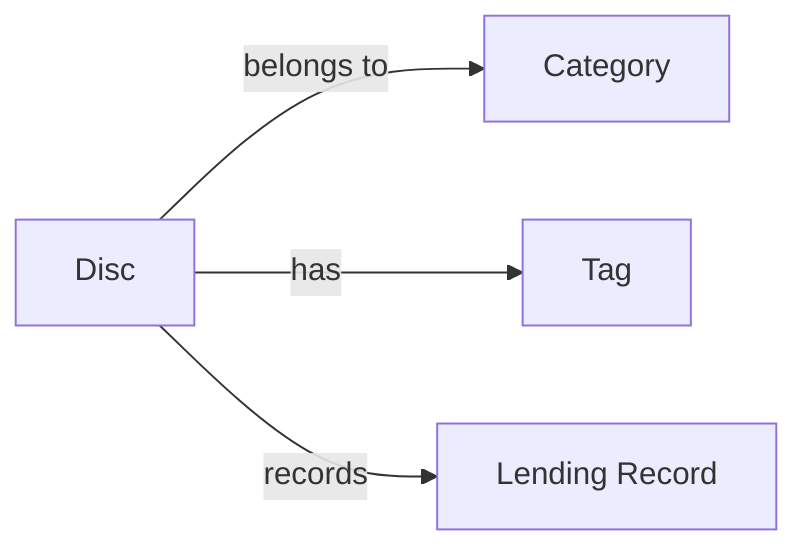
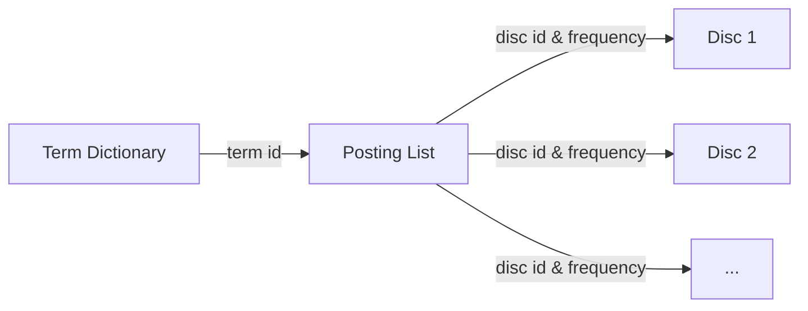

# 影碟管理系统详细设计与具体代码实现

作者：禅与计算机程序设计艺术

## 1. 背景介绍

在当今数字媒体时代,影碟仍然是人们收藏和欣赏电影、音乐等作品的重要载体之一。然而,随着个人影碟收藏量的增加,如何有效地管理和检索这些影碟资源,成为了一个亟待解决的问题。本文将详细介绍一个基于Java语言开发的影碟管理系统,通过对系统的需求分析、架构设计、数据库设计、核心算法以及具体代码实现等方面的阐述,为读者提供一个全面、系统的影碟管理解决方案。

### 1.1 影碟管理面临的挑战
#### 1.1.1 影碟数量庞大,类型多样
#### 1.1.2 检索效率低下
#### 1.1.3 缺乏统一的分类标准

### 1.2 影碟管理系统的价值
#### 1.2.1 提高个人影碟资源的管理效率
#### 1.2.2 方便用户快速检索所需影碟
#### 1.2.3 促进影碟资源的共享和交流

## 2. 核心概念与联系

在设计影碟管理系统之前,我们需要明确几个核心概念及其之间的联系,以便更好地理解系统的运作原理。

### 2.1 影碟(Disc)
影碟是系统管理的基本单位,包含了影片的各种元数据信息,如标题、导演、演员、发行时间、类型等。每个影碟都有一个唯一的编号作为标识。

### 2.2 类别(Category)
类别用于对影碟进行分类,一个影碟可以属于多个类别,而一个类别下也可包含多个影碟。常见的影碟分类有:电影、纪录片、音乐、体育等。

### 2.3 标签(Tag) 
标签是对影碟内容的关键词描述,一个影碟可以有多个标签,通过标签可以方便地检索出与之相关的影碟资源。例如:"科幻"、"悬疑"、"励志"等。

### 2.4 借阅记录(Lending Record)
借阅记录用于追踪影碟的借出和归还情况,包含借阅人、借阅时间、归还时间等信息。通过借阅记录可以了解影碟的使用频率和借阅历史。

以上核心概念之间的联系如下图所示:

## 3. 核心算法原理与具体操作步骤

影碟管理系统的核心功能是检索,即根据用户输入的关键词,快速找出与之相关的影碟资源。本节将重点介绍实现高效影碟检索的核心算法——倒排索引。

### 3.1 倒排索引的基本原理
倒排索引(Inverted Index)是一种常用于信息检索领域的数据结构,其基本思想是:对于每个出现在影碟信息中的关键词,维护一个包含该关键词的影碟列表。当用户输入检索词时,系统只需在索引中查找该词,就可以获取包含该词的所有影碟,从而避免了全表扫描的低效。

### 3.2 构建倒排索引
构建倒排索引的步骤如下:

#### 3.2.1 文本预处理
对影碟的标题、简介等文本信息进行分词、去除停用词、提取词干等预处理操作,得到关键词列表。

#### 3.2.2 建立词典
将所有关键词去重,编号,形成一个词典(Term Dictionary),记录每个关键词的编号(Term ID)。

#### 3.2.3 建立倒排列表  
对于每个影碟,根据其关键词列表,在倒排索引中添加相应的记录,形成倒排列表(Posting List)。倒排列表由若干倒排项(Posting)组成,每个倒排项包含两部分信息:影碟ID和词频(即该词在该影碟中出现的次数)。

倒排索引的结构如下图所示:

### 3.3 检索算法
有了倒排索引,检索的过程就非常简单了。以单词查询为例,检索步骤如下:

1. 对查询词进行预处理(分词、提取词干等),得到词典中的Term ID;
2. 在倒排列表中查找该Term ID对应的倒排项;
3. 根据倒排项中的影碟ID,获取对应的影碟信息。

对于多词组合查询,可以先分别检索每个词,然后对结果取交集或并集。

### 3.4 算法复杂度分析
倒排索引的检索效率非常高。假设词典中有$M$个关键词,共$N$个影碟,平均每个影碟包含$K$个关键词,则单词查询的时间复杂度为$O(K)$,空间复杂度为$O(MK)$。可见,检索的时间代价与影碟总数$N$无关,只与匹配的影碟数$K$有关。当$K \ll N$时,检索效率将远高于全表扫描的$O(N)$。

## 4. 数学模型和公式详细讲解举例说明

在影碟管理系统中,我们可以利用一些简单的数学模型来刻画影碟和用户之间的关系,从而实现智能推荐等个性化服务。本节以协同过滤(Collaborative Filtering)推荐算法为例,介绍其中的数学原理。

### 4.1 用户-影碟评分矩阵
我们可以将用户对影碟的评分数据表示为一个矩阵$R$,其中$R_{ij}$表示用户$i$对影碟$j$的评分。例如:

$$
R=
\begin{bmatrix}
  ? & 3 & 1 & ? & 2 \\
  ? & ? & 2 & 4 & ? \\
  5 & 1 & ? & ? & 3 \\
  ? & ? & ? & 2 & ?
\end{bmatrix}
$$

其中,"?"表示用户未评分的影碟。

### 4.2 基于用户的协同过滤
基于用户的协同过滤(User-based CF)的基本思想是:找到与目标用户口味相似的其他用户,然后根据这些相似用户的评分来预测目标用户对某影碟的评分。

#### 4.2.1 计算用户相似度
首先,我们需要计算用户之间的相似度。常用的相似度度量有欧氏距离、皮尔逊相关系数等。以皮尔逊相关系数为例,用户$i$和用户$j$的相似度为:

$$
w_{ij} = \frac{\sum_{k \in I_{ij}}(R_{ik}-\overline{R}_i)(R_{jk}-\overline{R}_j)}
{\sqrt{\sum_{k \in I_{ij}}(R_{ik}-\overline{R}_i)^2} \sqrt{\sum_{k \in I_{ij}}(R_{jk}-\overline{R}_j)^2}}
$$

其中,$I_{ij}$表示用户$i$和$j$共同评分过的影碟集合,$\overline{R}_i$和$\overline{R}_j$分别表示用户$i$和$j$的评分均值。

#### 4.2.2 预测评分
根据用户相似度,我们可以预测目标用户$i$对影碟$j$的评分:

$$
\hat{R}_{ij} = \overline{R}_i + \frac{\sum_{k \in N_i(j)} w_{ik}(R_{kj}-\overline{R}_k)}
{\sum_{k \in N_i(j)} |w_{ik}|}
$$

其中,$N_i(j)$表示与用户$i$相似度最高的$K$个用户(即$i$的"邻居")中,评分过影碟$j$的用户集合。

### 4.3 算法实例
下面以一个简单的例子来说明该算法的计算过程。

假设有3个用户和4部影片,评分矩阵如下:

$$
R=
\begin{bmatrix}
  4 & ? & 3 & 5 \\
  3 & 4 & ? & 3 \\
  ? & 2 & 4 & ?
\end{bmatrix}
$$

现在我们要预测用户1对影片2的评分。

首先计算用户1和其他用户的相似度:

$$
w_{12}=\frac{(4-4)(3-3.33)+(5-4)(3-3.33)}{\sqrt{(4-4)^2+(5-4)^2} \sqrt{(3-3.33)^2+(3-3.33)^2}} \approx 0.31
$$
$$
w_{13}=\frac{(3-4)(4-3)}{\sqrt{(3-4)^2} \sqrt{(4-3)^2}} = 1
$$

然后计算用户1对