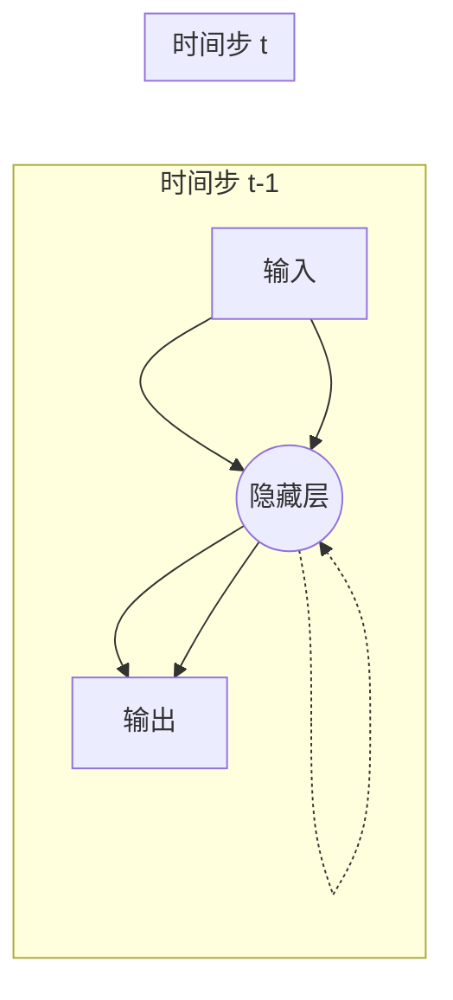

## 1. 背景介绍

### 1.1 人工神经网络与序列数据处理的局限性

人工神经网络（Artificial Neural Networks, ANNs）在各种任务中取得了显著的成功，例如图像识别、自然语言处理和机器翻译。然而，传统的ANNs在处理序列数据时存在局限性，因为它们无法捕捉数据中的时间依赖关系。

传统的ANNs将输入数据视为独立的样本，忽略了数据点之间的时间顺序。例如，在处理文本时，每个单词都被视为一个独立的输入，而忽略了句子中单词的顺序。这使得传统的ANNs难以处理具有时间依赖关系的序列数据，例如语音识别、机器翻译和时间序列预测。

### 1.2 循环神经网络的诞生

为了解决传统ANNs在处理序列数据方面的局限性，循环神经网络（Recurrent Neural Networks, RNNs）应运而生。RNNs是一种特殊类型的神经网络，它能够处理序列数据，因为它在网络中引入了循环连接，允许信息在时间步长之间传递。

RNNs的关键特征是它们能够存储过去的信息，并在处理当前输入时利用这些信息。这种能力使得RNNs能够捕捉数据中的时间依赖关系，使其成为处理序列数据的理想选择。

## 2. 核心概念与联系

### 2.1 RNN的基本结构

RNNs的基本结构包括一个输入层、一个隐藏层和一个输出层。与传统ANNs不同的是，RNNs的隐藏层具有循环连接，允许信息在时间步长之间传递。

下图展示了一个简单的RNN结构：



在每个时间步长，RNN接收一个输入并更新其隐藏状态。隐藏状态是RNN的记忆，它存储了过去的信息。RNN的输出是基于当前输入和隐藏状态的函数。

### 2.2 循环连接与时间依赖关系

RNNs中的循环连接允许信息在时间步长之间传递。这意味着RNN能够存储过去的信息，并在处理当前输入时利用这些信息。这种能力使得RNNs能够捕捉数据中的时间依赖关系。

例如，在处理文本时，RNN可以记住句子中前面的单词，并使用这些信息来理解当前单词的含义。

### 2.3 隐藏状态与记忆

RNNs的隐藏状态是其记忆，它存储了过去的信息。隐藏状态在每个时间步长更新，并用于计算RNN的输出。

隐藏状态的大小决定了RNN能够存储的信息量。更大的隐藏状态允许RNN存储更多信息，但也会增加计算成本。

## 3. 核心算法原理具体操作步骤

### 3.1 前向传播

RNNs的前向传播过程与传统ANNs类似，但包含了循环连接。在每个时间步长，RNN执行以下操作：

1. 接收输入 $x_t$。
2. 使用以下公式计算隐藏状态 $h_t$：

$$
h_t = f(W_h x_t + U_h h_{t-1} + b_h)
$$

其中：

* $W_h$ 是输入到隐藏层的权重矩阵。
* $U_h$ 是隐藏层到隐藏层的权重矩阵。
* $b_h$ 是隐藏层的偏置向量。
* $f$ 是激活函数，例如tanh或ReLU。

3. 使用以下公式计算输出 $y_t$：

$$
y_t = g(W_y h_t + b_y)
$$

其中：

* $W_y$ 是隐藏层到输出层的权重矩阵。
* $b_y$ 是输出层的偏置向量。
* $g$ 是激活函数，例如softmax。

### 3.2 反向传播

RNNs的反向传播过程也与传统ANNs类似，但需要考虑循环连接。反向传播算法用于计算网络中所有权重的梯度，以便更新权重并最小化损失函数。

RNNs的反向传播算法称为**沿时间反向传播（Backpropagation Through Time, BPTT）**。BPTT算法通过将RNN展开成一个深度前馈网络来计算梯度。

### 3.3 梯度消失和梯度爆炸

RNNs在训练过程中可能会遇到梯度消失或梯度爆炸问题。

* **梯度消失**是指梯度在反向传播过程中变得非常小，导致网络难以学习长期依赖关系。
* **梯度爆炸**是指梯度在反向传播过程中变得非常大，导致网络训练不稳定。

解决梯度消失和梯度爆炸问题的方法包括：

* 使用**梯度裁剪**来限制梯度的最大值。
* 使用**长短期记忆（Long Short-Term Memory, LSTM）**或**门控循环单元（Gated Recurrent Unit, GRU）**等更复杂的RNN架构。

## 4. 数学模型和公式详细讲解举例说明

### 4.1 RNN的数学模型

RNNs的数学模型可以表示为以下公式：

$$
h_t = f(W_h x_t + U_h h_{t-1} + b_h)
$$

$$
y_t = g(W_y h_t + b_y)
$$

其中：

* $x_t$ 是时间步长 $t$ 的输入。
* $h_t$ 是时间步长 $t$ 的隐藏状态。
* $y_t$ 是时间步长 $t$ 的输出。
* $W_h$ 是输入到隐藏层的权重矩阵。
* $U_h$ 是隐藏层到隐藏层的权重矩阵。
* $b_h$ 是隐藏层的偏置向量。
* $W_y$ 是隐藏层到输出层的权重矩阵。
* $b_y$ 是输出层的偏置向量。
* $f$ 是隐藏层的激活函数。
* $g$ 是输出层的激活函数。

### 4.2 举例说明

假设我们有一个RNN，它接收一个单词序列作为输入，并预测下一个单词。输入序列是 "The quick brown"，我们希望RNN预测下一个单词 "fox"。

1. **时间步长 1：**

    * 输入： "The"
    * 隐藏状态： $h_0$（初始隐藏状态）
    * 输出： 无

2. **时间步长 2：**

    * 输入： "quick"
    * 隐藏状态： $h_1 = f(W_h "quick" + U_h h_0 + b_h)$
    * 输出： 无

3. **时间步长 3：**

    * 输入： "brown"
    * 隐藏状态： $h_2 = f(W_h "brown" + U_h h_1 + b_h)$
    * 输出： 无

4. **时间步长 4：**

    * 输入： 无
    * 隐藏状态： $h_3 = f(W_h "" + U_h h_2 + b_h)$
    * 输出： $y_4 = g(W_y h_3 + b_y)$

RNN的输出 $y_4$ 应该是一个概率分布，表示下一个单词的可能性。我们希望 "fox" 的概率最高。

## 5. 项目实践：代码实例和详细解释说明

### 5.1 使用Python和TensorFlow构建RNN

以下代码示例展示了如何使用Python和TensorFlow构建一个简单的RNN：

```python
import tensorflow as tf

# 定义RNN模型
model = tf.keras.Sequential([
    tf.keras.layers.SimpleRNN(units=64, activation='tanh', return_sequences=True),
    tf.keras.layers.SimpleRNN(units=64, activation='tanh'),
    tf.keras.layers.Dense(units=10, activation='softmax')
])

# 编译模型
model.compile(optimizer='adam', loss='sparse_categorical_crossentropy', metrics=['accuracy'])

# 训练模型
model.fit(x_train, y_train, epochs=10)

# 评估模型
loss, accuracy = model.evaluate(x_test, y_test)
print('Loss:', loss)
print('Accuracy:', accuracy)
```

**代码解释：**

* `tf.keras.layers.SimpleRNN` 创建一个简单的RNN层。
    * `units` 参数指定隐藏层的大小。
    * `activation` 参数指定激活函数。
    * `return_sequences` 参数指定是否返回所有时间步长的输出。
* `tf.keras.layers.Dense` 创建一个全连接层。
* `model.compile` 编译模型，指定优化器、损失函数和评估指标。
* `model.fit` 训练模型，指定训练数据、epochs数量等参数。
* `model.evaluate` 评估模型，指定测试数据。

### 5.2 RNN的应用场景

RNNs可以用于各种应用场景，例如：

* **自然语言处理：**
    * 文本生成
    * 机器翻译
    * 情感分析
    * 语音识别
* **时间序列预测：**
    * 股票价格预测
    * 天气预报
    * 交通流量预测
* **其他：**
    * 视频分析
    * 音乐生成

## 6. 工具和资源推荐

### 6.1 深度学习框架

* TensorFlow
* PyTorch
* Keras

### 6.2 在线课程和教程

* Coursera: Deep Learning Specialization
* Udacity: Deep Learning Nanodegree
* fast.ai: Practical Deep Learning for Coders

### 6.3 书籍

* Deep Learning (Ian Goodfellow, Yoshua Bengio, Aaron Courville)
* Hands-On Machine Learning with Scikit-Learn, Keras & TensorFlow (Aurélien Géron)

## 7. 总结：未来发展趋势与挑战

### 7.1 RNNs的未来发展趋势

* **更复杂的RNN架构：** 研究人员正在开发更复杂的RNN架构，例如LSTM、GRU和Transformer，以提高RNNs的性能和效率。
* **更有效的训练算法：** 研究人员正在开发更有效的训练算法，例如AdamW和LAMB，以加快RNNs的训练速度并提高其性能。
* **更广泛的应用场景：** RNNs正在应用于越来越多的领域，例如医疗保健、金融和制造业。

### 7.2 RNNs面临的挑战

* **计算成本：** RNNs的计算成本很高，尤其是在处理长序列数据时。
* **梯度消失和梯度爆炸：** RNNs在训练过程中可能会遇到梯度消失或梯度爆炸问题。
* **可解释性：** RNNs的决策过程难以解释，这使得调试和改进模型变得困难。

## 8. 附录：常见问题与解答

### 8.1 什么是RNNs中的循环连接？

RNNs中的循环连接允许信息在时间步长之间传递。这意味着RNN能够存储过去的信息，并在处理当前输入时利用这些信息。这种能力使得RNNs能够捕捉数据中的时间依赖关系。

### 8.2 RNNs和传统ANNs有什么区别？

RNNs和传统ANNs的主要区别在于RNNs具有循环连接，允许信息在时间步长之间传递。这使得RNNs能够处理序列数据，而传统ANNs则不能。

### 8.3 RNNs的应用场景有哪些？

RNNs可以用于各种应用场景，例如自然语言处理、时间序列预测和视频分析。

### 8.4 RNNs面临哪些挑战？

RNNs面临的挑战包括计算成本、梯度消失和梯度爆炸以及可解释性。
