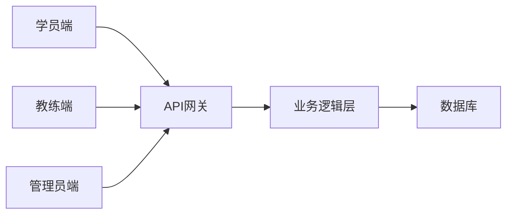

## 微信小程序乐学车驾校预约练车系统

## 1. 背景介绍

### 1.1 驾培行业现状与痛点

随着社会经济的快速发展和人民生活水平的不断提高，汽车保有量持续增长，驾驶培训行业也迎来了蓬勃发展。然而，传统的驾校预约练车模式存在诸多痛点：

* **信息不透明:** 学员难以获取教练、车辆、场地等信息，预约过程繁琐。
* **效率低下:**  电话预约、人工排班效率低下，学员等待时间长，体验差。
* **缺乏灵活性:**  传统预约方式缺乏灵活性，学员难以根据自身时间安排进行调整。

### 1.2 微信小程序的优势

微信小程序作为一种轻量级应用，具有以下优势：

* **无需下载安装:**  用户无需下载安装，即开即用，方便快捷。
* **用户基数庞大:**  微信拥有庞大的用户群体，小程序可以触达更多潜在用户。
* **开发成本低:**  小程序开发成本相对较低，开发周期短，迭代速度快。
* **功能丰富:**  小程序支持多种功能，可以满足驾校预约练车系统的需求。

### 1.3 乐学车驾校预约练车系统

为了解决传统驾校预约练车模式的痛点，提高学员学习效率和体验，我们开发了基于微信小程序的“乐学车驾校预约练车系统”。该系统旨在为学员提供便捷、高效、灵活的预约练车服务。

## 2. 核心概念与联系

### 2.1 用户角色

* **学员:**  报名参加驾校培训的用户。
* **教练:**  负责指导学员学习驾驶技能的专业人员。
* **管理员:**  负责系统管理和维护的人员。

### 2.2 功能模块

* **学员端:**
    * 注册登录
    * 查看教练信息
    * 查看车辆信息
    * 预约练车
    * 取消预约
    * 查看预约记录
    * 在线支付
    * 评价教练
* **教练端:**
    * 发布可预约时间段
    * 查看预约列表
    * 确认预约
    * 取消预约
    * 查看学员评价
* **管理员端:**
    * 用户管理
    * 教练管理
    * 车辆管理
    * 场地管理
    * 订单管理
    * 数据统计

### 2.3 系统架构



## 3. 核心算法原理具体操作步骤

### 3.1 预约算法

#### 3.1.1 时间片划分

系统将每天的时间划分为多个时间片，例如：上午8:00-9:00、上午9:00-10:00等。

#### 3.1.2 可预约时间段

教练可以根据自身时间安排发布可预约时间段，例如：周一下午2:00-4:00、周二上午9:00-11:00等。

#### 3.1.3 预约匹配

当学员选择预约时间段时，系统会根据以下规则进行匹配：

* **时间匹配:**  学员选择的预约时间段必须在教练的可预约时间段内。
* **车辆匹配:**  系统会根据学员选择的车型匹配相应的车辆。
* **教练匹配:**  系统会优先匹配评价较高的教练。

### 3.2 排班算法

#### 3.2.1 教练排班

系统会根据教练的可预约时间段和预约情况自动生成教练排班表。

#### 3.2.2 车辆排班

系统会根据车辆的可用时间和预约情况自动生成车辆排班表。

### 3.3 支付算法

#### 3.3.1 在线支付

系统支持微信支付、支付宝支付等在线支付方式。

#### 3.3.2 支付流程

* 学员选择预约时间段后，系统会生成订单。
* 学员选择支付方式并完成支付。
* 系统确认支付成功后，预约成功。

## 4. 数学模型和公式详细讲解举例说明

### 4.1 预约成功率模型

$$
预约成功率 = \frac{成功预约次数}{总预约次数}
$$

**举例说明:**

假设某驾校共有100名学员，某天共有50名学员预约练车，其中40名学员预约成功，则该驾校的预约成功率为：

$$
预约成功率 = \frac{40}{50} = 80\%
$$

### 4.2 教练评分模型

$$
教练评分 = \frac{好评数}{总评价数} \times 5
$$

**举例说明:**

假设某教练收到10条评价，其中8条好评，2条差评，则该教练的评分为：

$$
教练评分 = \frac{8}{10} \times 5 = 4
$$

## 5. 项目实践：代码实例和详细解释说明

### 5.1 微信小程序端

#### 5.1.1 预约练车页面

```javascript
// 获取教练列表
wx.request({
  url: 'https://api.lexueche.com/coaches',
  success: (res) => {
    this.setData({
      coaches: res.data
    })
  }
})

// 预约练车
onBookTap: function(event) {
  const coachId = event.currentTarget.dataset.coachId
  const startTime = this.data.startTime
  const endTime = this.data.endTime

  wx.request({
    url: 'https://api.lexueche.com/bookings',
    method: 'POST',
     {
      coachId: coachId,
      startTime: startTime,
      endTime: endTime
    },
    success: (res) => {
      wx.showToast({
        title: '预约成功',
        icon: 'success'
      })
    }
  })
}
```

#### 5.1.2 教练评价页面

```javascript
// 提交评价
onSubmitTap: function(event) {
  const coachId = this.data.coachId
  const rating = this.data.rating
  const comment = this.data.comment

  wx.request({
    url: 'https://api.lexueche.com/ratings',
    method: 'POST',
     {
      coachId: coachId,
      rating: rating,
      comment: comment
    },
    success: (res) => {
      wx.showToast({
        title: '评价成功',
        icon: 'success'
      })
    }
  })
}
```

### 5.2 后端API

#### 5.2.1 预约接口

```python
@app.route('/bookings', methods=['POST'])
def create_booking():
  coach_id = request.form.get('coachId')
  start_time = request.form.get('startTime')
  end_time = request.form.get('endTime')

  # 校验参数
  # ...

  # 创建预约记录
  booking = Booking(
    coach_id=coach_id,
    start_time=start_time,
    end_time=end_time
  )
  db.session.add(booking)
  db.session.commit()

  return jsonify({'message': '预约成功'})
```

#### 5.2.2 评价接口

```python
@app.route('/ratings', methods=['POST'])
def create_rating():
  coach_id = request.form.get('coachId')
  rating = request.form.get('rating')
  comment = request.form.get('comment')

  # 校验参数
  # ...

  # 创建评价记录
  rating = Rating(
    coach_id=coach_id,
    rating=rating,
    comment=comment
  )
  db.session.add(rating)
  db.session.commit()

  return jsonify({'message': '评价成功'})
```

## 6. 实际应用场景

### 6.1 驾校推广

驾校可以通过乐学车小程序进行招生宣传，吸引更多学员报名。

### 6.2 学员预约

学员可以通过乐学车小程序便捷地预约练车时间，提高学习效率。

### 6.3 教练管理

教练可以通过乐学车小程序管理自己的预约时间，提高工作效率。

### 6.4 数据分析

驾校可以通过乐学车小程序收集学员数据，进行数据分析，优化运营策略。

## 7. 工具和资源推荐

### 7.1 微信小程序开发工具

* 微信开发者工具：https://developers.weixin.qq.com/miniprogram/dev/devtools/download.html

### 7.2 后端开发框架

* Flask：https://flask.palletsprojects.com/
* Django：https://www.djangoproject.com/

### 7.3 数据库

* MySQL：https://www.mysql.com/
* MongoDB：https://www.mongodb.com/

### 7.4 云服务

* 阿里云：https://www.aliyun.com/
* 腾讯云：https://cloud.tencent.com/

## 8. 总结：未来发展趋势与挑战

### 8.1 未来发展趋势

* **个性化推荐:**  根据学员的学习进度和偏好，推荐合适的教练和课程。
* **人工智能辅助教学:**  利用人工智能技术辅助教练进行教学，提高教学质量。
* **虚拟现实模拟驾驶:**  利用虚拟现实技术模拟驾驶场景，提高学员的驾驶技能。

### 8.2 面临的挑战

* **数据安全:**  保障学员和教练的个人信息安全。
* **系统稳定性:**  保证系统的稳定运行，避免出现故障。
* **用户体验:**  不断优化用户体验，提高用户满意度。

## 9. 附录：常见问题与解答

### 9.1 如何注册乐学车小程序？

打开微信，搜索“乐学车”，进入小程序，点击“注册”按钮，按照提示填写信息即可完成注册。

### 9.2 如何预约练车？

登录乐学车小程序，选择教练和预约时间段，点击“预约”按钮即可完成预约。

### 9.3 如何取消预约？

登录乐学车小程序，进入“我的预约”页面，选择要取消的预约，点击“取消预约”按钮即可。

### 9.4 如何评价教练？

登录乐学车小程序，进入“我的评价”页面，选择要评价的教练，填写评价内容并提交即可。
