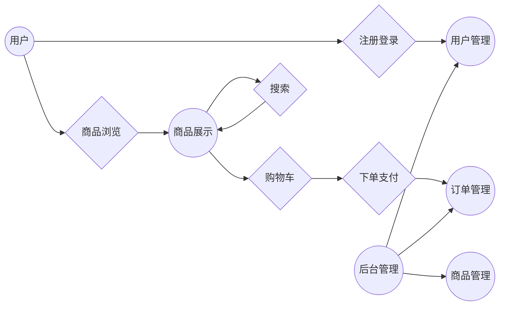

## 1. 背景介绍

### 1.1 电商行业的蓬勃发展与手机销售的兴起

近年来，随着互联网技术的快速发展和普及，电子商务行业蓬勃发展，各种类型的电商平台如雨后春笋般涌现。其中，手机销售作为电商行业的重要组成部分，市场规模不断扩大，竞争日益激烈。

### 1.2  手机销售网站的功能需求

为了在竞争激烈的手机销售市场中脱颖而出，手机销售网站需要具备以下功能：

* **商品展示:**  清晰、美观地展示手机商品信息，包括图片、价格、参数等。
* **搜索功能:**  提供快速、准确的商品搜索功能，方便用户查找所需商品。
* **购物车:**  允许用户将选购的商品添加到购物车，并支持修改数量、删除商品等操作。
* **订单管理:**  提供用户下单、支付、查看订单状态、取消订单等功能。
* **用户管理:**  支持用户注册、登录、修改个人信息等操作。
* **后台管理:**  提供商品管理、订单管理、用户管理等后台管理功能。

### 1.3 本文目标

本文将详细介绍如何设计和实现一个功能完善的手机销售网站，包括数据库设计、前端页面设计、后端代码实现等方面，并提供完整的代码示例。

## 2. 核心概念与联系

### 2.1 系统架构设计

本项目采用经典的三层架构设计，即表现层、业务逻辑层和数据访问层。

* **表现层:** 负责用户界面展示和用户交互，使用 HTML、CSS、JavaScript 等技术实现。
* **业务逻辑层:** 负责处理业务逻辑，例如用户注册、登录、商品浏览、下单等，使用 Java、Python 等编程语言实现。
* **数据访问层:** 负责与数据库交互，进行数据读取和写入操作，使用 JDBC、ORM 等技术实现。

### 2.2 数据库设计

数据库设计是整个系统设计的基础，合理的数据库设计可以提高系统性能和数据一致性。本项目使用 MySQL 数据库，数据库设计如下：

```sql
-- 用户表
CREATE TABLE user (
  id INT PRIMARY KEY AUTO_INCREMENT,
  username VARCHAR(255) NOT NULL UNIQUE,
  password VARCHAR(255) NOT NULL,
  email VARCHAR(255) NOT NULL UNIQUE,
  phone VARCHAR(20),
  address VARCHAR(255)
);

-- 商品表
CREATE TABLE product (
  id INT PRIMARY KEY AUTO_INCREMENT,
  name VARCHAR(255) NOT NULL,
  description TEXT,
  price DECIMAL(10, 2) NOT NULL,
  stock INT NOT NULL,
  image VARCHAR(255)
);

-- 订单表
CREATE TABLE order_info (
  id INT PRIMARY KEY AUTO_INCREMENT,
  user_id INT NOT NULL,
  order_time DATETIME NOT NULL,
  total_price DECIMAL(10, 2) NOT NULL,
  status VARCHAR(20) NOT NULL
);

-- 订单明细表
CREATE TABLE order_item (
  id INT PRIMARY KEY AUTO_INCREMENT,
  order_id INT NOT NULL,
  product_id INT NOT NULL,
  quantity INT NOT NULL,
  price DECIMAL(10, 2) NOT NULL
);
```

### 2.3  核心模块之间的联系

以下是系统核心模块之间的联系图:



## 3. 核心算法原理具体操作步骤

### 3.1 用户注册与登录

**注册流程：**

1. 用户填写注册信息，包括用户名、密码、邮箱等。
2. 系统验证用户信息是否合法，例如用户名是否已存在、密码是否符合安全要求等。
3. 如果用户信息合法，则将用户信息保存到数据库中，并发送激活邮件到用户邮箱。
4. 用户点击邮件中的激活链接，激活账号。

**登录流程：**

1. 用户输入用户名和密码。
2. 系统验证用户名和密码是否匹配。
3. 如果匹配，则将用户信息保存到 session 中，并跳转到首页。

### 3.2 商品展示与搜索

**商品展示：**

1. 系统从数据库中读取商品信息。
2. 根据商品分类、品牌等条件筛选商品。
3. 对商品进行分页展示。
4. 用户可以点击商品图片或名称查看商品详情。

**商品搜索：**

1. 用户输入关键词进行搜索。
2. 系统根据关键词匹配商品名称、描述等信息。
3. 对搜索结果进行排序和分页展示。

### 3.3 购物车与下单

**购物车：**

1. 用户点击“加入购物车”按钮将商品添加到购物车。
2. 系统将商品信息保存到 session 中。
3. 用户可以修改购物车中商品的数量或删除商品。

**下单：**

1. 用户确认购物车中的商品信息。
2. 选择收货地址、支付方式等信息。
3. 生成订单并保存到数据库中。
4. 系统调用支付接口完成支付操作。

## 4. 数学模型和公式详细讲解举例说明

本项目不涉及复杂的数学模型和公式，但以下是一些常用的数学概念和公式：

* **分页算法:**  将大量数据分成多个页面进行展示，常用的分页算法有简单分页、偏移分页等。
* **价格计算:**  根据商品单价和数量计算总价，公式为：总价 = 单价 * 数量。
* **折扣计算:**  根据折扣比例计算折扣后的价格，公式为：折扣后价格 = 原价 * (1 - 折扣比例)。

## 5. 项目实践：代码实例和详细解释说明

### 5.1  技术选型

* **前端:** HTML、CSS、JavaScript、jQuery、Bootstrap
* **后端:** Java、Spring Boot、MyBatis
* **数据库:** MySQL
* **开发工具:** IntelliJ IDEA

### 5.2 代码示例

**用户注册控制器:**

```java
@RestController
@RequestMapping("/users")
public class UserController {

    @Autowired
    private UserService userService;

    @PostMapping("/register")
    public Result register(@RequestBody User user) {
        // 验证用户信息
        // ...

        // 保存用户信息到数据库
        userService.save(user);

        // 发送激活邮件
        // ...

        return Result.success("注册成功，请前往邮箱激活账号");
    }
}
```

**商品展示页面:**

```html
<!DOCTYPE html>
<html lang="en">
<head>
    <meta charset="UTF-8">
    <title>商品列表</title>
    <link rel="stylesheet" href="https://cdn.jsdelivr.net/npm/bootstrap@4.6.2/dist/css/bootstrap.min.css">
</head>
<body>
    <div class="container">
        <h1>商品列表</h1>
        <div class="row">
            <div class="col-md-3" th:each="product : ${products}">
                <div class="card">
                    
                    <div class="card-body">
                        <h5 class="card-title" th:text="${product.name}"></h5>
                        <p class="card-text" th:text="${product.description}"></p>
                        <p class="card-text">价格：<span th:text="${product.price}"></span>元</p>
                        <a href="#" class="btn btn-primary">加入购物车</a>
                    </div>
                </div>
            </div>
        </div>
    </div>
</body>
</html>
```

## 6. 实际应用场景

手机销售网站可以应用于以下场景：

* **手机品牌官网:**  用于展示和销售手机品牌的产品。
* **电商平台:**  作为电商平台的手机销售频道。
* **手机零售商:**  用于线上销售手机产品。

## 7. 总结：未来发展趋势与挑战

### 7.1 未来发展趋势

* **移动化:**  随着移动互联网的普及，手机销售网站需要更加注重移动端的用户体验。
* **个性化推荐:**  利用大数据和人工智能技术，为用户提供个性化的商品推荐。
* **虚拟现实/增强现实:**  利用 VR/AR 技术，为用户提供更加沉浸式的购物体验。

### 7.2  挑战

* **竞争激烈:**  手机销售市场竞争激烈，需要不断提升用户体验和服务质量。
* **技术更新快:**  互联网技术更新迭代迅速，需要不断学习和掌握新技术。
* **安全问题:**  电商平台存在安全风险，需要加强安全防护措施。

## 8. 附录：常见问题与解答

### 8.1 如何提高网站访问速度？

* 使用缓存技术，例如 CDN、浏览器缓存等。
* 优化数据库查询效率，例如使用索引、优化 SQL 语句等。
* 压缩网页资源，例如图片、JavaScript、CSS 等。

### 8.2 如何保证用户信息安全？

* 使用 HTTPS 协议加密传输数据。
* 对用户密码进行加密存储。
* 定期进行安全漏洞扫描和修复。