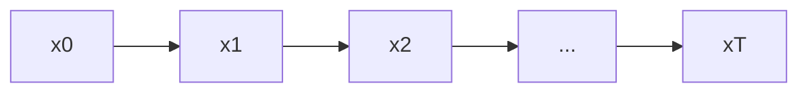

# 扩散模型的训练技巧与超参数调优指南

## 1.背景介绍

### 1.1 什么是扩散模型?

扩散模型(Diffusion Models)是一种新兴的生成式深度学习模型,近年来在计算机视觉、自然语言处理等领域取得了突破性进展。它通过学习从噪声数据到真实数据的逆向转换过程,实现了对复杂数据分布的高质量生成。

扩散模型的核心思想是将数据生成过程建模为一个逐步添加高斯噪声的前向扩散(diffusion)过程,然后学习一个逆向过程(reverse process)将噪声数据转换回原始数据。这种思路与变分自编码器(VAE)和生成对抗网络(GAN)等传统生成模型不同,扩散模型不需要直接对数据分布建模,而是通过学习逆向过程,从噪声中恢复数据。

### 1.2 扩散模型的应用领域

由于扩散模型能够生成高质量、多样化的数据样本,因此在以下领域具有广泛的应用前景:

- 计算机视觉:生成逼真图像、图像超分辨率、图像修复等
- 自然语言处理:文本生成、机器翻译、对话系统等
- 音频处理:音乐生成、语音合成等
- 科学计算:分子结构生成、蛋白质结构预测等

扩散模型提供了一种全新的生成模型范式,打开了人工智能生成能力的新大门。

## 2.核心概念与联系

### 2.1 扩散过程(Forward Diffusion Process)

扩散过程是指将原始数据 $x_0$ 逐步添加高斯噪声,最终转化为纯噪声数据 $x_T$ 的过程。具体来说,扩散过程由 $T$ 个时间步组成,在每个时间步 $t$,会将前一步的数据 $x_{t-1}$ 与一个高斯噪声 $\epsilon_t \sim \mathcal{N}(0, \beta_t)$ 进行融合,生成新的数据 $x_t$:

$$x_t = \sqrt{1-\beta_t} x_{t-1} + \sqrt{\beta_t} \epsilon_t$$

其中 $\beta_t$ 是一个扩散系数,控制了每一步添加噪声的强度。当 $t=0$ 时,我们有 $x_0 = x$ 为原始数据;当 $t=T$ 时,我们得到的 $x_T$ 是一个服从标准高斯分布的纯噪声数据。

扩散过程可以用一个马尔可夫链来表示:



### 2.2 逆向过程(Reverse Process)

逆向过程的目标是从纯噪声数据 $x_T$ 生成原始数据 $x_0$。这个过程可以通过学习一个条件概率模型 $p_\theta(x_{t-1}|x_t)$ 来实现,该模型预测给定 $x_t$ 时,前一步 $x_{t-1}$ 的条件分布。

根据贝叶斯公式,我们有:

$$p_\theta(x_{0:T}) = p(x_T) \prod_{t=1}^T p_\theta(x_{t-1}|x_t)$$

其中 $p(x_T)$ 是已知的标准高斯分布。我们可以通过最大化上式的对数似然,训练模型参数 $\theta$。

为了提高生成质量和效率,实践中常采用扩散模型的改进版本,如DDPM、DDIM等,它们对原始扩散模型进行了改进和优化。

### 2.3 扩散模型与其他生成模型的联系

扩散模型与其他经典生成模型有着密切的联系:

- 与变分自编码器(VAE)相比,扩散模型不需要显式建模数据分布,而是学习从噪声到数据的映射。
- 与生成对抗网络(GAN)相比,扩散模型是一种无监督的生成模型,不需要对抗训练,更加稳定。
- 与自回归模型(如PixelCNN、Transformer)相比,扩散模型可以高效并行生成数据,不需要逐像素生成。
- 扩散模型与Score Matching等基于能量的模型有着理论联系,可被视为一种基于梯度的能量模型。

总的来说,扩散模型提供了一种全新的生成模型范式,结合了其他模型的优点,在生成质量和效率上都有出色的表现。

## 3.核心算法原理具体操作步骤 

### 3.1 扩散过程(Forward Process)

扩散过程的目标是将原始数据 $x_0$ 逐步扩散为噪声数据 $x_T$,具体步骤如下:

1. 初始化 $x_0 = x$,其中 $x$ 为原始数据样本。
2. 对于时间步 $t=1,2,...,T$:
    - 从高斯分布 $\mathcal{N}(0, \beta_t)$ 中采样噪声 $\epsilon_t$。
    - 更新数据: $x_t = \sqrt{1-\beta_t} x_{t-1} + \sqrt{\beta_t} \epsilon_t$。
3. 最终得到 $x_T$,即服从标准高斯分布的纯噪声数据。

其中,扩散系数 $\beta_t$ 控制了每一步添加噪声的强度。一个常用的选择是线性扩散系数:

$$\beta_t = \frac{1}{T} \cdot \bar{\beta}$$

其中 $\bar{\beta}$ 是一个超参数,控制了整个扩散过程的噪声强度。较大的 $\bar{\beta}$ 会导致 $x_T$ 更接近纯噪声,但也意味着逆向过程更加困难。

### 3.2 逆向过程(Reverse Process)

逆向过程的目标是从噪声数据 $x_T$ 生成原始数据 $x_0$,这是通过学习一个条件概率模型 $p_\theta(x_{t-1}|x_t)$ 来实现的。具体步骤如下:

1. 初始化 $x_T$ 为一个从标准高斯分布采样的纯噪声数据。
2. 对于时间步 $t=T, T-1, ..., 1$:
    - 使用神经网络模型 $p_\theta(x_{t-1}|x_t)$ 预测 $x_{t-1}$ 的均值和方差。
    - 从预测的分布中采样 $x_{t-1}$。
3. 最终得到 $x_0$,即生成的数据样本。

为了训练神经网络模型 $p_\theta(x_{t-1}|x_t)$,我们可以最大化扩散过程和逆向过程的联合对数似然:

$$\mathbb{E}_{x_0, \epsilon} \Big[ \log p_\theta(x_0|x_1) + \sum_{t=2}^T \log p_\theta(x_{t-1}|x_t, x_0) \Big]$$

其中 $p_\theta(x_{t-1}|x_t, x_0)$ 是一个条件高斯分布,其均值和方差由神经网络预测。

在实践中,通常会对上述基本算法进行一些改进和优化,如采用不同的扩散方程、参数化方法、采样策略等,以提高生成质量和效率。

## 4.数学模型和公式详细讲解举例说明

### 4.1 扩散过程的数学模型

扩散过程可以用一个线性高斯马尔可夫链来建模,其状态转移方程为:

$$q(x_{t}|x_{t-1}) = \mathcal{N}(x_t; \sqrt{1-\beta_t} x_{t-1}, \beta_t\mathbf{I})$$

其中 $\beta_t$ 是扩散系数,控制了每一步添加噪声的强度。$\mathbf{I}$ 是单位矩阵。

整个扩散过程的联合分布可以写为:

$$q(x_{1:T}|x_0) = \prod_{t=1}^T q(x_t|x_{t-1})$$

根据马尔可夫链的性质,我们可以得到 $x_T$ 的边缘分布:

$$q(x_T|x_0) = \mathcal{N}(x_T; \sqrt{\bar{\alpha}_T} x_0, (1-\bar{\alpha}_T)\mathbf{I})$$

其中 $\bar{\alpha}_t = \prod_{s=1}^t (1-\beta_s)$ 是一个与扩散系数相关的量。

当 $T \rightarrow \infty$ 时,不论 $x_0$ 是什么值,最终 $x_T$ 都会收敛到标准高斯分布 $\mathcal{N}(0, \mathbf{I})$。这说明扩散过程最终会将任何数据转化为纯噪声。

### 4.2 逆向过程的数学模型

逆向过程的目标是从 $x_T$ 生成 $x_0$,这可以通过学习一个条件概率模型 $p_\theta(x_{t-1}|x_t)$ 来实现。根据贝叶斯公式,我们有:

$$p_\theta(x_{0:T}) = p(x_T) \prod_{t=1}^T p_\theta(x_{t-1}|x_t)$$

其中 $p(x_T)$ 是已知的标准高斯分布。

为了最大化上式的对数似然,我们可以将其重写为:

$$\log p_\theta(x_0) = \mathbb{E}_{q(x_{1:T}|x_0)} \Big[ \log \frac{p_\theta(x_{0:T})}{q(x_{1:T}|x_0)} \Big]$$

根据重要性采样的思想,我们可以使用 $q(x_{1:T}|x_0)$ 来近似期望,从而得到下面的损失函数:

$$\mathcal{L}(\theta) = \mathbb{E}_{x_0, \epsilon} \Big[ -\log \frac{p_\theta(x_{0:T})}{q(x_{1:T}|x_0)} \Big]$$

其中 $\epsilon$ 是扩散过程中引入的噪声序列。

通过最小化上述损失函数,我们可以训练模型参数 $\theta$,使得 $p_\theta(x_{t-1}|x_t)$ 能够恰当地预测每一步的逆向转换。

在实践中,通常会对上述基本模型进行一些改进和优化,如采用不同的参数化方法、损失函数等,以提高生成质量和效率。

### 4.3 示例:DDPM模型

DDPM(Denoising Diffusion Probabilistic Models)是一种广为人知的扩散模型,其逆向过程的条件概率模型为:

$$p_\theta(x_{t-1}|x_t) = \mathcal{N}(x_{t-1}; \mu_\theta(x_t, t), \sigma_t^2\mathbf{I})$$

其中 $\mu_\theta(x_t, t)$ 是一个神经网络,用于预测 $x_{t-1}$ 的均值;$\sigma_t$ 是已知的方差。

DDPM模型的损失函数为:

$$\mathcal{L}(\theta) = \mathbb{E}_{x_0, \epsilon} \Big[ \|\ \epsilon - \epsilon_\theta(x_t, t)\ \|^2 \Big]$$

其中 $\epsilon_\theta(x_t, t) = \frac{1}{\sqrt{1-\bar{\alpha}_t}} \big( x_t - \sqrt{1-\bar{\alpha}_t} \mu_\theta(x_t, t) \big)$ 是一个重参数化的噪声预测项。

通过最小化上述损失函数,我们可以训练神经网络 $\mu_\theta(x_t, t)$,使其能够从噪声数据 $x_t$ 预测出原始数据 $x_{t-1}$ 的均值。

DDPM模型在图像生成任务上取得了非常优秀的表现,生成的图像质量高、多样性好。它的思路也被广泛应用于其他领域的扩散模型中。

## 5.项目实践:代码实例和详细解释说明

在这一节,我们将通过一个实际的代码示例,演示如何使用PyTorch实现一个简单的扩散模型,用于手写数字图像的生成。

### 5.1 导入所需的库

```python
import torch
import torch.nn as nn
import torchvision
import matplotlib.pyplot as plt
```

### 5.2 定义扩散过程

我们先定义扩散过程,包括线性扩散系数和高斯噪声采样:

```python
def linear_beta_schedule(timesteps, start=1e-4, end=2e-2):
    return torch.lin