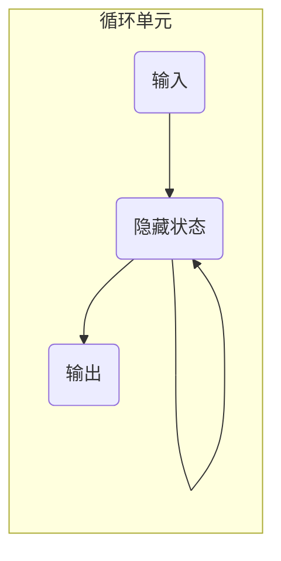
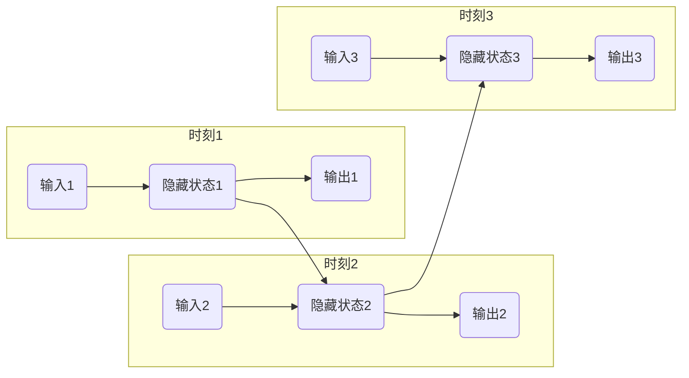

## 1. 背景介绍

### 1.1 RNN与序列数据处理

循环神经网络（RNN）是一种专门用于处理序列数据的深度学习模型，在自然语言处理、语音识别、时间序列分析等领域取得了巨大成功。与传统的前馈神经网络不同，RNN具有循环结构，能够捕捉序列数据中的时间依赖关系，从而更好地理解和预测序列数据的未来趋势。

### 1.2 梯度下降与反向传播

深度学习模型的训练通常采用梯度下降算法，通过不断调整模型参数来最小化损失函数。反向传播算法是梯度下降算法的核心，用于计算损失函数对模型参数的梯度。

### 1.3 BPTT算法的诞生

对于RNN来说，由于其循环结构，传统的反向传播算法无法直接应用。为了解决这个问题，BPTT（Backpropagation Through Time）算法应运而生，它将RNN展开成一个深层的前馈神经网络，然后应用标准的反向传播算法计算梯度。

## 2. 核心概念与联系

### 2.1 RNN的结构

RNN的基本单元是循环单元，它包含一个隐藏状态（hidden state）和一个输出（output）。隐藏状态存储了序列数据历史信息，输出则表示当前时刻的预测结果。循环单元的结构如下图所示：



### 2.2 前向传播

在RNN的前向传播过程中，每个时刻的输入都会与上一时刻的隐藏状态一起输入到循环单元，计算当前时刻的隐藏状态和输出。

### 2.3 反向传播

BPTT算法将RNN展开成一个深层的前馈神经网络，然后应用标准的反向传播算法计算梯度。

## 3. 核心算法原理具体操作步骤

### 3.1 RNN的展开

BPTT算法首先将RNN展开成一个深层的前馈神经网络，如下图所示：



### 3.2 梯度计算

在展开后的网络中，BPTT算法应用标准的反向传播算法计算损失函数对模型参数的梯度。

### 3.3 梯度裁剪

为了防止梯度爆炸问题，BPTT算法通常会进行梯度裁剪，将梯度的范数限制在一定范围内。

## 4. 数学模型和公式详细讲解举例说明

### 4.1 循环单元的数学模型

循环单元的数学模型可以表示为：

$$
\begin{aligned}
h_t &= f(W_{hh} h_{t-1} + W_{xh} x_t + b_h) \\
y_t &= g(W_{hy} h_t + b_y)
\end{aligned}
$$

其中，$h_t$ 表示当前时刻的隐藏状态，$x_t$ 表示当前时刻的输入，$y_t$ 表示当前时刻的输出，$W_{hh}$、$W_{xh}$、$W_{hy}$ 表示权重矩阵，$b_h$、$b_y$ 表示偏置向量，$f$ 和 $g$ 表示激活函数。

### 4.2 BPTT算法的梯度计算公式

BPTT算法的梯度计算公式可以表示为：

$$
\begin{aligned}
\frac{\partial L}{\partial W_{hh}} &= \sum_{t=1}^T \frac{\partial L}{\partial h_t} \frac{\partial h_t}{\partial W_{hh}} \\
\frac{\partial L}{\partial W_{xh}} &= \sum_{t=1}^T \frac{\partial L}{\partial h_t} \frac{\partial h_t}{\partial W_{xh}} \\
\frac{\partial L}{\partial W_{hy}} &= \sum_{t=1}^T \frac{\partial L}{\partial y_t} \frac{\partial y_t}{\partial W_{hy}}
\end{aligned}
$$

其中，$L$ 表示损失函数，$T$ 表示序列长度。

## 5. 项目实践：代码实例和详细解释说明

### 5.1 使用Python实现RNN

```python
import torch
import torch.nn as nn

class RNN(nn.Module):
    def __init__(self, input_size, hidden_size, output_size):
        super(RNN, self).__init__()
        self.hidden_size = hidden_size
        self.i2h = nn.Linear(input_size + hidden_size, hidden_size)
        self.i2o = nn.Linear(input_size + hidden_size, output_size)
        self.softmax = nn.LogSoftmax(dim=1)

    def forward(self, input, hidden):
        combined = torch.cat((input, hidden), 