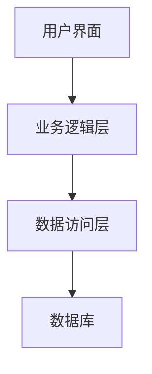
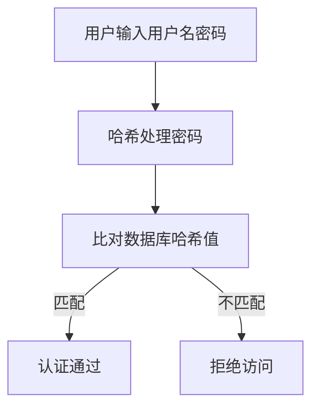

# 教学管理系统详细设计与具体代码实现

## 1. 背景介绍

### 1.1 教学管理系统的需求

现代教育环境下,教师和学生都面临着各种挑战和需求。教师需要高效地组织和管理课程、作业、成绩等,而学生需要便捷地获取课程资料、提交作业、查看成绩等。传统的纸质管理方式已经无法满足当今教育的需求,因此需要一个高效、智能的教学管理系统来简化这些流程。

### 1.2 系统目标

教学管理系统的主要目标是:

1. 为教师提供一个集中的平台,用于创建和管理课程、分配作业、评分和记录学生成绩。
2. 为学生提供一个用户友好的界面,用于获取课程材料、提交作业、查看成绩和反馈。
3. 实现教师和学生之间的无缝沟通和协作。
4. 提高教学效率,减轻教师的工作负担。
5. 为教育管理部门提供数据分析和决策支持。

## 2. 核心概念与联系

### 2.1 系统架构

教学管理系统通常采用三层架构或 N 层架构,包括:

1. **表现层(Presentation Layer)**: 提供用户界面,处理用户交互。
2. **业务逻辑层(Business Logic Layer)**: 实现系统的核心功能逻辑。
3. **数据访问层(Data Access Layer)**: 负责与数据库交互,执行数据持久化操作。



### 2.2 核心模块

教学管理系统通常包含以下核心模块:

1. **课程管理模块**: 用于创建、编辑和管理课程信息、课程资料等。
2. **作业管理模块**: 用于创建、分发和评分作业。
3. **成绩管理模块**: 用于记录和管理学生成绩。
4. **用户管理模块**: 用于管理教师和学生帐户。
5. **通知模块**: 用于向用户发送系统通知和消息。
6. **报告模块**: 用于生成各种报告,如成绩报告、课程统计报告等。

### 2.3 关键技术

实现教学管理系统需要以下关键技术:

1. **Web 开发技术**: HTML、CSS、JavaScript、框架(React、Angular、Vue等)。
2. **服务器端技术**: Java、.NET、Python、Node.js 等。
3. **数据库技术**: 关系型数据库(MySQL、PostgreSQL、Oracle等)或 NoSQL 数据库(MongoDB、Cassandra等)。
4. **安全技术**: 用户认证、授权、加密等。
5. **消息队列**: 用于异步通信和作业调度。

## 3. 核心算法原理具体操作步骤

### 3.1 用户认证

用户认证是系统安全的基础,通常采用以下步骤:

1. 用户输入用户名和密码。
2. 将密码进行哈希处理,例如使用 SHA-256 算法。
3. 将哈希值与数据库中存储的哈希值进行比对。
4. 如果匹配成功,则认证通过,否则拒绝访问。



### 3.2 作业评分算法

作业评分算法需要考虑多个因素,如作业分数、提交时间等。以下是一种简单的加权算法:

1. 定义作业满分 $S$,延迟扣分系数 $\lambda$。
2. 计算学生提交作业的延迟时间 $t$。
3. 计算扣分分数 $p = \lambda t$。
4. 学生得分 $s = S - p$。

$$
s = \begin{cases}
S, & \text{if }t \leq 0\\
S - \lambda t, & \text{if }t > 0
\end{cases}
$$

### 3.3 课程推荐算法

为了推荐合适的课程给学生,可以使用协同过滤算法。该算法基于用户的历史行为(如选课记录)来预测用户的兴趣。常用的算法有:

1. **用户基于协同过滤**: 找到与目标用户有相似兴趣的其他用户,并推荐这些用户感兴趣的课程。
2. **基于项目的协同过滤**: 找到与目标课程相似的其他课程,并推荐这些相似课程。

## 4. 数学模型和公式详细讲解举例说明

### 4.1 协同过滤算法

协同过滤算法是推荐系统中常用的技术,它通过分析用户之间或项目之间的相似性来预测用户对项目的偏好。以下是用户基于协同过滤算法的数学模型:

设有 $m$ 个用户和 $n$ 个项目,用 $R$ 表示用户-项目评分矩阵,其中 $r_{ui}$ 表示用户 $u$ 对项目 $i$ 的评分。我们的目标是预测用户 $u$ 对项目 $j$ 的评分 $\hat{r}_{uj}$。

1. 计算用户 $u$ 与其他用户 $v$ 的相似度,常用的相似度度量有余弦相似度、皮尔逊相关系数等。

$$
\text{sim}(u, v) = \frac{\sum_{i \in I}\left(r_{ui} - \overline{r}_u\right)\left(r_{vi} - \overline{r}_v\right)}{\sqrt{\sum_{i \in I}\left(r_{ui} - \overline{r}_u\right)^2}\sqrt{\sum_{i \in I}\left(r_{vi} - \overline{r}_v\right)^2}}
$$

其中 $I$ 是用户 $u$ 和 $v$ 都评分过的项目集合,$\overline{r}_u$和$\overline{r}_v$分别是用户 $u$ 和 $v$ 的平均评分。

2. 计算预测评分,将与目标用户 $u$ 相似的用户 $v$ 对项目 $j$ 的评分加权平均:

$$
\hat{r}_{uj} = \overline{r}_u + \frac{\sum_{v \in S(u, j)}\text{sim}(u, v)\left(r_{vj} - \overline{r}_v\right)}{\sum_{v \in S(u, j)}\left|\text{sim}(u, v)\right|}
$$

其中 $S(u, j)$ 是已对项目 $j$ 评分并且与用户 $u$ 相似的用户集合。

### 4.2 马尔可夫决策过程

马尔可夫决策过程(Markov Decision Process, MDP)是一种用于建模决策过程的数学框架,它在强化学习中有广泛应用。在教学管理系统中,我们可以将学生的学习过程建模为一个 MDP,以优化教学策略。

MDP 由以下要素组成:

- 状态集合 $\mathcal{S}$: 表示系统可能的状态,如学生的知识水平。
- 动作集合 $\mathcal{A}$: 表示可执行的动作,如分配作业或课程。
- 转移概率 $\mathcal{P}_{ss'}^a$: 表示在状态 $s$ 下执行动作 $a$ 后,转移到状态 $s'$ 的概率。
- 奖励函数 $\mathcal{R}_s^a$: 表示在状态 $s$ 下执行动作 $a$ 获得的即时奖励。
- 折扣因子 $\gamma \in [0, 1)$: 用于平衡即时奖励和长期奖励。

目标是找到一个策略 $\pi: \mathcal{S} \rightarrow \mathcal{A}$,使得期望累积奖励最大化:

$$
\max_\pi \mathbb{E}\left[\sum_{t=0}^\infty \gamma^t r_t \mid \pi\right]
$$

其中 $r_t$ 是在时间步 $t$ 获得的奖励。这个优化问题可以通过动态规划或强化学习算法(如 Q-Learning)来求解。

## 4. 项目实践: 代码实例和详细解释说明

在本节中,我们将展示一些核心功能的代码实现,并对其进行详细解释。

### 4.1 用户认证

以下是使用 Python 和 Flask 框架实现用户认证的示例代码:

```python
from flask import Flask, request, session
from werkzeug.security import check_password_hash

app = Flask(__name__)
app.secret_key = 'your_secret_key'

# 用户数据库(模拟)
users = {
    'john': {'password': 'sha256_hashed_password', 'role': 'teacher'},
    'jane': {'password': 'sha256_hashed_password', 'role': 'student'}
}

@app.route('/login', methods=['POST'])
def login():
    username = request.form['username']
    password = request.form['password']

    # 检查用户是否存在
    if username not in users:
        return 'Invalid username', 401

    # 验证密码哈希
    if not check_password_hash(users[username]['password'], password):
        return 'Invalid password', 401

    # 设置会话
    session['username'] = username
    session['role'] = users[username]['role']

    return 'Login successful'
```

在这个示例中,我们使用 Flask 框架创建了一个简单的 Web 应用程序。用户数据存储在一个字典中,密码使用 SHA-256 算法进行哈希处理。

当用户尝试登录时,我们首先检查用户名是否存在。如果存在,我们使用 `check_password_hash` 函数验证提供的密码与存储的哈希值是否匹配。如果匹配成功,我们将用户名和角色存储在会话中,表示用户已经成功登录。

### 4.2 作业评分

以下是使用 Python 实现作业评分算法的示例代码:

```python
import datetime

# 作业信息
assignment = {
    'name': 'Assignment 1',
    'due_date': datetime.datetime(2023, 5, 15),
    'max_score': 100,
    'late_penalty': 0.1  # 每天延迟扣 10% 分数
}

def grade_assignment(student_name, submission_date, score):
    # 计算延迟天数
    late_days = max(0, (submission_date - assignment['due_date']).days)

    # 计算扣分分数
    penalty = assignment['max_score'] * assignment['late_penalty'] * late_days

    # 计算最终分数
    final_score = max(0, score - penalty)

    return final_score

# 示例用法
student_submission = {
    'name': 'John Doe',
    'submission_date': datetime.datetime(2023, 5, 18),
    'score': 85
}

final_score = grade_assignment(student_submission['name'], student_submission['submission_date'], student_submission['score'])
print(f"{student_submission['name']}'s final score: {final_score}")
```

在这个示例中,我们定义了一个作业对象,包含作业名称、截止日期、满分和延迟扣分系数。`grade_assignment` 函数接受学生姓名、提交日期和原始分数作为输入,并计算最终分数。

首先,我们计算学生提交作业的延迟天数。如果提交日期晚于截止日期,则延迟天数为提交日期与截止日期之间的天数差;否则,延迟天数为 0。

接下来,我们根据延迟天数和延迟扣分系数计算扣分分数。最后,我们将原始分数减去扣分分数,得到最终分数。如果最终分数小于 0,则将其设置为 0。

在示例用法部分,我们创建了一个学生提交对象,并调用 `grade_assignment` 函数计算最终分数。

### 4.3 课程推荐

以下是使用 Python 和 scikit-learn 库实现基于项目的协同过滤算法的示例代码:

```python
import pandas as pd
from sklearn.metrics.pairwise import cosine_similarity

# 加载课程数据
courses = pd.read_csv('courses.csv')

# 创建课程-学生评分矩阵
course_student_matrix = courses.pivot_table(index='course_id', columns='student_id', values='rating')

# 计算课程之间的相似度
course_similarity = cosine_similarity(course_student_matrix.T)

# 获取与目标课程最相似的课程
def get_similar_courses(course_id, n=5):
    course_indices = course_student_matrix.index.tolist()
    course_index = course_indices.index(course_id)
    
    similarities = course_similarity[course_index]
    similar_course_indices = similarities.argsort()[::-1][1:n+1]
    
    similar_courses = [course_indices[i] for i in similar_course_indices]
    return similar_courses

# 示例用