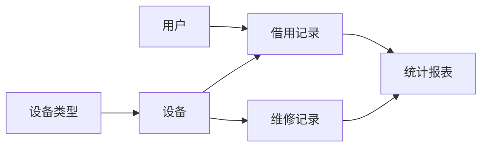

# 教学设备管理系统详细设计与具体代码实现

作者：禅与计算机程序设计艺术

## 1. 背景介绍

### 1.1 教学设备管理的重要性

在现代化教学过程中,教学设备发挥着至关重要的作用。高效管理和维护教学设备可以显著提升教学质量,为师生创造良好的教学环境。然而,传统的人工管理方式效率低下,难以满足日益增长的教学需求。因此,开发一套功能完善、易于使用的教学设备管理系统势在必行。

### 1.2 系统开发目标

本教学设备管理系统旨在实现以下目标:

1. 提供设备信息的集中管理,包括设备类型、数量、状态等
2. 实现设备的借用、归还流程自动化,提高管理效率
3. 支持设备维修、报废等全生命周期管理
4. 生成各类统计报表,为管理决策提供数据支持
5. 具备良好的可扩展性,便于未来功能拓展

### 1.3 技术选型

为保证系统的稳定性、高效性和可维护性,本项目采用以下技术:

- 后端:Spring Boot + MyBatis
- 前端:Vue.js + Element UI
- 数据库:MySQL
- 版本控制:Git
- 项目管理:Maven

## 2. 核心概念与关系

### 2.1 设备(Equipment)

教学设备的基本信息,包括设备编号、名称、类型、规格、购置日期、状态等。

### 2.2 设备类型(EquipmentType)

设备所属的类别,如多媒体教室、实验室仪器等。每个设备类型可包含多个设备。

### 2.3 用户(User)

使用教学设备的师生用户,包括用户ID、姓名、所属部门等信息。用户可借用和归还设备。

### 2.4 借用记录(BorrowRecord)  

用户借用设备的记录,包含借用人、借用设备、借用时间、归还时间、设备状态等。

### 2.5 维修记录(MaintenanceRecord)

设备的维修记录,包括维修时间、维修人员、维修内容、维修结果等。

### 2.6 统计报表(StatisticalReport)

根据设备借用、维修等记录生成的统计分析报表,为管理决策提供依据。

以上核心概念之间的关系可用下图表示:



## 3. 核心算法原理与具体步骤

### 3.1 设备借用算法

#### 3.1.1 借用规则

1. 用户选择所需设备,系统检查设备状态是否可借用
2. 若设备可借用,则生成借用记录,并将设备状态更新为"已借出"
3. 若设备不可借用,则提示用户并终止借用流程

#### 3.1.2 算法步骤

1. 用户发起借用请求,传入用户ID和设备ID
2. 查询设备状态是否为"可借用"
3. 若可借用,插入新的借用记录,将设备状态更新为"已借出",返回成功
4. 若不可借用,返回失败提示信息

### 3.2 设备归还算法

#### 3.2.1 归还规则

1. 用户选择需归还的设备,系统查询对应的借用记录
2. 若存在未完成的借用记录,则将借用记录状态更新为"已归还",并将设备状态更新为"可借用"
3. 若不存在未完成的借用记录,则提示用户并终止归还流程

#### 3.2.2 算法步骤

1. 用户发起归还请求,传入用户ID和设备ID
2. 查询该用户和设备的未完成借用记录
3. 若存在未完成记录,更新借用记录状态为"已归还",将设备状态更新为"可借用",返回成功
4. 若不存在未完成记录,返回失败提示信息

## 4. 数学模型与公式详解

### 4.1 设备可用率模型

设备可用率是衡量设备管理效率的重要指标,可用如下公式计算:

$$
设备可用率 = \frac{设备可用时间}{总时间} \times 100\%
$$

其中,设备可用时间为设备处于"可借用"状态的时间,总时间为统计周期内的总时长。

例如,某设备一个月内可用时间为20天,则其可用率为:

$$
设备可用率 = \frac{20}{30} \times 100\% \approx 66.7\%
$$

### 4.2 设备故障率模型

设备故障率反映了设备的稳定性和可靠性,可用如下公式计算:

$$
设备故障率 = \frac{设备故障次数}{使用总次数} \times 100\%
$$

其中,设备故障次数为统计周期内设备发生故障的次数,使用总次数为设备被借用的总次数。

例如,某设备一个月内发生故障2次,使用总次数为50次,则其故障率为:

$$
设备故障率 = \frac{2}{50} \times 100\% = 4\%
$$

通过分析设备可用率和故障率,可以发现设备管理中存在的问题,并采取针对性的优化措施。

## 5. 项目实践:代码实例与详解

### 5.1 设备借用接口

#### 5.1.1 Controller层

```java
@RestController
@RequestMapping("/equipment")
public class EquipmentController {

    @Autowired
    private EquipmentService equipmentService;

    @PostMapping("/borrow")
    public Result borrowEquipment(@RequestBody BorrowRequest request) {
        return equipmentService.borrowEquipment(request);
    }
}
```

#### 5.1.2 Service层

```java
@Service
public class EquipmentServiceImpl implements EquipmentService {

    @Autowired
    private EquipmentMapper equipmentMapper;
    
    @Autowired
    private BorrowRecordMapper borrowRecordMapper;

    @Override
    public Result borrowEquipment(BorrowRequest request) {
        // 查询设备状态
        Equipment equipment = equipmentMapper.selectById(request.getEquipmentId());
        if (equipment == null || !equipment.getStatus().equals("可借用")) {
            return Result.fail("设备不可借用");
        }
        
        // 插入借用记录
        BorrowRecord record = new BorrowRecord();
        record.setUserId(request.getUserId());
        record.setEquipmentId(request.getEquipmentId());
        record.setBorrowTime(new Date());
        record.setStatus("借用中");
        borrowRecordMapper.insert(record);
        
        // 更新设备状态
        equipment.setStatus("已借出");
        equipmentMapper.updateById(equipment);
        
        return Result.success();
    }
}
```

#### 5.1.3 Mapper层

```java
@Mapper
public interface EquipmentMapper extends BaseMapper<Equipment> {
}

@Mapper
public interface BorrowRecordMapper extends BaseMapper<BorrowRecord> {
}
```

以上代码实现了设备借用的基本流程,包括检查设备状态、插入借用记录、更新设备状态等步骤。其中用到了MyBatis-Plus提供的BaseMapper接口,简化了数据库操作。

### 5.2 设备归还接口

设备归还接口与借用接口类似,主要区别在于归还时需要查询未完成的借用记录,并更新借用记录和设备状态。代码实现可参考借用接口,此处不再赘述。

## 6. 实际应用场景

教学设备管理系统可应用于各类教育机构,如中小学、高校、培训机构等。以下是几个典型应用场景:

### 6.1 多媒体教室管理

在多媒体教室中,老师可通过系统快速查询和借用投影仪、音响等设备,并在使用完毕后及时归还。系统可自动记录设备的使用情况,方便后续维护和统计。

### 6.2 实验室仪器管理

实验室管理员可使用系统登记各类仪器设备的信息,并控制仪器的借用和归还。通过系统生成的统计报表,管理员可掌握仪器的使用频率、故障率等关键指标,优化实验室资源配置。

### 6.3 体育器材管理

体育器材管理员可利用系统跟踪球类、田径器材等的库存和借用情况。教师可通过系统预约所需器材,提高训练和教学效率。系统还可生成器材损耗报告,为器材更新和采购提供决策依据。

## 7. 工具与资源推荐

### 7.1 开发工具

- IntelliJ IDEA:功能强大的Java IDE,提供智能代码提示和调试功能
- Visual Studio Code:轻量级编辑器,适合前端开发
- Postman:API测试工具,可模拟各类HTTP请求
- Navicat:数据库管理工具,支持多种数据库类型

### 7.2 学习资源

- Spring Boot官方文档:https://spring.io/projects/spring-boot
- Vue.js官方文档:https://vuejs.org/
- MyBatis-Plus官方文档:https://baomidou.com/
- 《Spring Boot实战》:Spring Boot入门必读,案例丰富
- 《Vue.js实战》:系统讲解Vue.js技术栈,适合前端入门

### 7.3 开源项目

- Guns:https://gitee.com/stylefeng/guns
- RuoYi:https://gitee.com/y_project/RuoYi
- Eladmin:https://github.com/elunez/eladmin

以上开源项目都基于Spring Boot和Vue.js,功能完善,代码规范,可作为项目开发的参考和学习资料。

## 8. 总结与展望

### 8.1 项目总结

本文详细阐述了教学设备管理系统的设计思路和实现过程,涵盖了系统的背景分析、核心概念、关键算法、数学模型、代码实现等各个方面。通过对系统的全面剖析,读者可以深入理解教学设备管理的业务需求和技术实现,为开发类似系统提供参考。

### 8.2 未来展望

随着教育信息化的不断推进,教学设备管理系统也面临着新的挑战和机遇:

1. 智能化:引入人工智能技术,实现设备的自动化管理和故障预测
2. 移动化:提供移动端应用,方便用户随时随地访问系统
3. 大数据:收集和分析设备使用数据,优化资源配置和决策
4. 物联网:利用物联网技术,实现设备的实时监控和远程控制

未来,教学设备管理系统将不断融合新技术,为教育机构提供更加智能、高效、便捷的管理服务,助力教育事业的发展。

## 9. 附录:常见问题与解答

### 9.1 如何初始化设备数据?

可以编写数据导入脚本,将设备信息批量导入到数据库中。也可以在系统中提供设备录入功能,由管理员手动添加设备信息。

### 9.2 如何处理设备故障?

当用户报告设备故障时,管理员可在系统中标记设备状态为"维修中",并创建维修记录。维修完成后,再将设备状态更新为"可借用"。系统可根据维修记录生成故障统计报告,帮助分析设备故障原因。

### 9.3 如何进行权限控制?

系统应根据用户的角色(如管理员、教师、学生等)分配不同的操作权限。可使用Spring Security等安全框架实现用户认证和授权,保护系统的敏感资源。

### 9.4 如何保证数据安全?

应采取以下措施保护系统数据:

1. 用户密码加密存储,防止泄露
2. 定期备份数据库,防止数据丢失
3. 使用HTTPS协议,保护数据传输过程
4. 对用户输入进行验证和过滤,防止SQL注入等攻击

### 9.5 如何提高系统性能?

可从以下方面优化系统性能:

1. 使用连接池,减少数据库连接开销
2. 添加缓存机制,加速数据访问
3. 优化SQL查询,避免不必要的全表扫描
4. 压缩静态资源,减小网络传输量
5. 使用负载均衡,分散服务器压力

通过不断优化和改进,可以使教学设备管理系统运行更加高效、稳定,为用户提供更好的服务体验。