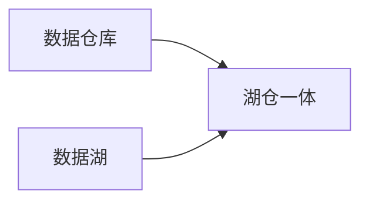
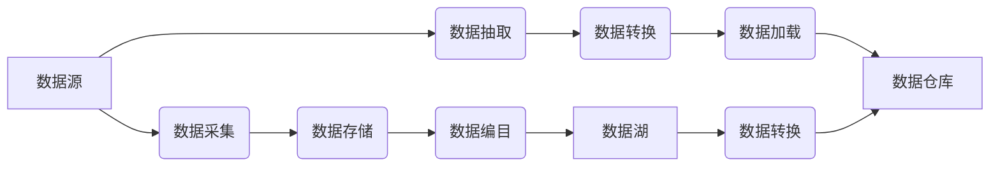

## 1. 背景介绍

### 1.1 数据仓库的起源与发展

数据仓库的概念最早由Bill Inmon于1990年提出，他将数据仓库定义为“面向主题的、集成的、相对稳定的、反映历史变化的数据集合，用于支持管理决策”。随着信息技术的不断发展，数据仓库技术也经历了从关系型数据库到多维数据库，再到云数据仓库的演变。

### 1.2 数据湖的兴起与挑战

近年来，随着大数据时代的到来，数据种类和规模呈爆炸式增长，传统数据仓库难以应对海量、多样的数据存储和分析需求。在这种背景下，数据湖应运而生。数据湖是一种集中式存储库，可以存储任何类型的数据，包括结构化、半结构化和非结构化数据。

### 1.3 数据仓库与数据湖的融合趋势

数据仓库和数据湖各有优缺点，为了更好地满足企业对数据管理和分析的需求，近年来出现了将两者融合的趋势。这种融合架构通常被称为“湖仓一体”，它结合了数据仓库的结构化查询能力和数据湖的灵活性，为企业提供更全面的数据管理和分析解决方案。

## 2. 核心概念与联系

### 2.1 数据仓库

* **面向主题：** 数据仓库中的数据围绕特定的主题组织，例如客户、产品、销售等。
* **集成：** 数据仓库中的数据来自不同的数据源，并经过清洗、转换和整合，形成统一的数据视图。
* **相对稳定：** 数据仓库中的数据通常是历史数据，不会频繁更新。
* **反映历史变化：** 数据仓库中的数据包含时间维度，可以用于分析历史趋势和变化。

### 2.2 数据湖

* **集中式存储库：** 数据湖是一个集中式存储库，可以存储任何类型的数据。
* **Schema-on-Read：** 数据湖中的数据在存储时不需要定义Schema，而是在读取时根据需要进行解析。
* **支持多种分析方法：** 数据湖支持批处理、流处理、交互式查询等多种分析方法。
* **可扩展性：** 数据湖可以根据需要进行扩展，以满足不断增长的数据存储和分析需求。

### 2.3 湖仓一体

* **结合数据仓库和数据湖的优势：** 湖仓一体架构结合了数据仓库的结构化查询能力和数据湖的灵活性。
* **统一的数据管理平台：** 湖仓一体提供统一的数据管理平台，可以管理结构化、半结构化和非结构化数据。
* **支持多种分析场景：** 湖仓一体支持多种分析场景，包括报表、BI、数据挖掘、机器学习等。

### 2.4 核心概念联系图



## 3. 核心算法原理具体操作步骤

### 3.1 数据仓库 ETL 流程

ETL (Extract, Transform, Load) 是数据仓库的核心流程，它包括以下步骤：

* **数据抽取：** 从不同的数据源中抽取数据。
* **数据转换：** 对抽取的数据进行清洗、转换和整合，使其符合数据仓库的要求。
* **数据加载：** 将转换后的数据加载到数据仓库中。

### 3.2 数据湖数据摄取流程

数据湖的数据摄取流程通常包括以下步骤：

* **数据采集：** 从不同的数据源中采集数据。
* **数据存储：** 将采集的数据存储到数据湖中。
* **数据编目：** 对存储的数据进行编目，以便于后续的查找和使用。

### 3.3 湖仓一体数据处理流程

湖仓一体的数据处理流程通常包括以下步骤：

* **数据摄取：** 将数据从不同的数据源摄取到数据湖中。
* **数据转换：** 使用数据湖中的数据处理引擎对数据进行转换和清洗。
* **数据加载：** 将转换后的数据加载到数据仓库中，用于结构化查询和分析。

### 3.4 核心算法流程图



## 4. 数学模型和公式详细讲解举例说明

### 4.1 数据仓库星型模型

星型模型是一种常用的数据仓库模型，它由一个事实表和多个维度表组成。

* **事实表：** 存储业务事件的度量值，例如销售额、订单数量等。
* **维度表：** 存储与业务事件相关的维度信息，例如时间、产品、客户等。

### 4.2 数据湖数据分区

数据分区是一种常用的数据湖数据组织方式，它可以根据数据的特征将数据存储到不同的分区中，以便于后续的查询和分析。

### 4.3 数学模型公式举例

**星型模型：**

```
事实表：销售事实表
维度表：时间维度表、产品维度表、客户维度表

销售事实表：
| 订单ID | 产品ID | 客户ID | 时间ID | 销售额 |
|---|---|---|---|---|
| 1 | 1 | 1 | 1 | 100 |
| 2 | 2 | 2 | 2 | 200 |

时间维度表：
| 时间ID | 年 | 月 | 日 |
|---|---|---|---|
| 1 | 2023 | 1 | 1 |
| 2 | 2023 | 1 | 2 |

产品维度表：
| 产品ID | 产品名称 | 产品类别 |
|---|---|---|
| 1 | 产品A | 类别A |
| 2 | 产品B | 类别B |

客户维度表：
| 客户ID | 客户姓名 | 客户地区 |
|---|---|---|
| 1 | 张三 | 北京 |
| 2 | 李四 | 上海 |
```

**数据分区：**

```
数据分区：按日期分区

分区路径：/data/year=2023/month=01/day=01
```

## 5. 项目实践：代码实例和详细解释说明

### 5.1 数据仓库 ETL 代码示例

**使用 Python 和 Pandas 库进行 ETL：**

```python
import pandas as pd

# 从 CSV 文件中读取数据
df = pd.read_csv('sales_data.csv')

# 数据清洗：删除重复数据
df.drop_duplicates(inplace=True)

# 数据转换：将日期列转换为日期时间格式
df['日期'] = pd.to_datetime(df['日期'])

# 数据加载：将数据写入到数据库中
df.to_sql('sales_table', engine, if_exists='replace', index=False)
```

### 5.2 数据湖数据摄取代码示例

**使用 AWS S3 SDK 将数据上传到数据湖：**

```python
import boto3

# 创建 S3 客户端
s3 = boto3.client('s3')

# 上传文件到数据湖
s3.upload_file(Filename='sales_data.csv', Bucket='my-data-lake', Key='sales/sales_data.csv')
```

### 5.3 湖仓一体数据处理代码示例

**使用 AWS Glue 处理数据湖中的数据：**

```python
import sys
from awsglue.transforms import *
from awsglue.utils import getResolvedOptions
from pyspark.context import SparkContext
from awsglue.context import GlueContext
from awsglue.job import Job

# 创建 Glue 上下文
sc = SparkContext()
glueContext = GlueContext(sc)
spark = glueContext.spark_session
job = Job(glueContext)

# 获取 Glue 作业参数
args = getResolvedOptions(sys.argv, ['JOB_NAME'])

# 读取数据湖中的数据
datasource0 = glueContext.create_dynamic_frame.from_options(
    format_options={"multiline": False},
    connection_type="s3",
    format="json",
    connection_options={
        "paths": ["s3://my-data-lake/sales/"],
        "recurse": True
    },
    transformation_ctx="datasource0",
)

# 数据转换：将日期列转换为日期时间格式
applymapping1 = ApplyMapping.apply(
    frame=datasource0,
    mappings=[
        ("日期", "string", "日期", "timestamp")
    ],
    transformation_ctx="applymapping1",
)

# 数据加载：将数据写入到数据仓库中
datasink2 = glueContext.write_dynamic_frame.from_options(
    frame=applymapping1,
    connection_type="s3",
    format="parquet",
    connection_options={
        "path": "s3://my-data-warehouse/sales/",
        "partitionKeys": ["日期"]
    },
    transformation_ctx="datasink2",
)

job.commit()
```

## 6. 实际应用场景

### 6.1 商业智能

数据仓库和数据湖可以用于构建商业智能系统，帮助企业分析业务数据，识别趋势，并做出更明智的决策。

### 6.2 数据科学

数据湖可以为数据科学家提供一个集中式平台，用于存储和分析各种类型的数据，以进行数据挖掘、机器学习和人工智能应用。

### 6.3 物联网

数据湖可以用于存储和分析来自物联网设备的海量数据，帮助企业优化运营，提高效率，并开发新的产品和服务。

## 7. 总结：未来发展趋势与挑战

### 7.1 云原生数据仓库和数据湖

随着云计算的普及，云原生数据仓库和数据湖将成为未来发展趋势。云原生架构可以提供更高的可扩展性、弹性和成本效益。

### 7.2 数据安全和隐私

数据安全和隐私是数据仓库和数据湖面临的主要挑战。企业需要采取适当的安全措施，以保护敏感数据免遭未经授权的访问和使用。

### 7.3 数据治理

数据治理对于确保数据质量和一致性至关重要。企业需要制定数据治理策略，以管理数据生命周期，并确保数据符合相关法规和标准。

## 8. 附录：常见问题与解答

### 8.1 数据仓库和数据湖的区别是什么？

数据仓库是一种结构化的数据存储库，用于存储和分析历史数据，而数据湖是一个集中式存储库，可以存储任何类型的数据，包括结构化、半结构化和非结构化数据。

### 8.2 什么是湖仓一体？

湖仓一体是一种结合了数据仓库和数据湖优势的架构，它提供统一的数据管理平台，可以管理结构化、半结构化和非结构化数据。

### 8.3 如何选择合适的数据仓库和数据湖解决方案？

选择合适的数据仓库和数据湖解决方案取决于企业的具体需求，例如数据规模、数据类型、分析需求和预算等。