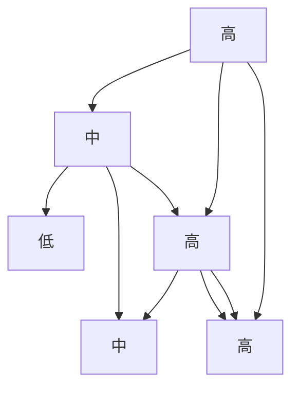

# 数据安全审计认证：权威认可，提升安全信誉

作者：禅与计算机程序设计艺术

## 1.背景介绍
### 1.1 数据安全的重要性
#### 1.1.1 数据泄露事件频发
#### 1.1.2 数据安全威胁日益严峻 
#### 1.1.3 数据安全已成为企业生存发展的关键
### 1.2 数据安全审计认证的必要性
#### 1.2.1 提升企业数据安全管理水平
#### 1.2.2 增强客户和合作伙伴信任
#### 1.2.3 满足法律法规合规要求

## 2.核心概念与联系
### 2.1 数据安全审计
#### 2.1.1 定义与目标
#### 2.1.2 审计内容与范围
#### 2.1.3 审计方法与流程
### 2.2 数据安全认证 
#### 2.2.1 认证标准与框架
#### 2.2.2 认证流程与要求
#### 2.2.3 认证结果与效力
### 2.3 数据安全审计与认证的关系
#### 2.3.1 审计是认证的基础
#### 2.3.2 认证是审计的目的
#### 2.3.3 二者相辅相成，缺一不可

## 3.核心算法原理具体操作步骤
### 3.1 风险评估
#### 3.1.1 资产识别与分类
#### 3.1.2 威胁分析与评估
#### 3.1.3 脆弱性扫描与测试
### 3.2 安全控制措施
#### 3.2.1 访问控制与身份认证
#### 3.2.2 数据加密与脱敏
#### 3.2.3 日志审计与监控
### 3.3 持续改进
#### 3.3.1 缺陷跟踪与修复
#### 3.3.2 安全意识培训
#### 3.3.3 应急响应与恢复

## 4.数学模型和公式详细讲解举例说明
### 4.1 风险评估模型
#### 4.1.1 定性与定量分析
风险评估可采用定性与定量相结合的方法。定性分析通过对资产、威胁、脆弱性等因素进行主观判断，给出高、中、低三个等级。定量分析则通过赋予各因素数值，计算出风险值。

风险值计算公式如下：
$$
Risk = Asset \times Threat \times Vulnerability
$$
其中，$Asset$ 表示资产价值，$Threat$ 表示威胁发生的可能性，$Vulnerability$ 表示脆弱性被利用的难易程度，取值范围均为 $[0,1]$。

#### 4.1.2 风险矩阵图
风险矩阵图直观展示了各种风险的分布情况，便于进行风险判断和处置。矩阵图中，横轴表示风险发生的可能性，纵轴表示风险造成的影响程度，取值范围为低、中、高三个等级。



### 4.2 密码学算法
#### 4.2.1 对称加密
对称加密采用单一密钥对数据进行加密和解密，常见算法有 DES、3DES、AES 等。以 AES 为例，加密过程如下：

1. 密钥扩展：由种子密钥生成若干轮子密钥。
2. 初始轮：将明文与初始轮密钥进行异或。 
3. 重复轮：对状态数组进行字节代换、行移位、列混淆和轮密钥加等操作。
4. 最终轮：类似重复轮，但省略列混淆步骤。

AES 加密过程可用下述公式表示：

$$
C = E_K(P) = Round_n \circ \cdots \circ Round_1 \circ InitRound(P)
$$

其中，$P$ 为明文，$K$ 为密钥，$E$ 为加密函数，$Round$ 为重复轮函数，$InitRound$ 为初始轮函数，$C$ 为密文。

#### 4.2.2 公钥密码
公钥密码采用密钥对进行加密和解密，公钥可公开，私钥保密。常见算法有 RSA、ECC 等。以 RSA 为例，加密解密过程如下：

加密：$C = P^e \bmod n$
解密：$P = C^d \bmod n$

其中，$P$ 为明文，$C$ 为密文，$(e,n)$ 为公钥，$(d,n)$ 为私钥。$n$ 是两个大素数 $p,q$ 的乘积，$e$ 与 $(p-1)(q-1)$ 互素，$d$ 为 $e$ 模 $(p-1)(q-1)$ 的乘法逆元。

## 5.项目实践：代码实例和详细解释说明
### 5.1 Python实现AES加密
```python
from Crypto.Cipher import AES
from Crypto.Util.Padding import pad, unpad

def encrypt_aes(data, key):
    cipher = AES.new(key, AES.MODE_CBC)
    encrypted_data = cipher.encrypt(pad(data, AES.block_size))
    return cipher.iv + encrypted_data

def decrypt_aes(data, key):
    iv = data[:AES.block_size]
    cipher = AES.new(key, AES.MODE_CBC, iv)
    decrypted_data = unpad(cipher.decrypt(data[AES.block_size:]), AES.block_size)
    return decrypted_data
```

以上代码使用 Python 的 PyCryptodome 库实现了 AES 加密算法，密钥长度为 16 字节。`encrypt_aes` 函数对数据进行加密，先生成随机初始向量 iv，然后对数据进行填充并加密，返回 iv 和密文拼接的结果。`decrypt_aes` 函数对数据进行解密，先取出 iv，再使用密钥和 iv 进行解密，最后去除填充返回明文。

### 5.2 Java实现RSA签名验签
```java
import java.security.*;

public class RSASignature {
    public static byte[] sign(byte[] data, PrivateKey privateKey) throws Exception {
        Signature signature = Signature.getInstance("SHA256withRSA");
        signature.initSign(privateKey);
        signature.update(data);
        return signature.sign();
    }
    
    public static boolean verify(byte[] data, byte[] sign, PublicKey publicKey) throws Exception {
        Signature signature = Signature.getInstance("SHA256withRSA");
        signature.initVerify(publicKey);
        signature.update(data);
        return signature.verify(sign);
    }
}
```

以上代码使用 Java 实现了 RSA 数字签名算法。`sign` 方法使用私钥对数据进行签名，先初始化签名对象，然后更新数据，最后生成签名值。`verify` 方法使用公钥对签名进行验证，流程与签名类似，如果验证通过则返回 true，否则返回 false。

## 6.实际应用场景
### 6.1 金融行业
#### 6.1.1 网上银行和移动支付 
#### 6.1.2 信用卡数据保护
#### 6.1.3 反洗钱和反欺诈
### 6.2 医疗行业
#### 6.2.1 电子病历和处方 
#### 6.2.2 医疗器械和药品供应链
#### 6.2.3 远程医疗和健康监测
### 6.3 政府部门
#### 6.3.1 公民身份信息管理
#### 6.3.2 税务和社保数据保护
#### 6.3.3 机密文件和档案安全

## 7.工具和资源推荐
### 7.1 开源安全工具
- OWASP ZAP：Web 应用安全扫描器
- Metasploit：渗透测试框架
- Nmap：网络探测和安全审计
- Wireshark：网络协议分析
### 7.2 安全标准与规范
- ISO 27001：信息安全管理体系
- PCI DSS：支付卡行业数据安全标准
- GDPR：欧盟通用数据保护条例
- HIPAA：美国健康保险可移植性和责任法案
### 7.3 安全认证机构
- 国际信息系统安全认证联盟（ISC）2
- ISACA：信息系统审计与控制协会
- 公共可用规范 140（FIPS 140）
- 通用准则（Common Criteria）

## 8.总结：未来发展趋势与挑战
### 8.1 数据安全形势日益严峻
#### 8.1.1 数据量爆炸式增长
#### 8.1.2 攻击手段不断升级
#### 8.1.3 数据价值不断提升
### 8.2 新技术带来的机遇与挑战
#### 8.2.1 人工智能和机器学习
#### 8.2.2 区块链和去中心化
#### 8.2.3 量子计算和后量子密码
### 8.3 未来发展方向
#### 8.3.1 数据安全治理体系建设
#### 8.3.2 数据安全技术创新应用
#### 8.3.3 数据安全人才培养

## 9.附录：常见问题与解答
### 9.1 数据安全审计与渗透测试的区别？
数据安全审计是一种评估风险、检查合规性的方法，渗透测试是一种主动发现漏洞、验证安全性的手段。二者侧重点不同，但都是数据安全体系的重要组成部分。
### 9.2 数据脱敏的常用方法有哪些？
- 隐藏：用 * 号等符号替换敏感数据
- 替换：用随机生成或映射的数据替换敏感数据
- 加密：使用加密算法对敏感数据进行变换
- 分割：将完整数据分割成多个部分存储
### 9.3 如何进行数据安全风险评估？
风险评估一般分为以下几个步骤：

1. 确定评估目标和范围
2. 识别和分类数据资产
3. 分析数据面临的威胁
4. 评估数据存在的脆弱性
5. 计算风险值并判断风险等级
6. 制定风险处置策略

风险评估可使用 STRIDE、DREAD、OCTAVE 等多种模型和方法，定性定量分析与矩阵图相结合，以全面识别风险、科学管控风险。