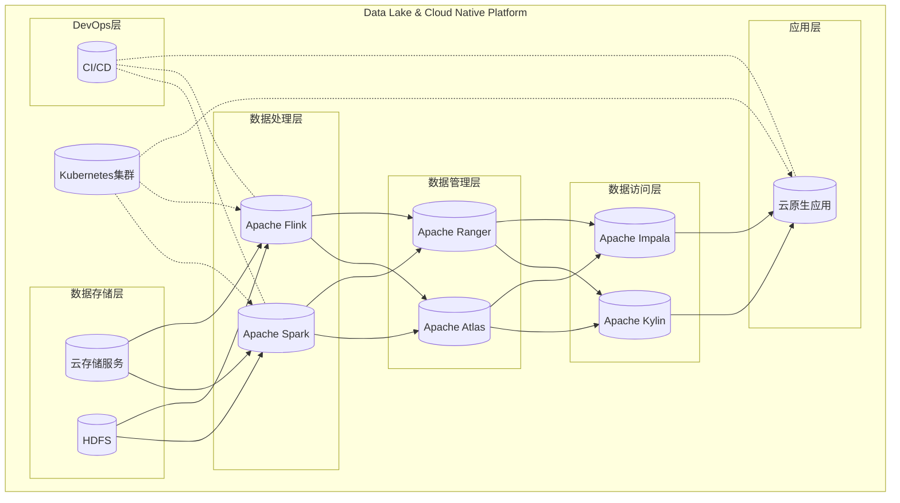

# 数据湖与云原生架构紧密结合

## 1. 背景介绍

### 1.1 数据湖的兴起

随着大数据时代的到来,传统的数据仓库架构已经无法满足现代企业对于海量异构数据的存储和处理需求。数据湖(Data Lake)应运而生,它提供了一种高度可扩展、经济高效的解决方案,能够存储各种类型的原始数据,包括结构化、半结构化和非结构化数据。

数据湖的核心理念是"存储一切,处理一切",它摒弃了数据仓库中严格的模式约束,将所有原始数据以最原始的形式存储在一个集中的存储系统中,并通过后期的处理和分析来赋予数据价值。这种范式转变为企业带来了前所未有的数据处理灵活性和成本效益。

### 1.2 云原生架构的崛起  

与此同时,云计算技术的快速发展推动了云原生架构(Cloud Native Architecture)的兴起。云原生架构是一种利用云计算模型来构建和运行可伸缩且具有恢复能力的应用程序的方法。它包括微服务、容器、DevOps实践和声明式API等核心概念,旨在帮助企业更好地利用云平台的优势,提高应用的敏捷性、可靠性和可维护性。

### 1.3 数据湖与云原生架构的融合

虽然数据湖和云原生架构起源于不同的需求,但它们在实践中却有着天然的契合点。数据湖需要一个灵活、可扩展的基础架构来存储和处理大规模数据,而云原生架构正好提供了这样的基础设施。同时,数据湖也为云原生应用提供了数据支撑,使其能够更好地利用数据进行决策和优化。

因此,将数据湖与云原生架构紧密结合,可以充分发挥两者的协同效应,打造出一个高度灵活、可扩展、高性能且经济高效的现代化数据处理平台。这种融合不仅可以满足企业对于大数据处理的需求,也能为云原生应用提供强大的数据支撑,助力企业数字化转型。

## 2. 核心概念与联系

### 2.1 数据湖的核心概念

#### 2.1.1 数据存储层

数据湖的核心是一个分布式、高度可扩展的存储层,通常采用对象存储或分布式文件系统,例如HDFS、AWS S3、Azure Data Lake Storage等。这些存储系统能够以极低的成本存储海量数据,并提供高吞吐量和高并发性能。

#### 2.1.2 数据处理层

数据处理层负责对存储在数据湖中的原始数据进行处理和分析。常见的处理引擎包括Apache Spark、Apache Hive、Apache Flink等,它们支持批处理、流处理和交互式查询等多种处理范式。

#### 2.1.3 数据管理层

数据管理层负责对数据湖中的数据进行元数据管理、数据治理、安全控制和访问控制等,确保数据的可发现性、可追溯性和安全性。常见的工具包括Apache Atlas、Apache Ranger等。

#### 2.1.4 数据访问层

数据访问层为上层应用和分析工具提供统一的数据访问入口,支持SQL、NoSQL、API等多种访问方式。常见的工具包括Apache Kylin、Apache Impala、Presto等。

### 2.2 云原生架构的核心概念

#### 2.2.1 微服务

微服务是云原生架构的核心理念之一,它将单一的应用程序拆分为多个小型、独立的服务,每个服务专注于完成一个单一的业务功能。这种架构有助于提高应用的可维护性、可扩展性和灵活性。

#### 2.2.2 容器

容器是云原生架构中实现微服务的关键技术。容器可以将应用程序及其依赖项打包到一个独立的、可移植的单元中,简化了应用程序的部署和管理。Docker是最著名的容器技术。

#### 2.2.3 Kubernetes

Kubernetes是一个开源的容器编排平台,它能够自动化容器的部署、扩展和管理,提供了服务发现、负载均衡、自动伸缩等功能,大大简化了容器化应用的运维工作。

#### 2.2.4 DevOps

DevOps是一种软件开发实践,它强调开发和运维团队之间的协作,通过自动化流程和持续交付,加快应用程序的迭代周期。DevOps是云原生架构中不可或缺的一部分。

#### 2.2.5 无服务器计算

无服务器计算(Serverless)是云原生架构中的一种新兴计算模型,它允许开发人员直接运行代码,而无需管理底层的基础设施。AWS Lambda、Azure Functions等都是无服务器计算的典型代表。

### 2.3 数据湖与云原生架构的联系

数据湖与云原生架构在以下几个方面有着密切的联系:

1. **基础设施层面**:数据湖通常部署在云环境中,利用云服务提供的存储和计算资源。云原生架构正是为了充分利用云平台的优势而设计的,因此两者在基础设施层面有着天然的契合性。

2. **架构理念层面**:数据湖和云原生架构都倡导分布式、松耦合、可扩展的架构理念,这种理念有助于构建灵活、高可用的系统。

3. **工具技术层面**:数据湖和云原生架构都采用了诸如容器、Kubernetes、Spark等开源技术,它们可以相互配合,构建出一个统一的现代化数据处理平台。

4. **自动化层面**:数据湖和云原生架构都强调自动化和DevOps实践,以提高系统的敏捷性和可维护性。

5. **数据驱动层面**:云原生应用通常需要利用大量的数据进行决策和优化,而数据湖正好可以为其提供强大的数据支撑。

总的来说,数据湖和云原生架构在架构理念、技术实现和实践方法上有着高度的一致性,将两者紧密结合可以充分发挥各自的优势,构建出一个现代化、高效、弹性且经济的数据处理平台。

## 3. 核心架构原理与实现步骤

### 3.1 总体架构设计

将数据湖与云原生架构紧密结合的总体架构可以概括为以下几个核心层次:

1. **数据存储层**:采用云存储服务(如AWS S3、Azure Data Lake Storage等)或分布式文件系统(如HDFS)作为数据湖的底层存储。
2. **数据处理层**:部署Apache Spark、Apache Flink等大数据处理引擎,在Kubernetes集群上运行作为容器应用。
3. **数据管理层**:部署Apache Atlas、Apache Ranger等工具,实现元数据管理、数据治理和安全控制。
4. **数据访问层**:部署Apache Kylin、Apache Impala等查询引擎,为上层应用提供统一的数据访问入口。
5. **应用层**:部署基于微服务架构的云原生应用,通过数据访问层访问和利用数据湖中的数据。
6. **DevOps层**:采用持续集成/持续交付(CI/CD)实践,自动化应用和数据处理组件的构建、测试和部署。

这种架构充分体现了数据湖和云原生架构的紧密融合,既利用了数据湖存储和处理大数据的能力,又借助了云原生架构的敏捷性、弹性和自动化优势。

### 3.2 核心组件介绍

#### 3.2.1 数据存储层

**HDFS (Hadoop Distributed File System)**

HDFS是Apache Hadoop项目的核心组件之一,是一个高度容错的分布式文件系统,能够在廉价的硬件集群上可靠地存储海量数据。HDFS采用主从架构,由一个NameNode(名称节点)和多个DataNode(数据节点)组成。NameNode负责管理文件系统的元数据,而DataNode则负责实际存储数据块。

**AWS S3 (Amazon Simple Storage Service)**

AWS S3是亚马逊云服务中的对象存储服务,提供了安全、耐用、高度可扩展的对象存储能力。S3将数据存储为对象,每个对象都包含数据和元数据,可以通过Web服务接口进行访问和管理。S3具有高度的可用性、持久性和低成本的特点,非常适合作为数据湖的底层存储。

#### 3.2.2 数据处理层

**Apache Spark**

Apache Spark是一个开源的分布式数据处理引擎,支持批处理、流处理、机器学习和图计算等多种计算范式。Spark基于内存计算,具有极高的性能,并且提供了丰富的API,支持Scala、Java、Python和R等多种编程语言。在数据湖架构中,Spark可以用于ETL、数据分析和机器学习等多种场景。

**Apache Flink**

Apache Flink是另一个流行的分布式数据处理引擎,专注于流处理和事件驱动应用。Flink提供了低延迟、高吞吐量和精确一次语义的流处理能力,同时也支持批处理和机器学习。与Spark相比,Flink更加擅长处理持续不断的数据流,在物联网、在线分析和实时决策等场景具有优势。

#### 3.2.3 数据管理层

**Apache Atlas**

Apache Atlas是一个开源的数据治理和元数据管理框架,它为数据湖提供了全面的元数据管理能力。Atlas可以自动收集和组织来自各种数据源的元数据,并提供统一的元数据模型和查询接口,帮助用户发现、理解和管理数据资产。

**Apache Ranger**

Apache Ranger是一个开源的数据安全和访问控制框架,它为数据湖提供了全面的安全管理能力。Ranger支持基于角色的访问控制(RBAC)和细粒度的授权策略,可以控制对数据、元数据和服务的访问。它还提供了数据masking和行级别安全过滤等高级安全功能。

#### 3.2.4 数据访问层

**Apache Kylin**

Apache Kylin是一个开源的分析引擎,专门为大数据分析场景而设计。Kylin通过预计算和存储多维数据立方体,可以极大提高分析查询的性能。它支持SQL接口,可以与BI工具和数据可视化工具无缝集成,为数据湖提供高效的分析能力。

**Apache Impala**

Apache Impala是另一个流行的大数据查询引擎,它提供了低延迟和高并发的SQL查询能力。Impala可以直接查询存储在HDFS或云存储中的数据,无需进行数据移动或转换,极大地提高了查询效率。它广泛应用于交互式分析、Ad-Hoc查询和实时数据探索等场景。

#### 3.2.5 应用层

**微服务应用**

在应用层,采用微服务架构设计云原生应用。每个微服务都封装了特定的业务功能,通过轻量级的通信机制(如HTTP RESTful API或消息队列)进行互联。微服务应用可以利用数据访问层提供的接口,访问和利用数据湖中的数据,实现数据驱动的业务逻辑。

**Kubernetes**

Kubernetes作为容器编排平台,负责管理和调度微服务应用以及数据处理组件的容器化部署。它提供了