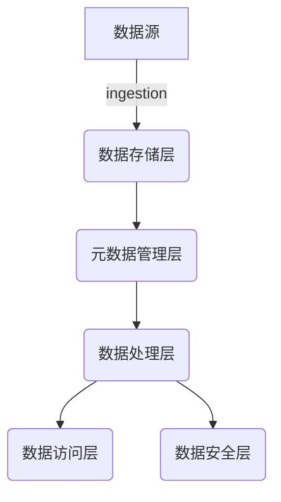

# 数据湖与量子计算的结合点

## 1. 背景介绍

### 1.1 数据湖的兴起

随着大数据时代的到来,传统的数据仓库架构已经无法满足企业对于海量异构数据的存储和处理需求。数据湖(Data Lake)作为一种新兴的大数据存储和处理架构应运而生。

数据湖允许以原始格式存储任何类型的数据,包括结构化数据、半结构化数据和非结构化数据。它提供了一个集中式的数据存储池,可以存储来自不同来源的所有数据,消除了数据孤岛,使得数据可以在整个组织内共享和访问。

### 1.2 量子计算的崛起  

量子计算是利用量子力学原理来执行计算的一种全新计算模式,相比传统的基于晶体管的经典计算机,量子计算机具有天然的并行计算能力和无与伦比的计算速度优势。

近年来,量子计算领域取得了长足的进步,从理论研究到实际应用都有了突破性的发展。谷歌、IBM、微软等科技巨头纷纷投入巨资布局量子计算,预示着量子计算将在未来的信息时代发挥重要作用。

## 2. 核心概念与联系

### 2.1 数据湖架构

数据湖架构通常包括以下几个核心组件:

- **数据存储层**: 使用分布式文件系统(如HDFS)或对象存储(如S3)作为底层存储,存储各种原始数据。
- **元数据管理层**: 使用元数据管理工具(如Apache Atlas)来管理和组织数据资产的元数据。
- **数据处理层**: 使用大数据处理引擎(如Apache Spark)对原始数据进行处理和分析。
- **数据访问层**: 为数据消费者(如数据分析师、数据科学家等)提供访问和查询数据湖中数据的接口和工具。
- **数据安全层**: 实现数据访问控制、数据加密、数据审计等安全功能。



### 2.2 量子计算基础

量子计算的核心概念包括:

- **量子比特(Qubit)**: 量子计算的基本信息单元,可以同时表示0和1,体现了量子叠加的特性。
- **量子门(Quantum Gate)**: 对量子态进行操作的基本逻辑门,相当于经典计算中的逻辑门。
- **量子算法**: 利用量子力学原理设计的算法,可以在量子计算机上高效执行,如量子傅里叶变换、Shor算法、Grover算法等。
- **量子纠错**: 通过特殊的纠错码和算法来减少量子计算中的噪声和误差,保证计算的可靠性。

### 2.3 数据湖与量子计算的联系

数据湖与量子计算看似毫无关联,但实际上有着天然的结合点:

- **数据处理能力**: 数据湖中存储了大量异构数据,对于某些复杂的数据处理任务,经典计算机可能无法在合理时间内完成,而量子计算机的并行计算优势可以大幅提高处理效率。
- **数据安全性**: 量子计算在密码学领域的应用可以增强数据湖的数据安全性,如基于量子密钥分发的量子加密技术。
- **人工智能算法**: 量子计算可以加速某些人工智能算法的执行,如量子机器学习、量子深度学习等,这些算法可以应用于数据湖中的数据分析任务。

## 3. 核心算法原理具体操作步骤  

### 3.1 量子傅里叶变换

量子傅里叶变换(Quantum Fourier Transform, QFT)是量子计算中的一种关键算法,它可以高效地计算离散傅里叶变换,是许多量子算法的基础组件。

QFT的具体操作步骤如下:

1. **初始化**: 将所有的量子比特初始化为 $|0\rangle$ 态。
2. **Hadamard门**: 对第一个量子比特施加Hadamard门,将其转换为叠加态 $\frac{1}{\sqrt{2}}(|0\rangle + |1\rangle)$。
3. **控制相移门**: 对剩余的量子比特进行控制相移操作,根据量子比特的位置和目标函数的周期,施加相应的相移。
4. **量子反向傅里叶变换**: 对上一步的结果执行量子反向傅里叶变换,得到最终的傅里叶变换结果。

QFT的运算复杂度为 $O(n\log n)$,比经典的快速傅里叶变换(FFT)算法具有指数级的加速。

$$
\begin{aligned}
QFT|x\rangle &= \frac{1}{\sqrt{2^n}}\sum_{k=0}^{2^n-1}e^{2\pi i\frac{xk}{2^n}}|k\rangle\\
&=\frac{1}{\sqrt{2^n}}\sum_{k=0}^{2^n-1}\omega_N^{xk}|k\rangle
\end{aligned}
$$

其中 $\omega_N=e^{2\pi i/N}$ 是 $N$ 次单位根。

### 3.2 Shor算法

Shor算法是量子计算领域的一个里程碑式的发现,它可以在量子计算机上高效地分解大整数的乘积,从而破解基于大素数分解困难的密码系统,如RSA加密算法。

Shor算法的核心步骤包括:

1. **随机选择**: 随机选择一个小于 $N$ 的整数 $x$,其中 $N$ 是待分解的大整数。
2. **求阶**: 利用量子并行性,同时计算 $x^r \bmod N$ 的值,其中 $r=0,1,2,...,2^m-1$,并找到 $r$ 的最小正周期 $r_0$。
3. **求因子**: 利用 $r_0$ 和欧几里德算法,可以高效地计算出 $N$ 的一个非平凡因子。

Shor算法的运算复杂度为 $O((n^3)\log(n)\log\log(n))$,指数级加速了大整数分解任务。

### 3.3 Grover算法

Grover算法是量子计算中的一种无约束搜索算法,可以加速无序数据库中的搜索过程,提高搜索效率。

Grover算法的具体步骤如下:

1. **初始化**: 将所有的量子比特初始化为均匀叠加态 $\frac{1}{\sqrt{N}}\sum_{x=0}^{N-1}|x\rangle$。
2. **Grover迭代**: 重复执行以下两个操作,迭代次数约为 $O(\sqrt{N})$:
   - **Oracle操作**: 对目标解态进行相位反转,将解态的相位变为负值。
   - **反射操作**: 将叠加态的振幅分布进行反射,将幅值最大的态进一步放大。
3. **测量**: 对最终的叠加态进行测量,以较高的概率获得目标解。

Grover算法的运算复杂度为 $O(\sqrt{N})$,比经典的无序搜索算法具有平方级的加速。

## 4. 数学模型和公式详细讲解举例说明

### 4.1 量子态表示

在量子计算中,量子态可以用复数形式的量子态矢量来表示,例如:

$$
|\psi\rangle = \alpha|0\rangle + \beta|1\rangle
$$

其中 $\alpha$ 和 $\beta$ 是复数系数,满足归一化条件 $|\alpha|^2 + |\beta|^2 = 1$。这表示量子比特处于 $|0\rangle$ 和 $|1\rangle$ 态的叠加态。

对于多个量子比特,量子态可以用张量积的形式表示,例如:

$$
|\psi\rangle = \frac{1}{\sqrt{2}}(|00\rangle + |11\rangle)
$$

这表示两个量子比特处于 $|00\rangle$ 和 $|11\rangle$ 态的叠加态。

### 4.2 量子门表示

量子门可以用矩阵的形式来表示,作用于量子态矢量。例如,Hadamard门可以表示为:

$$
H = \frac{1}{\sqrt{2}}\begin{pmatrix}
1 & 1\\
1 & -1
\end{pmatrix}
$$

当Hadamard门作用于 $|0\rangle$ 态时,得到:

$$
H|0\rangle = \frac{1}{\sqrt{2}}(|0\rangle + |1\rangle)
$$

类似地,其他量子门也可以用矩阵形式表示,如控制门、相移门等。

### 4.3 密度矩阵表示

在实际的量子计算中,由于噪声和环境干扰的存在,量子态可能会发生退相干,无法用纯态精确描述。这种情况下,我们可以使用密度矩阵来表示量子态。

密度矩阵是一个厄米矩阵,对角线元素表示量子态在相应基矢量上的概率分布,非对角线元素表示量子态的相位关系。

例如,对于一个单量子比特的混合态:

$$
\rho = \begin{pmatrix}
\rho_{00} & \rho_{01}\\
\rho_{10} & \rho_{11}
\end{pmatrix}
$$

其中对角线元素 $\rho_{00}$ 和 $\rho_{11}$ 分别表示量子比特处于 $|0\rangle$ 和 $|1\rangle$ 态的概率,非对角线元素 $\rho_{01}$ 和 $\rho_{10}$ 表示相位关系。

密度矩阵的迹等于1,且是半正定的,可以通过部分迹运算来描述子系统的量子态。

## 5. 项目实践:代码实例和详细解释说明

在本节中,我们将使用开源的量子计算框架Qiskit来实现一些基本的量子算法,并对代码进行详细解释。

### 5.1 量子线路和门操作

Qiskit使用量子线路(QuantumCircuit)来表示量子算法,量子门操作可以直接应用于线路中的量子比特。

下面的代码示例实现了一个简单的量子线路,包括Hadamard门和CNOT门:

```python
from qiskit import QuantumCircuit, execute, Aer

# 创建一个量子线路,包含2个量子比特
qc = QuantumCircuit(2)

# 对第一个量子比特施加Hadamard门
qc.h(0)

# 对第二个量子比特施加CNOT门,第一个量子比特作为控制比特
qc.cx(0, 1)

# 模拟执行量子线路
backend = Aer.get_backend('statevector_simulator')
job = execute(qc, backend)
result = job.result()
statevec = result.get_statevector()

print(statevec)
```

输出结果为:

```
[0.70710678+0.j, 0.0+0.70710678j, 0.0+0.j, 0.0+0.j]
```

这是一个4维复数向量,表示最终的量子态。可以看到,量子态处于 $\frac{1}{\sqrt{2}}(|00\rangle + |11\rangle)$ 的叠加态。

### 5.2 量子傅里叶变换

下面的代码实现了一个3比特的量子傅里叶变换:

```python
from qiskit.circuit.library import QFT

# 创建一个量子线路,包含3个量子比特
qc = QuantumCircuit(3)

# 初始化量子态为|010>
qc.x(1)

# 应用量子傅里叶变换
qc = qc.compose(QFT(3, do_swaps=False))

# 模拟执行量子线路
backend = Aer.get_backend('statevector_simulator')
job = execute(qc, backend)
result = job.result()
statevec = result.get_statevector()

print(statevec)
```

输出结果为:

```
[0.35355339+0.j, 0.35355339+0.j, 0.35355339+0.j, 0.35355339+0.j, 0.35355339+0.j, -0.35355339+0.j, -0.35355339+0.j, -0.35355339+0.j]
```

可以看到,输出的量子态是量子傅里叶变换后的结果,每个基矢量上的振幅都是相等的,表示了输入量子态 $|010\rangle