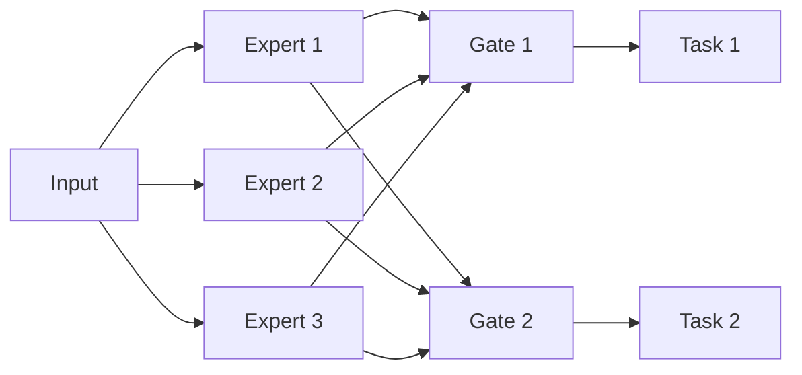

# 文本分类与情感分析：多任务学习的"妙笔生花"

作者：禅与计算机程序设计艺术

## 1. 背景介绍

### 1.1 文本分类与情感分析的重要性
在当今信息爆炸的时代,海量的文本数据如何高效处理和分析,已成为自然语言处理(NLP)领域的重要课题。文本分类和情感分析作为NLP的两大基础任务,在舆情监控、用户画像、个性化推荐等诸多领域有着广泛的应用。

### 1.2 传统方法的局限性
传统的文本分类和情感分析方法,如朴素贝叶斯、支持向量机等,主要基于人工特征工程,存在特征稀疏、鲁棒性差等问题。近年来,深度学习的兴起为这两大任务带来了新的突破。

### 1.3 多任务学习的优势  
多任务学习(Multi-task Learning)通过共享不同任务间的知识,能够提升模型的泛化能力。将文本分类和情感分析作为两个相关任务进行联合建模,有望实现"1+1>2"的效果。本文将重点探讨如何利用多任务学习技术,实现文本分类与情感分析的"妙笔生花"。

## 2. 核心概念与联系

### 2.1 文本分类
文本分类是指将文本按照预定义的类别进行归类。常见的分类体系有主题分类、意图分类、情感极性分类等。其数学表示为:
$$\hat{y} = \arg\max_{c \in C} P(c|x)$$
其中,$x$为输入文本,$C$为候选类别集合,$\hat{y}$为预测类别。

### 2.2 情感分析
情感分析旨在自动判别文本所表达的情感倾向,如积极、消极、中性等。细粒度情感分析还可识别具体的情感类别,如喜悦、愤怒、悲伤等。其数学表示为:
$$\hat{s} = \arg\max_{s \in S} P(s|x)$$  
其中,$S$为候选情感标签集合,$\hat{s}$为预测情感标签。

### 2.3 多任务学习
多任务学习的核心思想是通过共享不同任务间的知识,提升模型的泛化能力。常见的多任务学习框架有参数共享、交替训练等。以Hard-parameter Sharing为例,其数学表示为:
$$\min_{\Theta,\Theta_1,\Theta_2} \mathcal{L}_1(\Theta,\Theta_1) + \mathcal{L}_2(\Theta,\Theta_2)$$
其中,$\Theta$为共享参数,$\Theta_1$和$\Theta_2$分别为任务1和任务2的专有参数。$\mathcal{L}_1$和$\mathcal{L}_2$为相应的损失函数。

### 2.4 文本分类与情感分析的关联
文本分类和情感分析虽然侧重点不同,但在建模过程中有诸多相通之处:

1. 都需要对文本进行向量化表示。常用的方法有词袋模型、TF-IDF、词向量等。
2. 都可基于深度学习模型,如CNN、RNN、Transformer等,学习文本的高层语义表示。  
3. 在应用场景上也常有交叉,如情感极性分类可视为一种特殊的文本分类任务。

因此,将二者作为多任务学习的子任务,有望实现特征表示和知识的复用,提升模型性能。

## 3. 核心算法原理与具体操作步骤

本节将重点介绍一种简洁有效的多任务学习算法——MMoE(Multi-gate Mixture-of-Experts),并详细阐述其在文本分类与情感分析任务中的应用步骤。

### 3.1 MMoE原理

MMoE是一种多门控混合专家模型,其结构如下图所示:



模型主要由三部分组成:

1. 专家(Expert):每个专家是一个独立的神经网络,用于提取输入的不同特征。
2. 门控(Gate):每个任务设置一个门控网络,用于聚合不同专家的输出。门控系数$g$可学习,代表不同专家对该任务的重要性。
3. 任务塔(Task Tower):每个任务设置独立的塔网络,用于完成具体的预测。

MMoE的前向计算过程可概括为:

$$
\begin{aligned}
\mathbf{x} &= \text{Input}(\mathbf{x}) \\
\mathbf{e}_i &= \text{Expert}_i(\mathbf{x}), \quad i=1,2,...,N_e \\
\mathbf{g}_j &= \text{Gate}_j(\mathbf{x}), \quad j=1,2,...,N_t \\
\mathbf{h}_j &= \sum_{i=1}^{N_e} g_{j,i} \cdot \mathbf{e}_i \\
\hat{\mathbf{y}}_j &= \text{TaskTower}_j(\mathbf{h}_j)
\end{aligned}
$$

其中,$\mathbf{x}$为输入,$N_e$为专家数量,$N_t$为任务数量,$\hat{\mathbf{y}}_j$为任务$j$的输出。

模型的优化目标为所有任务损失函数的加权和:

$$\mathcal{L} = \sum_{j=1}^{N_t} \alpha_j \mathcal{L}_j(\hat{\mathbf{y}}_j, \mathbf{y}_j)$$

其中,$\alpha_j$为任务$j$的权重系数,$\mathbf{y}_j$为任务$j$的真实标签。

### 3.2 应用于文本分类与情感分析

将MMoE应用于文本分类与情感分析的多任务学习,可分为以下几个步骤:

#### Step 1. 文本预处理
对原始文本进行分词、去停用词、词性标注等预处理操作,得到规范化的文本输入。

#### Step 2. 文本表示
将预处理后的文本转换为数值化的特征向量。可选用的方法有:

- 词袋模型:统计每个词在文本中的出现频次,生成高维稀疏向量。
- TF-IDF:在词袋模型的基础上,考虑词在全局的重要性,生成加权的文本向量。 
- 词嵌入:通过Word2Vec、GloVe等预训练模型,将词映射为低维稠密向量。
- 预训练语言模型:如BERT、XLNet等,可生成动态的上下文相关的词向量。

#### Step 3. 搭建MMoE模型
1. 定义Expert:可使用CNN、BiLSTM、Transformer等常见的文本特征提取器。
2. 定义Gate:一般为简单的全连接层,输出$N_e$维的门控系数。
3. 定义Task Tower:对于分类任务,可使用全连接层+Softmax激活函数;对于回归任务,可使用全连接层+线性激活函数。
4. 组装模型:按照MMoE的计算流程,将各部分组装成完整的模型。

#### Step 4. 模型训练与调优
1. 准备数据:按照一定比例划分训练集、验证集和测试集。
2. 定义损失函数:对于文本分类,常用交叉熵损失;对于情感分析,可使用交叉熵损失或平方损失。
3. 设置优化器:如Adam、AdamW等,调整学习率、权重衰减等超参数。
4. 训练模型:采用Mini-batch的方式,迭代训练模型至收敛。可使用Early Stopping策略防止过拟合。
5. 模型评估:在验证集和测试集上评估模型性能,如准确率、F1值、AUC等。

#### Step 5. 模型部署与应用
将训练好的模型封装为API接口,集成到实际的应用系统中。如舆情监控平台、智能客服系统等。

## 4. 数学模型和公式详细讲解举例说明

本节将以一个简单的例子,直观阐述MMoE的数学原理。

假设我们有两个任务:新闻主题分类和情感极性分类。输入为一段文本$\mathbf{x}$,目标是预测其主题类别$\hat{y}_1 \in \{0,1\}^C$(C为候选主题数)和情感极性$\hat{y}_2 \in \{0,1\}$。

首先,将文本$\mathbf{x}$通过预处理和词嵌入,转换为$d$维的特征向量$\mathbf{e} \in \mathbb{R}^d$。

然后,定义$N_e$个Expert网络,每个Expert为一个$L$层的全连接网络:

$$\mathbf{e}_i = \text{MLP}_i(\mathbf{e}), \quad i=1,2,...,N_e$$

其中,$\mathbf{e}_i \in \mathbb{R}^{d'}$为第$i$个Expert的输出。

接着,定义两个任务的Gate网络,分别计算$N_e$个Expert对该任务的重要性:

$$
\begin{aligned}
\mathbf{g}_1 &= \text{Softmax}(\mathbf{W}_1 \mathbf{e} + \mathbf{b}_1) \\
\mathbf{g}_2 &= \text{Softmax}(\mathbf{W}_2 \mathbf{e} + \mathbf{b}_2)
\end{aligned}
$$

其中,$\mathbf{W}_1, \mathbf{W}_2 \in \mathbb{R}^{N_e \times d}, \mathbf{b}_1, \mathbf{b}_2 \in \mathbb{R}^{N_e}$为Gate网络的参数。$\mathbf{g}_1, \mathbf{g}_2 \in \mathbb{R}^{N_e}$为两个任务的门控系数,满足$\sum_{i=1}^{N_e} g_{1,i} = \sum_{i=1}^{N_e} g_{2,i} = 1$。

然后,计算每个任务的混合特征表示:

$$
\begin{aligned}
\mathbf{h}_1 &= \sum_{i=1}^{N_e} g_{1,i} \cdot \mathbf{e}_i \\
\mathbf{h}_2 &= \sum_{i=1}^{N_e} g_{2,i} \cdot \mathbf{e}_i
\end{aligned}
$$

其中,$\mathbf{h}_1, \mathbf{h}_2 \in \mathbb{R}^{d'}$为两个任务的混合特征。

最后,将混合特征输入到任务特定的Tower网络,得到预测输出:

$$
\begin{aligned}
\hat{\mathbf{y}}_1 &= \text{Softmax}(\mathbf{W}_{t1} \mathbf{h}_1 + \mathbf{b}_{t1}) \\
\hat{y}_2 &= \text{Sigmoid}(\mathbf{w}_{t2}^T \mathbf{h}_2 + b_{t2})
\end{aligned}
$$

其中,$\mathbf{W}_{t1} \in \mathbb{R}^{C \times d'}, \mathbf{b}_{t1} \in \mathbb{R}^C$为主题分类任务的参数,$\mathbf{w}_{t2} \in \mathbb{R}^{d'}, b_{t2} \in \mathbb{R}$为情感分类任务的参数。

模型的总损失函数为两个任务损失的加权和:

$$\mathcal{L} = \alpha_1 \cdot \text{CrossEntropy}(\hat{\mathbf{y}}_1, \mathbf{y}_1) + \alpha_2 \cdot \text{BinaryCrossEntropy}(\hat{y}_2, y_2)$$

其中,$\alpha_1, \alpha_2$为两个任务的权重系数。

通过端到端的反向传播和梯度下降,可优化模型参数$\{\text{MLP}_i, \mathbf{W}_j, \mathbf{b}_j, \mathbf{W}_{tj}, \mathbf{b}_{tj}, \mathbf{w}_{tj}, b_{tj}\}$,实现多任务的联合学习。

## 5. 项目实践:代码实例与详细解释说明

下面以PyTorch为例,给出MMoE用于文本分类与情感分析多任务学习的简要代码。

```python
import torch
import torch.nn as nn

class Expert(nn.Module):
    def __init__(self, input_dim, hidden_dim, output_dim):
        super(Expert, self).__init__()
        self.fc1 = nn.Linear(input_dim, hidden_dim)
        self.fc2 = nn.Linear(hidden_dim, output_dim)
        self.relu = nn.ReLU()

    def forward(self, x):
        x = self.fc1(x)
        x =