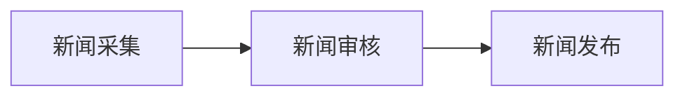
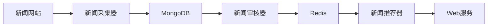

# 新闻管理系统详细设计与具体代码实现

## 1. 背景介绍

### 1.1 新闻管理系统的重要性

在当今信息时代,新闻传播已经成为人们获取信息和了解世界的主要渠道之一。无论是传统媒体还是新兴媒体,都需要一个高效、可靠的新闻管理系统来支撑其日常运营。一个优秀的新闻管理系统不仅能够帮助新闻机构有效管理新闻资源,还能为读者提供更加优质的新闻服务。

### 1.2 新闻管理系统的主要功能

一个完整的新闻管理系统通常包括以下几个核心功能模块:

- 新闻采集模块:自动抓取各大新闻网站的新闻内容
- 新闻审核模块:人工审核新闻内容,过滤低质量和不实信息
- 新闻发布模块:将审核通过的新闻内容发布到各个新闻平台
- 用户管理模块:管理新闻订阅用户的账号和权限
- 数据分析模块:对新闻数据进行多维度分析,为决策提供支持

## 2. 核心概念与联系

### 2.1 新闻数据模型

在新闻管理系统中,新闻数据是最核心的资源。一条新闻数据通常包括以下几个关键字段:

- 标题(title)
- 内容(content)
- 作者(author)
- 发布时间(pub_time)
- 新闻来源(source)
- 关键词(keywords)
- 分类标签(category)

这些字段构成了一条新闻的基本框架,也是系统进行数据处理和分析的基础。

### 2.2 新闻处理流程

新闻管理系统的核心流程可以概括为"采集 -> 审核 -> 发布"三个主要环节,如下图所示:



1. **新闻采集**: 系统从各大新闻网站抓取原始新闻数据,进行基本的格式化处理。
2. **新闻审核**: 人工编辑审核新闻内容的真实性、可读性等,对低质量新闻进行过滤。
3. **新闻发布**: 将审核通过的新闻内容发布到各个新闻平台,供用户订阅和查阅。

除了这三个核心环节,系统还包括用户管理、数据分析等辅助功能模块。

## 3. 核心算法原理具体操作步骤  

### 3.1 新闻采集算法

新闻采集是整个系统的基础,直接决定了后续处理的数据质量。常用的新闻采集算法有:

1. **基于规则的网页解析**

该算法依赖于事先定义好的规则集,通过解析网页的HTML/XML结构从中提取出新闻正文、标题等关键信息。规则可以是XPath表达式、CSS选择器等。

优点是实现简单,适用于结构相对固定的网页。缺点是无法处理动态页面,维护工作量较大。

2. **基于学习的网页解析**

这种算法通过机器学习的方式自动构建解析模型,能够适应网页结构的变化。常用的模型有CRF(条件随机场)、序列标注等。

优点是通用性更强,能处理动态页面。缺点是实现复杂,需要大量标注数据进行模型训练。

3. **综合采集策略**

实际应用中,通常会结合以上两种方法的优势,对不同类型的网页采取不同的采集策略,以提高采集的准确率和覆盖面。

### 3.2 新闻审核算法

新闻审核的主要目标是过滤低质量、夸张失实的新闻内容。审核算法主要包括:

1. **基于规则的文本过滤**

通过预定义的关键词词库和语法规则,过滤包含违禁词汇、突出夸张性用语的新闻。这是最基本的审核手段。

2. **基于统计的文本分类**

利用机器学习的文本分类技术,判断新闻内容是否属于低质量类别。常用的分类模型有朴素贝叶斯、SVM、FastText等。

3. **基于知识图谱的审核**

构建一个包含实体、事件等知识的知识库,利用知识图谱算法挖掘新闻与已有知识的矛盾和冲突,从而发现虚假新闻。

### 3.3 新闻推荐算法

除了基本的采集和审核功能,新闻推荐也是新闻管理系统的一个重要组成部分。通过分析用户的阅读行为和兴趣偏好,为用户推荐感兴趣的个性化新闻,可以提高用户体验和新闻传播效率。常用的新闻推荐算法有:

1. **协同过滤算法**

基于用户之间的行为相似性,将兴趣相似的用户分为一个邻居群,然后将一个用户喜欢的新闻推荐给这个邻居群中的其他用户。常用的算法有基于用户的协同过滤、基于项目的协同过滤等。

2. **内容过滤算法** 

根据新闻的关键词、主题等内容特征,计算新闻与用户兴趣的相似度,将相似度较高的新闻推荐给用户。常用的算法有TF-IDF、主题模型等。

3. **混合推荐算法**

综合协同过滤和内容过滤的优点,构建混合推荐算法,以期获得更好的推荐效果。

## 4. 数学模型和公式详细讲解举例说明

在新闻管理系统中,有许多环节涉及到复杂的数学模型和公式计算,下面将对其中一些常用模型进行详细讲解。

### 4.1 TF-IDF算法

TF-IDF(Term Frequency-Inverse Document Frequency)是一种常用的文本特征向量化方法,广泛应用于新闻内容分析、相似度计算等场景。其基本思想是:如果某个词在文档中出现的频率越高,同时在整个语料库中出现的频率越低,则该词对这个文档越有区分能力。

TF-IDF的计算公式如下:

$$
\mathrm{tfidf}(t, d, D) = \mathrm{tf}(t, d) \times \mathrm{idf}(t, D)
$$

其中:

- $\mathrm{tf}(t, d)$表示词$t$在文档$d$中出现的频率,通常使用原始词频或增强型词频计算;
- $\mathrm{idf}(t, D)$表示词$t$在语料库$D$中的逆向文档频率,公式为$\mathrm{idf}(t, D) = \log \frac{|D|}{|\{d \in D: t \in d\}|}$。

假设我们有一个新闻语料库$D$,包含5篇文档,其中第1篇文档$d_1$的内容为"本拟于今日发布的重大新闻被推迟"。那么词"新闻"的TF-IDF权重计算过程为:

1. 计算"新闻"在$d_1$中的词频$\mathrm{tf}(新闻, d_1) = 1$
2. 计算"新闻"在整个语料库$D$中出现的文档数$|\{d \in D: 新闻 \in d\}| = 3$
3. 计算逆向文档频率$\mathrm{idf}(新闻, D) = \log \frac{5}{3} \approx 0.51$
4. 计算TF-IDF权重$\mathrm{tfidf}(新闻, d_1, D) = 1 \times 0.51 \approx 0.51$

通过TF-IDF权重,我们可以构建出文档的特征向量,为后续的新闻内容分析、相似度计算等提供基础。

### 4.2 TextRank算法

TextRank是一种基于图模型的关键词提取和文本摘要算法,其思想来源于PageRank算法。算法将文本看作是一个加权有向图,单词之间的关系通过边的权重表示。通过计算每个单词/句子在图中的"重要性"分数,从而提取出关键词和摘要句子。

TextRank的核心公式为:

$$
WS(V_i) = (1-d) + d \times \sum_{j \in \operatorname{In}(V_i)} \frac{w_{ji}}{W(V_j)} WS(V_j)
$$

其中:

- $V_i$表示文本单位(单词或句子)
- $WS(V_i)$表示单位$V_i$的重要性分数
- $\operatorname{In}(V_i)$表示指向$V_i$的所有边的集合
- $w_{ji}$表示从$V_j$到$V_i$的边权重,通常设为两个单位共现次数
- $W(V_j)$表示$V_j$的出边权重之和
- $d$是阻尼系数,一般取值0.85

TextRank算法的基本流程为:

1. 构建文本图模型,计算单位之间的边权重
2. 使用上述公式迭代计算每个单位的重要性分数
3. 根据分数排序,选取Top-N作为关键词/摘要句子

由于TextRank算法充分考虑了单词/句子之间的关联关系,因此在关键词提取和文本摘要领域表现优异。

### 4.3 Word2Vec算法

Word2Vec是一种经典的词嵌入(Word Embedding)算法,能够将词语映射到一个低维的连续向量空间,使得语义相似的词在该空间中的向量也相似。Word2Vec广泛应用于自然语言处理的各个领域,是深度学习在NLP领域的一个重大突破。

Word2Vec包含两种经典模型:CBOW(连续词袋模型)和Skip-Gram。以Skip-Gram为例,其目标是根据当前词语$w_t$预测上下文窗口中其他词语$w_{t-n}, \cdots, w_{t-1}, w_{t+1}, \cdots, w_{t+n}$的概率,即最大化目标函数:

$$
\frac{1}{T} \sum_{t=1}^{T} \sum_{-n \leq j \leq n, j \neq 0} \log P(w_{t+j} | w_t)
$$

其中$T$是语料库中的词语总数,通过Softmax函数计算条件概率:

$$
P(w_c | w_t) = \frac{\exp(v_{w_c}^{\top} v_{w_t})}{\sum_{w=1}^{W} \exp(v_w^{\top} v_{w_t})}
$$

$v_w$和$v_{w_c}$分别表示词语$w$和$w_c$在向量空间中的表示。

Word2Vec通过神经网络训练得到词向量表示,这些向量能够很好地体现词语之间的语义关系,为下游的NLP任务提供有效的特征表示。

## 5. 项目实践:代码实例和详细解释说明

为了更好地理解新闻管理系统的实现细节,我们将通过一个基于Python的实例项目来演示其中的关键环节。本实例包含新闻采集、审核和推荐三个核心模块,并使用了前文介绍的TF-IDF、TextRank等算法。

### 5.1 系统架构



上图展示了整个系统的架构和模块之间的交互流程:

1. **新闻采集器**:负责从各大新闻网站抓取原始新闻数据,并存储到MongoDB数据库中。
2. **新闻审核器**:从MongoDB中读取新闻数据,对其内容进行审核过滤,将审核通过的新闻存储到Redis中。
3. **新闻推荐器**:从Redis中读取新闻数据,分析用户兴趣模型,推荐个性化新闻给用户。
4. **Web服务**:为用户提供新闻浏览、订阅等Web界面服务。

### 5.2 新闻采集器实现

新闻采集器的主要任务是从各大新闻网站抓取原始新闻数据,并进行基本的格式化处理后存储到MongoDB数据库中。我们使用Python的requests库发送HTTP请求,BeautifulSoup库解析HTML页面。

```python
import requests
from bs4 import BeautifulSoup
from datetime import datetime
from pymongo import MongoClient

# 连接MongoDB数据库