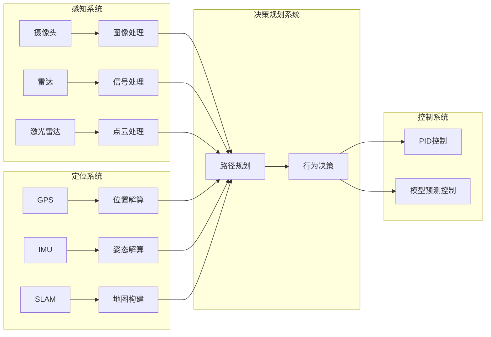

## 1. 背景介绍

### 1.1 无人驾驶车辆的起源与发展

无人驾驶车辆，或自动驾驶汽车，是近年来科技领域最受关注的主题之一。其概念最早可以追溯到 20 世纪 20 年代，但直到近十年来，随着人工智能、传感器技术、计算机视觉等领域的飞速发展，无人驾驶才真正从科幻走向现实。

### 1.2 无人驾驶技术的社会意义

无人驾驶技术被认为是未来交通运输的关键技术之一，其潜在的社会效益包括：

* **提高道路安全性:** 自动驾驶系统能够消除人为错误，从而显著降低交通事故发生率。
* **缓解交通拥堵:** 自动驾驶车辆能够更高效地利用道路空间，并通过车联网技术实现协同驾驶，从而缓解交通拥堵。
* **提高交通效率:** 自动驾驶车辆能够按照最优路线行驶，并根据实时路况进行调整，从而提高交通效率。
* **改善环境:** 自动驾驶车辆能够采用更经济的驾驶方式，从而减少尾气排放，改善环境。

### 1.3 无人驾驶技术的应用领域

无人驾驶技术的应用领域非常广泛，包括：

* **私家车:** 为用户提供更安全、便捷的出行体验。
* **公共交通:** 自动驾驶公交车、出租车、地铁等，能够提高公共交通的效率和安全性。
* **物流运输:** 自动驾驶卡车能够降低物流成本，并提高运输效率。
* **农业:** 自动驾驶拖拉机、收割机等能够提高农业生产效率。
* **军事:** 自动驾驶车辆能够用于战场侦察、物资运输等任务。

## 2. 核心概念与联系

### 2.1 无人驾驶系统的核心组成部分

无人驾驶系统通常由以下几个核心组成部分构成：

* **感知系统:** 利用各种传感器，如摄像头、雷达、激光雷达等，感知周围环境，收集道路信息、交通状况、障碍物等数据。
* **定位系统:** 利用 GPS、IMU 等技术确定车辆的精确位置和姿态。
* **决策规划系统:** 根据感知系统收集的信息和定位系统提供的车辆位置，规划车辆的行驶路线，并做出驾驶决策，如加速、减速、转向等。
* **控制系统:** 将决策规划系统生成的指令转换为实际的车辆控制信号，控制车辆的转向、加速、制动等动作。

### 2.2 核心概念之间的联系

无人驾驶系统的各个组成部分之间相互协作，共同完成自动驾驶任务。

* **感知系统** 为 **决策规划系统** 提供环境信息，以便规划行驶路线和做出驾驶决策。
* **定位系统** 为 **决策规划系统** 提供车辆位置信息，以便规划路线和控制车辆。
* **决策规划系统** 为 **控制系统** 提供控制指令，以便控制车辆的运动。

## 3. 核心算法原理具体操作步骤

### 3.1 感知算法

感知算法是无人驾驶系统的基础，其主要任务是识别和理解周围环境。常用的感知算法包括：

* **计算机视觉:** 利用摄像头获取图像信息，并通过图像处理算法识别道路、交通标志、车辆、行人等目标。
* **雷达:** 利用无线电波探测目标，并根据反射波的时间差和频率差计算目标的距离、速度、方向等信息。
* **激光雷达:** 利用激光束探测目标，并根据激光反射时间计算目标的距离和三维形状。

### 3.2 定位算法

定位算法用于确定车辆的精确位置和姿态。常用的定位算法包括：

* **GPS:** 利用全球定位系统确定车辆的经纬度和高度信息。
* **IMU:** 利用惯性测量单元测量车辆的加速度和角速度，并通过积分计算车辆的位置和姿态。
* **SLAM:** 利用同步定位与地图构建技术，同时构建环境地图和确定车辆位置。

### 3.3 决策规划算法

决策规划算法根据感知系统收集的信息和定位系统提供的车辆位置，规划车辆的行驶路线，并做出驾驶决策。常用的决策规划算法包括：

* **路径规划:** 寻找一条从起点到终点的安全、高效的行驶路线。
* **行为决策:** 根据交通规则、道路状况、其他车辆的行为等因素，做出驾驶决策，如加速、减速、转向等。

### 3.4 控制算法

控制算法将决策规划系统生成的指令转换为实际的车辆控制信号，控制车辆的转向、加速、制动等动作。常用的控制算法包括:

* **PID 控制:** 利用比例、积分、微分控制算法控制车辆的速度和方向。
* **模型预测控制:** 利用车辆动力学模型预测车辆未来的状态，并根据预测结果优化控制指令。

## 4. 数学模型和公式详细讲解举例说明

### 4.1 计算机视觉模型

计算机视觉模型用于识别和理解图像信息。常用的计算机视觉模型包括：

* **卷积神经网络 (CNN):** 利用卷积操作提取图像特征，并通过多层神经网络进行分类或回归。
* **循环神经网络 (RNN):** 利用循环结构处理序列数据，如视频、语音等。
* **目标检测模型:** 利用深度学习算法识别图像中的目标，并确定其位置和类别。

### 4.2 定位模型

定位模型用于确定车辆的精确位置和姿态。常用的定位模型包括：

* **卡尔曼滤波:** 利用状态空间模型预测车辆的状态，并根据观测数据更新预测结果。
* **粒子滤波:** 利用大量粒子模拟车辆的可能状态，并根据观测数据更新粒子的权重。

### 4.3 决策规划模型

决策规划模型用于规划车辆的行驶路线，并做出驾驶决策。常用的决策规划模型包括：

* **马尔可夫决策过程 (MDP):** 利用状态转移概率和奖励函数建模车辆的决策过程。
* **强化学习:** 利用试错学习方法，通过与环境交互学习最优的驾驶策略。

## 5. 项目实践：代码实例和详细解释说明

### 5.1 基于 ROS 的无人驾驶系统

ROS (Robot Operating System) 是一个开源的机器人软件平台，提供了丰富的工具和库，用于开发机器人应用程序。

以下是一个基于 ROS 的无人驾驶系统示例：

```python
#!/usr/bin/env python

import rospy
from sensor_msgs.msg import Image
from geometry_msgs.msg import Twist

class AutonomousDrivingNode:

    def __init__(self):
        rospy.init_node('autonomous_driving')

        # 订阅摄像头图像
        self.image_sub = rospy.Subscriber('/camera/image_raw', Image, self.image_callback)

        # 发布控制指令
        self.cmd_vel_pub = rospy.Publisher('/cmd_vel', Twist, queue_size=10)

    def image_callback(self, msg):
        # 处理图像数据
        # ...

        # 生成控制指令
        twist = Twist()
        twist.linear.x = 0.5
        twist.angular.z = 0.1

        # 发布控制指令
        self.cmd_vel_pub.publish(twist)

if __name__ == '__main__':
    node = AutonomousDrivingNode()
    rospy.spin()
```

### 5.2 代码解释

* `rospy.init_node('autonomous_driving')`: 初始化 ROS 节点，节点名称为 `autonomous_driving`。
* `self.image_sub = rospy.Subscriber('/camera/image_raw', Image, self.image_callback)`: 订阅摄像头图像话题 `/camera/image_raw`，回调函数为 `self.image_callback`。
* `self.cmd_vel_pub = rospy.Publisher('/cmd_vel', Twist, queue_size=10)`: 发布控制指令话题 `/cmd_vel`，消息类型为 `Twist`。
* `self.image_callback(self, msg)`: 摄像头图像回调函数，处理图像数据并生成控制指令。
* `twist = Twist()`: 创建一个 `Twist` 消息，用于存储控制指令。
* `twist.linear.x = 0.5`: 设置车辆的线速度为 0.5 米/秒。
* `twist.angular.z = 0.1`: 设置车辆的角速度为 0.1 弧度/秒。
* `self.cmd_vel_pub.publish(twist)`: 发布控制指令消息。

## 6. 实际应用场景

### 6.1 RoboTaxi

RoboTaxi 是无人驾驶出租车的简称，其目标是为用户提供按需出行服务。用户可以通过手机 APP 预约 RoboTaxi，车辆会自动行驶到用户指定的位置，并将用户安全送达目的地。

### 6.2 无人驾驶公交车

无人驾驶公交车能够提高公共交通的效率和安全性。自动驾驶系统能够根据实时路况调整行驶路线，并避免人为错误，从而提高公交车的运营效率。

### 6.3 无人驾驶物流

无人驾驶卡车能够降低物流成本，并提高运输效率。自动驾驶系统能够优化行驶路线，并减少人为因素造成的延误，从而提高物流运输效率。

## 7. 工具和资源推荐

### 7.1 ROS

ROS (Robot Operating System) 是一个开源的机器人软件平台，提供了丰富的工具和库，用于开发机器人应用程序。

### 7.2 Gazebo

Gazebo 是一个三维机器人仿真环境，可以用于模拟各种机器人和传感器，并测试无人驾驶算法。

### 7.3 KITTI 数据集

KITTI 数据集是一个用于自动驾驶研究的公开数据集，包含大量的真实道路场景图像和激光雷达数据。

## 8. 总结：未来发展趋势与挑战

### 8.1 未来发展趋势

* **更高等级的自动驾驶:** 目前大部分无人驾驶系统处于 L2 或 L3 级别，未来将向 L4 和 L5 级别发展，实现完全自动驾驶。
* **车路协同:** 将车辆与道路基础设施连接起来，实现信息共享和协同控制，提高交通效率和安全性。
* **人工智能技术的进一步发展:** 深度学习、强化学习等人工智能技术将继续推动无人驾驶技术的进步。

### 8.2 挑战

* **安全性:** 无人驾驶系统的安全性是至关重要的，需要解决各种复杂场景下的安全问题。
* **法律法规:** 无人驾驶车辆的法律法规尚未完善，需要制定相应的法律法规，规范无人驾驶车辆的研发、测试和运营。
* **社会接受度:** 无人驾驶技术的社会接受度还需要进一步提高，需要解决公众对无人驾驶车辆的安全性、隐私等方面的担忧。

## 9. 附录：常见问题与解答

### 9.1 无人驾驶车辆如何应对恶劣天气？

无人驾驶车辆通常配备了各种传感器，如摄像头、雷达、激光雷达等，能够在恶劣天气条件下感知周围环境。此外，无人驾驶系统还会利用地图信息、天气预报等数据，预测道路状况，并调整行驶策略。

### 9.2 无人驾驶车辆如何处理道德困境？

无人驾驶车辆的道德困境是一个复杂的问题，目前尚无完美的解决方案。一些研究者建议采用机器学习算法，根据大量的案例数据训练无人驾驶系统的道德决策能力。

### 9.3 无人驾驶车辆的安全性如何保障？

无人驾驶车辆的安全性是至关重要的，需要从多个方面进行保障，包括：

* **传感器冗余:** 使用多个传感器进行环境感知，提高系统的可靠性。
* **算法安全:** 采用安全可靠的算法，避免系统出现错误。
* **测试验证:** 进行大量的测试验证，确保系统在各种场景下都能安全运行。

## 10. Mermaid流程图

