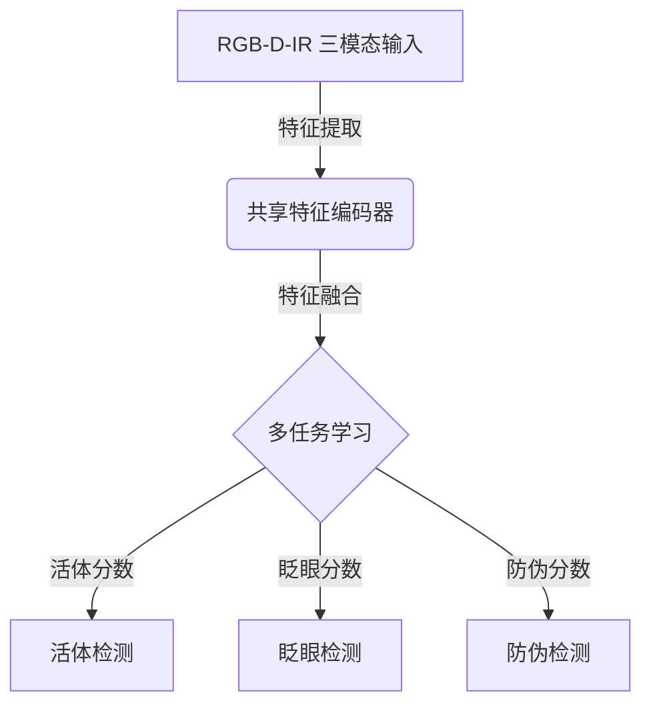
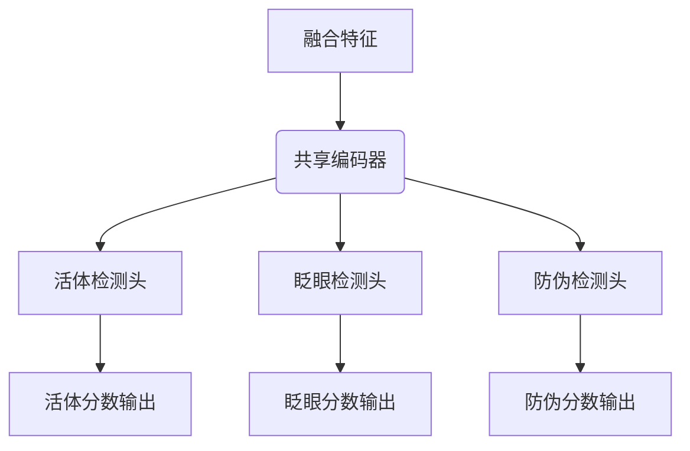

# 智能假冒人脸过滤的手机端用户身份鉴定算法研发及系统实现

## 1.背景介绍

### 1.1 人脸识别技术的重要性

随着移动互联网、人工智能和大数据技术的飞速发展，人脸识别技术已经广泛应用于手机解锁、支付安全、身份认证等多个领域。尤其是在金融、政务、安防等对安全性要求较高的场景中,人脸识别作为一种高效、便捷和无接触的生物识别方式,具有不可替代的重要作用。

然而,伴随人脸识别技术的普及,一些不法分子也开始利用科技手段制作高仿真人脸模型、视频等攻击载体,试图欺骗和绕过人脸识别系统,从而实施诈骗、盗窃等违法犯罪活动。因此,如何有效识别和过滤这些智能假冒人脸攻击,成为人脸识别技术发展的重大挑战之一。

### 1.2 智能假冒人脸攻击的危害

智能假冒人脸攻击具有以下几个特点:

1. **仿真度高**:利用3D打印、硅胶模具等先进技术制作的假人脸,形态、纹理、动态等细节都能高度贴近真人;
2. **欺骗性强**:能够有效绕过基于单一传感器(如RGB摄像头)的活体检测机制;
3. **攻击成本低**:随着技术发展,制作高仿真人脸模型的成本正在持续降低;
4. **隐蔽性高**:借助视频直播等通讯手段,远程发起攻击,难以被发现和追查。

一旦这些智能假冒人脸攻击得逞,将给企业和用户带来巨大的财产损失和隐私泄露风险。因此,研发出能够在手机端可靠、高效地识别和过滤各类假冒人脸攻击的算法和系统,具有重要的现实意义和应用价值。

## 2.核心概念与联系

### 2.1 人脸活体检测

人脸活体检测(Face Liveness Detection)技术是识别和防范假冒人脸攻击的关键措施。它通过分析人脸的生物特征和运动特征,判断输入的人脸图像或视频是来自真人的活体还是非活体攻击载体(如照片、视频、3D模型等)。常用的活体检测方法包括:

- **光线分析法**:通过红外线、3D结构光等手段,分析人脸在不同光线条件下的反射、散射等光学特性;
- **运动分析法**:要求被检测对象做出特定的运动(如眨眼、点头等),分析其运动轨迹和面部变形是否符合预期;
- **生物特征分析法**:提取人眼、嘴唇、鼻子等关键区域的生物特征,检测其细微变化(如眨眼时睫毛抖动等)。

这些传统活体检测方法虽然能够有效防范照片、视频等低级攻击,但对于高仿真3D模型等智能攻击载体,其鲁棒性和可靠性还有待提高。

### 2.2 深度学习在人脸活体检测中的作用

近年来,深度学习技术在计算机视觉、模式识别等领域取得了突破性进展,为提升人脸活体检测的性能提供了新的思路和方法。深度神经网络能够自动从大量真人和攻击载体的人脸图像/视频数据中学习到微观的纹理、光影和运动模式等特征,从而更好地区分活体和非活体人脸。

常见的基于深度学习的人脸活体检测模型有:

- **卷积神经网络(CNN)**:善于从静态图像中提取纹理、光影等局部特征,可用于检测基于图像的攻击;
- **循环神经网络(RNN)**:适合对序列数据(如视频)建模,可用于检测基于视频的攻击;
- **生成对抗网络(GAN)**:通过生成器和判别器的对抗训练,能够学习到更加细微和难以捕捉的活体特征。

通过有效融合多模态(如RGB、深度、红外等)数据输入,并采用端到端的深度学习模型,能够显著提高人脸活体检测的准确性和鲁棒性,为智能假冒人脸的过滤提供可靠的技术支持。

## 3.核心算法原理具体操作步骤

本节将介绍一种基于多任务卷积神经网络(Multi-task Convolutional Neural Network)的智能假冒人脸过滤算法。该算法的优势在于:

1. 能够同时利用RGB、深度和红外三种模态数据,充分挖掘多源异构数据的互补信息; 
2. 采用多任务学习框架,使不同任务之间的特征表示可以相互借鉴和增强,提高了模型的泛化能力;
3. 端到端的网络结构,无需人工设计特征,能自动从数据中学习到高层次的活体特征表示。

### 3.1 算法框架

该算法的整体框架如下图所示:

首先,RGB图像、深度图像和红外图像作为三个模态输入,分别通过对应的特征编码器(如VGGNet、ResNet等)提取特征;然后将三个模态的特征在某一层级进行融合,得到融合特征表示;最后,融合特征被输入到多任务学习模块,同时完成活体检测、眨眼检测和防伪检测三个任务,得到相应的分数输出。在训练阶段,三个任务的损失函数会被联合优化,实现特征表示的相互增强。

### 3.2 特征编码器

特征编码器的作用是从输入的RGB图像、深度图像和红外图像中提取相应的特征表示。这里采用的是广泛使用的VGGNet模型,它具有简单的网络结构、较小的参数量,但表现出色。

对于RGB输入,直接采用标准的VGGNet;对于深度图像,将输入通道数从3改为1;对于红外图像,也将输入通道数改为1。三个模态的特征编码器在浅层卷积层的参数是完全共享的,而在深层卷积层则是分开学习的。这一设计能够在一定程度上实现参数共享,降低过拟合风险。

### 3.3 特征融合

在得到三个模态的特征表示之后,需要将它们融合成一个统一的特征向量,作为多任务学习模块的输入。这里采用的是简单有效的元素级特征融合(Element-wise Feature Fusion)方法,即对应位置的特征向量元素进行加权求和:

$$
\mathbf{f}_\text{fused} = \alpha \mathbf{f}_\text{rgb} + \beta \mathbf{f}_\text{depth} + \gamma \mathbf{f}_\text{ir}
$$

其中, $\mathbf{f}_\text{rgb}$、$\mathbf{f}_\text{depth}$和$\mathbf{f}_\text{ir}$分别表示RGB、深度和红外模态的特征向量, $\alpha$、$\beta$和$\gamma$是可学习的权重系数,用于自动平衡不同模态的重要性。

### 3.4 多任务学习

多任务学习(Multi-task Learning)模块的核心思想是:利用不同但相关的任务之间的相互影响,使不同任务在学习过程中"增强"彼此,提高各个任务的泛化性能。在该算法中,涉及到以下三个相关任务:

1. **活体检测**:根据融合特征,判断输入是活体人脸还是非活体攻击载体,属于二分类问题;
2. **眨眼检测**:检测人脸在一段时间内是否存在眨眼行为,也属于二分类问题;
3. **防伪检测**:判断输入是否为伪造的人脸图像/视频,如照片、视频回放、3D模型等,同样是二分类问题。

上述三个任务之间是相关的,因为真实的活体人脸不仅能被正确检测为活体,同时也会存在眨眼等生物运动特征,且不属于任何类型的伪造载体。通过在网络中引入这些监督信号,可以促使模型学习到更加全面和细致的活体特征表示。

多任务学习模块的具体结构采用的是共享编码器 + 任务特定头(Task-specific Head)的设计,如下图所示:

融合特征首先通过一个共享的编码器网络进行特征转换和高级特征提取,然后分别输入到三个任务特定的头网络(如全连接层),得到各个任务的分数输出。在训练阶段,三个任务的损失函数(如二元交叉熵损失)会被加权求和,通过反向传播算法联合优化网络参数。

### 3.5 训练策略

1. **数据增广**:由于深度学习模型对数据的依赖性很强,因此需要构建足够大且多样化的数据集。除了收集真实的活体人脸数据,还需要生成各种类型的非活体攻击载体数据,如印刷图像、视频回放、3D模型等。同时还可以对现有数据进行变换(如旋转、缩放、添加噪声等)以扩大数据量。

2. **难例挖掘**:在网络训练过程中,定期遍历验证集,将那些被误判的难例数据反馈回训练集,迫使模型"学习"这些难以分类的边缘样本,不断提高泛化能力。

3. **迁移学习**:首先在大规模的通用人脸数据集(如MS-Celeb-1M、VGGFace2等)上预训练一个基础的人脸识别模型,然后在目标活体检测任务的数据集上进行微调(fine-tune),能够显著提升模型的收敛速度和性能。

4. **联合半监督学习**:除了使用标注的监督数据,还可以利用海量的未标注数据进行半监督学习。常见的方法有自注意力(Self-Attention)、均值教师模型(Mean Teacher Model)等,能够充分利用未标注数据中蕴含的丰富信息,进一步提升模型的泛化性能。

## 4.数学模型和公式详细讲解举例说明

在上一节介绍的多任务卷积神经网络算法中,涉及到多个数学模型和公式,本节将对它们进行详细地讲解和举例说明。

### 4.1 特征融合公式

在第3.3节中,我们采用了元素级特征融合的方法,将RGB、深度和红外三个模态的特征向量进行加权融合,公式如下:

$$
\mathbf{f}_\text{fused} = \alpha \mathbf{f}_\text{rgb} + \beta \mathbf{f}_\text{depth} + \gamma \mathbf{f}_\text{ir}
$$

其中, $\mathbf{f}_\text{rgb}$、$\mathbf{f}_\text{depth}$和$\mathbf{f}_\text{ir}$分别表示RGB、深度和红外模态的特征向量, $\alpha$、$\beta$和$\gamma$是可学习的权重系数。

这种简单的线性融合方式,不仅计算高效,而且能够自动学习每个模态的相对重要性。例如,在光照条件良好的环境下,RGB模态的权重可能会较大;而在光线昏暗的情况下,红外模态的权重则会增加。

以一个具体例子说明,假设:

- $\mathbf{f}_\text{rgb} = [0.2, 0.5, 0.1]$
- $\mathbf{f}_\text{depth} = [0.3, 0.4, 0.6]$  
- $\mathbf{f}_\text{ir} = [0.7, 0.2, 0.3]$
- $\alpha = 0.4, \beta = 0.3, \gamma = 0.3$

那么融合后的