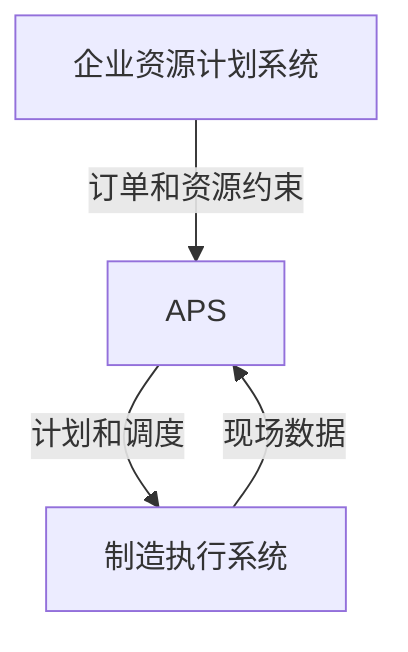

# 智能排产:APS优化生产计划与调度

## 1.背景介绍

### 1.1 生产计划与调度的重要性

在现代制造业中,有效的生产计划和调度对于提高生产效率、降低成本、满足客户需求至关重要。制造企业面临着来自市场的激烈竞争,必须精细化管理生产资源,优化生产流程,提高产品交付能力。传统的人工经验法已无法满足日益复杂的生产环境,因此引入智能优化技术成为当前的发展趋势。

### 1.2 制约生产计划与调度的复杂因素

影响生产计划与调度的因素错综复杂,包括:

- 多种资源约束(人力、设备、物料等)
- 复杂的优先级规则
- 不确定性(机器故障、原料延迟等)
- 动态变化的需求订单
- 多重目标(提高利用率、缩短交期等)

### 1.3 APS系统的应运而生

面对如此复杂的约束条件,人工手动排产已无法满足要求。高级计划与排程系统(Advanced Planning and Scheduling, APS)应运而生,它利用先进的数学建模和优化算法,综合考虑各种约束,自动生成最优生产计划。

## 2.核心概念与联系  

### 2.1 APS系统的定义

APS是一种计算机化系统,旨在有效地规划和调度制造企业的资源,包括人力、机器、工具、运输等,以满足客户订单需求。它集成了多种优化技术,如约束规划、启发式算法、数学规划等。

### 2.2 APS系统的核心功能

1. **需求计划(Demand Planning)**
   根据预测和订单情况,制定中长期的生产需求计划。

2. **生产计划(Production Planning)** 
   确定生产什么产品、何时生产、生产数量,平衡供需关系。

3. **车间调度(Shop Floor Scheduling)**
   精细化调度车间资源,如设备、人员,制定最优生产顺序和时间表。

4. **运输计划(Transportation Planning)**
   优化运输路线和车辆调度,确保原料和产品的及时到货和发货。

5. **可视化监控(Visualization and Monitoring)** 
   提供多维度视图跟踪执行情况,支持实时优化调整。

### 2.3 APS与其他系统的关系

APS是制造执行系统(MES)的上层系统,从MES获取现场数据,为制造活动提供精细化的计划和调度;同时APS也是企业资源计划系统(ERP)的下层系统,接收ERP下达的订单和资源约束信息。



## 3.核心算法原理具体操作步骤

APS系统通过将生产计划与调度问题建模为约束优化问题,再利用启发式算法、数学规划等技术求解,从而获得最优或近似最优的生产计划。

### 3.1 约束建模

首先需要对生产环境中的各种资源、约束条件、优化目标进行形式化建模,构建起约束优化模型。常用的约束类型包括:

- **资源约束** 如设备可用量、人力供给等
- **时间约束** 如交货期限、工序持续时间等 
- **优先级约束** 如订单优先级、工序先后顺序等
- **配料约束** 确保物料供给满足需求
- **其他约束** 如运输约束、并行互斥约束等

### 3.2 目标函数建模

确定优化目标,通常包括:

- 最小化总延期时间
- 最小化总制造成本 
- 最大化资源利用率
- 最小化库存水平
- 最大化总收益

可以是单一目标,也可设置多目标函数,将各目标加权求和。

### 3.3 启发式算法求解

由于生产计划问题属于NP难问题,无法用精确算法在可接受时间内求解。因此APS系统通常采用启发式算法进行近似求解,常用的算法有:

1. **基于优先级规则的发散算法**
   按一定规则生成初始解,再逐步优化改进。如shortest processing time (SPT)最短加工时间优先规则。

2. **基于构造的启发式算法**
   逐步构造出完整的可行解,如Giffler-Thompson算法。

3. **元启发式算法**
   通过组合多种启发式算法,提高求解质量和效率。如遗传算法、模拟退火、蚁群算法等。

4. **约束规划求解**
   将生产计划转化为约束满足问题,使用约束规划技术求解。如基于规则的系统、CLP等。

### 3.4 数学规划求解

除了启发式算法,APS系统也可采用数学规划技术对问题进行建模求解,如:

- **整数规划(IP)** 用于车间调度等离散决策问题
- **混合整数规划(MIP)** 同时处理离散和连续决策变量
- **线性规划(LP)** 用于需求计划等连续问题的近似求解

通过对原始问题进行松弛、分解等改进,可以在合理时间内求解规模较大的实例。

### 3.5 算法组合与多阶段优化

由于生产计划是一个多阶段决策过程,因此APS系统常采用分层算法框架,在不同阶段使用不同算法进行优化:

1. 长期需求计划层 采用数学规划等求解
2. 中期生产计划层 使用元启发式和约束规划技术  
3. 短期车间调度层 优先级规则算法或数学规划模型

各层之间存在着反馈和协同,通过迭代优化达到全局最优。

## 4.数学模型和公式详细讲解举例说明

### 4.1 作业车间调度模型

作业车间是制造环境中一种常见情形,对应着车间调度子问题。我们用一个经典的数学模型来刻画作业车间调度问题:

**目标函数**:
$$
\begin{aligned}
&\min \sum_j C_j\\
&\text{或} \quad \min \max_j C_j
\end{aligned}
$$

分别表示最小化总完工时间之和(缩短总交期),或最小化最大完工时间(缩短最差交期)。

**约束条件**:

1. 机器可用性约束
    - 每台机器同一时刻只能加工一个工序: $\sum_{j} x_{ijt} \leq 1 \quad \forall i,t$

2. 工序先后顺序约束 
    - 每个工件的工序必须按顺序加工: $C_{ij} + s_{ij} \leq t_{ij'} \quad \forall j, i \prec i'$

3. 非负约束
    - $C_j \geq 0 \quad \forall j$

其中:
- $C_j$ 表示工件j的完工时间
- $x_{ijt}$ 为0-1变量,表示工序$(i,j)$是否在时间t开始加工
- $s_{ij}$ 为工序$(i,j)$的加工时间
- $t_{ij}$ 为工序$(i,j)$的开始加工时间

### 4.2 车间调度中的启发式算法

针对上述作业车间调度问题,我们可以使用多种启发式算法求解:

1. **基于优先级规则的发散算法**
    - 最短剩余时间优先规则(SRPT): 优先安排剩余总加工时间最短的工件
    - 最早到期时间优先规则(EDD): 优先安排到期时间最早的工件
    - ...

2. **启发式构造算法**
    - Giffler-Thompson算法: 按特定规则逐个选择工序插入部分排程序列
    - 神经网络启发式算法: 使用神经网络从现有解种群中构造新解

3. **元启发式算法**  
    - 遗传算法: 对初始种群进行选择、交叉、变异,逐代进化
    - 模拟退火算法: 以一定概率接受次优解,跳出局部最优
    - ...

### 4.3 车间调度模型的数学规划求解

除了启发式算法,我们也可以使用数学规划技术对车间调度问题建模求解:

**0-1整数规划模型**:

$$
\begin{aligned}
&\min \sum_j C_j\\
\text{s.t.}\quad & \sum_{j} x_{ijt} \leq 1 && \forall i,t\\
& C_{ij} + s_{ij} \leq t_{ij'} + M(1 - y_{ij,i'j'}) && \forall j, i \prec i'\\
& \sum_{t} x_{ijt} = 1 && \forall i,j\\
& x_{ijt} \in \{0, 1\} && \forall i,j,t\\
& y_{ij,i'j'} \in \{0, 1\} && \forall j, i \prec i'
\end{aligned}
$$

其中 $y_{ij,i'j'}$ 为0-1变量,表示工序$(i,j)$是否在$(i',j')$之前加工。

针对这一NP难问题,我们可以通过切除平面法、Lagrange松弛等技术对模型进行改进,从而提高求解效率。

## 5.项目实践:代码实例和详细解释说明

下面以一个Python实现的作业车间调度示例,展示如何将理论模型转化为代码:

```python
from ortools.linear_solver import pywraplp

def job_shop_scheduling(jobs, machines):
    solver = pywraplp.Solver('Job Shop Scheduling', pywraplp.Solver.CBC_MIXED_INTEGER_PROGRAMMING)

    intervals = {}
    obj_var = solver.Sum([solver.IntVar(0, solver.infinity(), 'obj') for j in jobs])
    solver.Minimize(obj_var)

    for j in jobs:
        for i, mach in enumerate(j):
            intervals[(j, i)] = solver.IntVar(0, solver.infinity(), 'interval_%i_%i' % (j, i))
            if i == 0:
                solver.Add(intervals[(j, i)] == 0)
            else:
                solver.Add(intervals[(j, i)] >= intervals[(j, i-1)] + jobs[j][i-1])

        solver.Add(obj_var >= intervals[(j, len(j) - 1)] + jobs[j][-1])

        for i in range(len(j)):
            machine = j[i]
            solver.Add(solver.Sum([intervals[(k, l)] * (l == i) * (jobs[k][l] == machine) for k in jobs for l in range(len(jobs[k]))]) 
                       <= solver.Sum([intervals[(j, l)] * (l >= i) for l in range(len(j))]))

    status = solver.Solve()
    if status == pywraplp.Solver.OPTIMAL:
        print('Optimal Schedule Length:', solver.Objective().Value())
        for j in jobs:
            print('Job %i:' % j, end=' ')
            for i in range(len(jobs[j])):
                print(intervals[(j, i)].solution_value(), end=' ')
            print()
    else:
        print('No optimal solution found.')

# 示例用法
jobs = {
    1: [3, 2, 3],  # 工件1需要加工机器序列为[3, 2, 3]
    2: [1, 3, 4],
    3: [1, 2, 1]
}
machines = [1, 2, 3, 4]  # 共有4台机器
job_shop_scheduling(jobs, machines)
```

上述代码使用Google OR-Tools优化工具包,建模并求解作业车间调度问题。具体步骤如下:

1. 创建求解器对象,设置为混合整数规划(MIP)模型
2. 定义决策变量intervals,表示每个工序的开始时间
3. 设置目标函数为最小化完工时间之和
4. 添加工序先后顺序约束
5. 添加机器可用性约束,同一时刻每台机器只能加工一个工序
6. 求解并输出最优调度方案

需要注意的是,对于规模较大的实例,由于作业车间调度是NP难问题,求解时间会快速增长。这时我们可以引入启发式算法、松弛和分解技术等,以获得更高的计算效率。

## 6.实际应用场景

APS系统已被广泛应用于制造业的各个领域,下面列举几个典型场景:

1. **离散制造业**
    - 汽车、电子、机械等制造企业广泛使用APS进行生产计划和车间调度优化。

2. **流程工业** 
    - 石油化工、食品饮料等连续流程制造行业,使用APS优化生产过程和物流。

3. **服务行业**
    - 电力公司利用APS为电网调度做出最优负荷