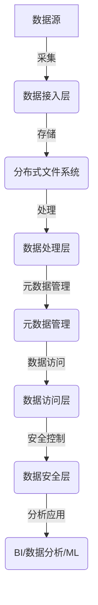
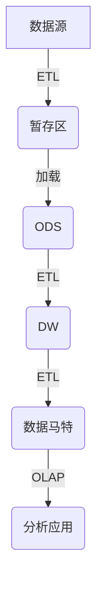
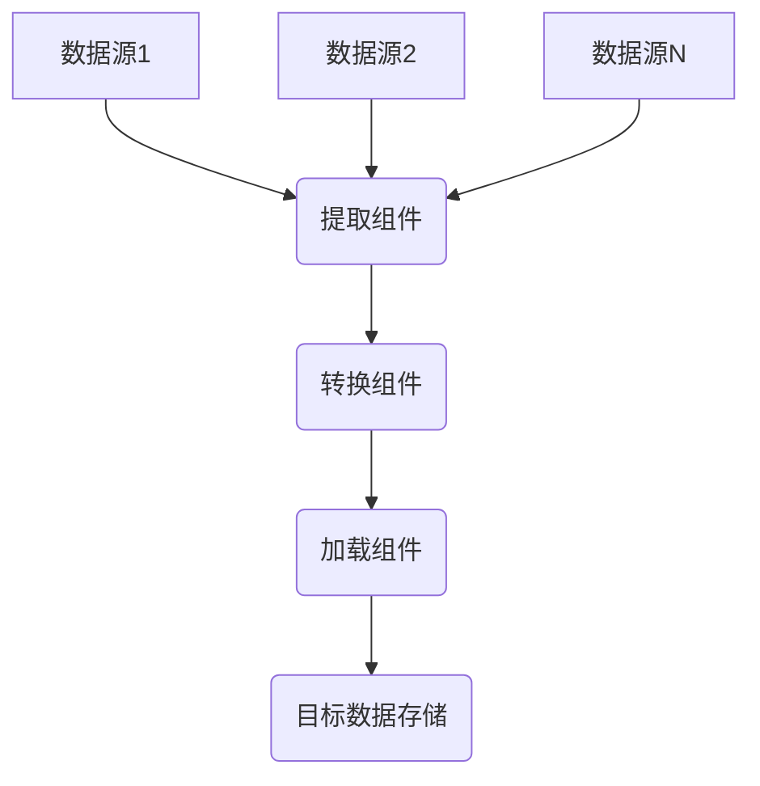
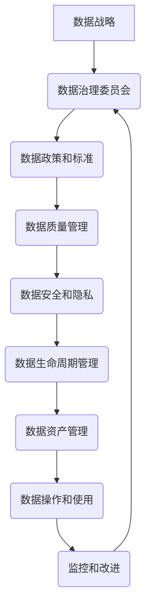

# "构建强大的数据基础设施：企业数字化的核心"

## 1.背景介绍

### 1.1 数据时代的到来

当今世界正处于一个前所未有的数据爆炸时代。随着互联网、物联网、人工智能等新兴技术的飞速发展,海量数据正以指数级的速度增长。据统计,2020年全球数据总量已达59ZB(1ZB=1万亿TB),预计到2025年将达175ZB。这些庞大的数据量不仅体现了企业数字化转型的成果,也为企业带来了新的挑战和机遇。

### 1.2 数据基础设施的重要性

企业要真正实现数字化转型,离不开强大的数据基础设施作为支撑。数据基础设施是指用于存储、管理和处理企业数据的一系列技术和架构,包括数据库、数据湖、数据集成、数据治理等。只有构建高效、可靠、安全的数据基础设施,企业才能充分利用数据资产,推动业务创新,提高运营效率,增强竞争优势。

### 1.3 数据基础设施建设的挑战

然而,构建企业级数据基础设施并非易事。它需要解决诸多技术和管理挑战:

- 数据heterogeneity:企业数据来源多样,结构、模式不尽相同
- 数据集成:如何高效整合多源异构数据
- 数据质量:如何确保数据的准确性、完整性和及时性
- 数据安全:如何保护敏感数据,防止数据泄露
- 数据治理:如何制定数据标准和政策,实现数据的有效管理
- 系统扩展性:如何构建可扩展的基础架构,满足不断增长的数据需求

因此,构建企业级数据基础设施需要综合运用多种先进技术,并结合企业的具体需求和现状,进行全面规划和实施。

## 2.核心概念与联系

### 2.1 数据湖

数据湖(Data Lake)是存储各种结构化、半结构化和非结构化数据的集中式存储库。它允许企业以原始格式存储所有数据,而无需进行预先转换。数据湖通常建立在分布式文件系统(如HDFS)之上,具有高度的可扩展性和容错能力。

相较于传统数据仓库,数据湖具有以下优势:

- 存储各种格式数据,无需预先转换
- 低成本、高可扩展性
- 支持批处理和流处理
- 满足多种数据处理需求

### 2.2 数据仓库

数据仓库(Data Warehouse)是一种面向主题的、集成的、非易失的、随时间变化的数据集合。它旨在支持企业决策分析,通过ETL(提取、转换、加载)过程从各种数据源提取并清洗数据,然后将其加载到以事实表和维度表组织的中央存储库中。

数据仓库的特点包括:

- 主题性:聚焦于特定的主题或领域
- 集成性:从多个异构数据源提取并清理数据
- 非易失性:保存历史数据用于分析
- 面向主题:专注于决策支持而非在线事务处理

### 2.3 数据集成

数据集成(Data Integration)是将来自多个异构数据源的数据提取、转换并加载到目标数据存储区(如数据仓库或数据湖)中的过程。常见的数据集成工具有Apache NiFi、Talend等。

数据集成的关键步骤包括:

1. 数据提取:从各种源系统获取数据
2. 数据转换:根据业务需求转换数据格式和结构
3. 数据加载:将转换后的数据加载到目标存储区
4. 数据质量:确保加载数据的准确性和完整性

### 2.4 数据治理

数据治理(Data Governance)是制定和实施一系列政策、标准、流程和技术,以确保企业数据的可用性、完整性、安全性和隐私性。它涵盖了数据的整个生命周期,包括数据获取、存储、使用和销毁。

数据治理的核心目标包括:

- 确保数据质量和一致性
- 实施数据安全和隐私保护
- 加强对数据资产的控制和管理
- 促进数据共享和利用
- 符合法规和标准要求

### 2.5 数据流水线

数据流水线(Data Pipeline)是一种自动化的数据处理系统,它从各种数据源提取数据,经过一系列转换和处理步骤,最终将数据加载到目标存储区。

数据流水线的主要组成部分包括:

- 数据源:各种结构化、半结构化和非结构化数据源
- 提取组件:从源系统提取数据
- 转换组件:清理、转换和丰富数据
- 加载组件:将处理后的数据加载到目标存储区
- 调度和监控:自动化执行和监控流水线

通过构建高效的数据流水线,企业可以实现端到端的数据处理自动化,加快数据的交付速度,提高数据质量和一致性。

### 2.6 数据目录

数据目录(Data Catalog)是一种元数据管理系统,用于收集、组织和管理企业内部和外部数据资产的元数据。它为数据消费者提供了一个集中的数据发现和理解平台。

数据目录的主要功能包括:

- 数据发现:帮助用户快速查找所需数据
- 元数据管理:收集和管理数据资产的元数据
- 数据理解:提供数据含义、来源、质量等信息
- 数据治理:实施数据标准和政策
- 数据访问:提供安全的数据访问机制

数据目录可以显著提高数据的可见性、可理解性和可访问性,从而促进数据资产的充分利用。

## 3.核心算法原理具体操作步骤

### 3.1 数据湖架构

数据湖架构通常由以下几个核心组件组成:

1. **分布式文件系统**:用于存储各种格式的原始数据,常用的是Apache Hadoop HDFS。
2. **数据接入层**:负责从各种数据源采集数据,常用工具包括Apache NiFi、Apache Kafka等。
3. **数据处理层**:对原始数据进行清理、转换和计算,常用的是Apache Spark、Apache Hive等。
4. **元数据管理**:收集和管理数据资产的元数据信息,可使用Apache Atlas等工具。
5. **数据访问层**:为上层应用和分析工具提供统一的数据访问接口,如ODBC/JDBC驱动程序。
6. **数据安全层**:实施数据安全和访问控制策略,如Apache Ranger。

数据湖架构的核心步骤包括:

1. 从各种数据源(如关系数据库、NoSQL、日志文件等)采集原始数据,存储到分布式文件系统中。
2. 使用大数据处理框架(如Apache Spark)对原始数据进行清理、转换和计算。
3. 收集和管理数据资产的元数据信息,以支持数据发现和理解。
4. 通过数据访问层为上层应用提供统一的数据访问接口。
5. 实施数据安全和访问控制策略,确保数据的安全性和合规性。
6. 上层应用(如BI工具、数据分析、机器学习等)可以直接访问和分析数据湖中的数据。

### 3.2 数据仓库构建

传统的数据仓库构建通常遵循以下步骤:

1. **数据提取(E)**:从各种源系统(如OLTP数据库、文件等)提取所需数据。
2. **数据转换(T)**:根据业务需求对提取的数据进行清理、转换和加工。
3. **数据加载(L)**:将转换后的数据加载到暂存区(Staging Area)。
4. **ODS**:操作数据存储(ODS)是一个面向主题的集成数据存储库,存储从各个源系统提取的详细数据。
5. **DW**:数据仓库(DW)是一个面向主题的、集成的、非易失的数据存储库,用于支持企业决策分析。
6. **数据马特**:数据马特是从数据仓库中提取的、专门用于特定主题领域分析的数据集市。
7. **OLAP**:在线分析处理(OLAP)工具可以对数据仓库和数据马特中的数据进行多维度分析和查询。

数据仓库构建的关键在于ETL过程,需要根据业务需求对源数据进行适当的转换和清理,以确保数据质量和一致性。此外,还需要设计合理的数据模型(如星型、雪花等)以支持高效的查询和分析。

### 3.3 数据集成

数据集成是将来自多个异构数据源的数据提取、转换并加载到目标数据存储区的过程。常见的数据集成工具有Apache NiFi、Talend等。数据集成的核心步骤如下:

1. **提取(Extract)**:从各种源系统(如关系数据库、NoSQL、文件等)提取所需数据。
2. **转换(Transform)**:根据业务需求对提取的数据进行清理、转换、合并和加工。常见的转换操作包括数据过滤、列删除/重命名、数据类型转换、代码转换等。
3. **加载(Load)**:将转换后的数据加载到目标数据存储区,如数据湖、数据仓库或其他存储系统。

在数据集成过程中,需要注意以下几个关键点:

- **数据连接器**:支持各种数据源和目标系统的连接器,以便无缝集成不同的数据系统。
- **数据映射**:定义源数据和目标数据之间的映射关系,确保数据转换的正确性。
- **数据质量**:通过数据验证、数据清理和标准化等措施,确保加载数据的准确性和完整性。
- **调度和监控**:自动化执行数据集成作业,并实时监控作业状态和数据流量。
- **元数据管理**:收集和管理数据资产的元数据信息,支持数据发现和理解。

### 3.4 数据治理

数据治理是制定和实施一系列政策、标准、流程和技术,以确保企业数据的可用性、完整性、安全性和隐私性。数据治理的核心步骤包括:

1. **制定数据战略**:明确数据在企业中的战略价值和目标,为数据治理奠定基础。
2. **建立数据治理委员会**:由高层管理人员、业务负责人和技术专家组成,负责制定数据治理政策和监督执行情况。
3. **制定数据政策和标准**:包括数据定义、数据质量标准、数据安全标准、数据访问控制等方面的政策和标准。
4. **数据质量管理**:通过数据剖析、数据清理和数据标准化等措施,确保数据质量满足业务需求。
5. **数据安全和隐私**:实施数据加密、访问控制、审计跟踪等措施,保护敏感数据的安全性和隐私性。
6. **数据生命周期管理**:制定数据的采集