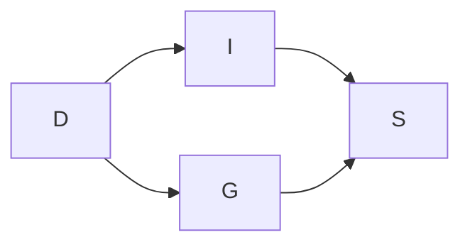

# 概率图模型:因子分解与推理算法

## 1.背景介绍

### 1.1 概率图模型的重要性

概率图模型是一种用于表示和推理复杂概率分布的强大工具。它们在许多领域都有广泛的应用,包括机器学习、计算机视觉、自然语言处理、生物信息学等。概率图模型提供了一种直观和紧凑的方式来表示随机变量之间的条件独立性和概率关系,并且能够有效地进行概率推理和学习。

### 1.2 概率图模型的发展历程

概率图模型的发展可以追溯到20世纪60年代,当时人们开始研究如何使用图形结构来表示概率分布。贝叶斯网络和马尔可夫随机场是最早提出的两种主要概率图模型。随后,概率图模型理论不断发展,涌现出了各种变体和扩展,例如因子图、链图、混合图等。

### 1.3 因子分解的重要性

对于复杂的概率分布,直接表示和计算是非常困难的。因子分解是一种将复杂的联合概率分布分解为更简单的条件独立形式的技术,它利用了概率图模型中表示的条件独立性结构。通过因子分解,我们可以大大降低计算和存储的复杂性,使得在概率图模型上进行推理和学习变得可行。

### 1.4 推理算法的作用

推理是概率图模型中的一个核心问题,它涉及到根据已知的证据计算感兴趣变量的概率分布。由于概率图模型通常包含大量的随机变量,精确推理往往是计算上不可行的。因此,开发高效的近似推理算法对于概率图模型的实际应用至关重要。

## 2.核心概念与联系  

### 2.1 概率图模型的表示

概率图模型由两个基本组成部分构成:一个结构化的图形表示和一组与图形相关联的概率分量。

#### 2.1.1 图形表示

图形表示包含节点和边,其中节点对应于随机变量,边表示变量之间的概率依赖关系。不同类型的概率图模型对图形结构有不同的假设和限制。例如,贝叶斯网络假设图形是有向无环的,而马尔可夫随机场假设图形是无向的。

#### 2.1.2 概率分量

每个节点都与一个条件概率分布相关联,表示该节点变量在给定其父节点取值的情况下的概率分布。对于整个模型,联合概率分布可以通过所有节点的条件概率分布的乘积来表示。

### 2.2 因子分解

因子分解是将联合概率分布分解为一组更简单的条件独立形式的过程。在概率图模型中,因子分解利用了图形结构中表示的条件独立性。

令 $X = \{X_1, X_2, \ldots, X_n\}$ 表示随机变量的集合,联合概率分布 $P(X)$ 可以分解为:

$$P(X) = \prod_{i=1}^{m} \phi_i(X_i)$$

其中 $\phi_i(X_i)$ 是定义在变量子集 $X_i \subseteq X$ 上的非负实值函数,称为因子(factor)。通过因子分解,我们可以将复杂的联合概率分布表示为更简单的乘积形式,从而降低计算和存储的复杂性。

### 2.3 推理问题

推理是概率图模型中的一个核心问题,它涉及到根据已知的证据计算感兴趣变量的概率分布。形式上,我们希望计算条件概率分布 $P(X|E=e)$,其中 $X$ 是感兴趣的变量集合, $E$ 是已知证据的变量集合,取值为 $e$。

根据贝叶斯定理,条件概率分布可以表示为:

$$P(X|E=e) = \frac{P(X,E=e)}{P(E=e)}$$

其中,分母 $P(E=e)$ 是证据的边际概率,分子 $P(X,E=e)$ 是联合概率分布在给定证据时的值。因此,推理问题可以归结为计算联合概率分布和边际概率。

### 2.4 推理算法

由于概率图模型通常包含大量的随机变量,精确推理往往是计算上不可行的。因此,开发高效的近似推理算法对于概率图模型的实际应用至关重要。常见的推理算法包括:

- 变量消元算法
- 信念传播算法
- 马尔可夫链蒙特卡罗算法
- 变分推理算法

这些算法在精确性、效率和适用范围方面各有优缺点,需要根据具体问题进行选择和调整。

## 3.核心算法原理具体操作步骤

在这一部分,我们将详细介绍概率图模型中两种核心推理算法的原理和具体操作步骤:变量消元算法和信念传播算法。

### 3.1 变量消元算法

变量消元算法是一种精确推理算法,它通过系统地求和消去不相关的变量来计算感兴趣变量的边际概率分布。算法的具体步骤如下:

1. 构造一个包含所有变量的因子乘积表示联合概率分布。
2. 选择一个需要消去的变量 $X_i$。
3. 将包含 $X_i$ 的所有因子相乘,得到一个新的因子 $\phi(X_i, X_{\sim i})$,其中 $X_{\sim i}$ 表示除 $X_i$ 以外的所有变量。
4. 对新因子 $\phi(X_i, X_{\sim i})$ 进行求和消去变量 $X_i$,得到一个新的因子 $\phi'(X_{\sim i})$。
5. 用新因子 $\phi'(X_{\sim i})$ 替换原始因子集合中包含 $X_i$ 的所有因子。
6. 重复步骤2-5,直到只剩下感兴趣的变量。

变量消元算法的时间复杂度与消元顺序有关,找到最优的消元顺序是一个NP-难问题。在实践中,通常使用启发式方法来确定一个较好的消元顺序。

### 3.2 信念传播算法

信念传播算法是一种高效的近似推理算法,它在概率图模型的因子图表示上进行操作。算法的核心思想是通过在因子图中传递消息来计算每个变量的边际概率分布。具体步骤如下:

1. 将概率图模型转换为因子图表示。
2. 初始化每个因子节点和变量节点的消息为1。
3. 选择一个方向(如从变量节点到因子节点),按照该方向更新所有消息。
4. 反转方向,按照新方向更新所有消息。
5. 重复步骤3-4,直到收敛或达到最大迭代次数。
6. 计算每个变量节点的边际概率分布,作为最终结果。

消息更新的具体规则取决于概率图模型的类型和结构。对于无向图模型(如马尔可夫随机场),消息更新规则为:

$$m_{i\rightarrow j}(x_j) = \alpha \sum_{x_i} \phi_i(x_i, x_j) \prod_{k \in N(i)\backslash j} m_{k\rightarrow i}(x_i)$$

其中 $m_{i\rightarrow j}(x_j)$ 表示从节点 $i$ 发送到节点 $j$ 的消息, $\phi_i(x_i, x_j)$ 是包含变量 $x_i$ 和 $x_j$ 的因子, $N(i)\backslash j$ 表示节点 $i$ 的邻居节点集合除去节点 $j$, $\alpha$ 是一个归一化常数。

信念传播算法通常在树形结构的概率图模型上可以获得精确的结果,但在含有环的情况下只能提供近似解。算法的收敛性和精确度取决于模型的结构和参数。

## 4.数学模型和公式详细讲解举例说明

在这一部分,我们将详细讨论概率图模型中的数学模型和公式,并通过具体例子来说明它们的应用。

### 4.1 贝叶斯网络

贝叶斯网络是一种广泛使用的概率图模型,它使用有向无环图(DAG)来表示随机变量之间的条件独立性结构。在贝叶斯网络中,每个节点对应一个随机变量,边表示变量之间的直接概率依赖关系。

#### 4.1.1 联合概率分布的因子分解

令 $X = \{X_1, X_2, \ldots, X_n\}$ 表示贝叶斯网络中的所有随机变量,则联合概率分布 $P(X)$ 可以分解为:

$$P(X) = \prod_{i=1}^{n} P(X_i | \text{Pa}(X_i))$$

其中 $\text{Pa}(X_i)$ 表示节点 $X_i$ 的父节点集合。这种分解利用了贝叶斯网络中表示的条件独立性假设,即每个变量在给定其父节点的取值时与其他变量条件独立。

#### 4.1.2 边际概率计算

计算变量的边际概率是贝叶斯网络推理中的一个核心问题。对于一个变量 $X_i$,其边际概率可以通过对联合概率分布进行求和计算:

$$P(X_i) = \sum_{X_{\sim i}} P(X)$$

其中 $X_{\sim i}$ 表示除 $X_i$ 以外的所有其他变量。直接计算边际概率的复杂度随变量数量的增加呈指数级增长,因此通常需要使用高效的推理算法,如变量消元算法或信念传播算法。

#### 4.1.3 条件概率计算

另一个常见的推理问题是计算给定某些证据时变量的条件概率分布。根据贝叶斯定理,条件概率可以表示为:

$$P(X_i | E=e) = \frac{P(X_i, E=e)}{P(E=e)}$$

其中 $E$ 表示证据变量集合,取值为 $e$。分子 $P(X_i, E=e)$ 可以通过在联合概率分布中将 $X_i$ 和 $E$ 的取值代入来计算,而分母 $P(E=e)$ 就是证据的边际概率。

#### 4.1.4 例子:学生成绩预测

考虑一个简单的贝叶斯网络,用于预测学生的成绩。网络包含以下变量:

- $D$: 学生的天赋 (高/低)
- $I$: 学生的智力 (高/低)
- $G$: 学生的勤奋程度 (高/低)
- $S$: 学生的成绩 (优秀/一般/差)

假设变量之间的条件独立性结构如下所示:

根据贝叶斯网络的定义,联合概率分布可以分解为:

$$P(D, I, G, S) = P(D)P(I|D)P(G|D)P(S|I,G)$$

现在,我们希望计算给定学生天赋为高($D=\text{高}$)时,成绩为优秀($S=\text{优秀}$)的概率 $P(S=\text{优秀} | D=\text{高})$。根据贝叶斯定理:

$$P(S=\text{优秀} | D=\text{高}) = \frac{P(S=\text{优秀}, D=\text{高})}{P(D=\text{高})}$$

分子可以通过将 $S=\text{优秀}$ 和 $D=\text{高}$ 代入联合概率分布表达式来计算,而分母 $P(D=\text{高})$ 是天赋为高的边际概率。通过这种方式,我们可以计算出给定证据时感兴趣变量的条件概率分布。

### 4.2 马尔可夫随机场

马尔可夫随机场(MRF)是另一种常用的概率图模型,它使用无向图来表示随机变量之间的相关性。在MRF中,每个节点对应一个随机变量,边表示变量之间的相关性。

#### 4.2.1 团和最大团

在MRF中,团(clique)是一个重要的概念,它指的是无向图中任何两个节点之间都有边相连的一个完全子图。最大团(maximal clique)是指不能再包含