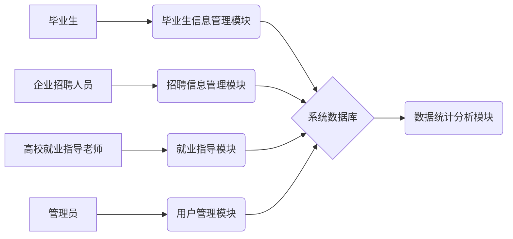
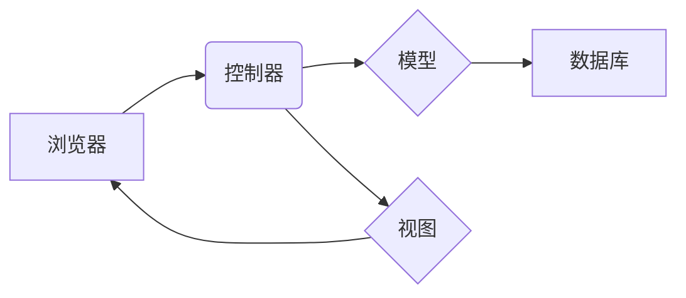

## 1. 背景介绍

### 1.1 高校毕业生就业信息管理的现状

随着高等教育的普及，高校毕业生人数逐年增加，就业压力也越来越大。为了更好地服务毕业生，高校需要建立一套完善的就业信息管理系统，对毕业生信息、招聘信息、就业指导等进行有效管理。传统的就业信息管理方式存在着信息分散、更新不及时、查询不便等问题，难以满足高校和毕业生的需求。

### 1.2 毕业生就业信息管理系统的意义

毕业生就业信息管理系统的建设，可以有效解决传统就业信息管理方式的弊端，提高就业信息管理效率，为毕业生提供更便捷、高效的就业服务。

- **提高信息管理效率:**  系统可以集中管理毕业生信息、招聘信息、就业指导等数据，避免信息分散、重复录入等问题，提高信息管理效率。
- **增强信息共享和交流:**  系统可以实现信息共享，方便高校、企业、毕业生之间进行信息交流，促进就业工作顺利开展。
- **提供便捷的就业服务:**  系统可以提供在线招聘、简历投递、就业指导等服务，方便毕业生获取就业信息，提高求职效率。
- **促进就业市场分析:**  系统可以收集和分析就业市场数据，为高校制定就业政策、企业招聘人才提供参考依据。

## 2. 核心概念与联系

### 2.1 系统用户角色

毕业生就业信息管理系统涉及多个用户角色，包括：

- **管理员:** 负责系统的维护和管理，包括用户管理、权限管理、数据备份等。
- **高校就业指导老师:** 负责发布就业信息、审核招聘信息、组织就业指导活动等。
- **企业招聘人员:** 负责发布招聘信息、筛选简历、组织面试等。
- **毕业生:** 负责完善个人信息、搜索招聘信息、投递简历等。

### 2.2 系统功能模块

毕业生就业信息管理系统主要包括以下功能模块：

- **用户管理模块:**  实现用户注册、登录、信息修改、密码找回等功能。
- **毕业生信息管理模块:**  实现毕业生信息的录入、查询、修改、删除等功能。
- **招聘信息管理模块:**  实现招聘信息的发布、审核、查询、修改、删除等功能。
- **就业指导模块:**  实现就业政策发布、就业指导课程、就业咨询等功能。
- **数据统计分析模块:**  实现毕业生就业情况统计、招聘信息分析等功能。

### 2.3 系统核心概念联系



## 3. 核心算法原理具体操作步骤

### 3.1 用户登录认证算法

#### 3.1.1 算法原理

用户登录认证算法采用基于用户名和密码的认证方式，具体步骤如下：

1. 用户输入用户名和密码。
2. 系统根据用户名查询数据库，获取该用户的密码信息。
3. 系统将用户输入的密码与数据库中存储的密码进行比对。
4. 如果密码匹配，则认证成功，用户登录系统；否则，认证失败，提示用户重新输入用户名和密码。

#### 3.1.2 代码实现

```python
def login(username, password):
    """
    用户登录认证

    Args:
        username: 用户名
        password: 密码

    Returns:
        True: 登录成功
        False: 登录失败
    """

    # 查询数据库，获取用户信息
    user = User.objects.filter(username=username).first()

    # 用户不存在
    if not user:
        return False

    # 密码校验
    if not user.check_password(password):
        return False

    # 登录成功
    return True
```

### 3.2 招聘信息匹配算法

#### 3.2.1 算法原理

招聘信息匹配算法采用基于关键词匹配的方式，具体步骤如下：

1. 提取毕业生简历中的关键词，例如专业、技能、工作经验等。
2. 提取招聘信息中的关键词，例如职位名称、职位要求、工作地点等。
3. 计算毕业生简历关键词与招聘信息关键词的相似度，例如采用余弦相似度算法。
4. 根据相似度排序，推荐匹配度较高的招聘信息给毕业生。

#### 3.2.2 代码实现

```python
def match_jobs(resume, jobs):
    """
    招聘信息匹配

    Args:
        resume: 毕业生简历
        jobs: 招聘信息列表

    Returns:
        匹配的招聘信息列表
    """

    # 提取简历关键词
    resume_keywords = extract_keywords(resume)

    # 遍历招聘信息
    matched_jobs = []
    for job in jobs:
        # 提取招聘信息关键词
        job_keywords = extract_keywords(job)

        # 计算相似度
        similarity = cosine_similarity(resume_keywords, job_keywords)

        # 添加匹配的招聘信息
        if similarity > threshold:
            matched_jobs.append(job)

    # 返回匹配的招聘信息列表
    return matched_jobs
```

## 4. 数学模型和公式详细讲解举例说明

### 4.1 余弦相似度算法

余弦相似度算法用于计算两个向量之间的相似度，其公式如下：

$$
\cos(\theta) = \frac{\mathbf{A} \cdot \mathbf{B}}{\|\mathbf{A}\| \|\mathbf{B}\|}
$$

其中，$\mathbf{A}$ 和 $\mathbf{B}$ 表示两个向量，$\cdot$ 表示向量点积，$\|\mathbf{A}\|$ 和 $\|\mathbf{B}\|$ 表示向量 $\mathbf{A}$ 和 $\mathbf{B}$ 的模长。

余弦相似度的取值范围为 $[-1, 1]$，值越大表示两个向量越相似。

**举例说明:**

假设毕业生简历关键词向量为 $\mathbf{A} = (1, 0, 1)$，招聘信息关键词向量为 $\mathbf{B} = (0, 1, 1)$，则它们的余弦相似度为：

$$
\cos(\theta) = \frac{(1, 0, 1) \cdot (0, 1, 1)}{\|(1, 0, 1)\| \|(0, 1, 1)\|} = \frac{1}{\sqrt{2} \sqrt{2}} = 0.5
$$

## 5. 项目实践：代码实例和详细解释说明

### 5.1 系统架构

毕业生就业信息管理系统采用 MVC 架构模式，具体架构图如下：



### 5.2 数据库设计

系统数据库采用 MySQL 数据库，主要数据表如下：

| 表名 | 字段 | 数据类型 | 说明 |
|---|---|---|---|
| user | id | int | 用户ID |
|  | username | varchar | 用户名 |
|  | password | varchar | 密码 |
|  | role | int | 角色（1：管理员，2：高校就业指导老师，3：企业招聘人员，4：毕业生） |
| graduate | id | int | 毕业生ID |
|  | user_id | int | 用户ID |
|  | name | varchar | 姓名 |
|  | major | varchar | 专业 |
|  | skills | varchar | 技能 |
|  | experience | varchar | 工作经验 |
| job | id | int | 招聘信息ID |
|  | company | varchar | 公司名称 |
|  | position | varchar | 职位名称 |
|  | requirements | varchar | 职位要求 |
|  | location | varchar | 工作地点 |

### 5.3 代码实例

**用户登录认证代码:**

```python
from django.contrib.auth import authenticate, login

def user_login(request):
    """
    用户登录视图函数
    """

    if request.method == 'POST':
        form = LoginForm(request.POST)
        if form.is_