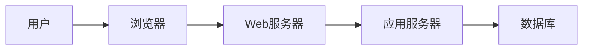

## 1. 背景介绍

### 1.1 毕业设计选题管理的现状与挑战

毕业设计是高等教育阶段重要的实践环节，选题则是毕业设计的第一步，也是至关重要的一步。传统的毕业设计选题管理模式存在诸多弊端，例如：

* **信息不对称:** 学生难以全面了解所有可选题目，指导老师也难以掌握学生的选题意向。
* **效率低下:**  人工操作繁琐，选题过程耗时耗力。
* **缺乏透明度:** 选题结果难以公开透明，容易滋生暗箱操作。

### 1.2 毕业设计选题管理系统的意义

为了解决上述问题，开发一套高效、透明、便捷的毕业设计选题管理系统势在必行。该系统可以：

* **提高信息透明度:**  集中展示所有可选题目信息，方便学生了解和选择。
* **提升选题效率:**  简化选题流程，实现自动化匹配和分配。
* **加强公平公正:**  确保选题过程公开透明，杜绝暗箱操作。
* **减轻管理负担:**  减轻教师和管理人员的工作负担，提高工作效率。

## 2. 核心概念与联系

### 2.1 用户角色

* **学生:**  参与选题的学生。
* **教师:**  发布题目、指导学生、审核选题结果的教师。
* **管理员:**  负责系统维护和管理的管理员。

### 2.2 核心功能模块

* **用户管理:**  包括学生、教师、管理员的注册、登录、信息管理等功能。
* **题目管理:**  包括题目的发布、审核、修改、删除等功能。
* **选题管理:**  包括学生提交选题申请、教师审核选题、系统自动分配题目等功能。
* **结果管理:**  包括选题结果的查询、统计、导出等功能。

### 2.3 系统架构

本系统采用B/S架构，使用Java语言开发，数据库采用MySQL。



## 3. 核心算法原理具体操作步骤

### 3.1 选题匹配算法

系统采用基于学生兴趣和教师研究方向的双向匹配算法，具体步骤如下：

1. **学生提交选题意向:**  学生在系统中填写个人信息和感兴趣的研究方向。
2. **教师发布题目:**  教师发布题目，并填写研究方向和指导学生数量限制。
3. **系统进行匹配:**  系统根据学生和教师的研究方向进行匹配，优先考虑双向匹配的学生和教师。
4. **教师审核选题:**  教师对匹配结果进行审核，确定最终的指导学生名单。

### 3.2 自动分配算法

当学生和教师的研究方向无法完全匹配时，系统会根据学生填写的第二、第三志愿进行分配，具体步骤如下：

1. **优先考虑第二志愿:**  系统优先考虑学生填写的第二志愿，尝试进行匹配。
2. **考虑第三志愿:**  如果第二志愿无法匹配，则考虑第三志愿。
3. **随机分配:**  如果所有志愿都无法匹配，则系统进行随机分配。

## 4. 数学模型和公式详细讲解举例说明

### 4.1 匹配度计算公式

系统采用余弦相似度计算学生和教师的研究方向匹配度，公式如下：

$$
similarity(S, T) = \frac{S \cdot T}{||S|| \cdot ||T||}
$$

其中，$S$ 表示学生的研究方向向量，$T$ 表示教师的研究方向向量。

**举例说明:**

假设学生的研究方向向量为 $S = (0.8, 0.2, 0.5)$，教师的研究方向向量为 $T = (0.7, 0.3, 0.6)$，则匹配度为：

$$
similarity(S, T) = \frac{0.8 \times 0.7 + 0.2 \times 0.3 + 0.5 \times 0.6}{\sqrt{0.8^2 + 0.2^2 + 0.5^2} \times \sqrt{0.7^2 + 0.3^2 + 0.6^2}} \approx 0.93
$$

### 4.2 分配优先级计算公式

系统根据学生填写的志愿顺序计算分配优先级，公式如下：

$$
priority = \frac{1}{rank}
$$

其中，$rank$ 表示志愿的排名，第一志愿为 1，第二志愿为 2，以此类推。

**举例说明:**

假设学生的第一志愿为 A 教师，第二志愿为 B 教师，则 A 教师的分配优先级为 1，B 教师的分配优先级为 0.5。

## 5. 项目实践：代码实例和详细解释说明

### 5.1 数据库设计

```sql
CREATE TABLE student (
    id INT PRIMARY KEY AUTO_INCREMENT,
    name VARCHAR(255) NOT NULL,
    research_direction VARCHAR(255) NOT NULL
);

CREATE TABLE teacher (
    id INT PRIMARY KEY AUTO_INCREMENT,
    name VARCHAR(255) NOT NULL,
    research_direction VARCHAR(255) NOT NULL,
    max_students INT NOT NULL
);

CREATE TABLE topic (
    id INT PRIMARY KEY AUTO_INCREMENT,
    title VARCHAR(255) NOT NULL,
    description TEXT,
    teacher_id INT NOT NULL,
    FOREIGN KEY (teacher_id) REFERENCES teacher(id)
);

CREATE TABLE selection (
    id INT PRIMARY KEY AUTO_INCREMENT,
    student_id INT NOT NULL,
    topic_id INT NOT NULL,
    status VARCHAR(255) NOT NULL,
    FOREIGN KEY (student_id) REFERENCES student(id),
    FOREIGN KEY (topic_id) REFERENCES topic(id)
);
```

### 5.2 核心代码实现

```java
// 计算匹配度
public double calculateSimilarity(Student student, Teacher teacher) {
    double[] studentVector = student.getResearchDirectionVector();
    double[] teacherVector = teacher.getResearchDirectionVector();
    double dotProduct = 0;
    for (int i = 0; i < studentVector.length; i++) {
        dotProduct += studentVector[i] * teacherVector[i];
    }
    double studentMagnitude = Math.sqrt(Arrays.stream(studentVector).map(x -> x * x).sum());
    double teacherMagnitude = Math.sqrt(Arrays.stream(teacherVector).map(x -> x * x).sum());
    return dotProduct / (studentMagnitude * teacherMagnitude);
}

// 分配题目
public void allocateTopics(List<Student> students, List<Teacher> teachers, List<Topic> topics) {
    // 构建学生志愿列表
    Map<Student, List<Teacher>> studentPreferences = new HashMap<>();
    for (Student student : students) {
        List<Teacher> preferences = student.getTeacherPreferences();
        studentPreferences.put(student, preferences);
    }

    // 循环分配
    while (!studentPreferences.isEmpty()) {
        // 找到匹配度最高的师生
        double maxSimilarity = 0;
        Student matchedStudent = null;
        Teacher matchedTeacher = null;
        for (Map.Entry<Student, List<Teacher>> entry : studentPreferences.entrySet()) {
            Student student = entry.getKey();
            List<Teacher> preferences = entry.getValue();
            for (Teacher teacher : preferences) {
                double similarity = calculateSimilarity(student, teacher);
                if (similarity > maxSimilarity) {
                    maxSimilarity = similarity;
                    matchedStudent = student;
                    matchedTeacher = teacher;
                }
            }
        }

        // 分配题目
        if (matchedStudent != null && matchedTeacher != null) {
            Topic topic = matchedTeacher.getAvailableTopic();
            if (topic != null) {
                Selection selection = new Selection(matchedStudent, topic, "已分配");
                // 保存选题结果
            }

            // 移除已分配的学生和教师
            studentPreferences.remove(matchedStudent);
            matchedTeacher.decrementAvailableStudents();
        } else {
            // 随机分配
            // ...
        }
    }
}
```

## 6. 实际应用场景

毕业设计选题管理系统适用于各种高等院校，包括：

* **综合性大学:**  涵盖多个学科，学生人数众多，选题需求量大。
* **理工科院校:**  注重科研和实践，对选题质量要求较高。
* **文科院校:**  注重理论研究和思辨能力，选题方向较为灵活。

## 7. 总结：未来发展趋势与挑战

### 7.1 未来发展趋势

* **智能化:**  引入人工智能技术，实现更精准的匹配和推荐。
* **个性化:**  根据学生的兴趣和能力，提供个性化的选题建议。
* **数据驱动:**  利用大数据分析，优化选题流程和结果。

### 7.2 面临的挑战

* **数据安全:**  保障学生和教师个人信息的安全性。
* **系统稳定性:**  确保系统稳定运行，避免出现故障。
* **用户体验:**  提升用户体验，提高系统易用性。

## 8. 附录：常见问题与解答

### 8.1 学生如何修改选题意向？

学生登录系统后，可以进入“我的选题”页面，修改已提交的选题意向。

### 8.2 教师如何查看学生的选题申请？

教师登录系统后，可以进入“我的题目”页面，查看已发布题目的选题申请情况。

### 8.3 管理员如何导出选题结果？

管理员登录系统后，可以进入“结果管理”页面，选择导出格式，导出选题结果。
