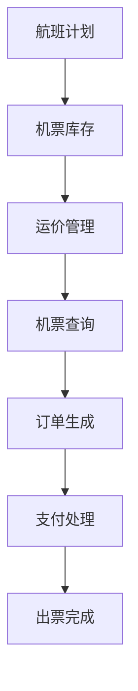

# 民航售票管理系统详细设计与具体代码实现

## 1.背景介绍

### 1.1 民航业务概述

民航业务是一个涉及多个系统和多个参与者的复杂过程。它包括航班计划、机票预订、行李运输、机场运营等多个环节。其中,机票预订和销售是整个流程的核心环节之一。

### 1.2 机票销售系统的作用

机票销售系统为航空公司、旅行社和消费者提供了一个高效的票务管理平台,实现了机票的在线预订、支付和出票。它不仅简化了传统的手工操作流程,还能实时更新航班动态信息,为决策提供数据支持。

### 1.3 系统架构概览

民航售票管理系统通常采用 B/S 或 C/S 架构,包含前台售票系统、中间件系统和后台管理系统三个主要部分。其中,前台系统面向旅客和销售代理,提供机票查询、预订和支付功能;中间件系统负责数据交换和业务流程控制;后台系统则完成运价管理、库存控制、账务处理等管理任务。

## 2.核心概念与联系

### 2.1 旅客(Passenger)

旅客是机票销售系统的最终服务对象,拥有唯一的旅客编号。他们可以通过各种渠道(网站、APP、电话等)查询航班信息、预订机票、办理改签和退票等。

### 2.2 航班计划(Flight Schedule)

航班计划是机票销售的基础,包含航班的起飞时间、到达时间、航线、机型等详细信息。计划会根据实际情况发生延误、取消等变动。

### 2.3 机票库存(Seat Inventory)

机票库存是指航班上可预订的座位数量。系统需要根据实时库存情况控制机票销售,防止超卖。库存信息也是收益管理的重要依据。

### 2.4 运价(Airfare) 

运价是指机票的销售价格,会受航线、舱位等多种因素影响。系统需要存储并维护各类运价信息,并依据相应规则计算实际票价。

### 2.5 订单(Order)

订单是旅客预订机票后形成的交易记录,包含旅客、航班、票价等关键信息。系统需要跟踪订单状态,并进行账务处理。

### 2.6 支付(Payment)

支付是订单流程中的关键环节。系统需要对接多种支付渠道,确保支付的安全性和可靠性。

### 2.7 出票(Ticketing)

出票是指为旅客生成载有二维码等信息的电子客票或纸质客票凭证。出票后,旅客即可凭票乘机。

### 2.8 核心流程联系

上述核心概念通过一系列复杂的交互流程联系在一起,构成了完整的机票销售业务。具体流程如下图所示:



## 3.核心算法原理具体操作步骤

### 3.1 库存控制算法

库存控制算法用于确保机票销售不会超过实际库存量。常用算法包括:

1. 顶层分配(Partition Control)

   - 将总库存按一定规则分配到各个销售渠道和舱位等
   - 避免不同渠道重复销售同一库存

2. 嵌套分配(Nesting Control)

   - 将不同舱位的库存相互嵌套,优先出售高价位舱位
   - 动态调整各舱位可用库存,提高收益

3. 实时库存控制(Real-time Inventory Control)

   - 每次销售时都与中央系统核对最新库存量
   - 可确保库存数据的实时准确性,但并发请求较高时效率较低

算法的选择需要权衡系统性能、收益最大化等多方面因素。

### 3.2 收益管理算法

收益管理算法旨在最大化航空公司的总收益,主要思路是对机票进行动态定价和库存调配。常用算法包括:

1. 线性规划(Linear Programming)
   - 将收益最大化建模为线性规划问题
   - 以机票销售量和舱位剩余量为约束条件
   - 求解最优解,得到理想的定价和库存分配策略

2. 概率模型(Probabilistic Models)
   - 基于历史数据,建立旅客购票行为的概率模型
   - 预测未来的订票需求,从而优化定价和库存

3. 机器学习模型
   - 利用机器学习技术从大量历史数据中发现隐含规律
   - 常用模型包括深度神经网络、强化学习等
   - 可处理非线性、动态变化的复杂问题

算法的选择需要考虑数据质量、算力条件、模型可解释性等多方面因素。

### 3.3 订单处理流程

1. 查询航班信息
   - 旅客输入出行日期、航线等条件
   - 系统检索符合条件的航班及其余座位情况
2. 选择舱位类型
   - 系统显示各舱位的余座和运价信息
   - 旅客选择合适的舱位类型
3. 确认订单信息 
   - 系统汇总订单信息,包括旅客、航班、票价等
   - 旅客确认并支付定金或全款
4. 分配座位
   - 系统从可用库存中为旅客分配座位
   - 并相应扣减库存量
5. 出票
   - 系统完成出票操作
   - 生成载有二维码等信息的电子客票或纸质客票
6. 开放值机
   - 旅客可凭票在航站楼完成报到和托运行李手续

### 3.4 系统异常处理

1. 航班取消
   - 自动为旅客退票或改期
   - 根据具体情况支付延误费用补偿
2. 航班延误
   - 及时通知旅客,提供机场服务
   - 延误时间过长可申请退票
3. 超售(Overbook)
   - 因航班临时减小机型等原因可能发生超售
   - 需按既定规则对旅客进行补偿,并协助改期或退票
4. 支付失败
   - 订单保留一定时间,等待旅客补救
   - 超时将自动取消订单并释放库存
5. 网络或系统故障
   - 自动切换到备份系统
   - 恢复正常后自动同步数据

## 4.数学模型和公式详细讲解举例说明

### 4.1 库存控制模型

在顶层分配和嵌套分配的库存控制模型中,通常需要求解以下优化问题:

$$
\begin{aligned}
\max \quad & \sum_{i=1}^{n}\sum_{j=1}^{m}p_{ij}x_{ij} \\
\text{s.t.} \quad & \sum_{j=1}^{m}x_{ij} \leq C_i, \quad i=1,2,...,n \\
& x_{ij} \geq 0, \quad i=1,2,...,n; j=1,2,...,m
\end{aligned}
$$

其中:

- $n$ 为舱位类型数量
- $m$ 为销售时间段数量  
- $p_{ij}$ 为第 $i$ 种舱位在第 $j$ 个时段的预期收益
- $x_{ij}$ 为第 $i$ 种舱位在第 $j$ 个时段的销售量
- $C_i$ 为第 $i$ 种舱位的总库存量

目标是在满足库存约束的条件下,最大化总收益。这是一个典型的线性规划问题,可用单纯形法等算法求解。

### 4.2 收益管理模型

收益管理中常用的EMSR(Expected Marginal Seat Revenue)模型将预期收益建模如下:

$$
EMSR_j = \sum_{k=j}^{n}(f_k-f_{k+1})E[R_k]
$$

其中:

- $n$ 为总的座位数量
- $j$ 为已售出的座位数量,从 $0$ 到 $n-1$  
- $f_k$ 为售出 $k$ 张票的概率
- $R_k$ 为第 $k$ 张票的收益(运价)

$EMSR_j$ 表示在已售出 $j$ 张票的情况下,预期能够通过销售下一张票获得的边际收益。通过与实际运价进行对比,可确定是否有利可图。

上述概率 $f_k$ 通常需要基于历史数据,利用贝叶斯估计、高斯混合模型等统计方法进行估计。

### 4.3 实例说明

假设某航班共有 100 个座位,分为经济舱和商务舱两种舱位类型,其中经济舱 80 个座位,商务舱 20 个座位。我们规划将这次航班划分为 4 个销售时段,其中:

- 经济舱分别在 4 个时段的预期收益为: $\$200,\$250,\$300,\$350$
- 商务舱分别在 4 个时段的预期收益为: $\$500,\$600,\$700,\$800$

那么,上述优化问题的具体数学模型为:

$$
\begin{aligned}
\max \quad & 200x_{11}+250x_{12}+300x_{13}+350x_{14}+500x_{21}+600x_{22}+700x_{23}+800x_{24} \\
\text{s.t.} \quad & x_{11}+x_{12}+x_{13}+x_{14} \leq 80 \\
& x_{21}+x_{22}+x_{23}+x_{24} \leq 20 \\
& x_{ij} \geq 0, \quad i=1,2; j=1,2,3,4
\end{aligned}
$$

求解这个线性规划问题,我们就可以得到在不同销售时段对两种舱位类型的最佳销售量分配方案,从而最大化整个航班的总收益。

## 4.项目实践:代码实例和详细解释说明

为了更好地理解上述算法在实际应用中的运作方式,我们将通过一个基于Python和Django框架的简单机票销售系统实例,来分析其中的关键代码实现。

### 4.1 系统架构

本示例采用经典的MVC模式,由以下几个核心模块组成:


- 前端模块: 基于HTML/CSS/JavaScript实现,提供用户界面
- 视图(View): 渲染网页,处理用户请求并返回响应
- 控制器(Controller): 协调视图和模型,处理业务逻辑
- 模型(Model): 映射数据库,执行数据查询和更新操作
- 数据库: 持久化存储航班、机票、订单等核心数据

### 4.2 数据模型

我们首先在`models.py`中定义系统的核心数据模型:

```python
from django.db import models

class Flight(models.Model):
    flight_number = models.CharField(max_length=10)
    departure = models.DateTimeField()
    arrival = models.DateTimeField()
    # 其他航班信息字段...

class Inventory(models.Model):
    flight = models.ForeignKey(Flight, on_delete=models.CASCADE)
    cabin_class = models.CharField(max_length=20)
    seats_available = models.IntegerField()
    
class Fare(models.Model):
    cabin_class = models.CharField(max_length=20) 
    amount = models.DecimalField(max_digits=10, decimal_places=2)
    # 其他运价规则字段...

class Booking(models.Model):
    passenger_name = models.CharField(max_length=100)
    flight = models.ForeignKey(Flight, on_delete=models.CASCADE)
    cabin_class = models.CharField(max_length=20)
    fare = models.ForeignKey(Fare, on_delete=models.CASCADE)
    seat_number = models.CharField(max_length=10)
    # 其他订单字段...
```

这里分别定义了`Flight`(航班)、`Inventory`(机票库存)、`Fare`(运价)和`Booking`(订单)四个模型类。其中,`Inventory`通过外键与`Flight`相关联,`Booking`则同时与`Flight`和`Fare`存在外键关联。这种关系模型能较好地描述机票销售业务中各个实体之间的联系。

### 4.3 库存控制

在`views.py`中,我们可以实现一个基于嵌套分配策略的库存控制函数:

```python
from .models import Inventory

def get_available_