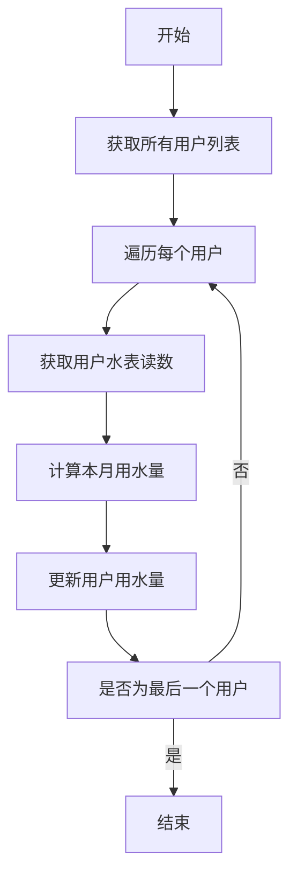
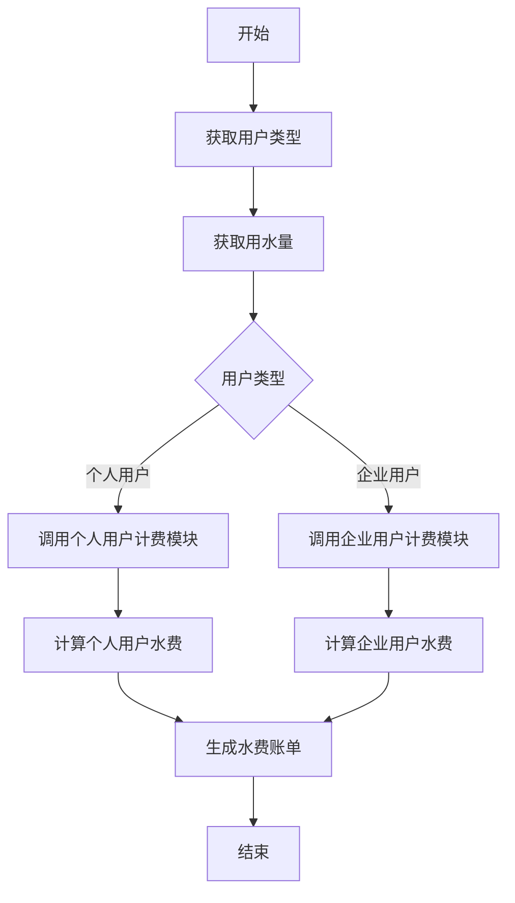
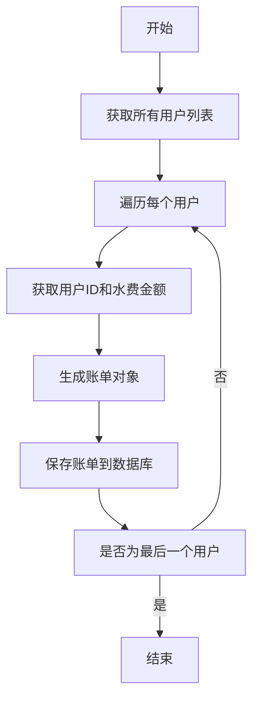

# 水费管理系统详细设计与具体代码实现

## 1. 背景介绍

随着城市化进程的不断加快,供水管理工作日益受到重视。传统的水费计算和收费方式已经无法满足现代化管理的需求,因此需要开发一套高效、智能的水费管理系统。该系统可以自动统计用户用水量、计算水费、生成账单并实现在线支付等功能,大大提高了工作效率,降低了人工成本。

### 1.1 现状与问题

1. 用户用水量统计依赖人工抄表,效率低且容易出错。
2. 水费计算复杂,不同类型用户及用水量存在差异。
3. 账单生成和发放滞后,用户无法及时了解用水情况。
4. 缴费方式单一,给用户带来不便。

### 1.2 系统目标

1. 实现自动远程抄表,无需人工介入。
2. 根据不同类型用户及用水量自动精确计算水费。
3. 及时生成电子账单,用户可随时查询用水情况。 
4. 支持多种在线缴费方式,如微信、支付宝等。
5. 提供移动端APP,方便用户随时随地查询缴费。

## 2. 核心概念与联系

### 2.1 用户(User)

用户是系统的核心对象,包括个人用户和企业用户两种类型。用户具有以下主要属性:

- 用户ID
- 用户名
- 用户类型(个人/企业)
- 用水地址
- 联系方式
- 水表读数

### 2.2 水表(WaterMeter)

水表是测量用户用水量的装置,其读数将直接影响水费的计算。水表具有以下属性:

- 水表ID
- 水表型号
- 安装地点
- 所属用户

### 2.3 水费计算(WaterBillCalculator)

根据用户类型和用水量计算应缴水费的核心模块,不同类型用户的计费标准不同。

### 2.4 账单(WaterBill)

水费账单是向用户展示用水量和应缴费用的载体,账单具有以下属性:

- 账单ID
- 账期
- 用户ID
- 用水量
- 应缴水费
- 账单状态(已出账/已缴费)

### 2.5 支付(Payment)

用户可以通过多种方式缴纳水费,如银行转账、微信、支付宝等。

这些核心概念相互关联,构成了完整的水费管理系统的数据模型。

## 3. 核心算法原理具体操作步骤  

### 3.1 抄表算法

每月对所有用户的水表进行自动抄表,获取本月用水量。抄表算法流程如下:



### 3.2 水费计算算法

根据用户类型和用水量计算应缴水费,算法流程如下:



#### 3.2.1 个人用户计费模块

个人用户计费标准分为三个阶梯:

- 前 6 吨,每吨 3 元
- 6-15 吨,每吨 4 元  
- 15 吨以上,每吨 5 元

计费公式:

$$
费用 = \begin{cases}
            用水量 \times 3 & \text{用水量} \le 6\\
            6 \times 3 + (用水量 - 6) \times 4 & 6 < 用水量 \le 15\\
            6 \times 3 + 9 \times 4 + (用水量 - 15) \times 5 & \text{用水量} > 15
            \end{cases}
$$

#### 3.2.2 企业用户计费模块

企业用户计费标准分为两个阶梯:

- 前 1000 吨,每吨 6 元
- 1000 吨以上,每吨 8 元  

计费公式:

$$
费用 = \begin{cases}
            用水量 \times 6 & \text{用水量} \le 1000\\
            1000 \times 6 + (用水量 - 1000) \times 8 & \text{用水量} > 1000
            \end{cases}
$$

### 3.3 账单生成算法

每月根据计算出的水费金额为每个用户生成水费账单,算法流程如下:



## 4. 数学模型和公式详细讲解举例说明

本系统主要涉及两个数学模型:个人用户计费模块和企业用户计费模块。

### 4.1 个人用户计费模块

个人用户的计费标准采用分段累进费率,可以用分段函数来表示:

$$
费用 = \begin{cases}
            用水量 \times 3 & \text{用水量} \le 6\\
            6 \times 3 + (用水量 - 6) \times 4 & 6 < 用水量 \le 15\\
            6 \times 3 + 9 \times 4 + (用水量 - 15) \times 5 & \text{用水量} > 15
            \end{cases}
$$

其中:

- 前 6 吨,每吨 3 元
- 6-15 吨,每吨 4 元
- 15 吨以上,每吨 5 元

我们以一个例子来具体说明:

假设一户家庭本月用水量为 18 吨,则其应缴水费为:

$$
\begin{aligned}
费用 &= 6 \times 3 + 9 \times 4 + (18 - 15) \times 5\\
     &= 18 + 36 + 15\\
     &= 69\text{元}
\end{aligned}
$$

即该户家庭本月应缴水费为 69 元。

### 4.2 企业用户计费模块

企业用户的计费标准也采用分段费率,但只有两个阶段:

$$
费用 = \begin{cases}
            用水量 \times 6 & \text{用水量} \le 1000\\
            1000 \times 6 + (用水量 - 1000) \times 8 & \text{用水量} > 1000
            \end{cases}
$$

其中:

- 前 1000 吨,每吨 6 元
- 1000 吨以上,每吨 8 元

我们再举一个例子:

假设一家工厂本月用水量为 1200 吨,则其应缴水费为:

$$
\begin{aligned}
费用 &= 1000 \times 6 + (1200 - 1000) \times 8\\
     &= 6000 + 1600\\
     &= 7600\text{元}
\end{aligned}  
$$

即该工厂本月应缴水费为 7600 元。

通过这两个具体例子,我们可以清楚地看到分段费率计费模型的应用,它可以很好地体现"累进费率"的原则,对于高消耗用户收取更高的单价,这有利于节约用水、保护水资源。

## 4. 项目实践:代码实例和详细解释说明

### 4.1 核心类设计

根据前面介绍的核心概念,我们可以设计出以下核心类:

#### 4.1.1 User类

```python
class User:
    def __init__(self, user_id, name, type, address, contact, meter_id):
        self.user_id = user_id
        self.name = name
        self.type = type  # 'personal' or 'corporate'
        self.address = address
        self.contact = contact
        self.meter_id = meter_id
        self.water_consumption = 0

    def set_water_consumption(self, consumption):
        self.water_consumption = consumption
```

#### 4.1.2 WaterMeter类

```python
class WaterMeter:
    def __init__(self, meter_id, model, location, user_id):
        self.meter_id = meter_id
        self.model = model
        self.location = location
        self.user_id = user_id
        self.reading = 0

    def set_reading(self, reading):
        self.reading = reading
```

#### 4.1.3 WaterBillCalculator类

```python
class WaterBillCalculator:
    @staticmethod
    def calculate_personal_bill(consumption):
        if consumption <= 6:
            fee = consumption * 3
        elif 6 < consumption <= 15:
            fee = 6 * 3 + (consumption - 6) * 4
        else:
            fee = 6 * 3 + 9 * 4 + (consumption - 15) * 5
        return fee

    @staticmethod
    def calculate_corporate_bill(consumption):
        if consumption <= 1000:
            fee = consumption * 6
        else:
            fee = 1000 * 6 + (consumption - 1000) * 8
        return fee
```

#### 4.1.4 WaterBill类

```python
class WaterBill:
    def __init__(self, bill_id, period, user_id, consumption, fee, status='unbilled'):
        self.bill_id = bill_id
        self.period = period
        self.user_id = user_id
        self.consumption = consumption
        self.fee = fee
        self.status = status
```

#### 4.1.5 Payment类

```python
class Payment:
    def __init__(self, payment_id, bill_id, amount, method, date):
        self.payment_id = payment_id
        self.bill_id = bill_id
        self.amount = amount
        self.method = method
        self.date = date
```

### 4.2 系统流程实现

#### 4.2.1 数据访问层

我们首先需要一个数据访问层来管理用户、水表、账单和支付记录的持久化存储。这里我们使用 SQLite 数据库进行示例,实现一个简单的数据访问对象(DAO)模式。

```python
import sqlite3

class DAO:
    def __init__(self, db_file):
        self.conn = sqlite3.connect(db_file)
        self.cursor = self.conn.cursor()
        self.create_tables()

    def create_tables(self):
        # 创建用户表
        self.cursor.execute("""CREATE TABLE IF NOT EXISTS users
                            (user_id INTEGER PRIMARY KEY, name TEXT, type TEXT, 
                            address TEXT, contact TEXT, meter_id INTEGER)""")
        
        # 创建水表表
        self.cursor.execute("""CREATE TABLE IF NOT EXISTS meters
                            (meter_id INTEGER PRIMARY KEY, model TEXT, 
                            location TEXT, user_id INTEGER)""")
        
        # 创建账单表
        self.cursor.execute("""CREATE TABLE IF NOT EXISTS bills
                            (bill_id INTEGER PRIMARY KEY, period TEXT, user_id INTEGER,
                            consumption REAL, fee REAL, status TEXT)""")
        
        # 创建支付表
        self.cursor.execute("""CREATE TABLE IF NOT EXISTS payments
                            (payment_id INTEGER PRIMARY KEY, bill_id INTEGER, 
                            amount REAL, method TEXT, date TEXT)""")
        self.conn.commit()

    # 其他数据访问方法...
```

#### 4.2.2 业务逻辑层

接下来,我们实现业务逻辑层,包括抄表、计费、生成账单和支付等功能。

```python
from dao import DAO
from entities import User, WaterMeter, WaterBillCalculator, WaterBill, Payment

class WaterBillManager:
    def __init__(self, db_file):
        self.dao = DAO(db_file)

    def read_meters(self):
        # 读取所有水表读数,更新用户用水量
        meters = self.dao.get_all_meters()
        for meter in meters:
            user = self.dao.get_user_by_meter_id(meter.meter_id)
            new_reading = meter.reading  # 假设能获取新的水表读数
            consumption = new_reading - user.water_consumption
            user.set_water_consumption(consumption)
            self.dao.update_user(user)

    def generate_bills(self):
        # 为所有用户生成本月账单
        users = self.dao.get_all_users()
        for user in users:
            consumption = user.water_consumption
            if user.type == 'personal':
                fee = WaterBillCalculator.calculate_personal_bill(consumption)
            else:
                fee = WaterBillCalculator.calculate_corporate_bill(consumption)
            bill = WaterBill(None, '2023-05', user.user_id, consumption, fee)
            self.dao.insert_bill(bill)

    def pay_bill(self, bill_id, amount, method):
        