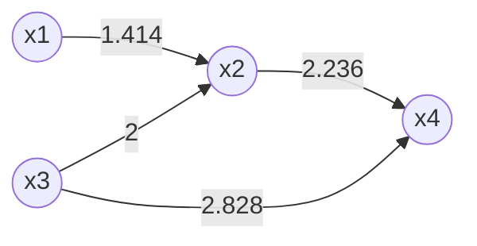

# 流形学习在计算机视觉中的应用

## 1. 背景介绍

### 1.1 计算机视觉概述

计算机视觉是人工智能领域的一个重要分支,旨在使计算机能够从数字图像或视频中获取有意义的高层次信息。它涉及多个领域,包括图像处理、模式识别、机器学习等。随着深度学习技术的不断发展,计算机视觉在诸多领域取得了令人瞩目的成就,如目标检测、图像分类、语义分割等。

### 1.2 流形学习的兴起

传统的机器学习算法通常假设数据分布在欧几里得空间中,但实际上,高维观测数据往往遵循一个低维流形嵌入在高维空间中。流形学习(Manifold Learning)旨在从高维数据中发现低维流形结构,从而实现数据的降维、可视化和表示学习等任务。近年来,随着深度神经网络在各领域取得突破性进展,流形学习也逐渐被应用于计算机视觉任务中。

## 2. 核心概念与联系  

### 2.1 流形的数学定义

在数学上,流形(Manifold)是一种拓扑空间,它在某种意义上类似于欧几里得空间,但具有更一般的性质。形式上,一个流形$\mathcal{M}$是一个拓扑空间,对于该空间中的每一点,都存在一个邻域,该邻域同胚于欧几里得空间$\mathbb{R}^n$中的一个开球。$n$被称为流形的维数。

### 2.2 流形学习的基本思想

流形学习算法的基本思想是将高维数据投影到一个低维流形上,同时保持数据在原始空间中的局部邻近关系。具体来说,假设高维观测数据$\mathbf{X} = \{\mathbf{x}_1, \mathbf{x}_2, \ldots, \mathbf{x}_N\}$嵌入在一个低维流形$\mathcal{M}$中,流形学习算法旨在从$\mathbf{X}$中学习一个映射$f: \mathbf{X} \mapsto \mathbf{Y}$,使得$\mathbf{Y} = \{f(\mathbf{x}_1), f(\mathbf{x}_2), \ldots, f(\mathbf{x}_N)\}$能够近似地重构出$\mathcal{M}$的结构。

### 2.3 流形学习与深度学习的联系

虽然传统的流形学习算法主要关注非线性降维和数据可视化,但其核心思想与深度学习中的表示学习密切相关。事实上,深度神经网络可以被看作是一种隐式的流形学习方法,其中网络的每一层都试图捕获数据的局部流形结构。通过层层映射,深度网络最终学习到数据分布的全局流形结构。因此,将流形学习思想引入深度神经网络,有望提高网络对复杂数据的表示能力。

## 3. 核心算法原理具体操作步骤

在介绍具体算法之前,我们先来了解流形学习算法的一些共同特点:

1. **邻域保持(Neighbor Preserving)**: 算法试图在低维空间中保持数据原始空间的局部邻近关系。
2. **拓扑保持(Topology Preserving)**: 除了局部结构,一些算法还试图保持数据的全局拓扑结构。
3. **无监督(Unsupervised)**: 大多数流形学习算法都是无监督的,不需要任何标签信息。

接下来,我们介绍几种经典的流形学习算法及其在计算机视觉中的应用。

### 3.1 等度量映射 (Isometric Mapping, ISOMAP)

ISOMAP算法由以下步骤组成:

1. **构建邻域图**: 计算所有数据点之间的欧氏距离,连接距离小于某个阈值的点对,构建一个邻域图$\mathcal{G}$。
2. **计算测地线距离**: 在邻域图$\mathcal{G}$上,计算任意两点之间的最短路径距离,作为这两点之间的测地线距离。
3. **多维缩放(MDS)**: 使用经典的MDS算法,将数据投影到低维空间,使投影后的点之间的欧氏距离尽可能接近测地线距离。

ISOMAP算法在计算机视觉中的应用包括:

- **姿态估计**: 使用ISOMAP对视频序列中的图像进行非线性嵌入,从而实现3D姿态的恢复。
- **图像分割**: 将ISOMAP与谱聚类相结合,对图像进行分割。

### 3.2 局部线性嵌入 (Locally Linear Embedding, LLE)

LLE算法的核心思想是在局部邻域内,数据点可以被线性重构。算法步骤如下:

1. **计算 $k$ 近邻**: 对于每个数据点$\mathbf{x}_i$,找到其 $k$ 个最近邻点。
2. **线性重构**: 对每个$\mathbf{x}_i$,求解最小化以下重构误差的权重向量$\mathbf{w}_i$:

$$
   \varepsilon(\mathbf{w}_i) = \left\|\mathbf{x}_i - \sum_{j\in \mathcal{N}(i)} w_{ij}\mathbf{x}_j\right\|^2
$$

   其中$\mathcal{N}(i)$是$\mathbf{x}_i$的邻域点集合,并且$\sum_j w_{ij} = 1$。
3. **计算低维嵌入**: 求解最小化以下代价函数的低维嵌入向量$\mathbf{y}_i$:

$$
   \phi(\mathbf{Y}) = \sum_i \left\|\mathbf{y}_i - \sum_{j\in \mathcal{N}(i)} w_{ij}\mathbf{y}_j\right\|^2
$$

LLE算法在计算机视觉中的应用有:

- **图像去噪**: 将LLE与自动编码器(Autoencoder)结合,用于图像的去噪和修复。
- **活体检测**: 使用LLE对人脸视频进行嵌入,用于活体检测。

### 3.3 拉普拉斯特征映射 (Laplacian Eigenmaps)

拉普拉斯特征映射算法的思路是,将数据投影到一个低维子空间,使投影后的数据尽可能保持原始数据的局部邻近关系。算法步骤如下:

1. **构建邻域图**: 与ISOMAP类似,构建一个加权邻域图$\mathcal{G}$,边的权重$W_{ij}$度量$\mathbf{x}_i$和$\mathbf{x}_j$的相似性。
2. **计算拉普拉斯矩阵**: 对于图$\mathcal{G}$,计算其对应的拉普拉斯矩阵$\mathbf{L} = \mathbf{D} - \mathbf{W}$,其中$\mathbf{D}$是度数矩阵。
3. **特征值分解**: 对$\mathbf{L}$进行特征值分解,取最小的$d$个非零特征值对应的特征向量,作为低维嵌入的坐标。

拉普拉斯特征映射在计算机视觉中的应用包括:

- **人脸识别**: 将拉普拉斯特征映射与支持向量机结合,用于人脸识别任务。
- **图像分割**: 利用拉普拉斯特征映射对图像进行分割。

### 3.4 t-SNE (t-Distributed Stochastic Neighbor Embedding)

t-SNE是一种常用的非线性降维和数据可视化算法,其思路是在低维空间中模拟数据在高维空间中的邻近关系。算法步骤如下:

1. **构建高维概率分布**: 对于每个数据点$\mathbf{x}_i$,计算其与其他点的高斯相似度,得到一个条件概率分布$p_{j|i}$,用于描述$\mathbf{x}_i$与$\mathbf{x}_j$的相似性。
2. **构建低维概率分布**: 在低维空间中,对每个映射点$\mathbf{y}_i$,计算其与其他点的学生t分布相似度,得到一个条件概率分布$q_{j|i}$。
3. **优化目标函数**: 最小化KL散度$D_\mathrm{KL}(P||Q)$,使得低维空间中的$Q$尽可能拟合高维空间中的$P$。

由于t-SNE能够很好地保持数据的局部结构,因此在计算机视觉中有广泛应用,如:

- **数据可视化**: 将高维图像数据投影到二维或三维空间,用于可视化分析。
- **特征提取**: 将t-SNE与深度网络相结合,用于无监督特征提取。

## 4. 数学模型和公式详细讲解举例说明

在上一节中,我们介绍了几种经典的流形学习算法,其中涉及了一些重要的数学概念和公式。现在,我们对这些公式进行详细的讲解和举例说明。

### 4.1 欧氏距离和测地线距离

在ISOMAP算法中,我们需要计算数据点之间的测地线距离(Geodesic Distance)。对于一个流形$\mathcal{M}$上的两点$p$和$q$,它们之间的测地线距离定义为连接这两点的最短曲线的长度:

$$
d_\mathcal{M}(p, q) = \inf_\gamma \int_0^1 \left\|\gamma'(t)\right\| dt
$$

其中,$\gamma: [0, 1] \rightarrow \mathcal{M}$是连接$p$和$q$的曲线,且$\gamma(0) = p$, $\gamma(1) = q$。

然而,在实践中,我们无法直接获得流形$\mathcal{M}$的表达式,只能通过有限的样本点$\mathbf{X}$来近似计算测地线距离。ISOMAP算法的做法是,首先构建一个邻域图$\mathcal{G}$,将样本点之间的最短路径距离作为它们之间的测地线距离的近似。具体来说,对于任意两点$\mathbf{x}_i$和$\mathbf{x}_j$,它们之间的测地线距离可以近似为:

$$
d_\mathcal{M}(\mathbf{x}_i, \mathbf{x}_j) \approx d_\mathcal{G}(\mathbf{x}_i, \mathbf{x}_j) = \min_{\pi_{ij}} \sum_{k=1}^{l(\pi_{ij})} \left\|\mathbf{x}_{\pi_{ij}(k)} - \mathbf{x}_{\pi_{ij}(k+1)}\right\|_2
$$

其中,$\pi_{ij}$是连接$\mathbf{x}_i$和$\mathbf{x}_j$的最短路径,由$l(\pi_{ij})$条边组成,而$\|\cdot\|_2$表示欧氏距离。

**举例说明**:

假设我们有一个样本集$\mathbf{X} = \{\mathbf{x}_1, \mathbf{x}_2, \mathbf{x}_3, \mathbf{x}_4\}$,其中$\mathbf{x}_1 = (1, 0)$, $\mathbf{x}_2 = (2, 1)$, $\mathbf{x}_3 = (0, 2)$, $\mathbf{x}_4 = (3, 3)$。我们可以构建如下的邻域图$\mathcal{G}$:

在该邻域图中,我们可以计算出$\mathbf{x}_1$和$\mathbf{x}_4$之间的测地线距离为:

$$
d_\mathcal{G}(\mathbf{x}_1, \mathbf{x}_4) = \left\|\mathbf{x}_1 - \mathbf{x}_2\right\|_2 + \left\|\mathbf{x}_2 - \mathbf{x}_4\right\|_2 = 1.414 + 2.236 = 3.65
$$

而它们之间的欧氏距离为:

$$
\left\|\mathbf{x}_1 - \mathbf{x}_4\right\|_2 = \sqrt{(1-3)^2 + (0-3)^2} = 3.162
$$

可以看出,在这个简单的例子中,测地线距离比欧氏距离更能反映出$\mathbf{x}_1$和$\mathbf{x}_4$之间的真实距离。

### 4.2 线性重构和权